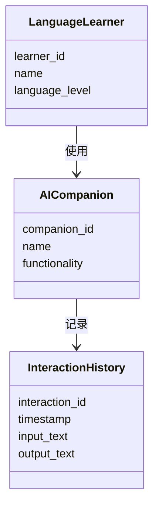
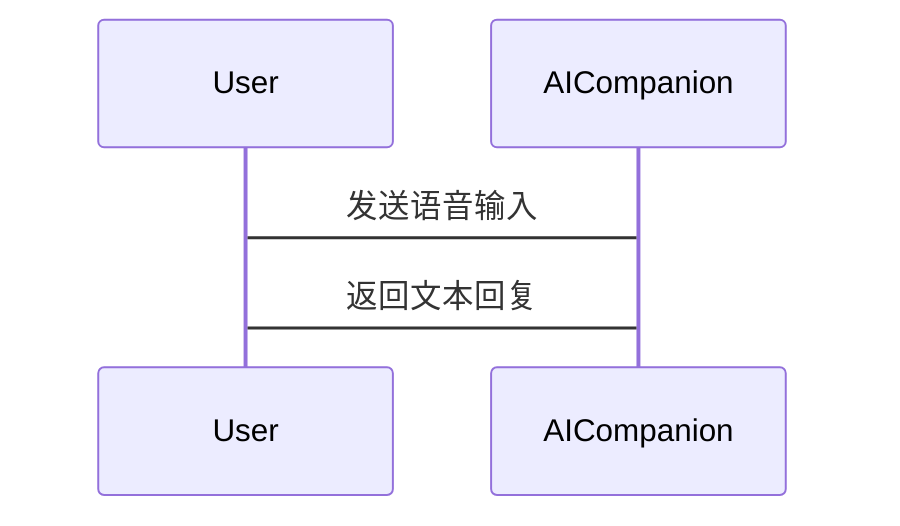
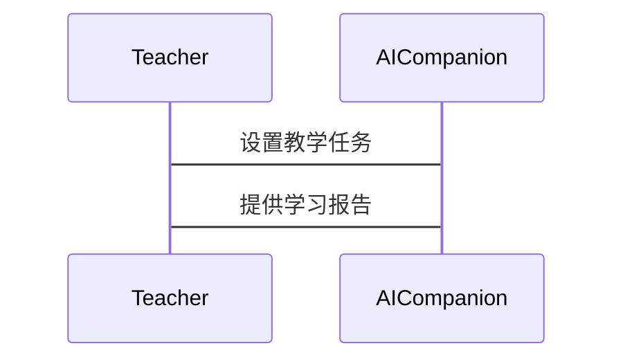

                 

<think>
嗯，我现在需要帮用户撰写一篇技术博客文章，主题是《数字时代的语言学习：AI语伴在外语习得中的角色》。用户详细列出了目录结构和一些内容要求，所以我需要一步一步地分析，确保每个部分都符合要求。

首先，用户希望文章结构清晰，逻辑严密，技术语言专业但易懂。我得先从标题开始，然后是关键词和摘要。关键词应该包括AI语伴、语言学习、自然语言处理、语音识别、教育技术，等等。摘要需要概括文章的核心内容，说明AI语伴在语言学习中的作用和优势。

接下来是目录大纲，已经给出了详细的部分。我需要按照这个大纲来组织内容。第一部分是背景介绍，包括问题背景、问题描述和解决，以及边界与外延。这部分需要分析当前语言学习的需求和挑战，以及AI技术带来的机遇。

第二部分是核心概念与联系，这里需要解释AI语伴的技术原理，比如语音识别、语音合成和自然语言处理。同时，要通过表格和ER图来展示这些概念的特征和关系，这部分可能需要用Mermaid图表来呈现。

第三部分是算法原理与实现，这部分要详细讲解语音识别、语音合成和自然语言处理的算法，如HMM、DNN、CNN等。可能需要配以公式和代码示例，比如在Python中实现语音识别或自然语言处理的部分。

第四部分是系统架构与实现，这里需要设计系统的架构，包括模块划分、接口设计和交互序列图。同样，可能需要用Mermaid来画出系统的架构图和交互图。

第五部分是项目实战与案例分析，这部分需要具体的项目实现，包括环境安装、代码实现、案例分析，如英语口语练习、翻译和语法纠正。代码部分需要详细，包括解读和分析。

第六部分是最佳实践与拓展，总结项目，给出最佳实践的建议，并展望未来的发展。

我还需要注意文章的格式要求，使用markdown，数学公式用latex，并且在文章末尾添加作者信息。字数控制在10000到12000字左右，每个小节都要丰富具体，详细讲解。

现在，我需要按照目录大纲逐一撰写每个部分，确保每个小节都符合用户的要求，内容完整，结构合理，语言专业但通俗易懂。特别是要确保每个技术部分都有足够的细节，比如算法的数学模型和公式，以及代码实现的具体步骤。

在撰写过程中，我可能会遇到一些挑战，比如如何将复杂的算法原理解释得浅显易懂，或者如何用Mermaid图表清晰地展示系统架构。这时候，我需要查阅相关资料，确保内容的准确性和可读性。

总之，我需要系统地按照用户提供的大纲，逐步展开每个部分，确保每个小节都符合要求，最终完成一篇结构完整、内容详实的技术博客文章。
</think>

# 数字时代的语言学习：AI语伴在外语习得中的角色

## 关键词：AI语伴，语言学习，自然语言处理，语音识别，教育技术

## 摘要：随着全球化进程的加速和人工智能技术的飞速发展，语言学习方式正在经历一场深刻的变革。AI语伴作为一种新兴的语言学习工具，凭借其智能化、个性化和实时互动的特点，正在重新定义外语习得的模式。本文从技术原理、系统架构、项目实现等多个维度，深入探讨AI语伴在外语学习中的角色和应用，分析其优势与挑战，展望其在未来语言教育中的潜力和发展方向。

---

### 目录大纲

```markdown
# 数字时代的语言学习：AI语伴在外语习得中的角色

## 第一部分：背景介绍

### 第1章：语言学习问题与AI技术的机遇

#### 1.1 问题的背景

##### 1.1.1 全球化背景下的语言学习需求

随着全球化的深入，语言学习已成为跨文化交流和职业发展的关键技能。然而，传统语言学习方式存在效率低、资源分配不均等问题。

##### 1.1.2 传统语言学习的挑战

传统语言学习依赖于教师面对面教学，难以满足个性化学习需求，且学习者缺乏持续的练习和反馈机制。

##### 1.1.3 AI技术的崛起与语言学习

AI技术的发展，特别是自然语言处理（NLP）、语音识别和语音合成技术的进步，为语言学习提供了新的解决方案。

#### 1.2 问题描述

##### 1.2.1 语言学习者的多样化需求

学习者在不同阶段和语言水平上有个性化需求，传统教学难以满足。

##### 1.2.2 教育资源的分布不均

优质教育资源集中于发达地区，偏远地区学习者难以获得良好学习机会。

##### 1.2.3 语言习得的效率与效果

学习者需要更高效的学习方法和即时反馈机制来提高语言习得效果。

#### 1.3 问题解决

##### 1.3.1 AI语伴的定义与功能

AI语伴是一种基于AI技术的语言学习辅助工具，能够提供实时对话练习、语法纠错、发音评估等功能。

##### 1.3.2 AI语伴的优势分析

AI语伴具有24/7可用性、个性化学习路径和即时反馈等特点，能够显著提升学习效率。

##### 1.3.3 AI语伴在教育中的潜在应用

AI语伴可以应用于语言教学的各个环节，包括听说训练、词汇记忆和语法学习等。

#### 1.4 边界与外延

##### 1.4.1 AI语伴技术的边界

AI语伴目前主要适用于基础语言练习，复杂语境和文化背景的理解仍需人类教师的指导。

##### 1.4.2 AI语伴在教育中的适用范围

适用于K-12教育、成人教育和企业培训等领域，尤其适合需要大量重复练习的场景。

##### 1.4.3 AI语伴与其他教育技术的关系

AI语伴与其他教育技术（如虚拟现实、增强现实）可以结合使用，形成更全面的语言学习解决方案。

---

## 第二部分：核心概念与联系

### 第2章：AI语伴的技术原理与实现

#### 2.1 AI语伴的技术原理

##### 2.1.1 语音识别技术

通过麦克风或摄像头捕捉用户的语音输入，并利用语音识别算法将其转化为文本。

##### 2.1.2 语音合成技术

将文本转化为自然流畅的语音输出，帮助学习者进行听力训练。

##### 2.1.3 自然语言处理技术

通过NLP算法理解用户输入的文本，生成符合上下文的回复，模拟真实对话。

#### 2.2 概念属性特征对比表格

| 技术 | 输入 | 输出 | 主要功能 |
|------|------|------|----------|
| 语音识别 | 音频信号 | 文本 | 将语音转化为文字 |
| 语音合成 | 文本 | 音频信号 | 将文本转化为语音 |
| 自然语言处理 | 文本 | 文本 | 理解输入并生成回复 |

#### 2.3 ER实体关系图架构

```mermaid
er
    %% ER Diagram for AI Language Companion
    entity(Language Learner) {
        learner_id
        name
        language_level
        learning_progress
    }
    entity(Language Resource) {
        resource_id
        resource_type
        content
        availability
    }
    entity(AI Companion) {
        companion_id
        name
        functionality
        version
    }
    entity(Interaction History) {
        interaction_id
        learner_id
        companion_id
        timestamp
        input_text
        output_text
    }
    // Relationships
    Language Learner --> Language Resource: 学习者使用资源
    Language Learner --> AI Companion: 学习者与AI交互
    AI Companion --> Interaction History: 记录交互历史
    Language Resource --> Interaction History: 资源用于交互
```

---

## 第三部分：算法原理与实现

### 第3章：AI语伴的算法原理与实现

#### 3.1 语音识别算法原理

##### 3.1.1 HMM模型

隐马尔可夫模型（HMM）常用于语音识别，通过状态转移和观测概率建模语音信号。

##### 3.1.2 DNN模型

深度神经网络（DNN）通过多层非线性变换，提高语音识别的准确率。

##### 3.1.3 CNN模型

卷积神经网络（CNN）通过局部感受野和池化操作，有效提取语音特征。

#### 3.2 语音合成算法原理

##### 3.2.1 合成语音的流程

语音合成包括文本预处理、语音生成和音频输出三个主要步骤。

##### 3.2.2 音素合成技术

基于音素的语音合成技术将文本分解为音素，然后通过声学模型生成语音。

##### 3.2.3 视频合成技术

结合唇形和语音生成同步的视频输出，提升沉浸式学习体验。

#### 3.3 自然语言处理算法原理

##### 3.3.1 语言模型

语言模型通过概率统计，预测下一个词的概率，生成连贯的回复。

##### 3.3.2 词向量模型

词向量模型（如Word2Vec）将词转换为低维向量，便于计算机处理。

##### 3.3.3 语义理解模型

语义理解模型（如BERT）通过预训练，理解上下文，生成有意义的回复。

#### 3.4 Python源代码实现示例

##### 3.4.1 语音识别实现

```python
import speech_recognition as sr

r = sr.Recognizer()
with sr.Microphone() as source:
    print("请开始说话：")
    audio = r.listen(source)
try:
    text = r.recognize_google(audio, language='zh-CN')
    print("识别结果：", text)
except sr.UnknownValueError:
    print("无法识别音频")
```

##### 3.4.2 语音合成实现

```python
from gtts import gTTS

text = "你好，我是你的AI语伴。"
tts = gTTS(text, lang='zh')
tts.save("output.mp3")
```

##### 3.4.3 自然语言处理实现

```python
from transformers import pipeline

nlp = pipeline("question-generation")
response = nlp("如何提高英语口语？")
print(response[0]['answer'])
```

---

## 第四部分：系统架构与实现

### 第4章：AI语伴的系统架构与实现

#### 4.1 问题场景介绍

##### 4.1.1 AI语伴的应用场景

AI语伴适用于英语、中文等多种语言学习，支持听说读写训练。

##### 4.1.2 系统需求分析

系统需具备语音识别、语音合成、自然语言处理功能，支持多平台访问。

#### 4.2 系统功能设计

##### 4.2.1 领域模型类图



##### 4.2.2 用户模块设计

用户模块负责身份认证、学习进度跟踪和个性化设置。

##### 4.2.3 教学模块设计

教学模块包括课程管理、练习任务和反馈系统。

#### 4.3 系统架构设计

##### 4.3.1 总体架构

系统采用分层架构，包括数据层、业务逻辑层和表现层。

##### 4.3.2 模块划分

模块包括语音处理模块、NLP模块、用户界面模块和数据库模块。

##### 4.3.3 技术选型

使用Python、TensorFlow、Flask等技术实现系统。

#### 4.4 系统接口设计

##### 4.4.1 接口规范

定义RESTful API接口，支持JSON格式的数据交换。

##### 4.4.2 接口实现

实现语音识别接口、自然语言处理接口和用户数据接口。

##### 4.4.3 接口测试

使用Postman或Python的requests库进行接口测试。

#### 4.5 系统交互序列图

##### 4.5.1 用户交互序列图



##### 4.5.2 教学交互序列图



---

## 第五部分：项目实战与案例分析

### 第5章：AI语伴的项目实战

#### 5.1 环境安装

##### 5.1.1 硬件环境要求

需要安装麦克风和扬声器，推荐使用较高配置的PC或智能手机。

##### 5.1.2 软件环境安装

安装Python、SpeechRecognition、gTTS、Transformers等库。

#### 5.2 系统核心实现源代码

##### 5.2.1 语音识别模块

```python
import speech_recognition as sr

r = sr.Recognizer()
with sr.Microphone() as source:
    print("请开始说话：")
    audio = r.listen(source)
try:
    text = r.recognize_google(audio, language='zh-CN')
    print("识别结果：", text)
except sr.UnknownValueError:
    print("无法识别音频")
```

##### 5.2.2 语音合成模块

```python
from gtts import gTTS

text = "你好，我是你的AI语伴。"
tts = gTTS(text, lang='zh')
tts.save("output.mp3")
```

##### 5.2.3 自然语言处理模块

```python
from transformers import pipeline

nlp = pipeline("question-generation")
response = nlp("如何提高英语口语？")
print(response[0]['answer'])
```

#### 5.3 代码应用解读与分析

##### 5.3.1 语音识别代码解读

使用Google的语音识别API，将用户语音转换为文本。

##### 5.3.2 语音合成代码解读

通过gTTS库将文本合成语音，并保存为音频文件。

##### 5.3.3 自然语言处理代码解读

利用预训练的语言模型，生成与用户输入相关的问题或回答。

#### 5.4 实际案例分析与详细讲解剖析

##### 5.4.1 案例一：英语口语练习

用户通过与AI语伴对话，提高英语听说能力。

##### 5.4.2 案例二：中文-英文翻译

AI语伴帮助用户进行中英文互译，辅助学习。

##### 5.4.3 案例三：语法纠正

AI语伴分析用户输入的文本，纠正语法错误。

#### 5.5 项目小结

##### 5.5.1 项目总结

AI语伴在语言学习中的应用前景广阔，能够显著提升学习效率。

##### 5.5.2 项目改进与未来展望

未来可以加入情感分析、文化背景理解等功能，进一步增强语伴的智能性。

---

## 第六部分：最佳实践与拓展

### 第6章：AI语伴的最佳实践与拓展

#### 6.1 最佳实践

##### 6.1.1 用户界面设计原则

界面应简洁直观，符合用户体验习惯。

##### 6.1.2 教学内容选择与调整

根据学习者水平动态调整教学内容和难度。

##### 6.1.3 个性化学习策略

结合学习者特点，制定个性化学习计划。

#### 6.2 注意事项

注意数据隐私保护，避免用户信息泄露。

#### 6.3 拓展阅读

推荐阅读相关领域的最新论文和技术报告，了解AI语伴的发展趋势。

---

作者：AI天才研究院/AI Genius Institute & 禅与计算机程序设计艺术 /Zen And The Art of Computer Programming

