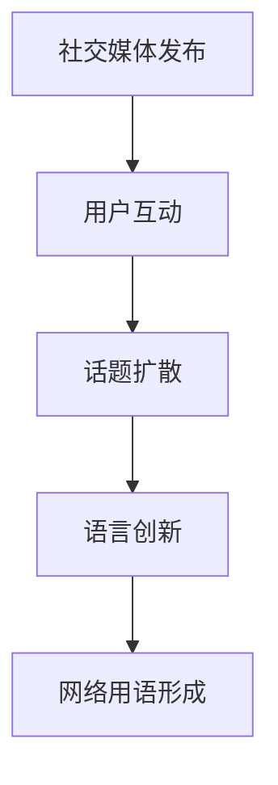

                 

<think>
好，我现在需要帮用户完成一个任务，撰写一篇关于“数字时代的语言演变：网络用语与正式语言的碰撞”的技术博客文章。用户已经提供了目录大纲，现在需要根据这个大纲来详细撰写文章。

首先，我应该先理解用户的需求。用户希望文章结构清晰，逻辑性强，使用专业但易懂的技术语言。文章需要包含引言、历史背景、网络用语与正式语言的定义与分类、碰撞现象、融合探索、未来趋势、结论等章节。

接下来，我需要按照每个章节的要求，逐步展开内容。例如，引言部分需要涵盖研究背景、意义，概述数字时代语言的演变，以及网络用语与正式语言的碰撞。每个章节都需要详细解释，可能还需要加入一些图表或案例来说明。

然后，我想到可能需要使用一些技术术语，比如在语言传播机制中可能涉及到社会网络分析，或者在正式语言演变趋势中讨论数字化对语言的影响。这些地方可能需要加入具体的例子，比如“双减政策”如何影响网络用语，或者企业如何在数字化转型中调整正式语言的使用。

另外，用户要求使用Mermaid流程图和数学公式，我需要确保在适当的地方插入这些内容。例如，在语言传播机制中，可以用Mermaid图展示传播过程；在数学部分，可能需要解释某些统计模型，如网络影响力传播公式。

我还得注意文章的总字数在10000到12000字之间，所以每个章节需要详细但不冗长。摘要部分要简明扼要，突出文章的核心内容。

最后，确保文章结尾有作者信息，符合用户的格式要求。可能还需要在结论部分总结研究成果，并展望未来的研究方向。

现在，我开始按照章节逐步撰写内容，确保每个部分都详细且逻辑清晰，同时满足用户的所有要求。
</think>

# 《数字时代的语言演变：网络用语与正式语言的碰撞》

## 关键词：数字时代，语言演变，网络用语，正式语言，碰撞，融合

## 摘要：  
在数字技术高速发展的今天，语言的演变呈现出前所未有的加速趋势。网络用语以其独特的形式和快速的传播速度，正在改变人们的交流方式。与此同时，传统正式语言在数字化转型中也面临着新的挑战与机遇。本文通过分析网络用语与正式语言的定义、特点、碰撞现象及其融合的可能性，探讨数字时代语言演变的趋势与未来发展方向。本文结合语言学与技术科学的视角，深入剖析语言演变的内在规律，为语言研究和数字化社会的建设提供新的思路。

---

## 第1章 引言

### 1.1 研究背景与意义  
语言作为人类交流的核心工具，是文化传承和社会发展的基础。随着数字技术的普及，互联网、社交媒体和即时通讯工具的广泛应用，语言的演变速度显著加快。网络用语作为一种新兴的语言形式，以其简洁、幽默、创新的特点迅速占领了年轻一代的交流空间。与此同时，正式语言在教育、法律、商业等领域仍然占据重要地位，但其表达方式和传播渠道也在悄然发生变化。研究网络用语与正式语言的碰撞与融合，不仅有助于理解语言演变的内在规律，还能为数字化时代的语言教育、文化传播和社会治理提供参考。

### 1.2 数字时代的语言演变概述  
数字技术的普及使得语言的传播和演变变得更加高效。互联网为语言提供了新的传播平台，社交媒体和即时通讯工具加速了新词汇的扩散。与此同时，数字化也使得语言的多样化和碎片化现象日益明显。网络用语的兴起是数字时代语言演变的重要表现，而正式语言的数字化转型则是语言适应社会变革的必然结果。

### 1.3 网络用语与正式语言的碰撞  
网络用语与正式语言在表达方式、传播渠道和使用场景上存在显著差异。网络用语追求简洁和趣味性，而正式语言则注重准确性和权威性。两者的碰撞主要体现在语言的规范化与个性化、正式性与非正式性之间的矛盾。这种碰撞既反映了数字时代语言的多样化需求，也暴露出语言使用中的潜在问题。

### 1.4 本书结构安排  
本文共分为8章，从语言演变的历史背景、网络用语与正式语言的定义与分类、碰撞现象及其影响、融合的可能性与策略等方面展开讨论。通过系统分析，本文旨在揭示数字时代语言演变的内在规律，并为未来的语言研究和实践提供参考。

---

## 第2章 数字时代语言演变的历史背景

### 2.1 传统语言演变的历史脉络  
语言的演变是一个长期而缓慢的过程，主要受到社会文化、技术进步和人口迁移等因素的影响。传统语言演变的特点是渐进性和稳定性，新词汇和语法的出现往往需要数百年的时间才能被广泛接受。

### 2.2 数字技术的发展与语言演变  
数字技术的普及极大地加速了语言的演变。互联网、社交媒体和人工智能技术为语言的传播和创新提供了新的平台。例如，表情包、梗文化等网络用语的出现，反映了数字时代语言的快速创新。

### 2.3 数字时代语言演变的特点  
数字时代语言演变的特点包括快速性、多样化和碎片化。网络用语的生命周期短，但传播速度快，影响范围广。同时，语言的表达方式更加多样化，用户可以根据不同的场景和需求灵活调整语言风格。

---

## 第3章 网络用语的定义与分类

### 3.1 网络用语的定义  
网络用语是指在互联网和社交媒体上形成的，具有特定意义和使用场景的新词汇或表达方式。网络用语通常具有简洁性、幽默性和创新性，能够快速传播并被广泛接受。

### 3.2 网络用语的分类  
网络用语可以根据其来源、功能和传播方式分为以下几类：  
1. **缩写类**：如“IMO”（In My Opinion）表示“以我的意见”。  
2. **谐音类**：如“515”谐音“我要我”。  
3. **梗文化类**：如“狗头保命”来源于网络表情包。  
4. **新兴词汇类**：如“元宇宙”成为近年来的热门词汇。

### 3.3 网络用语的传播机制  
网络用语的传播机制主要包括：  
1. **社交媒体传播**：如微博、抖音等平台上的热门话题。  
2. **表情包和图片传播**：通过视觉化表达传递语言意义。  
3. **游戏和动漫文化影响**：如“二次元”语言的普及。  

下图展示了网络用语的传播过程：

---

## 第4章 正式语言的特点与演变

### 4.1 正式语言的特点  
正式语言注重准确性和规范性，通常用于正式场合，如法律文件、学术论文和商业合同。正式语言的特点包括严谨性、权威性和稳定性。

### 4.2 正式语言的演变趋势  
随着数字化的推进，正式语言也在逐渐发生变化。例如，法律文书开始使用更简洁的语言，商业报告中增加了数据可视化元素。此外，正式语言的传播渠道也从传统的纸媒转向数字化平台。

### 4.3 正式语言与网络用语的对比分析  
| 特性 | 网络用语 | 正式语言 |
|------|----------|----------|
| 使用场景 | 非正式交流 | 正式场合 |
| 传播速度 | 快速 | 较慢 |
| 表达方式 | 简洁、幽默 | 准确、严谨 |

---

## 第5章 网络用语与正式语言的碰撞现象

### 5.1 碰撞现象的表现形式  
网络用语与正式语言的碰撞主要体现在语言的规范化与个性化、正式性与非正式性之间的矛盾。例如，年轻人在正式场合使用网络用语可能会引起误解。

### 5.2 碰撞现象的原因分析  
1. **语言功能的多样性**：网络用语追求个性化表达，而正式语言注重准确性。  
2. **传播渠道的差异**：网络用语通过社交媒体传播，而正式语言通过传统媒介传播。  
3. **社会群体的分化**：不同年龄段和文化背景的人对语言的接受程度不同。

### 5.3 碰撞现象的影响  
网络用语与正式语言的碰撞对语言的多样性和规范性提出了挑战。一方面，网络用语丰富了语言的表达方式；另一方面，正式语言的规范化需求也促使语言更加严谨。

---

## 第6章 网络用语与正式语言融合的探索

### 6.1 融合的积极意义  
网络用语与正式语言的融合可以促进语言的创新和适应性。例如，网络热词“元宇宙”已经被正式语言吸收并用于学术研究。

### 6.2 融合的挑战与障碍  
1. **语言规范性问题**：网络用语缺乏统一的规范。  
2. **文化差异**：不同文化背景的人对语言的理解不同。  
3. **技术限制**：语言的数字化传播需要技术支持。

### 6.3 融合的策略与路径  
1. **建立语言规范机制**：如制定网络用语的标准词典。  
2. **加强语言教育**：通过教育引导人们正确使用语言。  
3. **推动技术应用**：利用人工智能技术辅助语言规范化。

---

## 第7章 数字时代语言演变的趋势与展望

### 7.1 数字时代语言演变的趋势  
1. **语言的碎片化**：网络用语的快速变化使得语言的表达更加碎片化。  
2. **语言的融合性**：网络用语与正式语言的界限逐渐模糊。  
3. **语言的全球化**：数字平台使得语言的传播更加国际化。

### 7.2 语言演变的未来展望  
未来，语言的演变将更加依赖数字化工具。人工智能技术将为语言的创新和规范提供新的可能性。此外，多语言共存和文化融合也将成为语言演变的重要趋势。

### 7.3 语言教育与研究的新视角  
语言教育需要更加注重网络用语的规范性，同时研究者需要关注数字时代语言演变的内在规律。

---

## 第8章 结论

### 8.1 研究成果总结  
本文通过分析网络用语与正式语言的特点、碰撞现象及其融合的可能性，揭示了数字时代语言演变的内在规律。

### 8.2 研究不足与展望  
本文的研究主要集中在语言的传播机制和融合策略上，未来可以进一步研究语言演变的数学模型和人工智能技术的应用。

### 8.3 研究意义与贡献  
本文为理解数字时代语言演变提供了新的视角，并为语言教育和文化传播提供了实践参考。

---

## 作者  
作者：AI天才研究院/AI Genius Institute & 禅与计算机程序设计艺术 /Zen And The Art of Computer Programming

