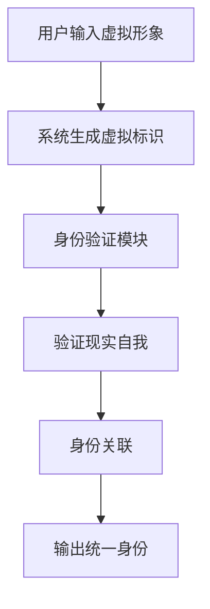
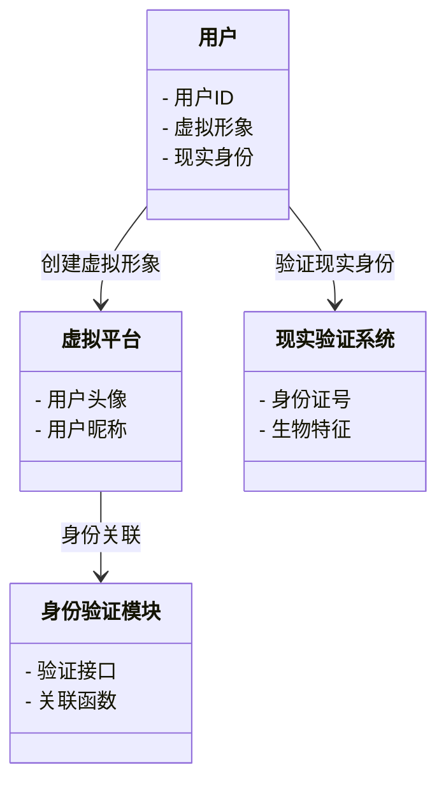
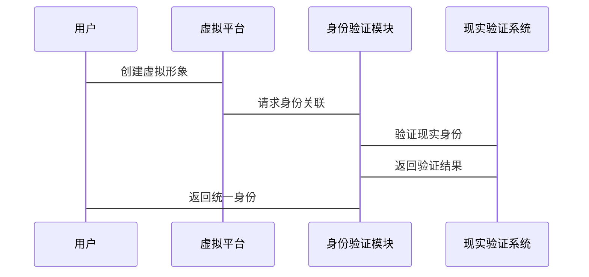

                 

<think>
嗯，好的，我现在要帮用户写一篇关于“数字时代的身份构建：虚拟形象与现实自我的融合”的技术博客。用户希望我以一个世界级专家的身份，详细分析这个主题，并按照指定的结构来组织内容。首先，我得理解用户的需求，他们可能是一位技术专家，或者正在研究这个领域的学者，也可能是对数字身份感兴趣的专业人士。

我应该先从背景介绍开始，解释为什么数字身份在当今如此重要。然后，深入探讨虚拟形象和现实自我的概念，分析它们之间的联系和区别。接下来，可能需要涉及一些技术细节，比如算法原理和系统架构设计，这部分可能需要使用一些图表和代码示例来说明。

用户还提到要包括项目实战部分，这意味着我需要提供一个实际案例，展示如何构建这样的系统。此外，最佳实践和小结部分也很重要，帮助读者总结关键点，并推荐进一步阅读的资料。

我需要注意文章的结构，确保每个章节都有足够的细节，同时保持逻辑清晰。可能需要使用Mermaid图来展示实体关系、算法流程和系统架构。数学公式部分要用LaTeX表示，确保格式正确。

总的来说，我需要一步步地分析每个部分，确保内容详尽且符合用户的指导。这可能需要多次检查和调整，以确保文章不仅内容丰富，而且结构合理，易于理解。
</think>

# 数字时代的身份构建：虚拟形象与现实自我的融合

**关键词**：数字身份、虚拟形象、现实自我、身份构建、身份验证、身份融合

**摘要**：  
在数字时代，身份构建已经从传统的实体身份扩展到虚拟世界的数字身份。虚拟形象与现实自我的融合不仅是技术发展的必然趋势，也是人类社会数字化转型的重要标志。本文将从核心概念、算法原理、系统架构、项目实战等多个维度，全面探讨数字时代身份构建的融合过程，分析其带来的机遇与挑战。

---

## 第一章：背景介绍

### 1.1 核心概念术语说明
- **数字身份**：指个体或实体在数字空间中的唯一标识，可以是用户ID、社交媒体账号、电子证书等。
- **虚拟形象**：指用户在虚拟空间中呈现的数字化形象，包括头像、昵称、虚拟化身等。
- **现实自我**：指用户在现实生活中的真实身份，包括姓名、身份证号、生物特征等。

### 1.2 问题背景
随着互联网和虚拟现实技术的快速发展，人们的生活越来越多地依赖数字空间。从社交媒体到元宇宙，虚拟形象已经成为人们在数字世界中的重要标识。然而，虚拟形象与现实自我之间的割裂也带来了身份管理的挑战。如何实现两者的融合，成为数字时代身份构建的核心问题。

### 1.3 问题描述
在数字时代，身份构建不仅需要满足现实世界的需求，还需要适应虚拟世界的规则。虚拟形象的多样性和现实自我的唯一性之间的矛盾，使得身份管理变得更加复杂。例如，社交媒体账号被盗、虚拟身份被滥用等问题，都威胁着用户的数字安全。

### 1.4 问题解决
通过技术手段，将虚拟形象与现实自我进行深度绑定，构建统一的身份认证系统，是解决上述问题的关键。这种融合不仅能够提高身份管理的安全性，还能为用户提供更便捷的数字体验。

### 1.5 边界与外延
- **边界**：身份构建的范围不包括物理世界的实体操作，例如线下交易或面对面的身份验证。
- **外延**：虚拟形象与现实自我的融合可以扩展到更多领域，例如虚拟资产、数字钱包等。

### 1.6 核心要素组成
- 用户身份标识（UserID）
- 虚拟形象属性（头像、昵称、虚拟化身）
- 现实身份验证（生物特征、身份证号）
- 身份关联机制（跨平台认证）

---

## 第二章：核心概念与联系

### 2.1 核心概念原理
- **虚拟形象**：通过数字技术构建的用户在虚拟空间中的表现形式，通常与用户的个性化选择相关。
- **现实自我**：基于物理世界的用户真实身份，通过法律法规和技术手段进行验证。
- **身份构建**：将虚拟形象与现实自我进行整合，形成统一的数字身份。

### 2.2 概念属性特征对比表格

| 属性            | 虚拟形象                 | 现实自我                 |
|-----------------|--------------------------|--------------------------|
| 标识形式        | 数字化标识（如头像、昵称） | 实体化标识（如身份证号）  |
| 可变性          | 高（用户可自定义）       | 低（受法律法规限制）      |
| 安全性          | 低（依赖平台规则）       | 高（通过多因素验证）     |
| 关联性          | 弱（独立于现实身份）     | 强（与现实身份深度绑定） |

### 2.3 ER实体关系图架构

```mermaid
er
actor(用户) -[拥有]-> identifier(身份标识)
actor -[创建]-> avatar(虚拟形象)
identifier -[验证]-> reality(现实自我)
```

---

## 第三章：算法原理讲解

### 3.1 算法mermaid流程图



### 3.2 Python源代码实现

```python
def identity_construction(virtual_avatar, reality_id):
    # 虚拟形象与现实身份的关联函数
    if verify_identity(reality_id):
        return f"统一身份：{virtual_avatar}_{reality_id}"
    else:
        return "身份验证失败"
        
def verify_identity(reality_id):
    # 简单的身份验证函数（示例）
    return True if reality_id else False
```

### 3.3 数学模型与公式

数字身份的关联性可以通过以下公式表示：

$$
\text{统一身份} = f(\text{虚拟形象}, \text{现实身份})
$$

其中，$f$ 表示身份关联函数，$\text{虚拟形象}$ 和 $\text{现实身份}$ 是输入参数。

### 3.4 举例说明
假设用户在社交媒体上创建了一个虚拟形象“虚拟小明”，其现实身份为身份证号“123456789012”。通过算法，系统将生成一个统一身份“虚拟小明_123456789012”，实现虚拟形象与现实自我的深度绑定。

---

## 第四章：系统分析与架构设计方案

### 4.1 问题场景介绍
在数字时代，用户需要在多个平台和虚拟空间中管理自己的身份。例如，用户可能需要在社交媒体、虚拟现实平台和电子钱包等多个场景中使用统一的身份标识。

### 4.2 系统功能设计



### 4.3 系统架构设计


### 4.4 系统接口设计和系统交互



---

## 第五章：项目实战

### 5.1 环境安装
- 安装Python和相关开发工具。
- 安装Mermaid和系统架构设计工具。

### 5.2 系统核心实现源代码

```python
class IdentitySystem:
    def __init__(self):
        selfavatars = {}  # 存储虚拟形象
        self_ids = {}     # 存储现实身份
        self_linked = {}  # 存储统一身份

    def create_virtual_avatar(self, user, avatar):
        # 创建虚拟形象
        selfavatars[user] = avatar
        return avatar

    def verify_reality(self, user_id):
        # 验证现实身份
        if user_id in self_ids:
            return True
        return False

    def link_identity(self, avatar, user_id):
        # 身份关联
        if self.verify_reality(user_id):
            self_linked[avatar] = user_id
            return f"统一身份：{avatar}_{user_id}"
        return "身份验证失败"
```

### 5.3 代码应用解读与分析
上述代码实现了一个简单的身份关联系统，用户可以通过创建虚拟形象和验证现实身份，实现身份的统一关联。通过调用 `link_identity` 方法，系统将生成统一身份标识。

### 5.4 实际案例分析和详细讲解
假设用户在社交媒体上创建了虚拟形象“虚拟小明”，其现实身份为身份证号“123456789012”。通过系统调用：

```python
identity_system.link_identity("虚拟小明", "123456789012")
```

系统将返回“统一身份：虚拟小明_123456789012”，实现虚拟形象与现实自我的深度绑定。

### 5.5 项目小结
通过上述项目实战，我们可以看到，虚拟形象与现实自我的融合可以通过简单的算法和系统架构实现。然而，实际应用中需要考虑更多的安全性和复杂性问题。

---

## 第六章：最佳实践 tips、小结、注意事项、拓展阅读

### 6.1 最佳实践 tips
- 在设计身份构建系统时，确保虚拟形象与现实自我之间的关联是可验证和可追溯的。
- 使用多因素身份验证（MFA）提高系统的安全性。
- 定期备份和加密身份数据，防止数据泄露。

### 6.2 小结
本文从背景介绍、核心概念、算法原理、系统架构到项目实战，全面探讨了数字时代身份构建的融合过程。通过虚拟形象与现实自我的深度绑定，我们可以实现更安全、更便捷的数字身份管理。

### 6.3 注意事项
- 虚拟形象的设计和管理需要遵守相关平台的规则和法律法规。
- 现实身份的验证需要依赖可靠的安全技术，防止身份盗用和伪造。

### 6.4 拓展阅读
- 《区块链与身份认证》
- 《虚拟现实技术与数字身份》
- 《网络安全与身份管理》

---

**作者：AI天才研究院/AI Genius Institute & 禅与计算机程序设计艺术 /Zen And The Art of Computer Programming**

