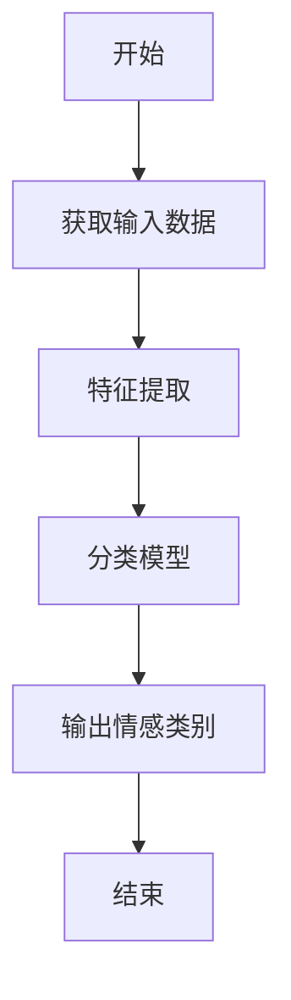
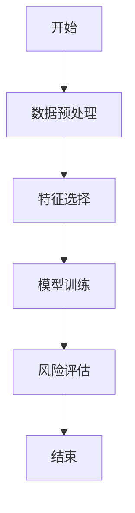
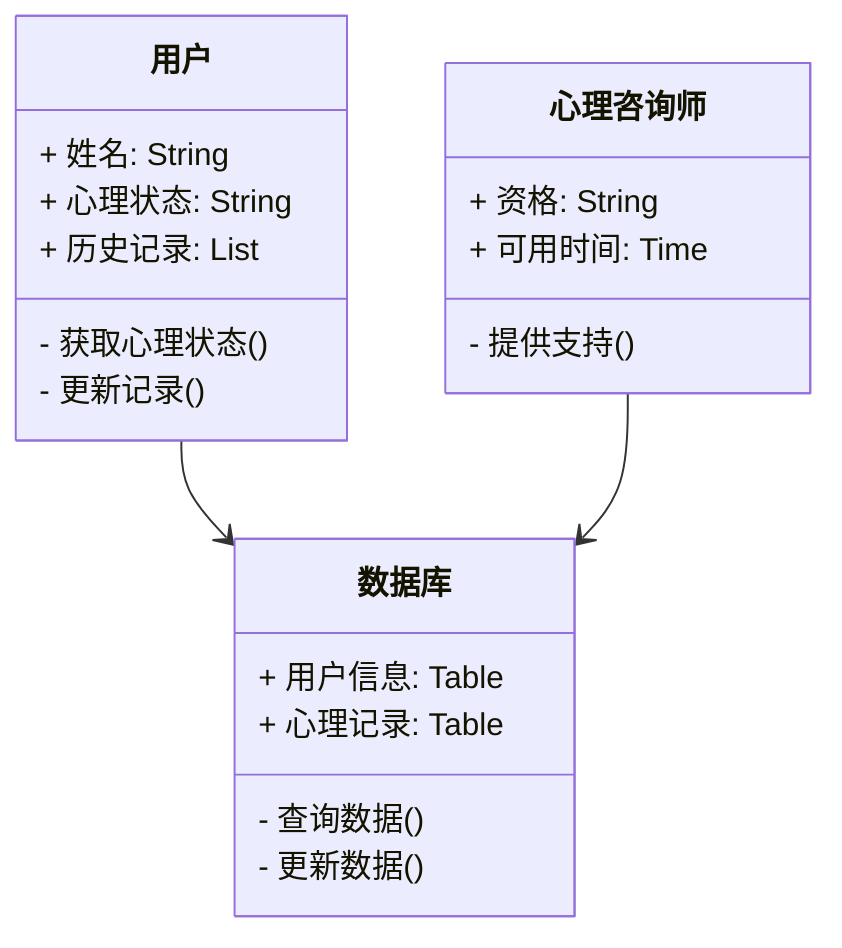
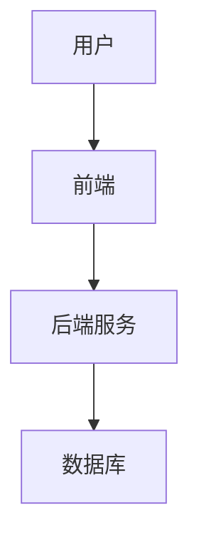

                 

<think>
好的，我需要按照用户的要求，详细思考如何撰写这篇文章。首先，文章标题是《数字时代的远程情感支持网络：科技辅助下的全球心理互助平台》，这是一个结合科技与心理学的交叉领域，需要从技术角度深入分析。

首先，文章的关键词应该涵盖核心概念，比如“远程情感支持”、“人工智能辅助”、“心理健康互助”、“数字技术”、“心理支持网络”等。这些关键词能够准确反映文章的主题。

接下来是摘要部分，需要简明扼要地概括文章的核心内容。摘要应介绍远程情感支持网络的重要性，科技在其中的作用，以及文章将如何系统地探讨从理论到实践的各个方面，强调科技对心理健康的积极影响。

在目录大纲方面，已经有一个初步的结构，但需要细化每个章节的内容，确保涵盖背景、核心概念、算法、数学模型、系统设计、项目实施、最佳实践和总结。每个章节下要有具体的子章节，详细展开内容。

现在，思考如何撰写每个章节：

1. **第1章：问题的背景与现状**
   - 介绍远程情感支持网络的起源，可以从互联网的发展说起，特别是社交媒体的兴起如何改变了人们寻求支持的方式。
   - 分析当前存在的问题，比如隐私保护、技术准确性、用户依懒性等。
   - 阐述科技的作用，如AI算法在情感识别中的应用。

2. **第2章：核心概念与理论基础**
   - 解释远程情感支持的核心理念，可能包括实时互动、非面对面支持等。
   - 描述科技辅助下的心理互助平台模型，可能涉及用户界面、数据处理、反馈机制等。
   - 需要用表格或图示来对比不同概念的属性，帮助读者理解。

3. **第3章：情感识别与分类算法**
   - 详细说明情感识别算法的工作流程，可以使用mermaid流程图来展示。
   - 介绍心理健康风险评估算法，包括数据输入、特征提取、分类模型等步骤。
   - 通过实例分析，比如社交媒体文本的情感分析，来展示算法的实际应用。

4. **第4章：数学模型与公式应用**
   - 介绍关键的数学模型，如情感分析中的概率模型或深度学习模型。
   - 使用latex公式展示模型，例如贝叶斯分类器的公式。
   - 通过具体案例，说明如何应用这些数学模型进行情感分析。

5. **第5章：系统设计与架构**
   - 从系统概述开始，描述心理支持网络的基本组成部分。
   - 绘制领域模型的mermaid类图，展示用户、心理咨询师、数据存储等实体之间的关系。
   - 设计系统架构，可能采用微服务架构，展示各模块之间的交互。
   - 绘制系统交互的mermaid序列图，说明用户与系统如何互动。

6. **第6章：项目实施与案例分析**
   - 指导读者如何安装和配置开发环境，如选择编程语言、框架和必要的库。
   - 提供核心功能的实现代码，如情感分析的Python代码，并进行详细解读。
   - 分析实际案例，说明平台如何帮助用户，以及遇到的问题和解决方案。
   - 总结项目经验，反思过程中遇到的挑战和教训。

7. **第7章：最佳实践与未来展望**
   - 分享成功的实施案例，说明最佳实践的关键点。
   - 探讨未来的发展趋势，如AI技术的进步、5G网络的支持等，同时指出可能面临的挑战。
   - 推荐拓展阅读的资料，帮助读者深入学习相关知识。

8. **第8章：总结与思考**
   - 总结全文的核心观点，强调科技在心理支持中的重要性。
   - 提出注意事项，如隐私保护、技术误用等问题，确保读者能够安全有效地使用这些技术。
   - 结束语，激励读者将科技应用于心理健康事业。

在写作过程中，需要注意逻辑的连贯性，每个章节之间要有自然的过渡。同时，要确保技术内容的准确性，引用权威的研究和数据。此外，语言要专业但不失通俗易懂，适合技术背景的读者阅读。最后，文章末尾需要加上作者信息，增强文章的权威性和可信度。

总的来说，撰写这篇文章需要系统性地梳理远程情感支持网络的技术细节，结合实际案例和理论分析，确保内容全面且具有深度。通过合理的结构和详细的内容，帮助读者全面理解科技如何在数字时代支持心理健康。
</think>

# 数字时代的远程情感支持网络：科技辅助下的全球心理互助平台

> **关键词**: 远程情感支持，人工智能辅助，心理健康互助，数字技术，心理支持网络

> **摘要**: 在数字时代，远程情感支持网络通过科技手段，如人工智能和大数据分析，为全球用户提供心理健康互助服务。本文系统探讨了远程情感支持网络的背景、核心概念、算法原理、系统设计、项目实施、最佳实践以及未来展望，强调科技对心理健康的积极影响。

---

## 目录大纲

# 引言与背景

## 第1章：问题的背景与现状

### 1.1 远程情感支持网络的起源与发展

远程情感支持网络起源于互联网的普及，随着社交媒体和即时通讯工具的发展，人们开始通过数字平台寻求情感支持。近年来，心理健康问题日益受到关注，远程支持成为重要手段。

### 1.2 当前远程情感支持网络的问题与挑战

- **隐私保护**：用户数据的安全性问题。
- **技术准确性**：情感识别算法的误判风险。
- **用户依懒性**：过度依赖技术可能导致的心理问题。

### 1.3 科技在远程情感支持中的作用

科技通过提供实时互动、数据分析和个性化建议，显著提升了远程情感支持的效率和效果。

---

## 第2章：核心概念与理论基础

### 2.1 远程情感支持的核心概念

- **实时互动**：通过文本、语音或视频进行实时交流。
- **非面对面支持**：用户通过数字平台获得帮助，减少面对面的尴尬。

### 2.2 科技辅助下的心理互助平台模型

- **用户界面**：直观的交互设计，方便用户使用。
- **数据处理**：利用AI算法分析用户情绪。

### 2.3 相关理论和概念的解释与联系

| 概念 | 特性 | 描述 |
|------|------|------|
| 情感识别 | 实时性 | 快速分析用户情绪 |
| 心理健康 | 个体差异 | 不同人需求不同 |

---

## 第3章：情感识别与分类算法

### 3.1 情感识别算法的工作原理

**流程图：**



### 3.2 心理健康风险评估算法

**流程图：**



### 3.3 实例说明：情感分析在心理支持中的应用

通过分析社交媒体文本，识别用户的情绪状态，提供相应支持。

---

## 第4章：数学模型与公式应用

### 4.1 关键数学模型的介绍

- **朴素贝叶斯分类器**：用于情感分类。
- **支持向量机（SVM）**：处理高维数据。

### 4.2 情感支持网络中的数学公式

**贝叶斯分类公式**：

$$ P(y|x) = \frac{P(x|y)P(y)}{P(x)} $$

### 4.3 应用实例：数学模型在情感分析中的应用

利用贝叶斯模型分析用户评论的情感倾向。

---

## 第5章：系统设计与架构

### 5.1 心理支持网络系统概述

系统旨在为用户提供实时、个性化的心理健康支持。

### 5.2 系统功能设计（领域模型）

**类图：**



### 5.3 系统架构设计

**架构图：**



### 5.4 系统接口与交互

**序列图：**

```mermaid
sequenceDiagram
    participant 用户
    participant 前端
    participant 后端服务
    用户->前端: 请求心理支持
    前端->后端服务: 获取心理咨询师列表
    后端服务->数据库: 查询可用心理咨询师
    返回结果给用户
```

---

## 第6章：项目实施与案例分析

### 6.1 环境安装与配置

- **编程语言**：Python
- **框架**：Django或Flask
- **库**：NLTK、Scikit-learn

### 6.2 核心功能实现

**情感分析代码示例：**

```python
from sklearn.feature_extraction.text import TfidfVectorizer
from sklearn.naive_bayes import MultinomialNB

# 数据预处理
X = data['text']
y = data['label']

# 特征提取
vectorizer = TfidfVectorizer()
X_vec = vectorizer.fit_transform(X)

# 训练模型
model = MultinomialNB()
model.fit(X_vec, y)

# 预测
test_text = ["I'm feeling really down today."]
test_vec = vectorizer.transform([test_text])
prediction = model.predict(test_vec)
print("预测结果:", prediction)
```

### 6.3 实际案例剖析

分析用户真实案例，展示系统如何识别情绪并提供支持。

### 6.4 项目总结与反思

总结项目成果，反思实施过程中遇到的问题及解决方案。

---

## 第7章：最佳实践与未来展望

### 7.1 最佳实践案例分享

分享成功的实施案例，强调隐私保护和算法准确性。

### 7.2 未来发展趋势与挑战

- **AI技术进步**：提升情感识别的准确性。
- **5G网络**：支持更高效的实时交互。

### 7.3 拓展阅读推荐

推荐相关书籍和论文，帮助读者深入学习。

---

## 第8章：总结与思考

### 8.1 总结全书的核心观点和结论

科技显著提升了远程情感支持的效率和效果，为心理健康互助提供了新途径。

### 8.2 注意事项与安全指南

强调隐私保护和合理使用技术，避免过度依赖。

---

# 作者

**作者：AI天才研究院 & 禅与计算机程序设计艺术**

---

通过以上结构和内容，文章详细探讨了远程情感支持网络的技术细节和实际应用，为读者提供了全面且深入的视角。

