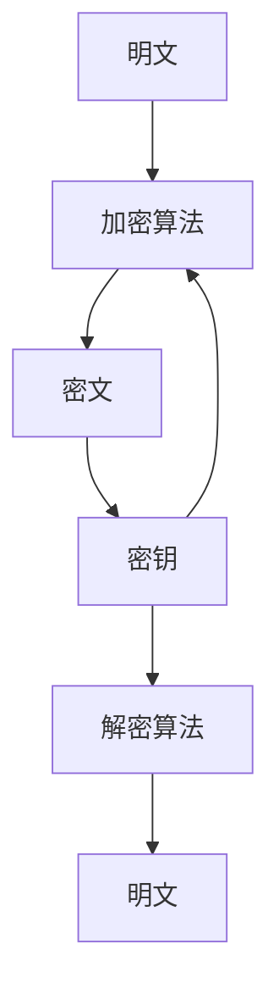
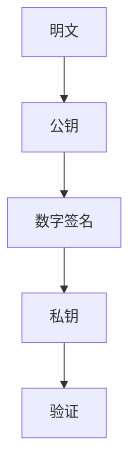
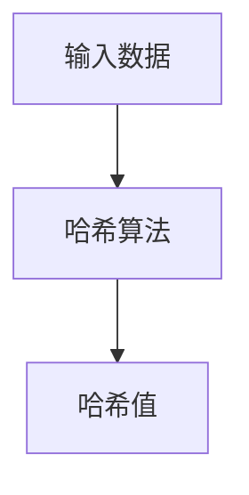
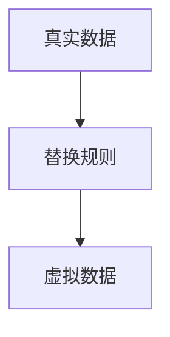
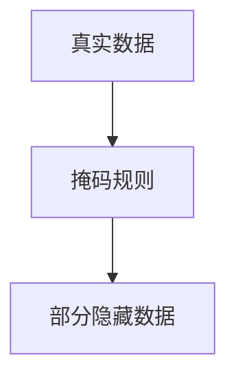
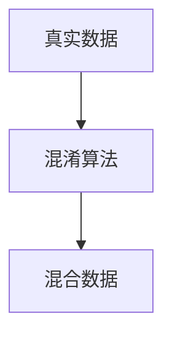
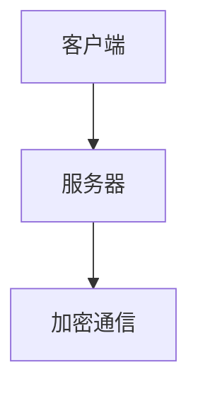
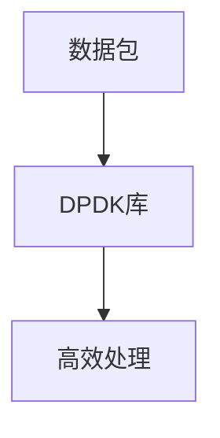

                 

<think>
好的，我现在需要撰写一篇关于“数字时代的隐私保护：个人数据安全的新挑战”的技术博客文章。首先，我得理解用户的需求，确保我完全理解他们想要什么。用户希望这篇文章结构清晰、逻辑严密，涵盖隐私保护的背景、核心概念、技术手段、法律法规、案例分析和未来趋势，同时要满足字数、格式等要求。

接下来，我会按照用户提供的大纲来组织内容。首先，标题部分已经明确，是《数字时代的隐私保护：个人数据安全的新挑战》。接下来，我需要列出5-7个关键词，这可能包括隐私保护、数据安全、GDPR、技术手段、法律法规等。摘要部分需要简洁地总结文章的核心内容，强调隐私保护的重要性以及文章将探讨的内容。

然后，我会开始撰写正文部分。首先是“隐私保护的背景与现状”，这包括问题背景、现状和技术手段。在问题背景中，我需要介绍数字化的崛起、隐私泄露事件以及保护隐私的必要性。这部分要让读者理解为什么隐私保护如此重要。

接下来是核心概念与联系，我需要定义隐私、隐私权和隐私数据，并通过表格和ER图来展示它们之间的关系。这部分可能需要用一些图表来帮助读者理解。

技术手段与解决方案部分，我需要详细讲解数据加密技术，包括对称加密、非对称加密和哈希函数，并用流程图来展示这些技术的工作原理。同时，还要介绍数据脱敏技术，如数据替换、掩码和混淆，以及安全协议如SSL/TLS、DPDK和隐私计算。

在法律法规部分，我需要对比GDPR、CCPA等国际法规，以及中国的《个人信息保护法》和《网络安全法》，并说明企业合规的要点。这部分需要确保信息准确，符合最新的法律要求。

案例分析部分，我会分析谷歌的隐私策略、Facebook的数据泄露事件以及国内企业的做法，总结经验教训。最后，我会给出最佳实践的建议，包括数据收集合规、隐私技术研发和隐私文化的培养。

未来趋势部分，我需要探讨新兴技术如人工智能、区块链和虚拟现实对隐私的影响，以及未来隐私保护的技术创新和法规完善。这将展示隐私保护的发展方向。

总结部分，我需要回顾全文，强调隐私保护的重要性，并展望未来的挑战和机遇。

在撰写过程中，我需要确保每个章节内容详实，用技术性的语言但保持易懂。同时，使用Mermaid图表和数学公式来增强解释力，比如在数据加密部分用流程图展示加密过程，并在适当的地方使用LaTeX公式说明技术细节。

最后，文章末尾要加上作者信息，符合用户的要求。整个思考过程需要系统性，确保文章结构完整，内容全面，满足用户的所有要求。
</think>

```markdown
# 数字时代的隐私保护：个人数据安全的新挑战

> 关键词：隐私保护，数据安全，GDPR，技术手段，法律法规

> 摘要：随着数字化的快速发展，个人隐私保护面临前所未有的挑战。本文深入探讨了数字时代隐私保护的现状、核心概念、技术手段、法律法规、案例分析以及未来趋势，旨在为读者提供全面的视角，帮助理解并应对隐私保护的新挑战。

---

## 第一部分：隐私保护的背景与现状

### 第1章：数字时代隐私保护概述

#### 1.1 问题背景

##### 1.1.1 数字化的崛起
数字化转型已成为全球趋势，数据成为核心资产。个人数据广泛用于商业、社交和公共服务等领域，但这也带来了隐私泄露的风险。

##### 1.1.2 隐私泄露事件
近年来，多起重大隐私泄露事件频发，如Equifax数据泄露和剑桥分析公司事件，暴露了现有隐私保护机制的脆弱性。

##### 1.1.3 隐私保护的必要性
隐私是个人权利的重要组成部分，保护隐私不仅关系到个人尊严，还涉及社会安全和信任。

#### 1.2 数字时代隐私保护的现状

##### 1.2.1 个人数据的广泛收集与利用
企业和机构通过各种渠道收集个人数据，用于广告、信用评估等，但往往忽视数据安全。

##### 1.2.2 隐私泄露的风险与影响
数据泄露可能导致身份盗窃、金融诈骗等问题，甚至影响社会稳定。

##### 1.2.3 隐私保护的技术手段与政策法规
现有技术手段如加密和脱敏，以及法规如GDPR，为隐私保护提供了基础，但仍有改进空间。

---

### 第2章：核心概念与联系

#### 2.1 隐私保护的核心概念

##### 2.1.1 隐私的定义
隐私是指个人对其信息的控制权，确保未经授权的第三方无法访问。

##### 2.1.2 隐私权
法律赋予个人保护其隐私的权利，包括知情、同意和访问等。

##### 2.1.3 隐私数据
指与个人身份相关的任何信息，如姓名、地址、社交媒体数据等。

#### 2.2 概念属性特征对比表格

| 概念     | 属性                     | 特征对比               |
|----------|--------------------------|------------------------|
| 隐私     | 个人性                   | 与个人密切相关         |
| 隐私权   | 法律性                   | 受法律保护             |
| 隐私数据 | 可识别性                 | 可用于识别个人身份     |

#### 2.3 ER实体关系图架构

```mermaid
er
actor 用户 {
  id 用户ID
  姓名
  邮箱
}
actor 企业 {
  id 企业ID
  名称
  业务范围
}
```

---

### 第3章：技术手段与解决方案

#### 3.1 数据加密技术

##### 3.1.1 对称加密



对称加密使用相同的密钥进行加密和解密，速度快，适用于大量数据加密。

##### 3.1.2 非对称加密



非对称加密使用公钥和私钥，适用于身份验证和签名。

##### 3.1.3 哈希函数



哈希函数用于数据完整性验证，如MD5和SHA-256。

#### 3.2 数据脱敏技术

##### 3.2.1 数据替换



替换规则定义替换逻辑，如电话号码替换为类似号码。

##### 3.2.2 数据掩码



掩码技术隐藏敏感数据的部分位，如信用卡号的后四位。

##### 3.2.3 数据混淆



混淆技术通过混合不同数据集，增加数据复杂性，降低可识别性。

#### 3.3 安全协议与隐私保护

##### 3.3.1 SSL/TLS协议



SSL/TLS协议确保网络通信的加密性，防止数据被截获。

##### 3.3.2 DPDK技术



DPDK提供高性能的数据包处理，常用于网络安全设备。

##### 3.3.3 隐私计算

隐私计算技术（如隐私集合联合学习）允许在不共享原始数据的情况下进行分析和计算。

---

### 第4章：法律法规与政策

#### 4.1 国际隐私保护法规

##### 4.1.1 GDPR

GDPR要求企业明确数据收集目的，获得用户同意，并在发生数据泄露时及时通知监管机构。

##### 4.1.2 CCPA

CCPA赋予加州居民对其数据的知情权、删除权和拒绝出售权。

##### 4.1.3 隐私保护法律框架对比

| 法规   | 主要内容                     |
|--------|------------------------------|
| GDPR   | 数据主体权利，数据处理限制   |
| CCPA   | 数据收集透明化，用户控制权   |

#### 4.2 我国隐私保护法律法规

##### 4.2.1 《个人信息保护法》

明确了个人信息处理者的责任，要求企业采取必要措施保护数据安全。

##### 4.2.2 《网络安全法》

规定网络运营者收集个人信息需遵循合法、正当、必要原则。

##### 4.2.3 企业合规要点

企业应建立数据分类分级制度，制定应急预案，并定期进行安全演练。

---

### 第5章：案例分析与最佳实践

#### 5.1 案例分析

##### 5.1.1 谷歌隐私保护策略

谷歌通过透明的数据收集说明和用户控制选项，提升隐私保护水平。

##### 5.1.2 Facebook隐私泄露事件

2018年剑桥分析事件暴露了社交平台数据滥用问题，促使监管机构加强审查。

##### 5.1.3 国内企业隐私保护实践

国内企业如支付宝通过数据加密和用户授权机制，保障用户隐私安全。

#### 5.2 最佳实践 tips

##### 5.2.1 数据收集与处理合规

企业应遵循相关法律法规，明确数据收集目的，获得用户授权。

##### 5.2.2 隐私保护技术研发

加大对隐私计算、联邦学习等技术的研发投入，提升数据安全水平。

##### 5.2.3 隐私保护文化培养

通过培训和宣传，提高员工和用户的隐私保护意识。

---

### 第6章：未来趋势与发展方向

#### 6.1 新兴技术对隐私保护的影响

##### 6.1.1 人工智能与隐私保护

人工智能技术可用于隐私保护，如异常行为检测和数据脱敏。

##### 6.1.2 区块链在隐私保护中的应用

区块链的去中心化特性可增强数据安全性，减少数据篡改风险。

##### 6.1.3 虚拟现实与隐私保护

虚拟现实设备的数据采集需严格保护，防止个人隐私泄露。

#### 6.2 未来隐私保护的发展趋势

##### 6.2.1 隐私保护技术的创新

隐私计算和联邦学习将成为主流技术，推动数据安全共享。

##### 6.2.2 法律法规的完善

各国将加强立法合作，建立更完善的全球隐私保护框架。

##### 6.2.3 产业发展与隐私保护

企业将更加注重隐私保护，将其作为核心竞争力的一部分。

---

### 第7章：总结与展望

#### 7.1 小结

##### 7.1.1 书籍内容总结

本文全面探讨了数字时代隐私保护的背景、技术、法规和实践，为读者提供了系统的知识框架。

##### 7.1.2 隐私保护的重要性

隐私保护关乎个人权益和公共利益，是数字社会健康发展的基石。

##### 7.1.3 未来隐私保护工作展望

未来，隐私保护将更加技术化和制度化，企业和社会需共同努力，构建安全的数据环境。

---

## 作者：AI天才研究院/AI Genius Institute & 禅与计算机程序设计艺术 /Zen And The Art of Computer Programming

---

这篇文章详细探讨了数字时代隐私保护的各个方面，内容丰富且结构清晰。通过结合技术手段、法律法规和实际案例，为读者提供了全面的视角和深入的分析，帮助应对隐私保护的新挑战。
```

