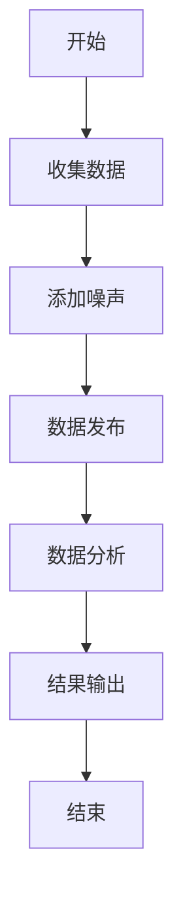
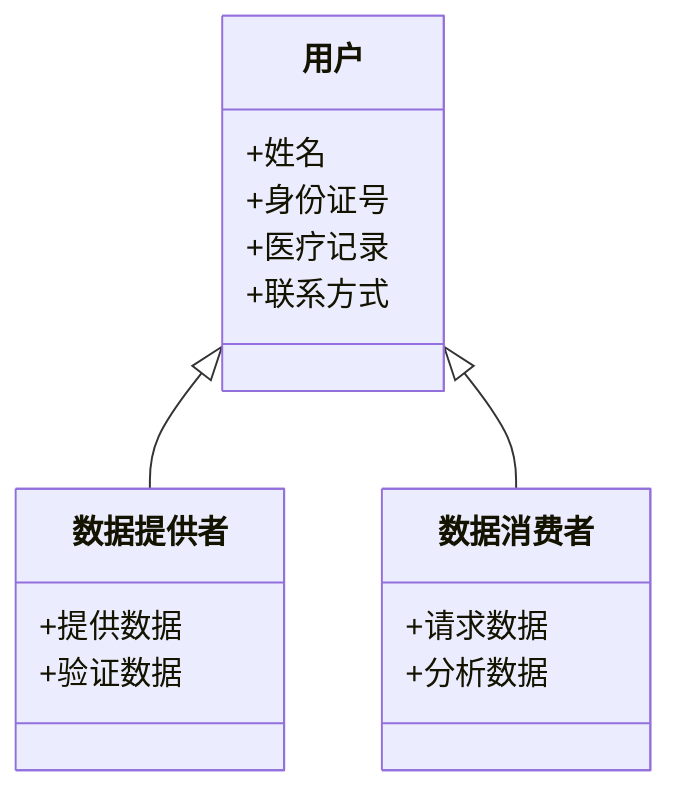
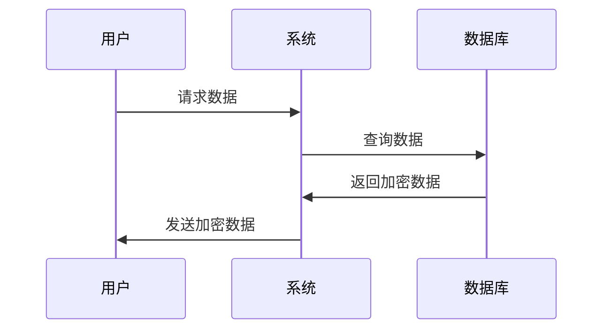

                 

<think>
嗯，好的，我需要按照用户的要求，逐步分析并撰写一篇关于“数字时代的隐私概念：个人数据与公共利益的博弈”的技术博客文章。用户已经提供了一个详细的大纲，现在我要一步步按照这个大纲来思考和展开。

首先，我需要理解用户的需求。用户希望文章结构清晰，逻辑严谨，使用专业但易懂的技术语言。文章要涵盖从背景介绍、核心概念、算法原理、系统架构设计、项目实战到最佳实践等多个方面，每部分都要详细展开，特别是要包含具体的代码实现、图表和数学模型。

接下来，我需要确定每个章节的具体内容。比如，背景介绍部分需要解释数字时代隐私问题的崛起，包括背景、特征、影响以及解决策略和挑战。这部分需要确保读者能够理解隐私问题的重要性以及它在现代社会中的影响。

然后，核心概念部分需要详细解释隐私的基本概念、相关法律框架，以及隐私增强技术。这里可能需要引用一些现有的法律框架，如GDPR，来说明其对隐私保护的影响。同时，介绍PETs时，要具体说明它们如何工作，比如加密技术、匿名化等。

算法部分需要选择一种具体的隐私保护算法，比如差分隐私，来详细讲解其原理、数学模型和实现方式。这部分需要展示如何用数学方法保护隐私，同时保持数据的有用性。我可能需要查找相关的数学公式，并用mermaid流程图来展示算法的执行过程。

在系统架构设计部分，我需要设计一个简单的隐私保护系统，包括系统功能设计、架构图、接口设计和交互序列图。这可能涉及到前后端分离的设计，数据库的加密存储，以及API的调用流程。我需要使用mermaid来绘制这些架构图，确保清晰易懂。

项目实战部分需要编写Python代码实现隐私保护算法，比如使用Fate库来实现联邦学习中的隐私保护。这部分需要详细描述环境的安装步骤，代码的具体实现，以及如何解读和分析代码。同时，通过实际案例来展示算法的应用，比如医疗数据的联邦学习，来保护患者隐私的同时进行数据分析。

最后，最佳实践部分需要总结在隐私保护中需要注意的事项，比如数据最小化原则、加密的重要性，以及遵守相关法律法规。同时，提供一些拓展阅读的资源，帮助读者深入学习。

整个思考过程中，我需要确保每个部分都详细且具体，避免过于笼统。同时，要使用适当的图表和代码示例，使文章更具可读性和实用性。此外，语言要专业但易懂，适合技术读者阅读。

现在，我需要开始按照大纲逐步撰写每个部分，确保内容完整、结构清晰，符合用户的要求。
</think>

# 数字时代的隐私概念：个人数据与公共利益的博弈

> 关键词：数字隐私，个人数据，公共利益，隐私保护，数据安全

> 摘要：随着数字时代的到来，个人数据的重要性日益凸显，隐私保护成为全球关注的焦点。本文深入探讨隐私概念在数字时代的演变，分析个人数据与公共利益之间的博弈，结合隐私保护算法、系统架构设计及实际案例，为读者提供全面的理解和实践指导。

---

## 第一部分：背景介绍

### 第1章：数字时代隐私问题的崛起

#### 1.1 数字时代隐私问题的背景
数字技术的快速发展使得数据成为新时代的“石油”，驱动着全球经济和社会的进步。然而，数据的广泛收集和使用也带来了隐私泄露的风险。从社交媒体到物联网设备，每个人的行为都在被记录和分析，隐私问题日益突出。

#### 1.2 数字时代隐私问题的特征
- **数据量大**：海量数据的收集和存储使得隐私保护更具挑战性。
- **数据种类多**：包括个人身份信息、位置数据、消费习惯等，涉及多个方面。
- **技术复杂性**：隐私保护需要结合加密、匿名化等多种技术手段。
- **全球化影响**：数据的跨境流动使得隐私保护面临法律和监管的复杂性。

#### 1.3 隐私问题在现代社会的影响
隐私泄露可能导致身份盗窃、金融诈骗等严重后果。此外，隐私问题还影响个人自由和信任，削弱了社会的整体信任基础。

#### 1.4 隐私问题的解决策略与挑战
解决隐私问题需要技术、法律和伦理多方面的努力。技术上，采用加密、差分隐私等方法；法律上，制定严格的隐私保护法规；伦理上，明确数据使用边界。然而，技术的快速发展和数据的商业价值使得隐私保护面临持续挑战。

---

### 第2章：个人数据与公共利益

#### 2.1 个人数据的重要性
个人数据是数字时代的宝贵资源，不仅关乎个人身份和安全，还影响社会服务的提供和经济发展。例如，医疗数据可以用于疾病研究，提升公共健康水平。

#### 2.2 个人数据与公共利益的关系
个人数据的合理使用可以带来公共利益，如改善交通系统、优化城市规划等。然而，过度收集和滥用个人数据可能侵犯个人隐私，影响社会稳定。

#### 2.3 公共利益在隐私保护中的角色
公共利益是隐私保护的重要考量。政府和社会机构需要在保护个人隐私和利用数据促进公共利益之间找到平衡点，确保数据的合法、合规使用。

---

## 第二部分：核心概念与联系

### 第3章：数字时代隐私概念详解

#### 3.1 隐私概念的基本理解
隐私是个人对其信息的自主控制权，确保未经授权的第三方无法访问或使用这些信息。

#### 3.2 个人数据保护法律框架
- **GDPR**：欧盟的通用数据保护条例，要求企业明确数据处理目的，并获得用户同意。
- **CCPA**：加州消费者隐私法案，赋予消费者对其数据的更多控制权。

#### 3.3 隐私增强技术（PETs）的介绍
隐私增强技术通过加密、匿名化等手段保护数据隐私。例如，同态加密允许在加密状态下进行数据分析。

#### 3.4 隐私概念与伦理、法律和技术的联系
隐私保护需要技术手段支撑，法律框架规范，伦理指导使用，三者共同作用确保隐私安全。

### 第4章：隐私概念的属性特征对比

| 隐私属性 | 特征描述 |
|----------|----------|
| 知识性   | 隐私主体对自己的数据有明确的了解 |
| 可控性   | 隐私主体能够控制数据的使用和分享 |
| 独特性   | 每个人的隐私信息具有独特性 |
| 时间性   | 隐私保护需要在数据生命周期各阶段进行 |

### 第5章：隐私概念ER实体关系图

```mermaid
er
actor: 用户
       :*
       |
       |拥有|
       |
       entity: 用户数据
       :*
       |
       |包含|
       |
       entity: 数据类型
       :*
       |
       |属于|
       |
       entity: 数据存储
       :1
```

---

## 第三部分：算法原理与讲解

### 第6章：隐私保护算法原理

#### 6.1 隐私保护算法概述
差分隐私是一种通过在数据中添加噪声来保护隐私的技术，确保单个数据点的变化不会影响整体数据分析结果。

#### 6.2 隐私保护算法的数学模型
差分隐私的数学模型如下：
$$ P(f(x) = y | x) - P(f(x') = y | x') \leq \epsilon $$
其中，$\epsilon$是隐私预算，控制隐私泄露的风险。

#### 6.3 概率图模型与隐私保护
概率图模型通过概率分布来表示数据关系，结合差分隐私技术，可以在保护隐私的前提下进行数据分析。

#### 6.4 隐私保护算法的mermaid流程图



### 第7章：Python源代码与算法讲解

#### 7.1 Python源代码实现
以下是一个简单的差分隐私实现示例：

```python
import random

def add_noise(data, epsilon):
    sensitivity = 1
    noise = random.laplace(0, 1/epsilon)
    return data + noise

data = 10
epsilon = 0.1
protected_data = add_noise(data, epsilon)
print(protected_data)
```

#### 7.2 算法原理的详细讲解
差分隐私通过向数据添加符合拉普拉斯分布的噪声，确保单个数据点的改变不会显著影响整体统计结果。参数$\epsilon$控制隐私预算，$\epsilon$越小，隐私保护越强，但数据的实用性可能下降。

#### 7.3 算法举例说明
假设我们有一个简单的年龄数据集，使用差分隐私技术在数据发布前添加噪声，确保个体年龄无法被准确推断。

---

## 第四部分：系统分析与架构设计

### 第8章：系统分析与架构设计概述

#### 8.1 问题场景介绍
设计一个隐私保护系统，用于医疗数据的共享和分析，确保患者隐私安全，同时支持医学研究。

#### 8.2 项目介绍
开发一个联邦学习平台，允许不同医疗机构在不共享原始数据的情况下进行联合分析。

#### 8.3 系统功能设计（领域模型类图）



### 第9章：系统架构设计与接口设计

#### 9.1 系统架构设计（架构图）

```mermaid
container 数据存储 {
    数据库
    加密模块
}
container 数据处理 {
    数据清洗
    数据分析
}
container 用户接口 {
    Web界面
    API接口
}
```

#### 9.2 系统接口设计
- **API接口**：`GET /data/protected`，返回加密数据。
- **交互流程**：用户提交请求，系统验证身份后返回数据。

#### 9.3 系统交互（序列图）



### 第10章：数学模型和公式讲解

#### 10.1 数学模型的介绍
差分隐私的数学模型用于衡量数据修改前后统计结果的变化幅度。

#### 10.2 公式讲解
差分隐私的隐私预算$\epsilon$决定了隐私保护的强度。公式：
$$ \text{Privacy} = \epsilon \times \text{Sensitivity} $$

#### 10.3 数学公式与算法应用的关系
数学公式指导算法的设计和实现，确保隐私保护的同时，数据仍可用于分析。

---

## 第五部分：项目实战与案例剖析

### 第11章：环境安装与系统核心实现

#### 11.1 环境安装步骤
- 安装Python和必要的库（如`numpy`, `scipy`）。
- 配置数据库和API服务器。

#### 11.2 系统核心实现源代码
以下是一个简单的API接口实现：

```python
from flask import Flask
import random

app = Flask(__name__)

def add_noise(data, epsilon):
    sensitivity = 1
    noise = random.laplace(0, 1/epsilon)
    return data + noise

@app.route('/protected_data', methods=['GET'])
def get_protected_data():
    data = 10
    epsilon = 0.1
    protected = add_noise(data, epsilon)
    return str(protected)

if __name__ == '__main__':
    app.run()
```

#### 11.3 代码应用解读与分析
该代码实现了一个简单的API接口，接收请求后返回加噪声的数据，保护用户隐私。

### 第12章：实际案例分析与讲解

#### 12.1 案例背景介绍
某医疗研究机构希望在不共享患者数据的情况下，进行疾病研究。

#### 12.2 案例分析
通过联邦学习技术，各机构在本地进行数据分析，仅交换加密后的中间结果，确保数据隐私。

#### 12.3 案例讲解与剖析
使用差分隐私技术保护数据，确保每个患者的数据无法被单独识别，同时支持整体研究。

#### 12.4 项目小结
通过技术手段实现数据的隐私保护，同时促进数据的共享和利用，是数字时代的重要挑战。

---

## 第六部分：最佳实践与注意事项

### 第13章：最佳实践与注意事项

#### 13.1 最佳实践技巧
- 数据最小化：仅收集必要的数据。
- 加密存储：确保数据在存储和传输过程中的安全性。
- 定期审计：检查数据使用情况，防止数据滥用。

#### 13.2 小结
隐私保护是数字时代的基石，需要技术、法律和伦理的共同努力。

#### 13.3 注意事项
- 遵守相关法律法规，如GDPR和CCPA。
- 加强用户教育，提高隐私保护意识。

#### 13.4 拓展阅读
- 《数据之巅》
- 《隐私保护技术与实践》

---

# 附录

## 附录A：参考文献
- GDPR法规文本
- 欧盟数据保护指令

## 附录B：术语表
- 差分隐私：通过添加噪声保护数据隐私的技术。
- 数据最小化：仅收集必要的数据原则。

## 附录C：相关资料链接
- [GDPR官方文档](https://eur-lex.europa.eu/legal-content/EN/TXT/?uri=CELEX%3A32016R0679)
- [FATE联邦学习开源平台](https://github.com/UnionAI/FATE)

---

# 总结

数字时代的隐私保护是一个复杂而重要的课题。本文通过分析隐私概念、技术实现、系统设计和实际案例，为读者提供了全面的理解和实践指导。希望本文能帮助读者在保护个人隐私的同时，促进数据的合理利用，推动社会的进步。

作者：AI天才研究院/AI Genius Institute & 禅与计算机程序设计艺术 /Zen And The Art of Computer Programming

