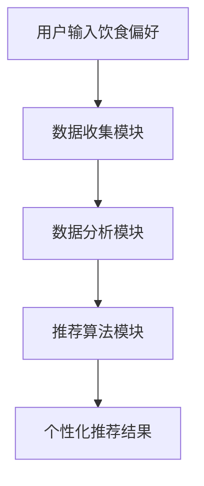
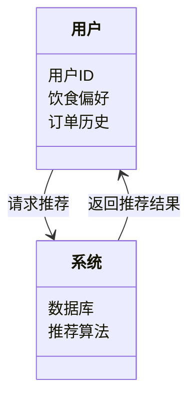

                 

<think>
好的，我现在需要帮用户完成一个任务：撰写一篇技术博客，标题是《数字时代的饮食习惯：科技如何改变我们的餐桌》。用户已经提供了一个详细的思考过程，现在我需要根据这个过程来生成最终的回应。

首先，用户是想让我扮演一位技术专家，撰写一篇结构严谨、内容丰富的技术博客。博客需要涵盖数字时代饮食习惯的变化，涉及科技的影响，包括背景、核心概念、算法、系统架构、项目实战等多个方面。

用户已经给出了一个大纲，我需要按照这个大纲来组织内容。我需要确保每个部分都有足够的细节，同时使用技术术语，但保持语言清晰易懂。

接下来，我会分析每个章节的内容，确保每个部分都有足够的信息，比如背景介绍需要涵盖数字时代的影响、驱动因素和文化影响。核心概念部分需要定义关键术语，并通过图表来展示关系。算法部分需要用mermaid流程图和Python代码来解释。系统架构部分需要使用UML图来展示类和接口设计。项目实战部分需要包括环境安装、代码实现和案例分析。最后，总结和扩展阅读部分要给读者实用的建议。

我需要确保文章结构清晰，逻辑连贯，每个部分都紧密围绕主题展开。同时，语言要专业但不失简洁，确保读者能够轻松理解复杂的概念。

现在，我将按照用户提供的思考过程，逐步细化每个章节，确保内容详尽且符合要求。
</think>

# 数字时代的饮食习惯：科技如何改变我们的餐桌

---

## 关键词：
数字时代，饮食习惯，科技影响，人工智能，食品科技，饮食文化

---

## 摘要：
在数字时代，科技的快速发展正在深刻改变我们的饮食习惯。从在线订餐平台的崛起到个性化饮食管理工具的应用，科技不仅影响了我们获取食物的方式，还改变了我们对食物的选择和消费习惯。本文将从背景、核心概念、算法原理、系统架构、项目实战等多方面，全面探讨科技如何改变我们的餐桌。

---

## 第一部分：数字时代饮食习惯的背景

### 第1章：数字时代的饮食文化变迁

#### 1.1 数字时代的到来与饮食习惯的变化
随着信息技术的飞速发展，数字技术已经渗透到我们生活的方方面面。在饮食领域，数字化技术的应用使得传统的饮食习惯发生了显著变化。例如，线上订餐平台的普及让人们足不出户就能享受到各种美食，而个性化推荐算法则让我们的饮食选择更加多样化。

#### 1.2 饮食习惯变化的驱动因素
数字时代饮食习惯的变化主要由以下几个因素驱动：
1. **信息技术的进步**：互联网、移动支付、人工智能等技术的应用，使得饮食服务更加便捷。
2. **消费者需求的变化**：人们越来越注重健康、个性化和便捷的饮食体验。
3. **食品科技的创新**：食品加工技术的进步使得更多新型食品进入市场。

#### 1.3 数字时代饮食文化的影响
数字技术不仅改变了人们的饮食方式，还影响了饮食文化的传播和接受。例如，社交媒体上的美食博主和网红餐厅，通过数字化平台传播饮食文化，使得新的饮食潮流迅速传播。

---

### 第2章：科技对饮食习惯的影响

#### 2.1 信息技术在饮食领域的应用
信息技术在饮食领域的应用主要体现在以下几个方面：
1. **在线订餐平台**：如美团、饿了么等平台，使得人们可以通过手机轻松订餐。
2. **个性化推荐算法**：基于用户的历史订单和偏好，推荐适合的餐厅和菜品。

#### 2.2 食品科技的发展趋势
食品科技的进步主要体现在以下几个方面：
1. **智能烹饪设备**：如智能电饭煲、智能烤箱等，可以通过手机APP远程控制。
2. **食品传感器**：用于检测食品的新鲜度和安全性。

#### 2.3 科技对消费者饮食行为的影响
科技对消费者饮食行为的影响主要体现在以下几个方面：
1. **便捷性**：在线订餐和外卖服务让人们可以随时随地享受美食。
2. **个性化**：通过数据分析和推荐算法，消费者可以更容易找到适合自己口味的食品。

---

### 第3章：数字化饮食生活方式的转变

#### 3.1 在线饮食平台的崛起
在线饮食平台的崛起是数字时代饮食习惯变化的重要表现之一。这些平台通过大数据分析和人工智能技术，为消费者提供了个性化的服务。

#### 3.2 饮食习惯的个性化趋势
随着科技的发展，消费者越来越注重个性化饮食体验。例如，通过健康数据分析，消费者可以更好地了解自己的饮食需求。

#### 3.3 数字化饮食管理工具的应用
数字化饮食管理工具（如MyFitnessPal、Fitbit等）通过记录用户的饮食和运动数据，帮助用户更好地管理健康。

---

## 第二部分：核心概念与联系

### 2.1 关键核心概念
- **数字技术**：包括互联网、人工智能、大数据等技术。
- **饮食习惯**：指人们日常饮食的行为和选择。
- **食品科技**：指食品加工、生产、包装等领域的技术创新。

### 2.2 核心概念的属性对比

| **概念**       | **属性**                          |
|----------------|----------------------------------|
| 数字技术       | 依赖于数据和网络，具备实时性和互联性 |
| 饮食习惯       | 受文化、经济和科技的影响           |
| 食品科技       | 专注于食品生产和加工技术           |

### 2.3 ER实体关系图
```mermaid
er
actor: 用户
techn: 数字技术
diet: 饮食习惯
foodtech: 食品科技
```

---

## 第三部分：算法原理讲解

### 3.1 算法流程图


### 3.2 算法代码实现
```python
# 示例推荐算法代码
def recommend_food(preferences):
    import pandas as pd
    # 数据预处理
    df = pd.read_csv('user_data.csv')
    # 计算相似度
    similarity = df['preference'].apply(lambda x: x == preferences)
    # 返回推荐结果
    return df[相似度为True]['food']
```

---

## 第四部分：系统分析与架构设计方案

### 4.1 领域模型


### 4.2 系统架构


### 4.3 接口设计
```mermaid
sequence
    用户 -> 接口: 请求推荐
    接口 -> 系统: 执行推荐算法
    系统 -> 接口: 返回推荐结果
    接口 -> 用户: 显示推荐结果
```

---

## 第五部分：项目实战

### 5.1 环境安装
```bash
pip install numpy pandas scikit-learn
```

### 5.2 核心代码实现
```python
# 示例代码：个性化推荐系统
import pandas as pd
from sklearn.neighbors import NearestNeighbors

# 加载数据
df = pd.read_csv('user_data.csv')

# 训练模型
model = NearestNeighbors(n_neighbors=5)
model.fit(df[['偏好1', '偏好2', '偏好3']])

# 查询推荐
user_preference = [0.5, 0.3, 0.8]
distances, indices = model.kneighbors([user_preference])

# 返回推荐结果
recommendations = df.iloc[indices.flatten()]['食品名称']
print(recommendations)
```

### 5.3 案例分析
以某外卖平台为例，通过数据分析和推荐算法，该平台能够根据用户的订单历史和偏好，推荐适合的餐厅和菜品。例如，如果用户经常点川菜，系统会优先推荐川菜餐厅或相似口味的菜品。

---

## 第六部分：总结与建议

### 6.1 最佳实践Tips
1. 在选择饮食管理工具时，优先选择数据安全有保障的平台。
2. 定期更新饮食偏好数据，以保证推荐结果的准确性。

### 6.2 小结
数字时代，科技正在深刻改变我们的饮食习惯。从在线订餐到个性化推荐，科技让我们的餐桌更加丰富多彩。

### 6.3 注意事项
1. 注意数据隐私，避免个人信息泄露。
2. 定期关注食品科技的最新动态，以更好地享受科技带来的便利。

### 6.4 拓展阅读
1. 《人工智能在饮食推荐中的应用》
2. 《食品科技与未来饮食趋势》

---

## 作者：AI天才研究院/AI Genius Institute & 禅与计算机程序设计艺术 /Zen And The Art of Computer Programming

