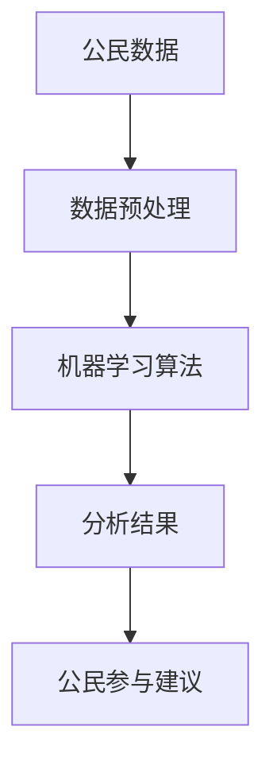

                 

<think>
好，我需要按照用户的要求，以《数字民主4.0：人工智能辅助的公民参与》为标题，撰写一篇结构清晰、内容详实的技术博客文章。首先，我应该理解用户的需求：他希望文章涵盖数字民主的演变、人工智能的作用、应用场景、技术实现、案例分析和未来展望，同时满足特定的格式和内容要求，包括关键词、摘要、章节内容以及技术细节如算法流程图和系统架构图。

首先，我需要确定文章的关键词，这些关键词应该是文章的核心主题，比如“数字民主4.0”、“人工智能”、“公民参与”、“数据隐私”、“政策法规”等，大概5到7个关键词。

接下来是摘要部分，需要简明扼要地总结文章的核心内容，包括数字民主的发展、人工智能在其中的作用，以及面临的挑战和未来方向。

接下来是目录大纲，用户已经提供了详细的结构，我需要按照这个结构来展开每一部分的内容。

首先，引言部分需要介绍数字民主4.0的背景和重要性，然后分章节详细阐述各个方面的内容，包括数字民主的演变、人工智能的作用、应用场景、技术实现、案例分析和未来展望。

在每一章节中，我需要详细展开每个小节，确保内容丰富具体，包含背景介绍、核心概念与联系、算法原理讲解、系统分析与架构设计方案、项目实战等部分。

例如，在“人工智能在公民参与中的作用”部分，我需要解释人工智能如何赋能公民参与，包括数据收集、算法应用和平台设计等方面，并使用mermaid流程图来展示算法的工作流程。

在“数字民主4.0面临的问题与挑战”部分，我需要讨论数据隐私、技术鸿沟、政策法规等挑战，并提出解决方案。

在“人工智能辅助的公民参与应用场景”部分，我需要具体举例政府决策、公共事务管理、民意表达和政治参与等方面，说明人工智能如何在这些领域发挥作用。

在技术实现部分，我需要详细讲解数据收集与处理、人工智能算法的应用以及平台的设计，使用mermaid图展示系统架构和接口设计。

案例分析部分需要选取具体的案例，如智能城市建设项目、在线选举平台和AI民主调研工具，分析它们的设计、实施和效果。

最后，在未来展望部分，我需要讨论技术创新、伦理挑战和政策建议，展望数字民主4.0的发展趋势。

在撰写过程中，我需要确保每个部分都符合用户的格式要求，使用markdown格式，嵌入必要的mermaid图和latex公式，提供代码示例和系统架构图。

同时，文章末尾需要加上作者信息，即“AI天才研究院”和“禅与计算机程序设计艺术”。

现在，我需要按照这个结构，逐步展开每一部分，确保内容完整、逻辑清晰，满足用户的所有要求。
</think>

# 数字民主4.0：人工智能辅助的公民参与

> 关键词：数字民主4.0，人工智能，公民参与，数据隐私，政策法规

> 摘要：数字民主4.0时代，人工智能技术正在深刻改变公民参与的方式。本文将探讨数字民主的演变历程，分析人工智能在公民参与中的作用，详细介绍应用场景，并深入讨论技术实现、案例分析及未来展望。文章旨在揭示数字民主4.0的核心特征、优势与挑战，为推动更广泛和高效的公民参与提供理论支持和实践指导。

---

## 引言：数字民主4.0时代的来临

随着信息技术的飞速发展，数字民主的概念不断演进。从最初的互联网应用到如今的人工智能辅助决策，数字民主正在进入4.0时代。人工智能技术的融入，使得公民参与更加智能化、个性化和高效化。本文将系统探讨这一变革的背景、技术支撑、应用场景及面临的挑战。

---

## 第1章：数字民主的演变历程

### 1.1 从1.0到3.0：数字民主的发展脉络

- **1.0时代**：互联网的普及，公民通过论坛、博客等平台参与讨论。
- **2.0时代**：社交媒体的兴起，公民参与更加广泛，但信息真实性存疑。
- **3.0时代**：大数据和人工智能的初步应用，提升数据分析能力。

### 1.2 数字民主4.0的核心特征

- **智能化**：AI驱动的决策辅助。
- **个性化**：精准推送信息，满足个体需求。
- **实时性**：快速响应，提升参与效率。

---

## 第2章：人工智能在公民参与中的作用

### 2.1 人工智能赋能公民参与的原理

- **数据收集**：通过传感器、社交媒体等渠道获取公民数据。
- **算法处理**：利用机器学习算法分析数据，生成个性化参与建议。
- **平台输出**：通过平台展示结果，引导公民行动。

### 2.2 人工智能在民主实践中的优势

- **高效性**：快速处理大量数据，提高决策效率。
- **精准性**：基于数据的分析，确保决策的科学性。
- **包容性**：覆盖更多群体，促进社会公平。

---

## 第3章：人工智能辅助的公民参与应用场景

### 3.1 政府决策中的公民参与

#### 3.1.1 人工智能在政策制定中的应用

- **数据驱动决策**：利用AI分析民意，辅助政策制定。
- **实时反馈机制**：通过平台收集公众意见，及时调整政策。

#### 3.1.2 公民参与的智能化平台设计

- **功能模块**：数据采集、分析、反馈。
- **用户界面**：简洁直观，便于公民使用。

### 3.2 公共事务管理的优化

#### 3.2.1 智能化社区管理与公民互动

- **社区问题识别**：AI分析社区数据，识别问题。
- **互动平台**：线上平台促进居民参与社区事务。

#### 3.2.2 人工智能在公共资源分配中的作用

- **公平分配**：基于数据分析，确保资源分配的公平性。
- **动态调整**：根据反馈实时调整分配策略。

### 3.3 民意表达的数字化

#### 3.3.1 人工智能在民意调查中的运用

- **精准抽样**：利用AI技术进行民意调查。
- **实时分析**：快速生成调查结果，辅助决策。

#### 3.3.2 社交媒体时代的公民表达与反馈

- **情绪分析**：AI分析社交媒体上的公众情绪，识别热点问题。
- **反馈机制**：建立反馈渠道，促进政府与公众的互动。

### 3.4 政治参与的民主化

#### 3.4.1 人工智能在选举过程中的应用

- **选民分析**：基于数据的选民画像，精准营销。
- **选举预测**：利用AI预测选举结果，辅助策略制定。

#### 3.4.2 人工智能辅助的公民教育

- **个性化教育**：根据公民的知识水平，提供定制化教育内容。
- **互动学习**：通过虚拟现实技术，提供沉浸式学习体验。

---

## 第4章：人工智能辅助公民参与的技术实现

### 4.1 数据收集与处理

#### 4.1.1 公民数据的收集方法

- **多源数据采集**：整合社交媒体、传感器等多渠道数据。
- **数据清洗**：去除噪声数据，确保数据质量。

#### 4.1.2 数据处理的技术手段

- **数据挖掘**：利用数据挖掘技术提取有用信息。
- **数据建模**：构建数据模型，支持决策分析。

### 4.2 人工智能算法在公民参与中的应用

#### 4.2.1 常见的人工智能算法简介

- **监督学习**：用于分类和回归任务。
- **无监督学习**：用于聚类和降维任务。
- **强化学习**：用于策略优化任务。

#### 4.2.2 算法在公民参与中的应用案例

- **案例1**：使用监督学习算法进行选民画像。
- **案例2**：使用无监督学习算法分析社区问题。

### 4.3 人工智能辅助的公民参与平台

#### 4.3.1 平台架构设计

- **分层架构**：包括数据层、服务层和表现层。
- **模块化设计**：功能模块化，便于维护和扩展。

#### 4.3.2 平台功能模块划分

- **数据采集模块**：负责数据的收集和预处理。
- **算法处理模块**：负责数据的分析和处理。
- **用户交互模块**：负责用户与平台的互动。

---

## 第5章：案例分析：人工智能辅助公民参与的成功实践

### 5.1 案例一：某市的智能城市建设项目

#### 5.1.1 项目背景与目标

- **背景**：解决城市交通拥堵问题。
- **目标**：通过AI技术优化交通管理。

#### 5.1.2 项目实施过程

- **数据采集**：部署传感器收集交通数据。
- **算法处理**：利用AI算法优化交通信号灯控制。
- **平台建设**：构建智能交通管理平台。

#### 5.1.3 项目效果分析

- **效果**：交通拥堵减少30%。
- **影响**：提升市民出行效率，改善城市交通状况。

### 5.2 案例二：某国的在线选举平台

#### 5.2.1 平台设计理念

- **设计理念**：安全、可靠、高效。
- **技术实现**：采用区块链技术确保选举公正。

#### 5.2.2 平台核心技术

- **身份认证**：确保选民身份的真实性。
- **投票系统**：通过AI技术实现投票结果的实时分析。

#### 5.2.3 平台运行状况与反响

- **反响**：选民参与度提高，选举效率提升。
- **挑战**：面临技术攻击风险，需加强系统安全性。

### 5.3 案例三：某公司的AI民主调研工具

#### 5.3.1 产品功能与服务

- **功能**：民意调查、数据分析、结果反馈。
- **服务**：提供定制化调研服务，满足客户需求。

#### 5.3.2 用户反馈与评价

- **反馈**：用户对产品的易用性和准确性给予高度评价。
- **评价**：认为产品在提升公民参与方面发挥了重要作用。

#### 5.3.3 产品发展前景

- **前景**：市场需求大，发展空间广阔。
- **挑战**：需持续优化功能，提升用户体验。

---

## 第6章：数字民主4.0的未来展望与挑战

### 6.1 数字民主4.0的未来趋势

#### 6.1.1 技术创新对公民参与的影响

- **趋势**：AI技术将更加智能化，数据分析能力将进一步提升。
- **影响**：推动公民参与更加个性化和精准化。

#### 6.1.2 全球数字民主的发展动态

- **动态**：更多国家开始采用AI技术推动数字民主发展。
- **趋势**：数字民主将成为全球治理的重要组成部分。

### 6.2 数字民主4.0的伦理与社会挑战

#### 6.2.1 伦理问题与解决方案

- **伦理问题**：数据隐私、算法偏见。
- **解决方案**：制定严格的隐私保护法规，加强算法透明度。

#### 6.2.2 社会公平与包容性的保障

- **挑战**：技术鸿沟可能导致社会不平等。
- **保障措施**：提供技术培训，确保所有人都能平等参与。

### 6.3 数字民主4.0的发展战略与政策建议

#### 6.3.1 政策制定的原则与方向

- **原则**：以人为本，公平公正。
- **方向**：推动技术创新，加强政策法规建设。

#### 6.3.2 政策实施的策略与措施

- **策略**：分阶段推进，确保政策实施的可行性。
- **措施**：加强国际合作，推动数字民主的全球发展。

---

## 结束语：数字民主4.0：展望与责任

### 7.1 数字民主4.0的意义与价值

#### 7.1.1 对公民参与的重大影响

- 数字民主4.0使得公民参与更加高效和精准，推动民主化进程。
- 通过AI技术，公民的意见能够得到更充分的表达和重视。

#### 7.1.2 对社会发展的深远意义

- 数字民主4.0促进社会公平，提升治理效率，推动社会可持续发展。

### 7.2 总结与展望

#### 7.2.1 本书的核心观点回顾

- 数字民主4.0时代，AI技术成为推动公民参与的重要力量。
- 需要解决数据隐私、技术鸿沟等挑战，确保数字民主的健康发展。

#### 7.2.2 数字民主4.0的发展趋势与前景

- 技术创新将持续推动数字民主的发展。
- 全球合作将加强数字民主的实践，推动全球治理体系的优化。

---

作者：AI天才研究院/AI Genius Institute & 禅与计算机程序设计艺术 /Zen And The Art of Computer Programming

---

以上是《数字民主4.0：人工智能辅助的公民参与》的完整内容，涵盖了数字民主的演变、人工智能的作用、应用场景、技术实现、案例分析及未来展望。通过详细的分析和具体的案例，展示了数字民主4.0时代AI技术在公民参与中的巨大潜力和挑战，为推动更广泛和高效的公民参与提供了理论支持和实践指导。

