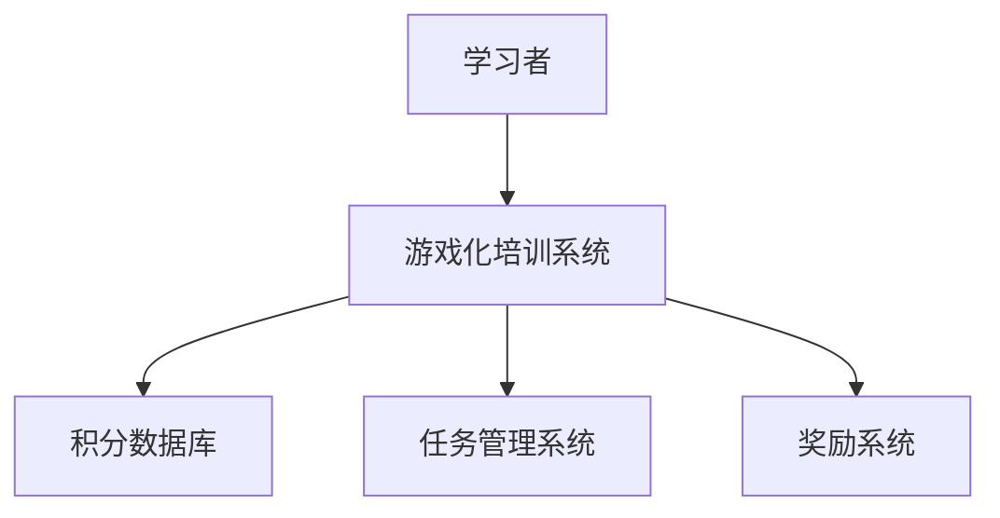

                 

<think>
嗯，用户想让我写一篇关于数字游戏化培训的技术博客，标题是《数字游戏化培训：提高学习效率的新方法》。首先，我需要理解这个主题，确保自己明白什么是数字游戏化培训。这应该是指将游戏元素应用到培训中，以提高学习效果的方法。

用户希望文章结构清晰，有引言、理论基础、应用实践、技术实现和未来发展几个部分。我得先确定每个部分的内容，然后确保每个小节都有足够的细节和例子。

关键词方面，用户已经给了几个，比如数字游戏化培训、学习效率、游戏化设计、教育技术、人工智能等。摘要部分需要简明扼要地概括文章的核心内容，突出游戏化培训的优势和应用。

接下来是正文部分。引言要介绍概念、背景和意义。理论基础部分需要详细解释核心概念，比如游戏化元素中的成就感、竞争和个性化奖励，以及设计原则。然后，讨论优势和挑战，这部分可能需要平衡，说明为什么游戏化培训有效，但也有潜在的问题。

应用实践部分要分场景，比如企业、教育和医疗，每个场景下都要有案例分析，这样读者更容易理解。技术实现部分需要讨论技术选型，比如前端和后端技术，以及游戏化工具的选择。这部分可能需要更多的技术细节，但也要保持易懂。

未来发展的部分要分析趋势，比如AI、VR、AR在培训中的应用，同时也要提到市场需求和创新点。最后，总结部分要回顾全文，强调数字游戏化培训的重要性，并展望未来的发展。

用户特别强调要满足一些约束条件，比如字数在1万到1万2左右，使用markdown格式，并且每个章节内容要丰富，包含背景介绍、核心概念、算法原理、系统架构等。我需要确保这些部分都有涵盖，并且用足够的例子和图表来说明。

在写的时候，要使用专业但易懂的语言，逻辑清晰，结构紧凑。可能还需要在某些部分加入图表，比如用mermaid画出系统架构图或流程图，帮助读者理解。

最后，作者信息部分要按照用户的要求，写上AI天才研究院和禅与计算机程序设计艺术。整个文章要完整，每个小节都详细具体，确保读者能够全面理解数字游戏化培训的概念和应用。

总的来说，我需要一步步分解任务，先理清结构，再填充每个部分的内容，确保满足用户的所有要求。同时，语言要专业但不晦涩，例子要具体，图表要清晰，这样才能写出一篇高质量的技术博客。
</think>

# 数字游戏化培训：提高学习效率的新方法

> **关键词**：数字游戏化培训、学习效率、游戏化设计、教育技术、人工智能、虚拟现实

> **摘要**：数字游戏化培训是一种通过将游戏元素融入学习过程来提高学习效率的新方法。本文从理论基础、应用场景、技术实现和未来发展四个方面深入探讨数字游戏化培训的核心概念、优势与挑战，结合实际案例分析其在企业、教育和医疗领域的应用，同时探讨其技术实现的关键点和未来发展趋势。

---

## 引言：数字游戏化培训概述

### 1.1 数字游戏化培训的概念与背景

数字游戏化培训是一种结合数字技术和游戏化设计的新型学习方法。它通过将游戏元素（如成就、竞争、奖励）融入学习过程，激发学习者的兴趣和动力，从而提高学习效率和知识转化率。

#### 1.1.1 数字游戏化培训的定义

数字游戏化培训是将游戏设计原理和数字技术相结合，用于学习和培训的一种方法。它利用游戏的趣味性和互动性，使学习过程更加 engaging 和 effective。

#### 1.1.2 数字游戏化培训的起源与发展

数字游戏化培训的起源可以追溯到游戏化学习（gamified learning）的概念，而随着技术的进步（如人工智能、虚拟现实等），数字游戏化培训逐渐成为一种重要的学习方式。

### 1.2 数字游戏化培训的意义与价值

数字游戏化培训不仅能够提高学习效率，还能增强学习者的兴趣和参与度。其核心价值在于通过游戏化设计，将复杂的知识转化为有趣的学习体验。

---

## 第1部分：数字游戏化培训的理论基础

### 1.1 数字游戏化培训的核心概念

#### 1.1.1 游戏化元素

游戏化元素是数字游戏化培训的核心组成部分。以下是一些关键的游戏化元素：

- **成就感**：通过完成任务或达成目标，给予学习者成就感。
- **竞争**：通过排行榜或竞赛机制，激发学习者的竞争意识。
- **个性化奖励**：根据学习者的表现给予个性化的奖励（如徽章、积分等）。

#### 1.1.2 游戏化培训的设计原则

游戏化培训的设计原则包括：

- **目标明确**：每个任务都应有明确的目标，帮助学习者明确学习方向。
- **内容丰富**：学习内容应多样化，避免单一化。
- **交互性强**：通过互动设计（如游戏化界面、反馈机制）增强学习体验。
- **游戏化程度适中**：游戏化程度应适中，避免过度游戏化影响学习效果。

### 1.2 数字游戏化培训的优势与挑战

#### 1.2.1 优势

- **提高学习效率**：通过游戏化设计，学习者更容易集中注意力，提高学习效率。
- **增强学习兴趣**：游戏化的学习方式更具趣味性，能够吸引学习者的兴趣。
- **促进知识转化**：通过实践和互动，学习者更容易将知识转化为实际能力。

#### 1.2.2 挑战

- **游戏化元素的滥用**：如果游戏化元素设计不当，可能会分散学习者的注意力。
- **学习目标的设定**：如何将游戏化元素与学习目标有机结合是一个难点。
- **学习者的接受度**：不同学习者对游戏化培训的接受程度不同。

---

## 第2部分：数字游戏化培训的应用实践

### 1.1 不同学习场景下的游戏化设计

#### 1.1.1 企业员工培训

**基本流程**：企业可以通过游戏化培训平台（如企业内部游戏化系统）进行员工培训，例如通过完成任务获得积分，最终解锁更高的奖励。

**案例分析**：某企业采用游戏化培训系统，通过模拟工作场景中的任务，员工需要完成一系列挑战任务才能获得晋升资格。

#### 1.1.2 教育领域

**基本流程**：教师可以通过游戏化教学工具（如虚拟教室）设计课程，例如通过答题闯关的方式完成知识点的学习。

**案例分析**：某学校采用游戏化教学平台，学生通过完成学习任务获得积分，积分可以兑换学习资源或奖励。

#### 1.1.3 医疗培训

**基本流程**：医疗培训机构可以通过虚拟现实（VR）技术设计医疗场景，学习者需要通过完成模拟手术任务获得积分。

**案例分析**：某医院采用 VR 游戏化培训系统，医生通过模拟手术操作获得积分，最终获得认证资格。

---

## 第3部分：数字游戏化培训的技术实现

### 1.1 技术选型与工具介绍

#### 1.1.1 前端技术

- **Web技术**：如 HTML、CSS、JavaScript，用于构建游戏化培训的界面。
- **移动应用技术**：如 React Native 或 Flutter，用于开发移动端游戏化培训应用。

#### 1.1.2 后端技术

- **服务器端技术**：如 Node.js 或 Python（Django/Flask），用于处理游戏化培训的逻辑。
- **数据库技术**：如 MySQL 或 MongoDB，用于存储学习者的积分、成就等数据。

#### 1.1.3 游戏化工具介绍

- **游戏化框架**：如 GameSparks、PlayCanvas，用于快速搭建游戏化应用。
- **游戏化插件**：如 React Game Library，用于在前端框架中添加游戏化元素。

### 1.2 技术实现方法与案例

#### 1.2.1 系统架构设计

**系统架构图**：

#### 1.2.2 系统功能设计

- **用户管理**：包括注册、登录、个人信息管理。
- **任务管理**：包括任务发布、进度跟踪、成就解锁。
- **奖励管理**：包括积分计算、奖励发放。

---

## 第4部分：数字游戏化培训的未来发展

### 1.1 行业趋势与展望

#### 1.1.1 技术发展趋势

- **人工智能**：通过 AI 技术个性化推荐学习任务。
- **虚拟现实**：通过 VR 技术提供沉浸式学习体验。
- **增强现实**：通过 AR 技术将游戏化元素叠加到现实场景中。

#### 1.1.2 市场需求

- **企业需求**：企业越来越重视员工培训效果，游戏化培训需求增加。
- **教育需求**：学校和教育机构希望通过游戏化教学提高学生学习兴趣。
- **医疗需求**：医疗行业需要通过游戏化培训提高医生的实践能力。

### 1.2 创新与挑战

#### 1.2.1 创新点

- **新技术应用**：如人工智能、虚拟现实等技术的应用。
- **新模式设计**：如社交化游戏化培训模式。

#### 1.2.2 挑战

- **技术挑战**：如何实现游戏化与学习目标的有机结合。
- **市场挑战**：如何降低游戏化培训的成本，提高其普及性。
- **社会挑战**：如何解决游戏化培训的公平性问题。

---

## 结论

数字游戏化培训是一种结合游戏化设计和数字技术的新型学习方法。通过本文的分析，我们可以看到，数字游戏化培训在理论和实践上都有很大的潜力。未来，随着技术的进步和应用场景的拓展，数字游戏化培训将成为提高学习效率的重要工具。

---

**作者：AI天才研究院/AI Genius Institute & 禅与计算机程序设计艺术 /Zen And The Art of Computer Programming**

