                 

<think>
好，我现在要帮用户完成一个任务，撰写一篇关于数字游民生活方式的技术博客文章。首先，我需要仔细分析用户的需求。

用户希望文章以《数字游民lifestyle：自由与责任的现代平衡》为标题，内容要逻辑清晰，结构紧凑，使用专业而易懂的技术语言。文章需要包括摘要、目录结构，每个章节都要有详细的内容，包括定义、背景、优势挑战、必备技能、实践案例、法律税务问题等。用户还特别强调，文章需要满足字数要求，使用markdown格式，并在末尾加上特定的作者信息。

接下来，我需要考虑文章的结构。用户已经给出了一个大纲，我需要按照这个大纲来扩展内容。首先，第1章是数字游民的生活方式概述，包括定义、起源、生活模式、优势和挑战。这部分需要详细解释每个小节，比如数字游民的定义，起源的时间节点，以及他们如何平衡工作和生活。

然后是第2章，数字游民必备的技能。这里需要涵盖数字技能，比如编程语言的选择，数据处理工具的使用；语言能力，特别是英语的重要性；以及自我管理技能，如时间管理、情绪管理和目标设定。这部分需要具体举例，说明为什么这些技能是必要的。

第3章是实践部分，包括选择合适的工作、设定目标、建立习惯，以及具体的案例分析，如远程软件开发、在线教育和自由撰稿。每个案例都需要详细描述，展示数字游民如何在实践中成功。此外，实践技巧部分需要提供实用的建议，如如何提高网络沟通效率，应对网络问题，维护人际关系。

第4章涉及法律和税务问题，这部分相对复杂。我需要解释合法身份的获取和维持，如何处理税务申报，以及国籍问题。可能需要一些法律术语，但要保持易懂。

最后，第5章是未来展望，讨论数字游民的趋势，技术如何影响这种生活方式，以及潜在的挑战和机遇。这部分需要有深度，预测未来的发展。

在写作过程中，我需要确保每个章节都有足够的细节，使用技术语言，同时保持逻辑清晰。用户还提到要包括核心概念的术语说明、问题背景、数学公式、系统架构图等，因此我需要在适当的地方插入mermaid流程图、类图和序列图，以增强文章的技术深度。

此外，用户要求文章结尾有作者信息，格式正确，所以我要记得在最后加上这部分。

现在，我需要开始逐章撰写内容，确保每个小节都覆盖所有必要的点，并且符合用户的详细要求。同时，要保持文章的连贯性和专业性，避免遗漏任何关键信息。
</think>

# 数字游民lifestyle：自由与责任的现代平衡

## 关键词：数字游民，远程工作，自由职业，工作与生活平衡，现代生活方式

## 摘要：  
数字游民是一种新兴的生活方式，它结合了现代互联网技术与自由职业的特点，为人们提供了更加灵活和自由的工作与生活模式。本文将从数字游民的定义、起源、生活方式、必备技能、实践案例、法律与税务问题以及未来趋势等方面进行深入分析，探讨数字游民如何在现代社会中实现自由与责任的平衡。

---

### 第1章 数字游民生活方式概述

#### 1.1 数字游民背景介绍

##### 1.1.1 数字游民定义  
数字游民（Digital Nomad）是指那些利用互联网技术和远程工作工具，能够在任何地方工作并享受自由生活方式的人群。他们通常不依赖固定的办公地点，而是通过数字工具与全球团队协作，完成工作任务。

##### 1.1.2 数字游民起源与发展  
数字游民的概念起源于2000年代初期，随着互联网技术的快速发展，尤其是宽带网络的普及和云办公工具的出现，远程工作的可行性得到了显著提升。近年来，全球疫情的爆发进一步推动了远程工作的普及，数字游民群体也随之快速增长。

##### 1.1.3 数字游民的生活与工作模式  
数字游民的生活模式强调灵活性和自主性，他们通常会选择在不同的国家和地区之间迁移，同时通过远程工作赚取收入。这种生活方式不仅打破了传统的工作模式，还为人们提供了更多的时间和空间去追求个人兴趣和生活质量的提升。

---

#### 1.2 数字游民的生活方式

##### 1.2.1 自由选择工作时间与地点  
数字游民的核心优势之一是能够自由选择工作时间和地点。他们可以根据自己的生物钟和生活环境，灵活安排工作时间，同时在全球范围内选择最适合居住和工作的地点。

##### 1.2.2 强调个人成长与学习  
数字游民注重个人成长和技能提升，他们通常会主动学习新技术和新知识，以适应快速变化的职业环境。这种持续学习的能力不仅帮助他们在职业上保持竞争力，也让他们能够更好地应对生活中的挑战。

##### 1.2.3 丰富的社交网络  
数字游民通过网络社交平台和线上社区，与全球各地的人建立联系。这种广泛的社交网络不仅为他们提供了职业支持，还丰富了他们的生活体验。

---

#### 1.3 数字游民的优势与挑战

##### 1.3.1 优势  
- **工作与生活平衡**：数字游民能够更好地协调工作与生活的关系，享受更多的自由时间。  
- **职业发展机会**：通过远程工作，他们可以接触到全球范围内的职业机会，拓展职业发展空间。  
- **低成本生活**：选择低成本地区生活，能够显著降低生活成本，增加可支配收入。

##### 1.3.2 挑战  
- **自律性要求高**：远程工作需要极强的自我管理能力，否则容易陷入工作与生活的混乱。  
- **网络连接问题**：在一些偏远地区，稳定的网络连接可能难以保障，影响工作效率。  
- **社交孤立感**：长期在异国他乡生活，可能会面临孤独感和社交压力。

---

#### 1.4 本章小结  
数字游民生活方式为人们提供了一种全新的工作与生活模式，其灵活性和自由度吸引了越来越多人的关注。然而，这种生活方式也带来了一些挑战，需要数字游民具备更强的自律性和适应能力。接下来，我们将深入探讨数字游民实现这种生活方式所需的必备技能。

---

### 第2章 数字游民必备技能

#### 2.1 数字技能

##### 2.1.1 编程技能  
编程是数字游民的重要技能之一，掌握一门或多门编程语言（如Python、JavaScript、Java等）能够为他们打开更多职业机会。以下是编程的基本流程图：

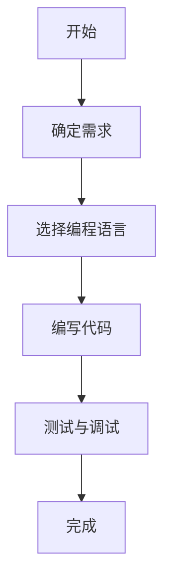

##### 2.1.2 数据处理与分析技能  
数据处理与分析是数字游民在工作中经常需要用到的技能，尤其是在数据驱动型工作中。以下是数据处理的基本流程：

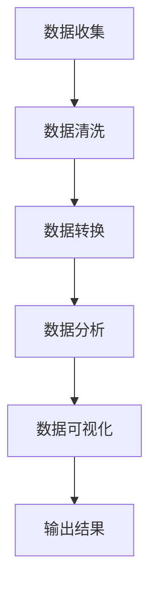

##### 2.1.3 软件工具使用  
数字游民需要熟练使用各种项目管理工具（如Trello、Asana）和协作工具（如Slack、Zoom）。以下是常见的工具功能对比：

| 工具名称 | 主要功能 | 适用场景 |
|----------|----------|----------|
| Trello   | 任务管理与团队协作 | 项目进度跟踪 |
| Asana    | 任务分配与项目管理 | 团队协作与任务跟踪 |
| Slack    | 实时沟通与文件共享 | 团队内部沟通 |
| Zoom     | 视频会议 | 远程会议与面试 |

---

#### 2.2 语言能力

##### 2.2.1 英语能力  
英语是数字游民的必备语言，尤其是在技术领域，英语是国际通用的交流工具。以下是英语学习的基本流程：

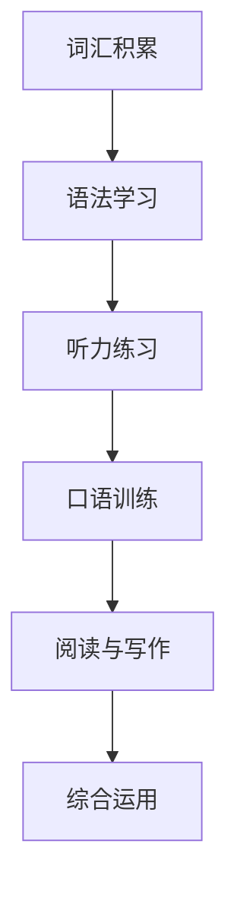

##### 2.2.2 其他语言能力  
根据工作需求，数字游民可能需要学习其他语言（如西班牙语、法语等）。以下是语言学习的核心要素：

| 要素 | 描述 | 重要性 |
|------|------|--------|
| 词汇 | 基础语言单位 | 高 |
| 语法 | 语言结构规则 | 高 |
| 听力 | 理解他人语言 | 中 |
| 口语 | 表达能力 | 中 |

---

#### 2.3 自我管理技能

##### 2.3.1 时间管理  
时间管理是数字游民成功的关键，以下是常见的时间管理方法：

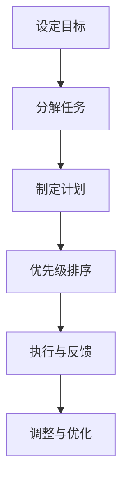

##### 2.3.2 情绪管理  
情绪管理帮助数字游民在远程工作中保持心理健康。以下是情绪管理的核心步骤：

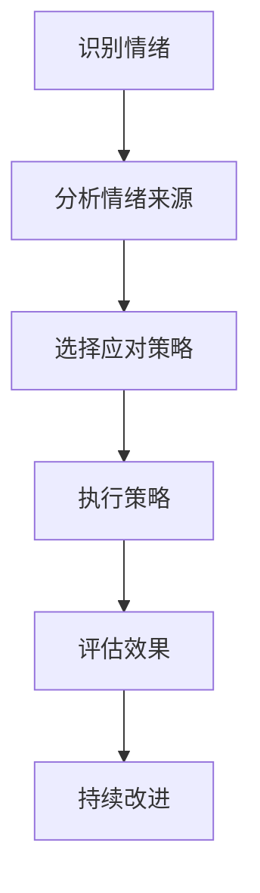

##### 2.3.3 目标设定与实现  
目标设定是数字游民职业发展的重要环节，以下是SMART目标设定法：

| SMART原则 | 描述 | 示例 |
|------------|------|------|
| 具体性     | 目标具体明确 | "完成一个Python项目" |
| 可衡量性   | 目标可量化 | "在3个月内完成项目" |
| 可实现性   | 目标可行 | "项目预算控制在500美元以内" |
| 相关性     | 目标与职业发展相关 | "提升个人技术能力" |
| 时间限制   | 设定明确的时间节点 | "项目应在6个月内完成" |

---

#### 2.4 本章小结  
数字游民的成功离不开一系列必备技能的支持。无论是技术技能、语言能力，还是自我管理能力，都是实现数字游民生活方式的关键。接下来，我们将通过具体案例深入探讨数字游民的实践方法。

---

### 第3章 数字游民实践

#### 3.1 实践方法

##### 3.1.1 选择合适的工作  
选择适合自己的远程工作是数字游民成功的关键。以下是选择工作的核心步骤：

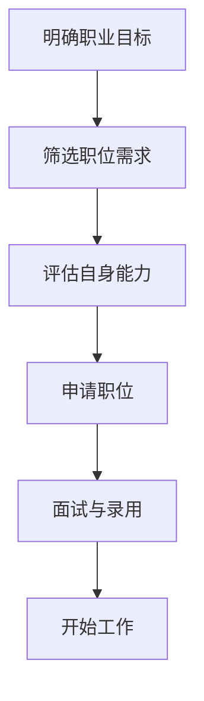

##### 3.1.2 设定工作目标  
设定明确的工作目标是数字游民高效工作的基础。以下是目标设定的步骤：

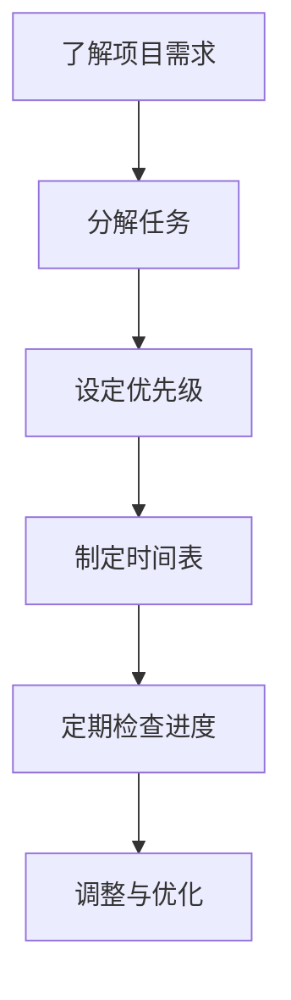

##### 3.1.3 建立工作习惯  
良好的工作习惯能够显著提高工作效率。以下是数字游民常用的高效工作习惯：

| 习惯 | 描述 | 优势 |
|------|------|------|
| 时间块管理 | 将工作时间分成专注块 | 提高工作效率 |
| 定期休息 | 每小时休息5分钟 | 防止疲劳 |
| 环境优化 | 创建安静、舒适的工作环境 | 提高专注度 |

---

#### 3.2 实践案例

##### 3.2.1 案例一：远程软件开发  
以一名远程软件开发工程师为例，以下是其工作流程：

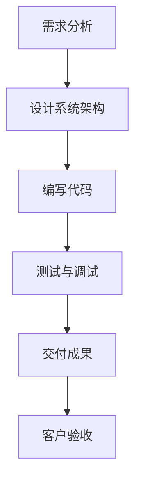

##### 3.2.2 案例二：在线教育  
以一名在线教育工作者为例，以下是其工作流程：

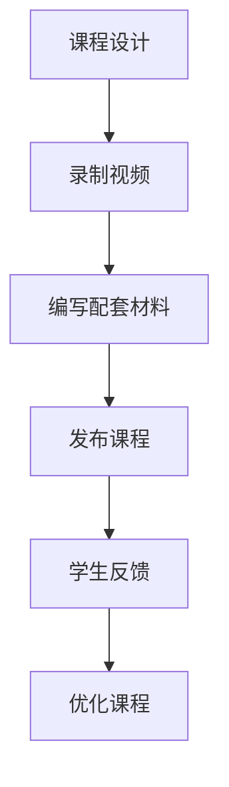

##### 3.2.3 案例三：自由撰稿人  
以一名自由撰稿人为例，以下是其工作流程：

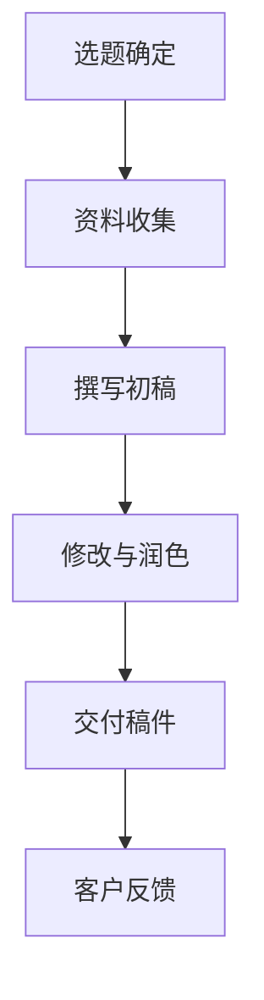

---

#### 3.3 实践技巧

##### 3.3.1 提高网络沟通效率  
使用高效的沟通工具（如Zoom、Microsoft Teams）是提高网络沟通效率的关键。以下是常用的沟通技巧：

| 技巧 | 描述 | 优势 |
|------|------|------|
| 视频会议 | 面对面交流 | 提高沟通效率 |
| 文档协作 | 实时编辑与共享 | 方便团队协作 |
| 时间同步 | 同一时间区 | 减少时差影响 |

##### 3.3.2 应对网络问题  
为应对网络连接问题，数字游民可以采取以下措施：

| 对策 | 描述 | 优势 |
|------|------|------|
| 备用网络 | 准备移动网络作为备用 | 确保网络连接 |
| 离线工作 | 在有网络时下载任务，离线处理 | 减少网络依赖 |
| 网络优化 | 使用VPN或加速器 | 提高网络稳定性 |

##### 3.3.3 维护人际关系  
维护人际关系是数字游民在远程工作中容易忽视但非常重要的环节。以下是维护人际关系的技巧：

| 技巧 | 描述 | 优势 |
|------|------|------|
| 定期联系 | 每周安排固定时间与团队沟通 | 维持关系 |
| 社交活动 | 参加线上社交活动 | 扩展人脉 |
| 个性化交流 | 关注个人兴趣与需求 | 提高互动质量 |

---

#### 3.4 本章小结  
通过具体的实践案例和技巧，我们可以看到数字游民生活方式的实现并非遥不可及。只要掌握正确的方法和技巧，每个人都可以成为成功的数字游民。

---

### 第4章 数字游民的法律与税务问题

#### 4.1 法律问题

##### 4.1.1 合法身份  
数字游民需要确保自己在全球范围内的合法身份，尤其是在选择居住地时，需要了解当地法律法规。以下是合法身份获取的关键步骤：

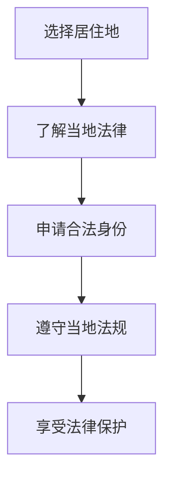

##### 4.1.2 税务申报  
数字游民需要了解并遵守全球范围内的税务规定。以下是税务申报的基本流程：

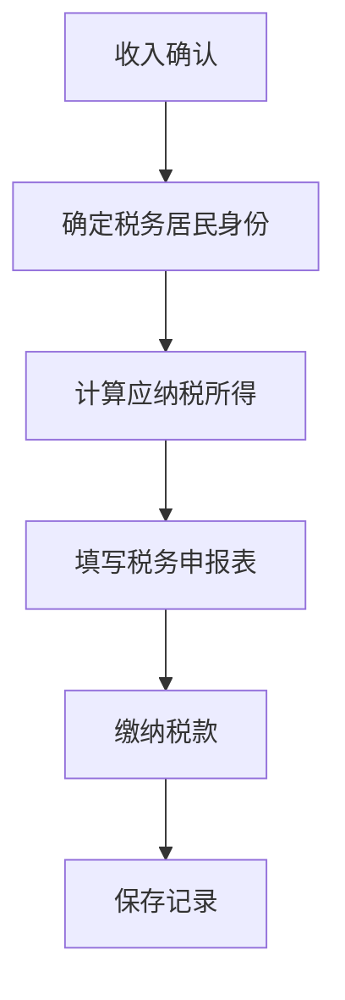

---

#### 4.2 本章小结  
数字游民在享受自由的同时，也需要面对法律与税务问题的挑战。了解并遵守相关法律法规是数字游民成功的关键。

---

### 第5章 数字游民的未来趋势

#### 5.1 数字游民的未来发展  
随着互联网技术的进一步发展和全球化的加深，数字游民生活方式将越来越普及。以下是未来趋势的几个关键点：

- **技术进步**：人工智能和自动化技术将进一步提升远程工作的效率。  
- **政策支持**：越来越多的国家和地区将推出支持数字游民的政策。  
- **全球化**：数字游民将更加全球化，跨国协作将成为常态。  

#### 5.2 数字游民与技术的融合  
数字游民的生活方式与技术的融合将更加紧密。以下是技术与数字游民融合的几个方面：

- **虚拟现实技术**：提升远程工作的沉浸感。  
- **区块链技术**：实现更加安全的跨境支付与税务申报。  
- **人工智能**：提供更加智能化的工作助手。  

---

### 作者：AI天才研究院 & 禅与计算机程序设计艺术

---

通过以上内容，我们可以看到数字游民生活方式的多样性和复杂性。数字游民不仅需要掌握技术技能和自我管理能力，还需要面对法律和税务等多方面的挑战。未来，随着技术的进步和全球化的加深，数字游民生活方式将变得更加普及和多样化。

