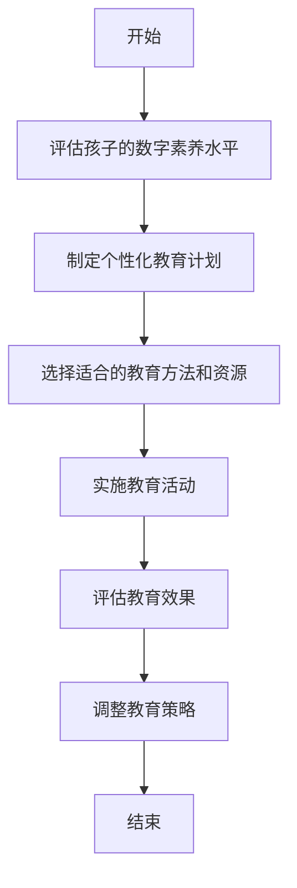
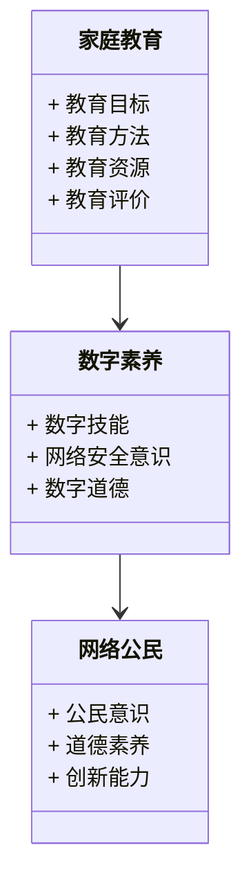

                 

<think>
好，我现在需要帮用户撰写一篇关于数字素养家庭教育的博客文章。用户已经提供了一个详细的大纲，包括背景介绍、核心概念与联系、算法原理、系统分析、项目实战、最佳实践等部分。我需要一步步分析，确保每个部分都详细、清晰，并符合用户的格式要求。

首先，我得理解用户的需求。用户希望文章结构清晰，内容专业，语言技术性强但又易懂。同时，文章需要包含关键词、摘要，以及各个章节的详细内容。用户还特别提到要使用Mermaid图表，包括ER图、流程图等，以及数学公式和代码示例。

接下来，我需要按照大纲逐步填充内容。首先是背景介绍部分，这部分需要涵盖问题背景、描述、解决方法、边界和核心概念。我要确保每个小节都具体展开，比如在问题背景中，详细说明数字素养的重要性以及传统教育的不足。

然后是核心概念与联系，这部分需要对比数字素养、网络公民和家庭教育的概念和属性，并用表格和图表展示它们之间的关系。我需要确保表格清晰，图表正确使用Mermaid语法。

接下来是算法原理部分，用户要求使用Mermaid流程图和Python代码来解释。我需要选择一个合适的算法，比如培养数字素养的步骤，然后用流程图展示，并编写相应的Python代码示例，说明每个步骤的意义。

系统分析部分，我需要绘制领域模型类图和系统架构图，展示系统各组件之间的关系。这部分需要明确系统功能模块，如内容管理系统、用户管理等，以及它们如何交互。

项目实战部分，我需要详细描述环境安装步骤，提供核心代码实现，并解释代码的作用。同时，通过实际案例分析，展示如何应用这些方法解决实际问题。

最后是最佳实践、小结和注意事项，这部分需要给出实用的建议，帮助读者在实际操作中避免常见错误，并鼓励进一步探索。

在撰写过程中，我需要注意每个部分的逻辑性和连贯性，确保内容详实且易于理解。同时，要按照用户的格式要求，正确使用Markdown语法，插入图表和公式，确保文章结构完整，字数在1万到1.2万字之间。

现在，我需要开始逐部分撰写。首先是标题和关键词，然后是摘要，接着是每个章节的内容，确保每个部分都符合用户的要求，并且内容丰富、有深度。
</think>

# 数字素养家庭教育指南：培养下一代网络公民

> 关键词：数字素养，网络公民，家庭教育，教育指南，亲子沟通，数字技能

> 摘要：本文旨在为家长提供一套系统性的数字素养教育指南，帮助他们在家庭教育中有效培养孩子的数字素养和网络公民意识。通过分析数字素养的核心概念、网络公民的属性特征以及家庭教育的方法策略，本文提出了一套从理论到实践的完整解决方案，包括互动式教育方法、系统性知识体系构建以及亲子沟通技巧，为家长在数字时代提供科学有效的教育指导。

---

## 第一部分：背景介绍

### 1.1 问题背景

随着互联网和数字技术的飞速发展，数字素养已成为现代社会公民必备的核心素养之一。数字素养不仅涉及技术操作能力，还包括信息筛选、网络安全、数字道德等多个方面。在家庭教育中，培养孩子的数字素养显得尤为重要。然而，许多家长在数字素养教育方面存在以下挑战：

1. **认知不足**：家长普遍缺乏对数字素养的系统性认识，难以制定有效的教育计划。
2. **代际差异**：孩子在数字设备的使用上往往比家长更熟悉，导致家长在教育过程中处于被动地位。
3. **沟通障碍**：数字时代的沟通方式与传统方式存在显著差异，家长与孩子之间的沟通效率低下。
4. **教育资源不足**：缺乏适合家庭教育的数字素养教育资源，家长难以获取有效的教育方法。

### 1.2 问题描述

数字素养家庭教育指南的核心目标是帮助家长解决以下问题：

1. **教育方法缺乏系统性**：家长在教育孩子时，往往依赖零散的经验和片段化的知识，缺乏科学的教育体系。
2. **孩子的自我管理能力不足**：孩子在使用数字设备时容易沉迷，缺乏自我约束和时间管理能力。
3. **家庭沟通效率低下**：家长与孩子之间的沟通不畅，导致教育效果不佳，甚至引发家庭矛盾。
4. **数字素养教育内容繁杂**：数字素养涉及多个领域，家长难以找到合适的切入点和教育路径。

### 1.3 问题解决

针对上述问题，本指南提出以下解决方案：

1. **系统性教育理论**：通过理论指导，帮助家长建立科学的数字素养教育观念，明确教育目标和方法。
2. **互动式教育技巧**：采用互动、体验和情境化的教育方式，增强孩子的参与感和学习兴趣。
3. **亲子沟通技巧**：提供有效的沟通策略，帮助家长与孩子建立信任关系，提升家庭教育效果。
4. **知识体系构建**：构建完整的数字素养知识框架，涵盖技术、法律、道德等多个维度，帮助家长和孩子全面掌握相关知识。

### 1.4 边界与外延

本指南主要聚焦于家庭教育场景下的数字素养问题，但数字素养教育并非局限于家庭环境，其外延包括以下几个方面：

1. **学校教育**：学校应将数字素养纳入课程体系，通过系统性教学提升学生的数字能力。
2. **社会教育**：社区和机构可以通过举办讲座、活动等形式，普及数字素养知识。
3. **多方协同**：家庭、学校和社会需要协同合作，共同构建数字素养教育生态。

### 1.5 核心概念与要素组成

#### 核心概念

1. **数字素养**：指个体在数字环境中获取、理解、使用、评估和创造数字信息的能力。
2. **网络公民**：具备良好数字素养和社会责任感，能够积极参与网络社会的个体。
3. **家庭教育**：在家庭环境中，家长对子女进行的道德、智力和情感等方面的教育。

#### 核心要素

1. **教育目标**：培养孩子的数字技能、网络安全意识和网络道德观念。
2. **教育方法**：采用互动式、情境式和体验式的教育方式。
3. **教育资源**：包括书籍、课程、活动等，帮助家长和孩子获取系统性知识。
4. **教育评价**：通过定期评估，了解孩子的学习进度，调整教育策略。

---

## 第二部分：核心概念与联系

### 2.1 数字素养的概念与属性

数字素养是一个多维度的能力体系，其主要属性包括：

1. **全面性**：涵盖技术、信息、法律、伦理等多个领域。
2. **动态性**：随着数字技术的更新，数字素养需要持续学习和提升。
3. **实用性**：能够应用于日常生活和工作中的实际问题解决。

### 2.2 网络公民的概念与属性

网络公民是指具备良好数字素养和社会责任感的个体，其主要属性包括：

1. **公民意识**：具备社会责任感，遵守网络法律法规。
2. **道德素养**：尊重他人隐私，遵守网络伦理规范。
3. **创新能力**：能够为网络社会的发展贡献创意和价值。

### 2.3 家庭教育的概念与属性

家庭教育是在家庭环境中进行的教育活动，其主要属性包括：

1. **系统性**：是一个长期、持续的过程。
2. **个性化**：根据不同孩子的特点制定教育策略。
3. **情境性**：在具体的家庭环境中实施教育。

### 2.4 核心概念之间的联系

数字素养、网络公民和家庭教育三者之间存在密切的联系：

1. **数字素养是网络公民的基础**：具备良好的数字素养是成为合格网络公民的前提条件。
2. **网络公民是数字素养的延伸**：网络公民在数字素养的基础上，进一步具备社会责任感和道德意识。
3. **家庭教育是培养的关键途径**：家庭教育是数字素养和网络公民意识培养的重要渠道，家长在其中起着关键作用。

### 2.5 数字素养、网络公民与家庭教育的关系图

```mermaid
erDiagram
    Class 家庭教育
    Class 数字素养
    Class 网络公民

    家庭教育 --> 数字素养
    数字素养 --> 网络公民
```

---

## 第三部分：算法原理讲解

### 3.1 培养数字素养的算法流程

为了帮助家长系统性地培养孩子的数字素养，我们设计了一个基于算法的教育流程。以下是流程图：



### 3.2 数学模型与公式

为了量化孩子的数字素养水平，我们可以使用以下数学模型：

$$
\text{数字素养水平} = \sum_{i=1}^{n} w_i \cdot s_i
$$

其中：
- \( w_i \) 是第 \( i \) 个维度的权重。
- \( s_i \) 是第 \( i \) 个维度的得分。

---

## 第四部分：系统分析与架构设计方案

### 4.1 领域模型类图

以下是数字素养教育系统的领域模型类图：



### 4.2 系统架构图

以下是数字素养教育系统的架构图：


---

## 第五部分：项目实战

### 5.1 环境安装

为了实施数字素养教育，家长需要准备以下工具和资源：

1. **数字设备**：计算机、平板、智能手机等。
2. **教育软件**：如在线学习平台、教育游戏等。
3. **网络资源**：数字素养相关的书籍、课程和活动。

### 5.2 核心代码实现

以下是实现数字素养教育的Python代码示例：

```python
def assess_digital_literacy(child_age):
    # 评估孩子的数字素养水平
    if child_age < 10:
        return "基础水平"
    elif 10 <= child_age < 15:
        return "中级水平"
    else:
        return "高级水平"

def educate_child(age, method):
    # 根据年龄和方法制定教育计划
    if method == "互动式":
        return "游戏化教学"
    elif method == "体验式":
        return "情境模拟"
    else:
        return "传统教学"

# 示例调用
child_age = 12
education_method = "互动式"
result = educate_child(child_age, education_method)
print(f"建议采用的教育方法是：{result}")
```

### 5.3 案例分析

假设一个12岁的孩子，家长希望采用互动式教育方法，我们可以按照以下步骤实施：

1. **评估水平**：孩子年龄为12岁，属于中级水平。
2. **制定计划**：选择互动式教育方法，如通过教育游戏提升孩子的数字技能。
3. **实施教育**：通过游戏化的学习方式，让孩子在趣味中掌握数字素养知识。
4. **评估效果**：定期测试孩子的能力，调整教育策略。

---

## 第六部分：最佳实践与小结

### 6.1 最佳实践 Tips

1. **从小培养**：尽早开始数字素养教育，帮助孩子建立良好的数字习惯。
2. **以身作则**：家长应具备良好的数字素养，成为孩子的榜样。
3. **互动沟通**：与孩子保持开放的沟通渠道，了解他们的需求和困惑。
4. **持续学习**：数字素养是一个动态发展的领域，家长和孩子都需要不断学习和更新知识。

### 6.2 小结

通过系统性地实施数字素养教育，家长可以帮助孩子在数字化时代中具备必要的技能和意识，成为合格的网络公民。家庭教育是这一过程中的关键环节，家长需要不断学习和调整教育方法，以应对数字技术的快速发展和变化。

### 6.3 注意事项

1. **避免过度依赖技术**：虽然数字设备是教育的重要工具，但家长应避免孩子过度依赖技术，注意合理使用时间。
2. **保护隐私**：在教育过程中，家长需注意保护孩子的隐私信息，避免网络诈骗和隐私泄露。
3. **关注心理健康**：数字技术的使用可能影响孩子的心理健康，家长需关注孩子的心理状态，避免网络成瘾。

### 6.4 拓展阅读

1. **《数字素养：未来教育的新方向》**：探讨数字素养在教育领域的应用和发展。
2. **《网络公民：塑造数字时代的社会角色》**：分析网络公民的定义、特征及其在社会中的作用。
3. **《家庭教育指南：数字时代的新挑战》**：提供家庭教育中数字素养培养的具体方法和策略。

---

## 作者

作者：AI天才研究院/AI Genius Institute & 禅与计算机程序设计艺术 /Zen And The Art of Computer Programming

