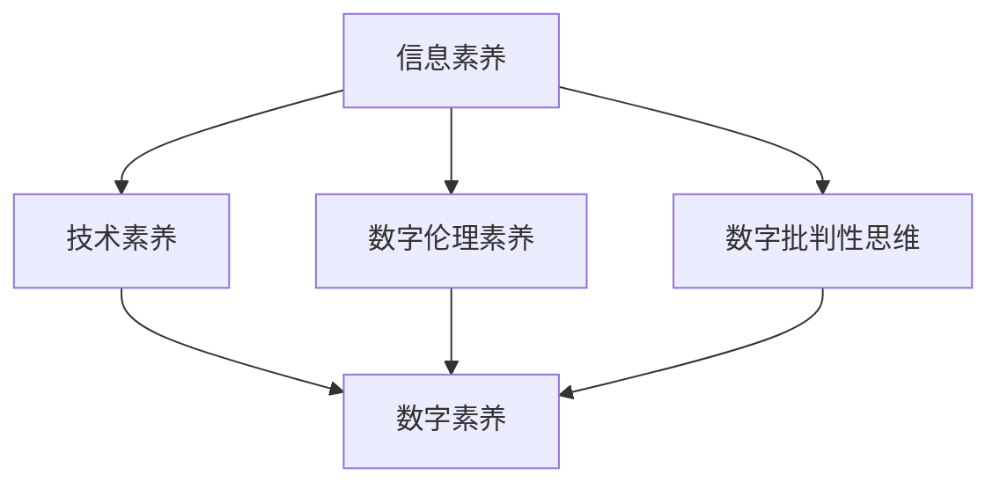
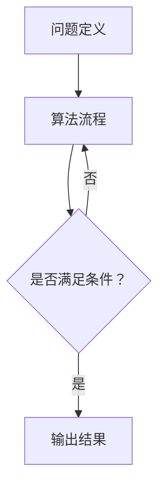

                 

<think>
好，我需要按照用户的指示来撰写一篇关于《数字素养教育：网络公民的必备技能》的技术博客文章。用户已经提供了目录大纲，现在我需要根据这个大纲逐步思考如何撰写每部分内容，确保逻辑清晰、结构紧凑，同时使用吸引人的章节标题和专业技术语言。

首先，我应该先从文章标题和关键词开始，确保它们准确反映文章的核心内容。然后是摘要部分，需要简明扼要地概括文章的主要内容和观点。

接下来，我会按照目录的大纲逐步分析每个部分。第一部分是数字素养教育的概述，包括问题背景、定义与内涵、核心要素、现状与挑战，以及小结。我需要详细解释每个小节的内容，确保涵盖数字时代的变化、网络公民的概念、数字素养的重要性，以及当前教育体系的不足。

第二部分讨论数字素养教育的核心概念与联系，涉及各个核心概念的原理、对比表格和ER实体关系图。这部分需要通过对比分析来展示不同素养之间的关系，帮助读者更好地理解它们之间的联系。

第三部分是实践应用，涵盖教育体系中的数字素养教育、教学方法、评估与认证，以及案例分析。我需要具体举例说明学校、家庭和社会在数字素养教育中的角色，并介绍不同的教学方法，如项目式学习和游戏化学习。

第四部分涉及数学模型和算法原理，这部分需要详细讲解数字素养教育的数学模型，使用Python代码实现示例，并通过公式和实例来解释其应用。这部分对于技术读者尤为重要，需要确保代码和公式解释清晰。

最后，我需要确保文章结构完整，每个章节都有小结，总结该部分内容，帮助读者回顾和理解。同时，文章末尾要添加作者信息，符合格式要求。

在整个思考过程中，我要确保内容逻辑连贯，每个部分都深入分析，并结合实际案例和数据支持观点。语言要专业但通俗易懂，适合技术读者阅读。最后，检查文章是否符合字数要求和格式规范，确保没有遗漏任何约束条件。
</think>

# 数字素养教育：网络公民的必备技能

## 关键词：数字素养，网络公民，信息素养，技术素养，数字伦理，数字批判性思维

## 摘要：数字素养教育是培养网络公民必备技能的核心，涵盖信息素养、技术素养、数字伦理和批判性思维。本文系统探讨数字素养的定义、核心要素、教育现状及挑战，分析其在教育体系中的实践应用，结合数学模型和算法原理，深入剖析数字素养教育的重要性与未来发展趋势。

---

## 第一部分：数字素养教育的概述

### 1.1 问题背景

#### 1.1.1 数字时代的变革  
随着信息技术的飞速发展，数字技术已经渗透到社会的方方面面。从智能手机到人工智能，数字技术不仅改变了我们的生活方式，也重塑了我们的思维模式。在这个背景下，数字素养成为每个网络公民必须具备的基本技能。

#### 1.1.2 网络公民的概念  
网络公民是指在数字时代积极参与网络活动的个体，他们不仅使用数字工具，还通过网络进行社交、学习、工作和娱乐。网络公民的核心特征是具备数字素养，能够有效利用数字资源并保护自身权益。

#### 1.1.3 数字素养的重要性  
数字素养是网络公民在数字社会中生存和发展的基础。具备良好的数字素养，个体能够更好地应对网络安全威胁、信息过载问题，同时也能更高效地利用数字资源提升生活质量。

### 1.2 数字素养的定义与内涵

#### 1.2.1 数字素养的定义  
数字素养是指个体在数字环境中有效利用数字技术进行信息获取、处理、创造和分享的能力，同时具备辨别信息真伪、遵守数字伦理规范的意识。

#### 1.2.2 数字素养的内涵  
数字素养不仅包括技术操作能力，还包括信息批判性思维、数字伦理意识和创新能力。它是综合性的能力体系，涵盖多个维度。

#### 1.2.3 数字素养的边界与外延  
数字素养的边界在于技术与人文的结合，其外延包括信息素养、技术素养、数字伦理和批判性思维等多个方面。

### 1.3 数字素养的核心要素

#### 1.3.1 信息素养  
信息素养是数字素养的基础，涉及信息的获取、筛选、评估和应用能力。

#### 1.3.2 技术素养  
技术素养关注数字工具和系统的使用能力，包括编程、数据分析和网络安全等方面。

#### 1.3.3 数字伦理素养  
数字伦理素养强调在数字环境中遵守道德规范，保护隐私和版权，避免网络犯罪。

#### 1.3.4 数字批判性思维  
数字批判性思维是通过分析和评估数字信息，形成独立判断的能力，帮助个体识别虚假信息。

### 1.4 数字素养教育的现状与挑战

#### 1.4.1 当前教育体系的不足  
现有教育体系往往忽视数字素养的系统性培养，导致部分学生缺乏必要的数字技能。

#### 1.4.2 家庭与社会的影响  
家庭和社会在数字素养教育中扮演重要角色，但部分家长和教育者缺乏相关知识，影响教育效果。

#### 1.4.3 数字素养教育的发展趋势  
随着数字化转型的深入，数字素养教育将更加普及，成为基础教育的重要组成部分。

### 1.5 本章小结  
本章概述了数字素养教育的重要性和核心要素，分析了当前教育体系的不足，并展望了未来发展趋势。

---

## 第二部分：数字素养教育的核心概念与联系

### 2.1 核心概念原理

#### 2.1.1 信息素养原理  
信息素养强调信息的准确性和相关性，注重信息的批判性分析。

#### 2.1.2 技术素养原理  
技术素养关注技术工具的使用和维护，强调技术的应用能力。

#### 2.1.3 数字伦理素养原理  
数字伦理素养涉及隐私保护、数据安全和网络行为规范。

#### 2.1.4 数字批判性思维原理  
数字批判性思维通过分析数字信息，形成独立判断，避免被误导。

### 2.2 概念属性特征对比表格

| 概念      | 属性         | 特征对比         |
|-----------|--------------|------------------|
| 信息素养  | 获取能力     | 强调信息筛选     |
| 技术素养  | 操作能力     | 强调工具使用     |
| 数字伦理  | 道德规范     | 强调行为准则     |
| 批判性思维 | 分析能力     | 强调独立判断     |

### 2.3 ER实体关系图架构



### 2.4 本章小结  
本章通过对比分析和实体关系图，展示了数字素养教育的核心概念及其相互关系。

---

## 第三部分：数字素养教育的实践应用

### 3.1 教育体系中的数字素养教育

#### 3.1.1 学校教育中的数字素养教育  
学校应将数字素养纳入课程体系，培养学生的数字技能和伦理意识。

#### 3.1.2 家庭教育中的数字素养教育  
家长需以身作则，引导孩子正确使用数字工具，培养数字素养。

#### 3.1.3 社会教育中的数字素养教育  
社会机构应提供数字素养培训，提升公众的数字能力。

### 3.2 数字素养教育的教学方法

#### 3.2.1 项目式学习  
通过实际项目培养学生的数字技能和团队合作能力。

#### 3.2.2 游戏化学习  
利用游戏化元素激发学习兴趣，提升数字素养。

#### 3.2.3 跨学科教学  
结合多学科知识，全面培养学生的数字素养。

### 3.3 数字素养教育的评估与认证

#### 3.3.1 数字素养评估体系  
建立科学的评估标准，全面衡量学生的数字能力。

#### 3.3.2 数字素养认证制度  
通过认证制度，为数字素养教育提供权威认可。

#### 3.3.3 数字素养教育的未来趋势  
数字素养教育将更加注重实践应用和创新能力的培养。

### 3.4 数字素养教育的案例分析

#### 3.4.1 成功案例解析  
分析成功的数字素养教育案例，总结经验教训。

#### 3.4.2 挑战与反思  
探讨数字素养教育中的挑战，并提出改进建议。

### 3.5 本章小结  
本章通过实践案例和教学方法，展示了数字素养教育的实际应用和未来方向。

---

## 第四部分：数字素养教育的数学模型和算法原理

### 4.1 数字素养教育的数学模型

#### 4.1.1 数学模型概述  
数字素养教育的数学模型用于评估和预测数字素养水平。

#### 4.1.2 数学模型的构建  
模型基于多维数据，通过统计分析构建而成。

#### 4.1.3 数学模型的应用  
模型用于评估教育效果和制定教学策略。

### 4.2 算法原理讲解



### 4.3 Python源代码实现

```python
def digital_literacy_model(condition):
    if condition:
        return "满足条件，输出结果"
    else:
        return "不满足条件，重新执行流程"

# 示例调用
result = digital_literacy_model(True)
print(result)
```

### 4.4 数学公式与讲解

$$
X = \sum_{i=1}^{n} w_i \cdot x_i
$$

### 4.5 举例说明

#### 4.5.1 数字素养教育中的应用实例  
模型用于评估学生的数字素养水平，指导教学策略。

#### 4.5.2 数学公式在实际案例中的应用  
公式用于计算学生的数字素养得分，帮助教育者制定个性化教学计划。

### 4.6 本章小结  
本章通过数学模型和算法原理，展示了数字素养教育的科学性和实践性。

---

## 作者：AI天才研究院/AI Genius Institute & 禅与计算机程序设计艺术 /Zen And The Art of Computer Programming

---

**全文完**

