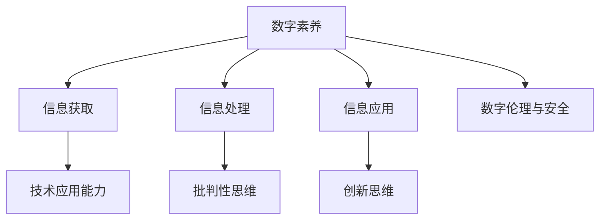

                 

<think>
好的，我现在需要帮助用户完成一个技术博客的撰写任务。用户希望我以《数字素养认证：信息时代的必备技能》为标题，按照他提供的目录大纲来写一篇结构清晰、内容详实的技术博客。同时，用户强调文章要符合一些特定的约束条件，比如字数、格式、内容完整性等。

首先，我得仔细分析用户的请求。用户希望文章分为三个主要部分：背景与重要性、核心技能、应用与实践，每个部分下还有多个章节。每个章节都有具体的子主题，比如数字素养的概念、信息时代的变革、核心技能中的计算机操作基础等。用户还特别指出要包括背景介绍、核心概念、算法原理、系统架构、项目实战等内容，这意味着文章不仅要有理论，还要有实际案例和代码分析。

接下来，我需要确保文章的格式正确。用户要求使用markdown格式，这意味着我需要在每个部分用适当的标题和列表来组织内容。同时，用户提到要包含关键词和摘要，这些部分需要简明扼要地概括文章的核心内容。

然后，我想到用户可能是技术领域的专家，或者是需要提升数字素养的人士。他们可能希望这篇文章不仅理论扎实，还能提供实用的建议和方法，帮助读者在实际中应用这些知识。因此，在写作时，我需要平衡理论和实践，确保内容既有深度又易于理解。

在内容方面，我需要从数字素养的背景开始，解释其概念、重要性以及当前的挑战。接下来，讨论信息时代的变革，包括技术的发展和数字化转型的影响。然后，深入探讨数字素养的核心技能，如计算机操作、网络安全、数据分析等。这部分需要详细讲解每个技能的重要性及其在实际中的应用。

之后，我会考虑数字沟通与协作，分析现代沟通方式的变化，以及协作工具在团队中的作用。创新思维与数字化工具的章节则需要探讨如何利用数字工具激发创造力，以及数字素养如何支持创业。

在应用与实践部分，我会讨论数字素养在职场中的应用，比如职业发展和项目管理中的具体案例。同时，强调终身学习的重要性，以及数字素养对未来社会的深远影响。最后，展望数字素养的未来，包括趋势和全球挑战。

用户还特别提到要包含附录，如认证指南和学习资源推荐，这有助于读者进一步学习和应用数字素养。在撰写过程中，我需要确保每个部分都详细具体，比如在系统分析部分，用mermaid图来展示实体关系、算法流程和系统架构，这样能更直观地传达信息。

此外，用户要求文章结尾有作者信息，格式为“AI天才研究院 & 禅与计算机程序设计艺术”。这需要我在最后明确标注，确保文章的归属和专业性。

现在，我需要考虑如何组织这些内容，确保逻辑流畅，每部分内容详实。例如，在讨论数字素养的重要性时，可以引用具体的数据或案例，说明缺乏数字素养可能带来的问题，以及具备数字素养的优势。在系统架构部分，使用mermaid图来展示类图和序列图，帮助读者更好地理解系统结构和交互过程。

最后，我需要确保文章整体字数在10000到12000字之间，这意味着每个章节大约需要几百到一千字。这需要我在写作时保持内容的深度，同时避免冗长，确保信息传达清晰有效。

总结一下，我的思考过程包括：理解用户需求，分析文章结构，确保格式正确，涵盖所有必要的内容部分，结合理论与实践，使用适当的技术工具（如mermaid图）来增强可读性，最后检查整体字数和逻辑连贯性。通过这些步骤，我能够撰写出符合用户要求的高质量技术博客。
</think>

# 数字素养认证：信息时代的必备技能

## 关键词：数字素养, 信息时代, 数字技能, 数字沟通, 数字创新, 终身学习

## 摘要：  
在信息时代，数字素养已成为个人和组织成功的关键因素。本文从数字素养的背景、核心技能、应用与实践三个方面展开，系统阐述了数字素养的重要性及其在各个领域的具体应用。通过分析数字素养的核心概念、技能体系和未来发展趋势，本文旨在为读者提供全面的视角，帮助其提升数字素养，适应快速变化的数字化社会。

---

## 第一部分：数字素养的背景与重要性

### 第1章：数字素养概述

#### 1.1 数字素养的概念与内涵  
数字素养是指个体在信息时代具备的信息处理、技术应用、问题解决和创新思维等多方面的能力。它不仅包括对数字技术的理解，还包括对数字化信息的批判性思维和有效利用。  

**核心要素：**  
1. **信息获取能力**：能够有效地寻找、检索和评估信息。  
2. **信息处理能力**：能够对信息进行分析、整理和归纳。  
3. **信息应用能力**：能够将信息应用于实际问题的解决。  
4. **数字伦理与安全意识**：理解数字技术的伦理问题，并保护个人和他人的信息安全。  

**概念结构图：**  

#### 1.2 数字素养的重要性  
数字素养是信息时代的核心竞争力。随着信息技术的飞速发展，具备数字素养的个体能够更好地适应社会变革，抓住数字化转型的机遇。  

**关键优势：**  
1. **职业竞争力**：数字素养高的个体在职场中更具优势，能够胜任复杂的技术环境。  
2. **问题解决能力**：数字素养帮助个体更高效地解决复杂问题。  
3. **终身学习能力**：数字素养是终身学习的基础，能够帮助个体持续适应变化。  

#### 1.3 数字素养的现状与挑战  
当前，数字素养的普及程度参差不齐。一些人能够熟练使用数字工具，而另一些人则缺乏基本的数字技能。此外，数字鸿沟、技术更新快、隐私与安全问题等都是数字素养提升的挑战。  

**主要挑战：**  
1. **技术更新速度快**：数字技能需要不断更新，否则会迅速过时。  
2. **数字鸿沟**：不同群体之间的数字技能差异可能扩大社会不平等。  
3. **隐私与安全风险**：数字素养不足可能导致个人信息泄露和网络安全问题。  

---

### 第2章：信息时代的变革

#### 2.1 信息技术的飞速发展  
信息技术的飞速发展推动了社会的全面数字化转型。人工智能、大数据、区块链等技术的广泛应用，使得数字素养成为必备技能。  

**技术发展趋势：**  
1. **人工智能**：从辅助决策到自动化应用。  
2. **大数据分析**：从数据收集到数据驱动的决策。  
3. **物联网**：从单一设备连接到万物互联。  

#### 2.2 数字化转型的推动力  
数字化转型不仅是技术的进步，更是商业模式和生活方式的深刻变革。企业、政府和社会组织都在加速数字化转型，以应对未来的挑战。  

**数字化转型的核心：**  
1. **业务流程优化**：通过数字化工具提高效率。  
2. **数据驱动决策**：利用数据分析支持决策。  
3. **客户体验提升**：通过数字化手段增强客户互动。  

#### 2.3 数字素养与个人发展  
数字素养不仅是职业发展的关键，也是个人成长的重要支撑。具备数字素养的个体能够更好地管理时间、信息和人际关系。  

**个人发展中的数字素养：**  
1. **时间管理**：利用数字工具提高效率。  
2. **知识管理**：有效整理和利用信息资源。  
3. **人际关系管理**：通过数字化手段建立和维护关系。  

---

## 第二部分：数字素养的核心技能

### 第3章：数字技能基础

#### 3.1 计算机操作基础  
计算机操作是数字素养的基本技能之一。掌握操作系统、办公软件和文件管理的基本操作是数字素养的入门门槛。  

**关键技能：**  
1. **操作系统**：Windows、MacOS和Linux的基本操作。  
2. **办公软件**：Word、Excel、PowerPoint的使用。  
3. **文件管理**：文件夹结构、文件压缩和解压。  

#### 3.2 网络与信息安全  
网络安全是数字素养的重要组成部分。个体需要具备保护个人信息和防止网络攻击的能力。  

**核心要点：**  
1. **密码管理**：使用强密码并定期更换。  
2. **防病毒软件**：安装并定期更新防病毒软件。  
3. **隐私保护**：避免在公共网络上传输敏感信息。  

#### 3.3 数据分析与处理  
数据分析能力是数字素养的高级技能。掌握数据可视化和基本统计分析方法能够帮助个体更好地理解和利用数据。  

**数据分析流程：**  
1. **数据收集**：通过问卷、传感器等方式获取数据。  
2. **数据清洗**：去除无效数据，处理缺失值。  
3. **数据分析**：使用统计方法或机器学习算法进行分析。  
4. **数据可视化**：通过图表展示分析结果。  

### 第4章：数字沟通与协作

#### 4.1 数字时代的沟通方式  
数字时代提供了多种沟通方式，如电子邮件、即时通讯和社交媒体。掌握这些工具能够提高沟通效率。  

**主要工具：**  
1. **电子邮件**：正式沟通的主要方式。  
2. **即时通讯**：如WhatsApp、Telegram等实时沟通工具。  
3. **社交媒体**：如LinkedIn、Twitter等专业社交平台。  

#### 4.2 数字化团队协作工具  
团队协作工具如Slack、Trello和Microsoft Teams已成为现代工作环境中的标配。这些工具能够提高团队协作效率。  

**协作工具的功能：**  
1. **任务管理**：分配和跟踪任务进度。  
2. **文件共享**：方便团队成员访问和编辑文件。  
3. **实时沟通**：支持语音和视频通话。  

#### 4.3 数字素养与跨文化沟通  
数字素养不仅要求个体具备技术能力，还需要具备跨文化沟通的能力。在全球化的背景下，理解不同文化背景下的沟通方式至关重要。  

**跨文化沟通的关键：**  
1. **尊重文化差异**：避免刻板印象和偏见。  
2. **语言与非语言沟通**：注意语言和非语言信号的差异。  
3. **适应性沟通**：根据文化背景调整沟通方式。  

### 第5章：创新思维与数字化工具

#### 5.1 数字时代的创新思维  
创新思维是数字素养的核心能力之一。个体需要具备发现问题、提出解决方案并实施创新的能力。  

**创新思维的步骤：**  
1. **发现问题**：识别问题和机会。  
2. **头脑风暴**：提出多个解决方案。  
3. **原型设计**：制作最小可行性产品（MVP）。  
4. **测试与迭代**：验证方案并不断优化。  

#### 5.2 数字化工具的运用  
数字化工具如设计软件、项目管理工具和数据分析工具能够帮助个体更高效地完成任务。  

**常用数字化工具：**  
1. **设计工具**：如Adobe Photoshop、Figma等。  
2. **项目管理工具**：如Jira、Asana等。  
3. **数据分析工具**：如Excel、Python（Pandas库）。  

#### 5.3 数字素养与创业实践  
数字素养是创业成功的关键因素之一。具备数字素养的创业者能够更好地利用数字化工具和资源，推动业务发展。  

**创业中的数字素养：**  
1. **市场分析**：利用大数据分析市场趋势。  
2. **产品开发**：使用数字化工具进行产品设计和测试。  
3. **营销推广**：通过社交媒体和SEO优化提升品牌影响力。  

---

## 第三部分：数字素养的应用与实践

### 第6章：数字素养在职场中的应用

#### 6.1 数字素养与职业发展  
数字素养高的个体在职场中更具竞争力。他们能够更快适应新技术，更好地与团队协作，并提出创新的解决方案。  

**职业发展中的数字素养：**  
1. **技能提升**：通过在线课程和实践提升数字技能。  
2. **跨部门协作**：在团队中发挥桥梁作用。  
3. **领导力**：具备数字素养的领导者能够更好地推动数字化转型。  

#### 6.2 数字素养在项目管理中的应用  
数字素养能够帮助项目管理者更高效地规划、执行和监控项目。  

**项目管理中的数字技能：**  
1. **任务分配**：使用协作工具分配任务。  
2. **进度跟踪**：通过甘特图和关键路径分析监控项目进度。  
3. **风险控制**：利用数据分析预测和应对风险。  

#### 6.3 数字素养与团队管理  
数字素养高的管理者能够更好地理解团队成员的需求，并利用数字化工具提升团队效率。  

**团队管理中的数字素养：**  
1. **团队协作**：通过数字化工具提升团队协作效率。  
2. **绩效评估**：利用数据分析方法评估团队成员的绩效。  
3. **文化建设**：营造学习型和创新型企业文化。  

### 第7章：数字素养与终身学习

#### 7.1 数字素养与自我提升  
数字素养是终身学习的基础。个体需要不断更新知识和技能，以适应快速变化的社会。  

**终身学习的关键：**  
1. **学习资源**：利用在线课程和数字图书馆获取知识。  
2. **学习方法**：采用主动学习和项目式学习。  
3. **学习评估**：通过测试和反馈不断优化学习效果。  

#### 7.2 数字素养与继续教育  
数字素养与继续教育密不可分。无论是企业员工还是自由职业者，都需要通过持续学习来保持竞争力。  

**继续教育中的数字素养：**  
1. **在线课程**：如Coursera、edX等平台提供丰富的在线课程。  
2. **证书认证**：通过数字素养认证提升个人资质。  
3. **实践应用**：将所学知识应用于实际工作中。  

#### 7.3 数字素养与学习共同体  
数字素养能够帮助个体建立和维护学习共同体，通过协作学习和知识共享实现共同成长。  

**学习共同体的特点：**  
1. **知识共享**：通过在线平台分享学习资源。  
2. **协作学习**：通过团队项目和小组讨论加深理解。  
3. **持续互动**：通过定期交流保持学习动力。  

### 第8章：数字素养的未来展望

#### 8.1 数字素养的发展趋势  
随着技术的不断进步，数字素养的要求也在不断提高。未来，具备高级数字素养的个体将更具竞争力。  

**未来趋势：**  
1. **人工智能辅助学习**：通过AI工具优化学习过程。  
2. **虚拟现实与增强现实**：通过沉浸式体验提升学习效果。  
3. **全球数字公民**：数字素养将成为全球公民的基本要求。  

#### 8.2 数字素养与未来社会  
数字素养将深刻影响社会的各个方面，从教育到医疗，从交通到娱乐。具备数字素养的个体和组织将更好地适应未来的社会变革。  

**未来社会的特点：**  
1. **数字化政府**：通过数字化手段提供更高效的服务。  
2. **智能城市**：利用数字化技术提升城市管理效率。  
3. **数字化教育**：通过在线教育实现教育资源的广泛覆盖。  

#### 8.3 数字素养的全球挑战与机遇  
数字素养的普及是全球性的挑战，但也是机遇。通过国际合作和知识共享，可以缩小数字鸿沟，推动全球数字化发展。  

**全球挑战与机遇：**  
1. **数字鸿沟**：通过技术援助和教育缩小全球数字鸿沟。  
2. **数字化转型**：通过数字素养支持全球企业的数字化转型。  
3. **可持续发展**：通过数字化手段推动全球可持续发展目标的实现。  

---

## 附录

### 附录A：数字素养认证指南  
数字素养认证是衡量个体数字技能的重要标准。认证内容包括计算机操作、数据分析、网络安全和创新思维等方面。  

**认证流程：**  
1. **报名**：通过认证机构在线报名。  
2. **学习**：参加在线课程或线下培训。  
3. **考试**：通过理论考试和实操测试。  
4. **颁发证书**：认证通过后颁发数字素养认证证书。  

### 附录B：数字素养学习资源推荐  
以下是一些推荐的数字素养学习资源：  
1. **在线课程**：Coursera、edX、Udemy等平台提供丰富的数字素养课程。  
2. **书籍**：《数字素养：信息时代的必备技能》、《高效能数字工作者的7个关键习惯》等。  
3. **工具**：Slack、Trello、Microsoft Teams等数字化工具的学习资源。  

### 附录C：常见问题解答  
**Q1：数字素养认证需要多长时间？**  
A：认证时间根据课程安排和学习进度而定，通常需要数周至数月。  

**Q2：数字素养如何帮助我提升职业竞争力？**  
A：数字素养是许多行业的核心技能，能够帮助你在职场中更具竞争力。  

**Q3：如何开始学习数字素养？**  
A：可以从基础的计算机操作和网络安全知识入手，逐步学习数据分析和创新思维。  

---

## 总结  
数字素养是信息时代的核心竞争力。通过系统学习和实践，个体能够提升数字技能、增强创新思维，并在职业和生活中更好地适应数字化社会。未来，数字素养将不仅是个人发展的关键，也将成为推动社会进步的重要力量。

---

## 作者：AI天才研究院 & 禅与计算机程序设计艺术

