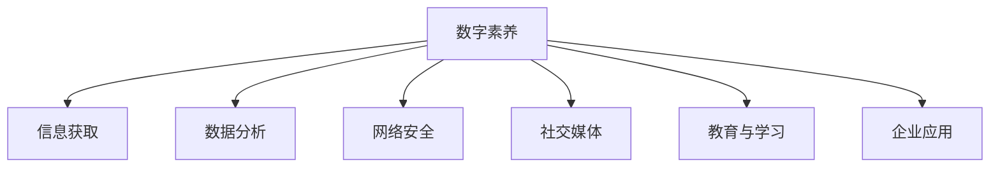

                 

<think>
嗯，用户希望我写一篇关于数字素养的技术博客文章，看起来像是一位技术专家写的，结构很详细。首先，我需要理解用户的需求，他们希望文章有一个清晰的结构，包括摘要、关键词，然后按照目录分章节详细讲解。

好的，标题是《数字素养：信息海洋中的导航技能》。关键词应该涵盖数字素养、信息检索、数据分析、网络安全、社交媒体、教育、企业应用这些方面。摘要部分需要简洁明了，概述文章的核心内容，说明数字素养的重要性以及文章的结构。

接下来，每一章的内容需要按照目录大纲来写。第1章是概述，介绍背景、核心概念和重要性。第2章到第6章分别从基础技能、社交媒体、教育、企业、公民责任等方面展开。每个小节都要详细，包含定义、技巧、案例分析等。

用户特别提到要使用技术语言，逻辑清晰，结构紧凑，所以每个章节都要有深度，同时用具体的例子和图表来辅助说明。比如，在信息检索部分，可能需要提到搜索引擎的使用技巧，并举一些实际的例子。

系统分析和架构设计方案部分，可能需要设计一个系统来展示数字素养的应用，比如一个数字素养教育平台，用Mermaid图展示类图、架构图和交互流程图。项目实战部分，需要用Python代码展示数据分析工具的实现，比如数据清洗的代码。

还有，每个章节的小结部分要总结关键点，给出最佳实践的建议，比如如何提高信息检索效率，如何保护数据隐私。注意事项部分提醒读者可能遇到的误区，比如过度依赖自动化工具而忽视基本技能。

最后，要确保文章整体流畅，每个部分衔接自然，字数控制在10000到12000字左右。作者信息也要放在最后，符合格式要求。

总的来说，我需要一步步按照用户的要求，构建每个章节的内容，确保每个部分都详尽且有深度，同时保持语言的专业性和可读性。可能还需要在写的时候多次检查，确保结构合理，内容全面，没有遗漏重要的点。
</think>

# 数字素养：信息海洋中的导航技能

> 关键词：数字素养，信息检索，数据分析，网络安全，社交媒体，教育，企业应用

> 摘要：数字素养是信息时代的核心能力，涵盖了信息检索、数据分析、网络安全、社交媒体使用、教育与企业应用等多个方面。本文通过系统化的分析与案例研究，深入探讨数字素养的内涵、技能体系、应用场景及未来发展趋势，帮助读者在信息海洋中高效导航，提升数字化时代的竞争力。

---

## 第1章：数字素养概述

### 1.1 问题的背景与挑战

#### 1.1.1 信息时代的崛起

在21世纪的今天，信息的爆炸式增长使得每个人都需要在海量数据中筛选、分析和利用信息。从社交媒体到大数据分析，从人工智能到区块链技术，数字化的浪潮席卷了生活的方方面面。信息的丰富性带来了便利，但也带来了信息过载、信息孤岛和信息不对称的问题。

#### 1.1.2 数字素养的重要性

数字素养是指个体在信息时代有效利用数字工具和资源，进行信息获取、分析、评估、管理和应用的能力。它是信息时代必备的核心技能，涵盖了技术、逻辑、伦理等多个维度。在数字化转型的背景下，数字素养不仅是个人竞争力的重要组成部分，也是企业和社会发展的关键推动力。

#### 1.1.3 本书的目标与结构

本书旨在通过系统化的知识框架和实际案例分析，帮助读者全面掌握数字素养的核心技能。全书共分为七章，从数字素养的基础概念到具体应用场景，层层深入，逐步展开。通过理论与实践相结合的方式，帮助读者在信息海洋中找到导航的技能。

---

### 1.2 数字素养的核心概念

#### 1.2.1 定义与属性

数字素养包括以下几个核心属性：
1. **信息获取能力**：能够高效地从多种渠道获取信息。
2. **信息分析能力**：能够对信息进行整理、分析和评估。
3. **信息应用能力**：能够将信息应用于实际问题的解决。
4. **信息安全意识**：能够识别和防范信息风险。
5. **数字工具使用能力**：能够熟练使用各种数字工具和平台。

#### 1.2.2 数字素养的组成部分

数字素养的组成部分可以通过以下表格展示：

| 部分 | 描述 |
|------|------|
| 信息检索 | 如何高效地搜索信息 |
| 数据分析 | 如何处理和分析数据 |
| 网络安全 | 如何保护个人和数据安全 |
| 社交媒体 | 如何在数字平台上有效沟通 |
| 教育与学习 | 如何在数字环境中学习和成长 |
| 企业应用 | 如何在企业中应用数字技能 |

#### 1.2.3 数字素养与技能对比

数字素养与传统技能的主要区别可以通过以下对比图展示：

---

## 第2章：数字素养基础技能

### 2.1 信息检索与搜索策略

#### 2.1.1 搜索引擎的使用

搜索引擎是信息检索的核心工具。以下是使用搜索引擎的步骤：

1. **明确需求**：确定需要查找的信息类型和关键词。
2. **选择搜索引擎**：根据需求选择合适的搜索引擎（如Google、百度、DuckDuckGo等）。
3. **优化搜索关键词**：使用关键词组合、引号、减号等技巧提高搜索精准度。

#### 2.1.2 高效搜索技巧

以下是一些高效搜索技巧：
- 使用引号进行精确搜索：`"关键词"`
- 使用减号排除无关内容：`关键词 -不相关的词`
- 使用通配符：* 或 ?
- 使用高级搜索选项：过滤结果类型、时间范围等。

#### 2.1.3 信息评估与辨别

信息评估的关键步骤：
1. **来源可靠性**：检查信息来源是否权威。
2. **信息时效性**：确认信息是否最新。
3. **内容逻辑性**：分析信息是否符合逻辑。
4. **多源验证**：通过多个来源验证信息的准确性。

### 2.2 数据分析基础

#### 2.2.1 数据类型与结构

数据类型可以分为以下几类：

| 类型 | 描述 |
|------|------|
| 结构化数据 | 可以用表格形式表示的数据，如CSV、Excel |
| 非结构化数据 | 文本、图像、音频等 |
| 半结构化数据 | JSON、XML等格式的数据 |

#### 2.2.2 数据处理与清洗

数据清洗的步骤：
1. **数据清洗**：去除重复、错误或无效数据。
2. **数据转换**：将数据转换为适合分析的格式。
3. **数据标准化**：统一数据格式和单位。

#### 2.2.3 常用数据分析工具

常用的工具包括：
- **Excel**：适合简单的数据分析。
- **Python**：适合复杂的数据分析，常用库有Pandas、NumPy。
- **R语言**：适合统计分析。
- **Tableau**：适合数据可视化。

### 2.3 网络安全意识

#### 2.3.1 常见网络威胁与防护

常见的网络威胁包括：
- 病毒攻击
- 黑客攻击
- 数据泄露
- 社会工程学攻击

防护措施：
- 使用强密码
- 安装杀毒软件
- 避免点击可疑链接

#### 2.3.2 数据隐私保护

数据隐私保护的关键点：
1. **加密技术**：保护数据传输和存储的安全性。
2. **访问控制**：限制对敏感数据的访问权限。
3. **隐私政策**：明确数据收集和使用规则。

#### 2.3.3 网络道德与法律

网络道德与法律的重要性：
- 遵守法律法规，避免侵犯他人隐私。
- 遵循网络道德，不传播虚假信息。

---

## 第3章：社交媒体与数字素养

### 3.1 社交媒体的影响

#### 3.1.1 社交媒体的优势

社交媒体的优势：
- 信息传播速度快
- 方便社交网络的建立
- 提供多种内容创作和分享的平台

#### 3.1.2 社交媒体的风险

社交媒体的风险：
- 信息过载
- 隐私泄露
- 网络欺凌

#### 3.1.3 媒体素养与数字素养

媒体素养是数字素养的重要组成部分，包括：
- 分析媒体信息的能力
- 评估信息来源的能力
- 创造和传播信息的能力

### 3.2 社交媒体的使用技巧

#### 3.2.1 创建与维护个人品牌

个人品牌建设的关键点：
- 确定个人定位
- 维护一致的个人形象
- 定期更新内容

#### 3.2.2 社交网络互动策略

社交互动技巧：
- 主动与他人建立联系
- 及时回复消息
- 选择合适的沟通方式

#### 3.2.3 社交媒体内容创作

内容创作的技巧：
- 确定目标受众
- 选择合适的平台
- 创作高质量的内容

### 3.3 社交媒体案例分析

#### 3.3.1 成功案例解析

例如，某品牌通过精准定位和优质内容，在社交媒体上获得了大量关注。

#### 3.3.2 失败案例反思

例如，某公司因泄露用户隐私导致品牌形象受损。

---

## 第4章：数字素养与教育

### 4.1 数字素养教育的重要性

#### 4.1.1 教育背景与需求

数字素养教育的背景：
- 信息技术的快速发展
- 社会对数字化人才的需求

#### 4.1.2 数字素养教育的目标

数字素养教育的目标：
- 提高学生的数字技能
- 培养学生的数字思维
- 增强学生的数字安全意识

#### 4.1.3 教育体系中的数字素养培养

数字素养培养的步骤：
1. **课程设计**：将数字素养纳入课程体系。
2. **教学方法**：采用项目式学习和实践教学。
3. **评估方式**：通过项目成果和实践能力进行评估。

### 4.2 教育技术与数字素养

#### 4.2.1 数字化教学工具

常用的数字化教学工具：
- 在线学习平台（如Moodle、Coursera）
- 互动白板（如Smart Board）
- 虚拟现实（VR）设备

#### 4.2.2 教育数据分析

教育数据分析的应用：
- 分析学生的学习行为
- 评估教学效果
- 个性化教学

#### 4.2.3 教育技术对数字素养的影响

教育技术对数字素养的影响：
- 提高学生的技术应用能力
- 增强学生的数字化思维
- 促进教师的数字素养提升

### 4.3 数字素养教育案例分析

#### 4.3.1 国内外数字素养教育案例

例如，芬兰的数字素养教育体系、美国的“21世纪技能”倡议。

#### 4.3.2 教育改革与数字素养

教育改革的趋势：
- 数字化教学
- 个性化学习
- 跨学科学习

---

## 第5章：数字素养与企业

### 5.1 企业中的数字素养需求

#### 5.1.1 企业数字素养的现状

企业数字素养的现状：
- 一些企业已经开始数字化转型
- 但仍有许多企业缺乏数字技能

#### 5.1.2 企业数字素养的重要性

企业数字素养的重要性：
- 提高企业竞争力
- 优化企业管理
- 促进企业创新

#### 5.1.3 企业数字素养提升策略

提升策略：
- 建立数字素养培训体系
- 引入数字化工具
- 鼓励员工学习新技术

### 5.2 数字素养在企业中的应用

#### 5.2.1 信息管理优化

信息管理优化的方法：
- 数据化管理
- 数字化流程
- 智能化决策

#### 5.2.2 智能化决策支持

智能化决策支持的工具：
- 大数据分析
- 人工智能
- 机器学习

#### 5.2.3 数字化转型与数字素养

数字化转型的关键点：
- 重构组织架构
- 优化业务流程
- 提升员工技能

### 5.3 企业数字素养案例分析

#### 5.3.1 成功企业案例分析

例如，某企业通过数字化转型实现了业务增长。

#### 5.3.2 失败企业案例分析

例如，某企业因忽视数字素养导致转型失败。

---

## 第6章：数字素养与公民责任

### 6.1 数字素养与公民责任

#### 6.1.1 数字素养与公民意识的关联

数字素养与公民意识的关联：
- 数字素养是公民参与社会事务的基础
- 数字素养是公民行使权利的重要能力

#### 6.1.2 公民数字素养的重要性

公民数字素养的重要性：
- 提高公民的数字技能
- 增强公民的数字安全意识
- 促进公民的社会参与

#### 6.1.3 公民数字素养的培养

培养方法：
- 社区教育
- 在线课程
- 实践活动

### 6.2 数字素养与公共政策

#### 6.2.1 公共政策中的数字素养考虑

公共政策中的数字素养考虑：
- 数字包容性
- 数字技能培训
- 数字基础设施建设

#### 6.2.2 公共政策对数字素养的影响

公共政策对数字素养的影响：
- 促进数字技能普及
- 提高数字资源的可及性
- 推动数字经济发展

#### 6.2.3 公共政策与数字素养的未来

未来的趋势：
- 数字政策的完善
- 数字素养的国际化标准
- 数字素养的全球合作

### 6.3 数字素养与社会责任

#### 6.3.1 企业社会责任与数字素养

企业社会责任的体现：
- 关注数字鸿沟
- 提供数字技能培训
- 保护用户隐私

#### 6.3.2 社会责任与数字素养的结合

社会责任与数字素养的结合：
- 数字公益
- 数字志愿者
- 数字教育

#### 6.3.3 社会责任与数字素养的未来发展

未来的方向：
- 数字素养的社会化传播
- 数字技能的普及化
- 数字伦理的国际化

---

## 附录：数字素养提升的实践指南

### 1. 信息检索技巧

- 使用高级搜索选项
- 利用引用和链接
- 定期更新搜索习惯

### 2. 数据分析工具推荐

- **Python**：适合编程基础的用户
- **Excel**：适合非技术人员
- **Tableau**：适合数据可视化需求

### 3. 网络安全防护建议

- 使用强密码
- 定期更新密码
- 避免点击可疑链接

### 4. 社交媒体使用规范

- 保护隐私
- 遵守平台规则
- 提高媒介素养

---

## 结语

数字素养是信息时代的核心技能，它不仅是个人竞争力的体现，也是社会进步的重要推动力。通过系统化的学习和实践，我们可以更好地应对信息海洋中的挑战，抓住数字化转型带来的机遇。

---

## 作者：AI天才研究院/AI Genius Institute & 禅与计算机程序设计艺术 /Zen And The Art of Computer Programming

