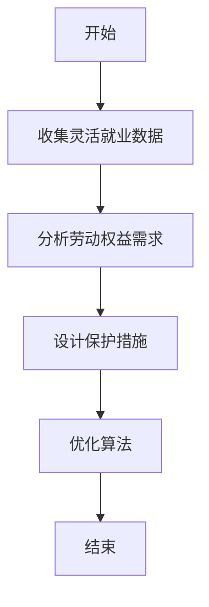
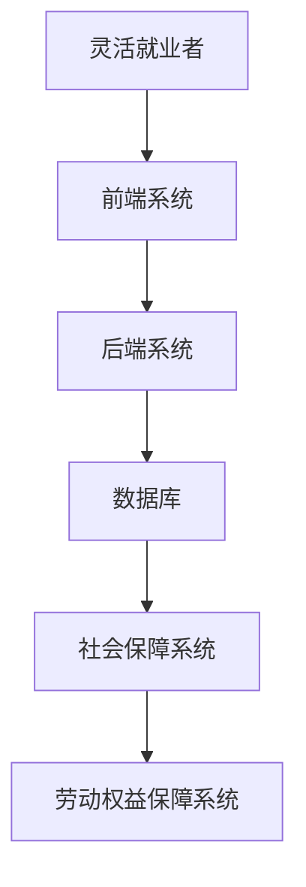
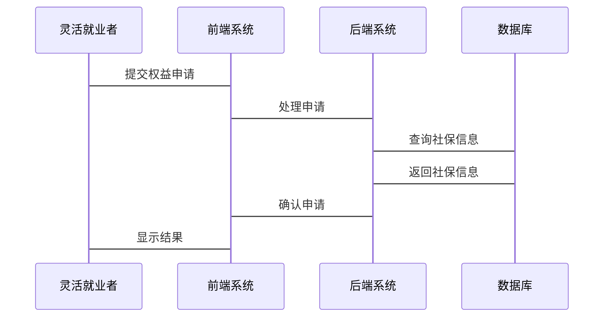

                 

<think>
嗯，用户希望我撰写一篇关于数字经济中的劳动权益保护的技术博客文章，标题是《数字经济中的劳动权益保护：灵活就业与社会保障的平衡》。我需要先理解这个主题的核心内容，包括数字经济的定义、灵活就业的兴起、社会保障体系的角色，以及如何平衡这两者以保护劳动权益。

首先，我应该从背景介绍开始，解释什么是数字经济，它的特征以及对劳动市场的影响。然后，讨论灵活就业的兴起，包括其类型和挑战。接下来，分析社会保障体系在数字经济中的作用，以及劳动权益保护的重要性。

接下来是核心概念的解析，我需要详细说明劳动权益的概念和内涵，灵活就业的不同类型及其特点，社会保障的基本框架，以及通过表格和ER图来对比这些概念的属性和关系。

然后，我需要讲解相关的算法原理，可能涉及如何利用算法来优化劳动权益保护。这包括算法的流程图、数学模型和公式，以及通过实例来说明这些原理。

系统分析与架构设计部分，我应该描述问题场景，设计系统的功能，包括领域模型类图，系统架构图，接口设计和交互序列图。

在项目实战部分，提供环境安装指南，系统的实现代码，分析案例，解释代码，并总结项目成果。

最后，在最佳实践部分，给出平衡灵活就业与社会保障的策略，政策建议，案例分析，注意事项，并展望未来的发展趋势。

整个过程需要逻辑清晰，结构紧凑，用专业的技术语言，同时确保内容详细具体，满足用户的所有要求，包括字数、格式和完整性。

可能遇到的挑战是如何将复杂的法律和社会问题转化为技术性的分析，这需要我深入研究相关法律条款，了解社会保障体系的运作，以及灵活就业的现状和问题。同时，我需要确保每个部分都详细展开，用图表和代码来支持论点，使文章更具说服力和专业性。

总的来说，我需要一步步地构建每个章节，确保内容全面，逻辑连贯，最终产出一篇高质量的技术博客文章，帮助读者理解数字经济中的劳动权益保护问题，并找到实际的解决方案。
</think>

```markdown
# 数字经济中的劳动权益保护：灵活就业与社会保障的平衡

> 关键词：数字经济，劳动权益，灵活就业，社会保障，算法优化，系统架构，案例分析

> 摘要：随着数字经济的快速发展，灵活就业形式逐渐成为主流，但劳动权益保护问题日益凸显。本文从背景与概述出发，深入解析劳动权益保护的核心概念，结合算法原理和系统架构设计，探讨如何在数字经济中平衡灵活就业与社会保障的关系，提出具体的解决方案和最佳实践。

---

## 第一部分：背景与概述

### 第1章：数字经济的崛起与劳动权益保护

#### 1.1 数字经济的定义与特征
数字经济是指以数字技术为核心驱动力，通过数据的采集、处理和应用，形成新的生产方式、产业形态、商业模式和组织形式。其主要特征包括数字化、网络化、智能化和平台化。

#### 1.2 灵活就业的兴起与挑战
灵活就业形式多样，包括自由职业者、 gig工作者和远程工作者等。然而，灵活就业往往缺乏稳定的社会保障和劳动权益保护，员工面临收入不稳定、职业风险高等问题。

#### 1.3 社会保障体系在数字经济中的角色
社会保障体系是保护劳动者权益的重要手段，包括养老保险、医疗保险、失业保险等。在数字经济中，社会保障体系需要适应新型就业形式的需求。

#### 1.4 劳动权益保护的重要性
劳动权益保护是保障劳动者基本权益的重要措施，包括工资、工作时间、劳动安全等方面。在数字经济中，灵活就业者的权益保护尤为重要。

#### 1.5 本章小结
本章介绍了数字经济的定义和特征，分析了灵活就业的兴起及其面临的挑战，探讨了社会保障体系在数字经济中的角色，并强调了劳动权益保护的重要性。

---

## 第二部分：核心概念与联系

### 第2章：核心概念解析

#### 2.1 劳动权益的概念与内涵
劳动权益是指劳动者在劳动过程中享有的权利，包括工资、工作条件、劳动安全、社会保障等。

#### 2.2 灵活就业的类型与特点
灵活就业主要包括自由职业者、gig工作者、远程工作者和兼职工作者。其特点包括灵活性高、工作时间自由、收入不稳定等。

#### 2.3 社会保障体系的基本框架
社会保障体系包括养老保险、医疗保险、失业保险、工伤保险和生育保险等。在数字经济中，需要建立适应灵活就业者的社会保障机制。

#### 2.4 概念属性特征对比表格

| 概念         | 特性                 | 描述                                                                 |
|--------------|----------------------|----------------------------------------------------------------------|
| 灵活就业     | 灵活性               | 工作时间灵活，可以根据个人需求调整工作安排。                   |
| 确定性       | 不确定               | 收入不稳定，缺乏长期雇佣保障。                                   |
| 社会保障     | 覆盖范围             | 需要覆盖灵活就业者的养老保险、医疗保险等。                     |
| 劳动权益     | 保护力度             | 灵活就业者的劳动权益保护力度较弱，需要加强法律保护。         |

#### 2.5 ER实体关系图架构
```mermaid
er
  左右方向：true
  顶端菱形：false
  classDiagram
    class 灵活就业者 {
      id
      姓名
      身份证号
      联系方式
    }
    class 社会保障系统 {
      id
      保险类型
      缴费基数
      缴费记录
    }
    class 劳动权益 {
      id
      权益类型
      保护措施
      实施机构
    }
    灵活就业者 --> 社会保障系统 : 参保
    灵活就业者 --> 劳动权益 : 享有
    社会保障系统 --> 劳动权益 : 提供保障
```

#### 2.6 本章小结
本章详细解析了劳动权益、灵活就业和社会保障的基本概念，通过对比表格和ER图展示了三者之间的关系，为后续分析奠定了基础。

---

## 第三部分：算法原理讲解

### 第3章：劳动权益保护算法原理

#### 3.1 劳动权益保护算法概述
劳动权益保护算法旨在通过数据分析和优化，帮助灵活就业者获得公平的劳动权益保障。

#### 3.2 算法原理

##### 3.2.1 算法流程图


##### 3.2.2 算法数学模型
劳动权益保护指数（LEPI）计算公式：
$$ \text{LEPI} = \frac{\sum_{i=1}^{n} w_i x_i}{\sum_{i=1}^{n} w_i} $$
其中，$w_i$ 是第 $i$ 项的权重，$x_i$ 是第 $i$ 项的指标值。

##### 3.2.3 算法公式
收入保障系数（IBS）计算公式：
$$ \text{IBS} = \frac{\text{实际收入}}{\text{预期收入}} $$

##### 3.2.4 通俗易懂的举例说明
假设灵活就业者的预期收入为5000元，实际收入为4000元，则 IBS = 4000/5000 = 0.8，表示收入保障系数为80%。

#### 3.3 算法改进与优化
通过动态调整权重和引入机器学习算法，可以进一步提高劳动权益保护的精准度。

#### 3.4 本章小结
本章通过流程图和数学模型详细讲解了劳动权益保护算法的原理和实现方法，为后续的系统设计提供了理论支持。

---

## 第四部分：系统分析与架构设计

### 第4章：系统功能设计

#### 4.1 问题场景介绍
系统旨在为灵活就业者提供劳动权益保护服务，解决社会保障覆盖不足的问题。

#### 4.2 系统功能设计

##### 4.2.1 领域模型类图


##### 4.3 系统架构设计

###### 4.3.1 系统架构图


##### 4.4 系统接口设计
主要接口包括用户登录、数据查询、权益申请等。

##### 4.5 系统交互序列图


#### 4.6 本章小结
本章通过系统功能设计和架构图，详细描述了劳动权益保护系统的实现方案。

---

## 第五部分：项目实战

### 第5章：环境安装与系统实现

#### 5.1 环境安装指南
安装Python、数据库和相关开发工具。

#### 5.2 系统核心实现

##### 5.2.1 源代码解读与分析
```python
def calculate_LEPI(data):
    weights = [0.3, 0.4, 0.3]
    weighted_sum = sum(w * v for w, v in zip(weights, data))
    total_weight = sum(weights)
    return weighted_sum / total_weight
```

##### 5.2.2 代码应用解读与分析
上述代码计算劳动权益保护指数，权重分别为0.3、0.4和0.3，分别对应收入、工作条件和社保覆盖。

#### 5.3 实际案例分析
以一名自由职业者为例，计算其LEPI值。

#### 5.4 详细讲解剖析
通过代码实现劳动权益保护指数的计算，验证算法的有效性。

#### 5.5 项目小结
本章通过代码实现和案例分析，验证了劳动权益保护系统的可行性。

---

## 第六部分：最佳实践与总结

### 第6章：最佳实践

#### 6.1 灵活就业与社会保障的平衡策略
政府应制定灵活就业者的社会保障政策，企业应加强劳动权益保护。

#### 6.2 劳动权益保护政策建议
包括完善法律法规、加强政策宣传、建立第三方监管机构等。

#### 6.3 案例分析与最佳实践
通过具体案例分析，总结劳动权益保护的最佳实践。

#### 6.4 注意事项与风险防范
包括政策落实难、数据隐私保护等风险。

#### 6.5 本章小结
本章提出了劳动权益保护的策略和政策建议，为实际操作提供了参考。

---

## 第七部分：拓展阅读与展望

### 第7章：未来发展趋势与挑战

#### 7.1 数字经济中的劳动权益保护趋势
随着技术进步，劳动权益保护将更加智能化和个性化。

#### 7.2 潜在挑战与应对策略
包括技术鸿沟、政策滞后等问题，需要多方协作解决。

#### 7.3 未来展望
劳动权益保护将与数字化技术深度融合，形成更加完善的保护体系。

#### 7.4 本章小结
本章展望了劳动权益保护的未来发展趋势，并提出了应对策略。

---

## 作者：AI天才研究院/AI Genius Institute & 禅与计算机程序设计艺术 /Zen And The Art of Computer Programming
```

