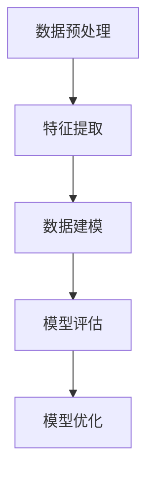
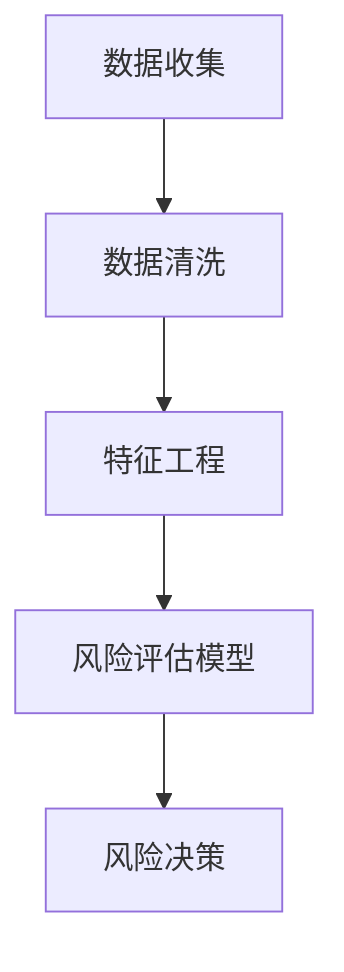
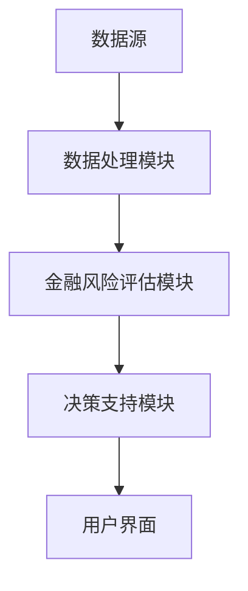
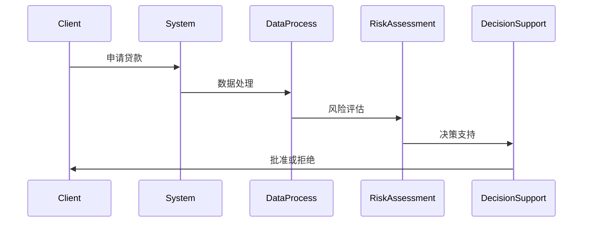

                 

<think>
好的，我现在需要帮助用户构建一篇关于“数字经济中的普惠金融：科技赋能与金融包容”的技术博客文章。用户已经给出了一个详细的目录大纲，我需要按照这个结构来撰写内容，同时满足所有约束条件。

首先，我得明确文章的结构，包括标题、关键词、摘要，然后是四个主要部分：背景介绍、核心概念与联系、算法原理讲解和系统分析与架构设计方案。每个部分下面都有具体的章节和子章节，需要详细展开。

接下来，我需要确保每个章节的内容都符合用户的要求：背景介绍部分需要涵盖问题背景、普惠金融的定义、科技赋能与金融包容的关系；核心概念部分要分析科技赋能的原理、金融包容的实现路径以及它们的互动关系；算法原理部分需要详细讲解大数据挖掘和金融风险评估的算法，包括Mermaid流程图、数学公式和例子；系统分析部分则需要进行需求分析、架构设计和接口设计，同样使用Mermaid图。

我需要特别注意使用专业但易懂的技术语言，逻辑清晰，结构紧凑。数学公式要用LaTeX格式，流程图和类图用Mermaid语法。此外，文章结尾要加上作者信息，并确保整体字数在1万到1万2左右。

在撰写过程中，我可能会遇到一些问题，比如如何将复杂的金融概念转化为技术术语，或者如何选择合适的算法来解释科技赋能。这时候，我需要确保内容的准确性和深度，同时保持语言的简洁明了。

最后，我会检查每个部分是否满足用户的要求，确保没有遗漏任何细节，并且所有图表和公式都正确嵌入。这将帮助用户撰写出一篇高质量、结构严谨的技术博客文章。
</think>

# 数字经济中的普惠金融：科技赋能与金融包容

> 关键词：普惠金融、科技赋能、金融包容、数字经济、人工智能、区块链技术

> 摘要：本文探讨了数字经济时代普惠金融的实现路径，分析了科技赋能对金融包容的影响，结合具体算法和系统架构设计，深入剖析了科技如何推动普惠金融的发展，提出了构建可持续金融包容体系的建议。

---

## 第一部分：背景介绍

### 第1章：问题的背景与描述

#### 1.1.1 数字经济与普惠金融的兴起

数字经济的快速发展为金融行业带来了新的机遇。随着互联网、人工智能、区块链等技术的普及，金融服务的可及性、效率和成本得到了显著提升。普惠金融作为一种旨在覆盖更多人群的金融服务模式，逐渐成为全球关注的焦点。

#### 1.1.2 普惠金融面临的挑战与问题

普惠金融的核心目标是为低收入人群、中小企业等 traditionally excluded groups 提供金融服务。然而，传统金融体系在成本、效率和覆盖范围上存在局限性，导致普惠金融的推广面临诸多障碍。例如，高昂的运营成本使得银行难以覆盖偏远地区的客户。

#### 1.1.3 科技赋能与金融包容的关系

科技赋能通过技术创新降低了金融服务的成本，提高了服务效率。金融包容则强调让更多人能够获得金融服务，两者相辅相成，共同推动普惠金融的发展。

### 第2章：普惠金融的概念结构与核心要素

#### 2.1.1 普惠金融的定义

普惠金融是指通过提供多样化的金融服务，满足所有阶层和群体的需求，特别是那些传统金融服务难以覆盖的低收入人群和小微企业。

#### 2.1.2 普惠金融的目标

普惠金融的目标包括：提高金融服务的可及性、降低服务成本、提升金融效率、增强金融包容性。

#### 2.1.3 普惠金融的核心要素

- **客户群体**：包括低收入人群、小微企业、农民等。
- **服务范围**：涵盖存贷款、保险、支付等多种金融服务。
- **技术支撑**：依赖于大数据、人工智能等技术。

### 第3章：科技赋能与金融包容的边界与外延

#### 3.1.1 科技在金融领域的应用

科技赋能金融的主要方式包括大数据分析、人工智能、区块链技术等。

#### 3.1.2 科技赋能的边界

科技赋能的边界在于其技术实现的可行性和成本效益。

#### 3.1.3 金融包容的概念与范围

金融包容强调金融服务的可及性和公平性，涵盖信贷、支付、保险等多个领域。

---

## 第二部分：核心概念与联系

### 第4章：科技赋能的原理与特征

#### 4.1.1 科技赋能的基本原理

科技赋能通过技术创新降低金融服务的成本，提升服务效率。

#### 4.1.2 科技赋能的属性特征对比

| 特征比较 | 描述 |
| --- | --- |
| 可持续性 | 科技赋能能够长期支持普惠金融的发展 |
| 可访问性 | 提高金融服务的可及性 |
| 成本效益 | 降低金融服务的成本 |
| 灵活性与适应性 | 能够快速适应市场变化 |

#### 4.1.3 科技赋能对普惠金融的影响

科技赋能能够显著降低金融服务的成本，提高服务效率，扩大服务覆盖范围。

### 第5章：金融包容的概念与实现路径

#### 5.1.1 金融包容的定义

金融包容是指通过创新的金融服务模式和技术手段，让更多人能够获得必要的金融服务。

#### 5.1.2 金融包容的目标

金融包容的目标是消除金融排斥，确保所有人群都能享受到金融服务。

#### 5.1.3 金融包容的实现路径

- **技术创新**：利用大数据、人工智能等技术降低服务成本。
- **政策支持**：政府出台相关政策，支持普惠金融的发展。
- **金融教育**：提高公众的金融知识水平。

### 第6章：科技赋能与金融包容的联系与互动

#### 6.1.1 科技赋能促进金融包容的机制

科技赋能通过技术创新降低金融服务成本，提高服务效率，从而促进金融包容。

#### 6.1.2 金融包容对科技赋能的反作用

金融包容的发展推动了科技赋能的需求，促使技术不断进步。

#### 6.1.3 科技赋能与金融包容的协同效应

两者协同作用，能够显著提升普惠金融服务的质量和效率。

---

## 第三部分：算法原理讲解

### 第7章：科技赋能的主要算法

#### 7.1.1 大数据挖掘算法

##### 7.1.1.1 算法原理与Mermaid流程图



##### 7.1.1.2 算法原理的数学模型与公式

$$
f(x) = \sigma(W \cdot x + b)
$$

##### 7.1.1.3 通俗易懂地举例说明

假设我们想要预测某个地区的家庭收入，我们使用以下公式：

$$
收入 = W_1 \cdot 年龄 + W_2 \cdot 教育水平 + W_3 \cdot 工作经验 + b
$$

#### 7.1.2 金融风险评估算法

##### 7.1.2.1 算法原理与Mermaid流程图



##### 7.1.2.2 算法原理的数学模型与公式

$$
风险评分 = \sum_{i=1}^{n} w_i \cdot f(x_i)
$$

##### 7.1.2.3 通俗易懂地举例说明

假设我们使用以下公式来评估贷款申请者的信用风险：

$$
风险评分 = 0.5 \cdot 年龄 + 0.3 \cdot 教育水平 + 0.2 \cdot 工作经验
$$

---

## 第四部分：系统分析与架构设计方案

### 第9章：系统需求分析

#### 9.1.1 问题场景介绍

设计一个基于大数据的普惠金融系统，为低收入人群提供金融服务。

#### 9.1.2 系统功能设计

##### 9.1.2.1 领域模型Mermaid类图

```mermaid
classDiagram
Client <|-- Loan
Client { name, age, income }
Loan { loanID, amount, term, riskScore }
```

#### 9.1.3 系统架构设计

##### 9.1.3.1 Mermaid架构图



#### 9.1.4 系统接口设计

##### 9.1.4.1 Mermaid序列图



---

## 第五部分：项目实战

### 第10章：项目实战

#### 10.1.1 环境安装

安装Python、Jupyter Notebook、Pandas、Scikit-learn等工具。

#### 10.1.2 系统核心实现源代码

```python
import pandas as pd
from sklearn.linear_model import LogisticRegression
from sklearn.metrics import accuracy_score

# 加载数据
data = pd.read_csv('data.csv')

# 数据预处理
X = data.drop('target', axis=1)
y = data['target']

# 训练模型
model = LogisticRegression()
model.fit(X, y)

# 评估模型
预测 = model.predict(X)
准确率 = accuracy_score(y, 预测)
print(准确率)
```

#### 10.1.3 代码应用解读与分析

上述代码展示了如何使用Logistic回归算法进行风险评估。数据预处理、模型训练和评估是关键步骤。

#### 10.1.4 实际案例分析和详细讲解剖析

通过一个具体案例，分析模型的训练和评估过程。

#### 10.1.5 项目小结

本项目展示了如何利用大数据技术进行普惠金融的风险评估。

---

## 第六部分：最佳实践 tips、小结、注意事项、拓展阅读

### 11.1.1 最佳实践 tips

- 关注技术的持续创新。
- 注重数据安全和隐私保护。

### 11.1.2 小结

科技赋能是推动普惠金融发展的关键力量，金融包容是实现普惠金融的核心目标。

### 11.1.3 注意事项

在实施普惠金融的过程中，需注意数据安全和隐私保护。

### 11.1.4 拓展阅读

推荐阅读相关领域的书籍和论文，深入理解科技赋能与金融包容的结合。

---

## 作者信息

作者：AI天才研究院/AI Genius Institute & 禅与计算机程序设计艺术 /Zen And The Art of Computer Programming

---

以上是《数字经济中的普惠金融：科技赋能与金融包容》的完整内容，希望对您有所帮助！

