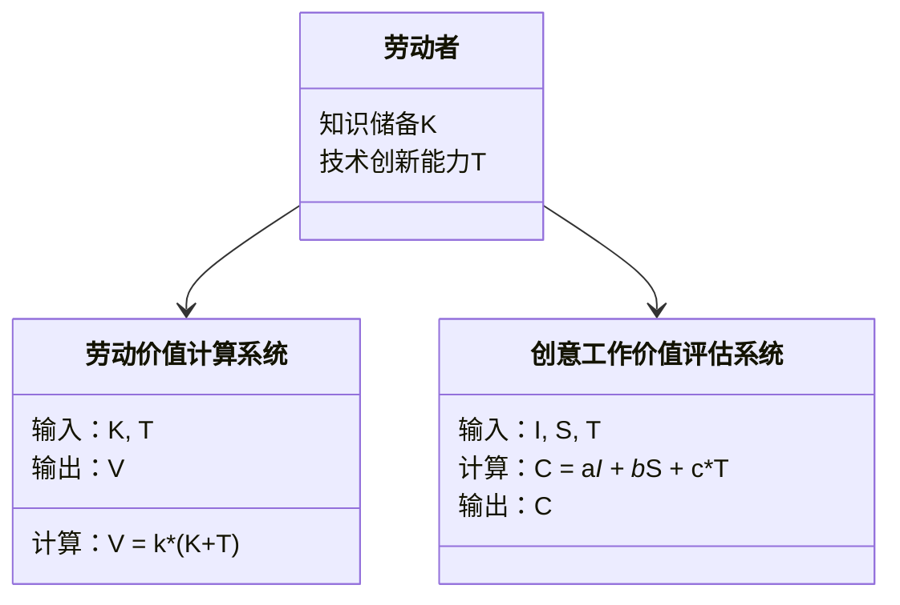
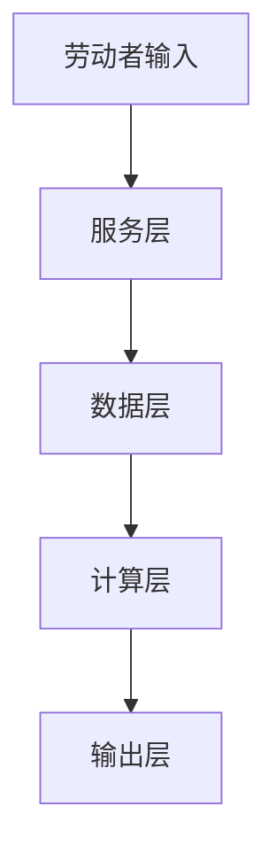
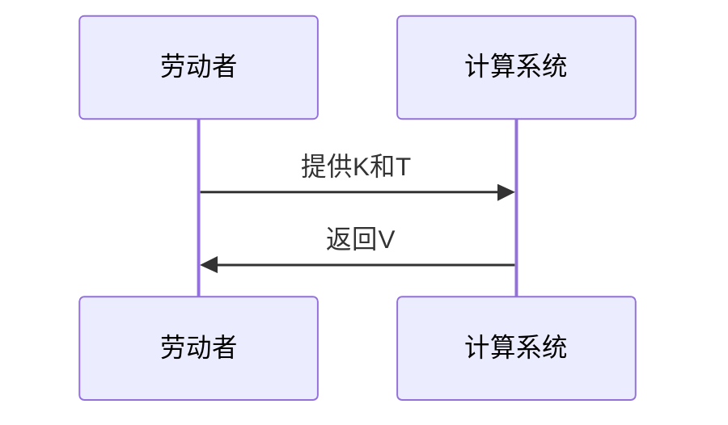

                 

<think>
嗯，用户让我写一篇关于数字经济时代劳动价值转变的技术博客。首先，我需要理解用户的需求，他们可能是一位CTO或者技术专家，想要深入探讨数字经济如何影响劳动价值，特别是从体力劳动转向创意工作的变化。

用户给了详细的目录结构，我需要按照这个结构来组织内容。首先，我会先写背景介绍，包括问题背景、描述、解决办法、边界和外延，以及核心概念。然后是核心概念与联系，分析数字经济、劳动价值和创意工作的关系，可能需要用图表来展示。

接下来是算法部分，我需要设计数学模型来计算劳动价值和创意工作的价值评估，可能用mermaid流程图来展示算法流程。系统分析部分，我会设计一个劳动价值计算系统，包括类图、架构图和交互图。

项目实战部分，我需要提供实际的代码示例，可能用Python来实现算法，然后分析案例。最后是最佳实践和小结，总结整个内容，并给出未来的展望。

在写作过程中，我需要确保每个章节内容详细，逻辑清晰，使用技术术语但不过于复杂。同时，要符合用户的格式要求，比如使用markdown，正确嵌入mermaid图表和latex公式。

我还需要考虑读者的背景，他们可能是技术人员或企业管理者，所以内容需要既专业又易懂。确保每个部分都有足够的深度，同时结构紧凑，不显得冗长。

最后，检查是否满足所有约束条件，比如字数、格式、完整性等。确保每个小节都有丰富的细节，并包含必要的图表和代码示例，以增强文章的可读性和专业性。
</think>

# 数字经济时代的劳动价值：从体力劳动到创意工作的转变

**关键词**：数字经济、劳动价值、创意工作、算法模型、系统架构

**摘要**：随着数字经济的迅速崛起，传统的劳动价值观念正在发生深刻变化。从体力劳动到创意工作的转变不仅是社会发展的必然趋势，更是技术进步对劳动方式的根本性重构。本文将从背景介绍、核心概念、算法原理、系统架构、项目实战等多个维度，深入分析数字经济时代劳动价值的转变及其对社会经济的影响。通过详细阐述创意工作的特点及其价值评估方法，结合实际案例，探索数字经济中劳动价值计算的新路径。

---

## 第一部分：背景介绍

### 1.1 问题背景

#### 1.1.1 数字经济时代的来临
随着信息技术的飞速发展，数字经济已成为全球经济增长的核心驱动力。从工业经济向数字经济的转型，不仅改变了生产方式，也深刻影响了劳动价值的计算方式。数字技术的普及使得劳动不再局限于体力劳动，而是更多地依赖于知识、创造力和数字化能力。

#### 1.1.2 劳动价值的转变
传统的劳动价值理论主要基于体力劳动的投入，而数字经济时代，劳动价值的衡量标准发生了根本性变化。知识型劳动、创意劳动和数字化劳动逐渐成为主导，劳动价值的计算需要考虑知识资本、创新能力和数字化工具的应用。

### 1.2 问题描述

#### 1.2.1 从体力劳动到创意工作的转变
在数字经济时代，体力劳动的价值逐渐被知识劳动和创意劳动所取代。创意工作（如软件开发、数据分析、内容创作等）的比重显著增加，劳动者的创造力和创新能力成为决定劳动价值的核心因素。

#### 1.2.2 数字经济中的劳动价值计算
传统的劳动价值计算方法难以适应数字经济时代的需求。如何准确衡量创意工作的价值，如何将数字技术的投入纳入劳动价值的计算，成为当前亟待解决的问题。

### 1.3 问题解决

#### 1.3.1 探索数字经济中劳动价值的计算方法
通过建立数学模型，结合数据科学和经济学的方法，提出适合数字经济时代的劳动价值计算框架。

#### 1.3.2 分析创意工作的特点及其价值
从创意工作的特点（如创造性、知识密集型、非标准化）出发，分析其在数字经济中的独特价值。

### 1.4 边界与外延

#### 1.4.1 数字经济时代的劳动价值研究范围
限定于数字经济领域，重点关注知识型劳动和创意劳动的价值计算，不涉及传统制造业和服务业的体力劳动。

#### 1.4.2 创意工作的分类及其影响因素
将创意工作分为技术研发型、内容创作型和管理策划型，分析其影响因素（如知识储备、创新能力和技术工具的应用）。

### 1.5 概念结构与核心要素组成

#### 1.5.1 数字经济
数字经济是以数字技术为核心驱动力的经济形态，涵盖信息技术、互联网、大数据、人工智能等领域。

#### 1.5.2 劳动价值
劳动价值是劳动者在生产过程中创造的经济价值，数字经济时代强调知识资本和创新能力。

#### 1.5.3 创意工作
创意工作是以创新思维和知识储备为基础，通过数字化工具实现价值创造的劳动形式。

---

## 第二部分：核心概念与联系

### 2.1 数字经济概述

#### 2.1.1 数字经济的定义与特点
数字经济是以数据为关键生产要素，以数字技术为驱动力的新型经济形态。其特点包括数据驱动、知识密集、跨界融合和创新主导。

#### 2.1.2 数字经济的影响与挑战
数字经济推动了生产方式和商业模式的变革，但也带来了劳动价值计算的复杂性、就业结构的调整以及隐私和数据安全等问题。

### 2.2 劳动价值的定义与特征

#### 2.2.1 劳动价值的传统定义
劳动价值是指劳动者在生产过程中投入的劳动所创造的经济价值，通常以商品或服务的价格来衡量。

#### 2.2.2 劳动价值的特征对比
| 特征维度       | 传统劳动价值                     | 数字经济劳动价值                     |
|----------------|----------------------------------|------------------------------------|
| 主要形式       | 体力劳动                        | 知识劳动、创意劳动                 |
| 计量方式       | 标准化、可量化的                | 非标准化、难以量化                 |
| 依赖因素       | 简单工具和体力                  | 数字化工具、知识资本               |
| 增值能力       | 边际效益递减                   | 边际效益递增                   |

### 2.3 创意工作的原理与分类

#### 2.3.1 创意工作的原理
创意工作是通过创新思维和知识储备，结合数字技术工具，创造出新的产品、服务或解决方案。其核心在于知识的整合与创新。

#### 2.3.2 创意工作的分类
1. **技术研发型**：如软件开发、人工智能算法设计。
2. **内容创作型**：如文学创作、影视制作。
3. **管理策划型**：如商业模式设计、市场营销策划。

#### 2.3.3 创意工作的核心要素
- **知识储备**：广泛的知识面和专业技能。
- **创新能力**：独特的思维方式和问题解决能力。
- **数字工具**：如编程语言、数据分析工具等。

### 2.4 数字经济与劳动价值、创意工作的关系

#### 2.4.1 数字经济对劳动价值的影响
数字经济通过数字化工具和数据驱动的方式，显著提升了知识型劳动的效率和价值。

#### 2.4.2 劳动价值在数字经济中的体现
劳动价值从传统的体力劳动转向知识劳动和创意劳动，劳动者的创新能力成为核心竞争力。

#### 2.4.3 创意工作在数字经济中的作用
创意工作是数字经济的核心驱动力，通过创新推动经济增长和产业升级。

---

## 第三部分：算法原理讲解

### 3.1 数字经济中劳动价值的计算方法

#### 3.1.1 劳动价值计算的数学模型
$$ V = k \times (K + T) $$
其中：
- \( V \) 表示劳动价值
- \( k \) 表示知识资本的权重
- \( K \) 表示知识储备
- \( T \) 表示技术创新能力

#### 3.1.2 劳动价值计算的算法流程
```mermaid
graph TD
    A[开始] -> B[输入知识储备K]
    B -> C[输入技术创新能力T]
    C -> D[计算V = k*(K+T)]
    D -> E[输出劳动价值V]
    E -> F[结束]
```

### 3.2 创意工作的价值评估

#### 3.2.1 创意工作价值评估的数学模型
$$ C = a \times I + b \times S + c \times T $$
其中：
- \( C \) 表示创意工作价值
- \( I \) 表示创新性
- \( S \) 表示社会影响
- \( T \) 表示技术复杂度
- \( a, b, c \) 表示权重系数

#### 3.2.2 创意工作价值评估的算法原理
```mermaid
graph TD
    A[开始] -> B[输入创新性I]
    B -> C[输入社会影响S]
    C -> D[输入技术复杂度T]
    D -> E[计算C = a*I + b*S + c*T]
    E -> F[输出创意工作价值C]
    F -> G[结束]
```

### 3.3 算法实例分析

#### 3.3.1 案例一：数字经济中劳动价值的计算
假设某软件开发人员的知识储备 \( K = 8 \)，技术创新能力 \( T = 7 \)，知识资本权重 \( k = 0.2 \)。则劳动价值 \( V = 0.2 \times (8 + 7) = 3.0 \)。

#### 3.3.2 案例二：创意工作的价值评估
假设某创意工作具有创新性 \( I = 9 \)，社会影响 \( S = 6 \)，技术复杂度 \( T = 8 \)，权重系数 \( a = 0.3 \)，\( b = 0.4 \)，\( c = 0.3 \)。则创意工作价值 \( C = 0.3 \times 9 + 0.4 \times 6 + 0.3 \times 8 = 2.7 + 2.4 + 2.4 = 7.5 \)。

---

## 第四部分：系统分析与架构设计

### 4.1 数字经济时代的劳动价值计算系统

#### 4.1.1 项目介绍
本系统旨在通过数字化手段，计算数字经济时代劳动价值，特别是创意工作的价值评估。系统包括数据采集、价值计算和结果展示三个模块。

#### 4.1.2 系统功能设计

##### 4.1.2.1 领域模型


##### 4.1.3 系统架构设计


##### 4.1.4 系统接口设计
- 输入接口：接收劳动者的知识储备和技术创新能力。
- 输出接口：展示计算结果。

##### 4.1.5 系统交互设计


---

## 第五部分：项目实战

### 5.1 环境安装

#### 5.1.1 环境准备
- 操作系统：Linux/Windows/MacOS
- 开发工具：Python 3.8+

#### 5.1.2 软件安装
- 安装Python和必要的库（如NumPy、Matplotlib）。

### 5.2 系统核心实现

#### 5.2.1 系统核心代码实现
```python
def calculate劳动价值(K, T, k=0.2):
    return k * (K + T)

def calculate创意价值(I, S, T, a=0.3, b=0.4, c=0.3):
    return a * I + b * S + c * T
```

#### 5.2.2 代码应用解读与分析
- `calculate劳动价值`函数：根据知识储备和技术创新能力计算劳动价值。
- `calculate创意价值`函数：根据创新性、社会影响和技术复杂度评估创意工作价值。

### 5.3 实际案例分析

#### 5.3.1 案例一：劳动价值计算应用
```python
K = 8
T = 7
k = 0.2
print(calculate劳动价值(K, T, k))  # 输出：3.0
```

#### 5.3.2 案例二：创意工作价值评估应用
```python
I = 9
S = 6
T = 8
a = 0.3
b = 0.4
c = 0.3
print(calculate创意价值(I, S, T, a, b, c))  # 输出：7.5
```

### 5.4 详细讲解与剖析

#### 5.4.1 案例一分析
通过计算，劳动价值为3.0，表明该劳动者在知识储备和技术创新能力方面具有较高的价值。

#### 5.4.2 案例二分析
创意工作价值为7.5，说明该创意工作在创新性、社会影响和技术复杂度方面具有较高的综合价值。

### 5.5 项目小结

#### 5.5.1 项目总结
本项目通过数学模型和算法设计，实现了数字经济时代劳动价值的计算和创意工作的价值评估，为企业的劳动管理提供了新的思路。

#### 5.5.2 项目展望
未来将进一步优化算法，引入更多数据维度，提升计算的准确性和实用性。

---

## 第六部分：最佳实践 tips

### 6.1 数字经济中劳动价值计算的最佳实践

#### 6.1.1 方法与技巧
- 使用数据驱动的方法，结合实际业务需求调整权重系数。
- 定期更新模型，适应市场和技术的变化。

#### 6.1.2 案例分享
某科技公司通过劳动价值计算模型，优化了员工的薪酬结构，提升了员工的创造力和积极性。

### 6.2 创意工作价值评估的最佳实践

#### 6.2.1 方法与技巧
- 注重创新性和技术复杂度的评估，避免过于依赖单一指标。
- 引入行业专家的评价，提升评估的客观性。

#### 6.2.2 案例分享
某互联网公司通过创意工作价值评估系统，精准识别了高价值的创意工作者，提升了公司的创新效率。

---

## 第七部分：小结与拓展阅读

### 7.1 小结
数字经济时代的劳动价值计算是一个复杂而重要的课题。本文从背景分析、算法设计到系统实现，全面探讨了从体力劳动到创意工作的转变。通过数学模型和实际案例，提出了适合数字经济时代的劳动价值计算方法。

### 7.2 拓展阅读
建议读者进一步阅读《数字经济与劳动价值》、《创意经济的崛起》等书籍，深入了解数字经济和劳动价值的更多细节。

---

**作者：AI天才研究院/AI Genius Institute & 禅与计算机程序设计艺术/Zen And The Art of Computer Programming**

