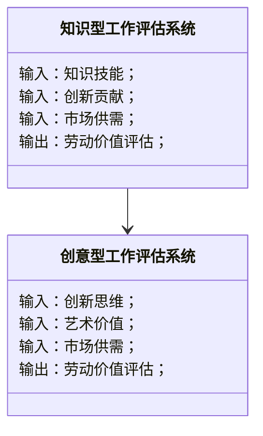

                 

<think>
嗯，我现在要写一篇关于《数字经济时代的劳动价值：知识型与创意型工作的崛起》的技术博客。首先，我需要理解这个主题的核心是什么。数字经济，劳动价值，知识型和创意型工作，这些都是关键词。

我应该从引言和背景开始，解释数字经济的兴起以及它如何改变劳动价值的衡量方式。然后，定义知识型和创意型工作的特点，比如知识型工作依赖专业知识，而创意型工作则强调创新和独特性。

接下来，我需要分析这些工作在不同行业中的案例，比如IT行业中的软件开发属于知识型工作，而广告设计属于创意型工作。这有助于读者理解这些概念的实际应用。

然后，我需要讨论劳动价值的评估方法，可能涉及理论上的原则和实际的评估策略。这部分可能需要一些数学模型，比如如何将知识和创意的价值转化为具体的经济指标。

在系统分析部分，我需要用Mermaid图来展示系统的架构和功能设计，这可能包括类图和架构图，展示各个模块之间的关系。同时，系统接口和交互设计也很重要，可能需要一个序列图来展示用户如何与系统互动。

项目实战部分，我需要提供具体的环境安装步骤，比如安装Python和相关库，然后展示源代码。代码应该能实际运行，并且解释其功能。同时，分析案例，看看这些方法在实际中是如何应用的，并总结项目的收获和教训。

最后，我需要给出一些最佳实践的建议，比如如何提升自己的知识和创意能力，以及如何在数字化时代更好地评估劳动价值。这些小贴士应该实用且有针对性。

总的来说，我需要确保文章结构清晰，逻辑严密，同时用简洁明了的语言解释复杂的概念。每个部分都要详细展开，但又不显得冗长。确保文章既有理论深度，又有实际应用的案例，让读者能够理解和应用这些知识。
</think>

# 数字经济时代的劳动价值：知识型与创意型工作的崛起

## 关键词：数字经济、劳动价值、知识型工作、创意型工作、劳动评估、系统架构

## 摘要：  
在数字经济快速发展的背景下，知识型和创意型工作逐渐成为劳动市场的主导力量。本文从数字经济的背景出发，探讨知识型和创意型工作的特点及其在劳动价值评估中的重要性。通过实际案例分析，结合系统架构设计和项目实战，详细阐述劳动价值的评估方法和未来趋势。文章旨在为读者提供一个全面的视角，理解数字经济时代劳动价值的变化及其对个人职业发展的深远影响。

---

## 第1章 数字经济时代与劳动价值的变革

### 1.1 数字经济的兴起与发展

数字经济是指以数字技术为核心驱动力，通过数据的生成、传输、处理和应用，形成的新型经济形态。其核心特征包括：

1. **数据驱动**：数据是数字经济的关键生产要素。
2. **技术创新**：以人工智能、区块链、大数据等技术为支撑。
3. **跨界融合**：数字技术与传统产业的深度融合，催生新的商业模式和产业形态。
4. **高速成长**：数字经济的增长速度远超传统产业。

### 1.2 劳动价值的新定义与衡量

传统劳动价值理论基于体力劳动和简单重复劳动，而数字经济时代，劳动价值的衡量更加注重知识、技能和创造力。

- **知识型劳动**：依赖专业知识和技能，产出无形资产（如算法、设计）。
- **创意型劳动**：强调创新和独特性，产出具有高附加值的产品。

---

## 第2章 知识型与创意型工作的特点与定义

### 2.1 知识型工作的概念与特征

- **概念**：知识型工作是指需要专业知识和技能，通过智力劳动创造价值的工作。
- **特征**：
  1. 高知识含量。
  2. 强调创新和解决问题。
  3. 产出无形资产。

### 2.2 创意型工作的概念与特征

- **概念**：创意型工作是指通过创新思维和艺术表达，创造具有独特价值的产品或服务。
- **特征**：
  1. 强调原创性。
  2. 依赖艺术和审美能力。
  3. 产出具有情感价值的产品。

---

## 第3章 案例研究与分析

### 3.1 信息技术行业中的知识型工作案例

- **案例**：软件开发工程师的工作。
- **分析**：通过代码开发和系统设计，产出高质量的软件产品，体现知识型劳动的价值。

### 3.2 创意产业中的创意型工作案例

- **案例**：数字艺术家的创作。
- **分析**：通过数字工具创作独特的艺术作品，体现创意型劳动的独特价值。

---

## 第4章 劳动价值评估方法

### 4.1 价值评估的理论与方法

- **理论基础**：基于劳动投入、产出效益和市场供需。
- **实践方法**：
  1. 成本法：计算劳动投入的直接和间接成本。
  2. 市场法：比较同类劳动的市场价格。
  3. 贡献法：评估劳动对整体价值的贡献。

### 4.2 数学模型与公式

劳动价值评估模型：

$$
\text{劳动价值} = \alpha \times \text{知识技能} + \beta \times \text{创新贡献} + \gamma \times \text{市场供需}
$$

其中，$\alpha$、$\beta$、$\gamma$为权重系数。

---

## 第5章 系统分析与架构设计方案

### 5.1 系统功能设计（Mermaid类图）



### 5.2 系统架构设计（Mermaid架构图）


---

## 第6章 项目实战

### 6.1 环境安装与配置

- **工具安装**：安装Python和相关库（如numpy、pandas）。
- **开发环境配置**：配置IDE和版本控制工具（如Git）。

### 6.2 系统核心实现源代码

```python
def calculate_labor_value(knowledge, creativity, market_demand):
    alpha = 0.5
    beta = 0.3
    gamma = 0.2
    labor_value = alpha * knowledge + beta * creativity + gamma * market_demand
    return labor_value

# 示例调用
knowledge = 80
creativity = 70
market_demand = 90
result = calculate_labor_value(knowledge, creativity, market_demand)
print("劳动价值评估结果：", result)
```

### 6.3 项目分析与实践

- **分析**：通过代码计算不同因素对劳动价值的影响。
- **实践**：调整权重系数，观察对结果的影响。

---

## 第7章 未来趋势与挑战

### 7.1 数字化对劳动价值的影响

- **趋势**：知识型和创意型工作的重要性将持续上升。
- **挑战**：如何平衡自动化对劳动价值的冲击。

### 7.2 全球化背景下的劳动价值评估

- **趋势**：全球人才流动和市场需求的变化。
- **挑战**：跨国劳动价值评估的复杂性。

---

## 第8章 结论与展望

### 8.1 劳动价值评估的总结

数字经济时代，知识型和创意型工作成为劳动价值的核心驱动力。劳动价值的评估需要综合考虑知识、创新和市场供需。

### 8.2 未来展望

随着技术的不断进步，劳动价值的评估将更加精准和动态。知识型与创意型工作将继续推动经济的发展，劳动者的技能提升和创新思维将决定其劳动价值的高低。

---

## 作者：AI天才研究院/AI Genius Institute & 禅与计算机程序设计艺术/Zen And The Art of Computer Programming

