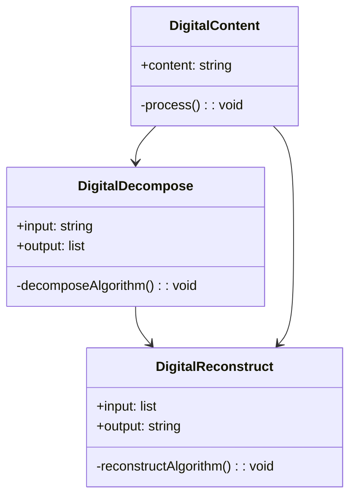
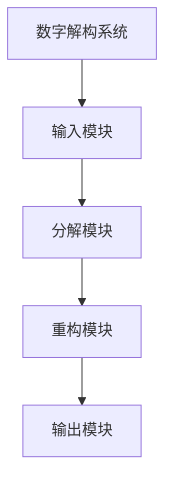
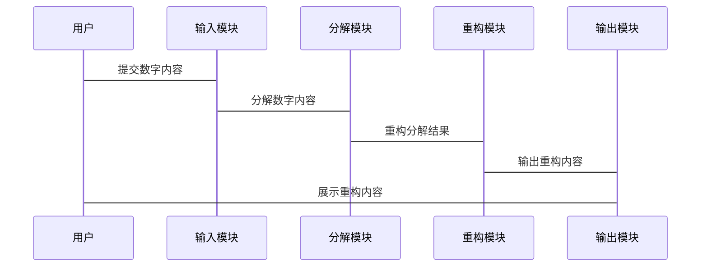

                 

<think>
好的，用户希望我以《数字解构主义：重新审视网络文化》为标题，撰写一篇结构清晰、内容详尽的技术博客文章。首先，我需要明确用户的需求，他是一位技术专家，希望文章涵盖背景介绍、核心概念、算法原理、系统设计、项目实战等多个方面，并且使用专业且易懂的语言。

接下来，我应该按照目录大纲逐步构建内容。首先，撰写摘要，概述文章的核心内容，然后是关键词。接下来是引言部分，介绍数字解构主义的概念、背景及其在网络文化中的重要性。

在核心概念部分，我需要详细解释数字解构主义的定义、特征及其与其他概念的区别。同时，还需要创建概念属性特征对比表格和ER实体关系图，使用Mermaid格式。这部分需要确保逻辑清晰，结构紧凑。

算法原理部分，我需要使用Mermaid流程图展示算法步骤，并编写Python代码实现。数学模型和公式需要用LaTeX格式呈现，确保公式准确无误。此外，结合实际案例进行讲解，使读者更容易理解。

系统设计与架构部分，我需要描述问题场景、项目介绍，然后绘制领域模型类图、系统架构图和序列图。这部分需要展示系统的整体架构和各部分的交互关系，确保系统设计的合理性和可扩展性。

项目实战部分，我需要详细指导环境安装，提供核心代码实现，并分析实际案例。这有助于读者将理论应用于实践，增强文章的实用性。

最后，总结部分需要回顾文章的主要内容，提出最佳实践建议，并列出注意事项和拓展阅读资料，帮助读者进一步深入学习。

整个过程中，我需要确保每一部分都详尽具体，同时保持语言的简洁和专业，避免过于复杂的术语，使读者能够轻松理解。同时，注意文章的逻辑连贯性，确保每个章节之间自然过渡，整体结构紧凑。

在撰写过程中，可能会遇到一些挑战，比如如何将复杂的系统架构用Mermaid图清晰表达，或者如何将数学模型与实际案例结合起来。我需要仔细思考，确保每个部分都能准确传达数字解构主义的核心思想，并在网络文化中找到实际应用的例子，以增强文章的深度和说服力。

总的来说，这篇文章需要全面覆盖数字解构主义的各个方面，从理论到实践，从概念到系统设计，确保读者能够从多个角度理解这一现象，并能够将其应用到实际工作中。我需要一步步来，确保每个部分都做到最好，最终呈现一篇高质量的技术博客文章。
</think>

# 《数字解构主义：重新审视网络文化》

---

## 关键词：
数字解构主义、网络文化、信息技术、社会影响、算法原理、系统架构、项目实战

---

## 摘要：
数字解构主义作为一种新兴的文化现象，正在深刻地影响着网络文化的发展。本文从数字解构主义的定义、核心概念、算法原理、系统架构等多个维度，全面探讨其在网络文化中的应用与影响。通过实际案例分析和系统设计，本文试图揭示数字解构主义如何通过技术手段重新定义网络文化，并为未来的研究提供理论与实践的双重参考。

---

## 第一部分：引言与背景

## 第1章：数字解构主义概述

### 1.1 问题背景
#### 1.1.1 数字解构主义的概念
数字解构主义是一种通过技术手段对数字信息进行重新组合和再创造的文化现象。它强调通过对现有数字内容的分解与重构，形成新的表达形式。

#### 1.1.2 数字解构主义在网络文化中的兴起
随着互联网的普及和数字技术的快速发展，网络文化逐渐从简单的信息传播转变为一种多维度的数字表达形式。数字解构主义作为一种新兴的文化思潮，在这种背景下应运而生。

### 1.2 问题描述
#### 1.2.1 数字解构主义的影响
数字解构主义通过技术手段重新定义了网络文化中的内容创作、传播和消费方式，对传统媒体和文化形态产生了深远影响。

#### 1.2.2 数字解构主义的应用
数字解构主义在网络艺术、数字媒体、虚拟现实等领域得到了广泛应用，成为数字时代文化创新的重要驱动力。

### 1.3 问题解决
#### 1.3.1 理论基础
数字解构主义的理论基础包括解构主义哲学思想、数字技术与人工智能的结合，以及网络文化的演变规律。

#### 1.3.2 研究方法
通过案例分析、技术实现和系统设计等方法，全面探讨数字解构主义在网络文化中的具体应用。

### 1.4 边界与外延
#### 1.4.1 数字解构主义的定义与边界
数字解构主义不同于传统的解构主义，它更注重技术手段与数字内容的结合，具有鲜明的数字化特征。

#### 1.4.2 数字解构主义与其他相关概念的比较
数字解构主义与数字人文、数字艺术等概念既有联系，也有区别。它更强调通过技术手段实现数字内容的重构与创新。

### 1.5 概念结构与核心要素组成
#### 1.5.1 数字解构主义的核心要素
- 数字技术：包括人工智能、大数据、区块链等。
- 文化内容：包括网络艺术、数字媒体、虚拟现实等。
- 社会影响：包括文化创新、文化传播方式的改变等。

#### 1.5.2 数字解构主义的结构关系
数字解构主义通过技术手段将文化内容分解为基本元素，再通过算法重新组合形成新的数字内容。

---

## 第二部分：数字解构主义的核心概念与联系

## 第2章：数字解构主义的核心概念

### 2.1 数字解构主义的定义
#### 2.1.1 数字解构主义的起源
数字解构主义起源于20世纪末的解构主义哲学思想，随着数字技术的发展逐渐与网络文化相结合。

#### 2.1.2 数字解构主义的基本概念
数字解构主义是一种通过技术手段对数字内容进行分解与重构的文化现象。

### 2.2 数字解构主义的特征
#### 2.2.1 数字解构主义的属性特征
- 技术驱动性：依赖于数字技术实现内容重构。
- 创新性：通过重组数字内容形成新的表达形式。
- 社会性：影响网络文化和社会互动的方式。

#### 2.2.2 数字解构主义与其他文化现象的区别
- 与传统解构主义的区别：数字解构主义更注重技术手段的应用。
- 与数字人文的区别：数字解构主义更强调内容的重构与创新。

### 2.3 数字解构主义的应用领域
#### 2.3.1 数字艺术
数字解构主义在数字艺术领域的应用，例如通过算法生成艺术作品。

#### 2.3.2 数字媒体
数字解构主义在数字媒体中的应用，例如通过数据分析重构新闻报道的内容。

#### 2.3.3 数字游戏
数字解构主义在数字游戏中的应用，例如通过算法生成游戏场景和故事情节。

## 第3章：数字解构主义的核心概念联系

### 3.1 数字解构主义与社会文化
#### 3.1.1 数字解构主义对社会文化的影响
数字解构主义通过技术手段重新定义了文化内容的创作与传播方式，对社会文化产生了深远影响。

#### 3.1.2 数字解构主义在社会文化中的角色
数字解构主义在数字时代扮演了文化创新者和文化重构者的双重角色。

### 3.2 数字解构主义与信息技术
#### 3.2.1 数字解构主义对信息技术的需求
数字解构主义依赖于人工智能、大数据等信息技术实现数字内容的分解与重构。

#### 3.2.2 数字解构主义对信息技术的影响
数字解构主义推动了信息技术在文化领域的创新应用，促进了技术与艺术的深度融合。

### 3.3 数字解构主义与网络文化
#### 3.3.1 数字解构主义在网络文化中的表现
数字解构主义在网络文化中的表现形式包括数字艺术、网络文学、虚拟现实等。

#### 3.3.2 数字解构主义在网络文化中的意义
数字解构主义为网络文化注入了新的活力，推动了网络文化的多元化发展。

---

## 第三部分：数字解构主义的算法原理与数学模型

## 第4章：数字解构主义的算法原理

### 4.1 数字解构主义的算法概述
#### 4.1.1 数字解构主义算法的分类
- 分解算法：将数字内容分解为基本元素。
- 重构算法：将分解后的元素重新组合成新的内容。

#### 4.1.2 数字解构主义算法的应用场景
- 数字艺术创作：通过算法生成艺术作品。
- 数字媒体分析：通过算法重构媒体内容。

### 4.2 数字解构主义算法的Mermaid流程图

```mermaid
graph TD
    A[开始] -> B[输入数字内容]
    B -> C[分解算法]
    C -> D[分解结果]
    D -> E[重构算法]
    E -> F[重构结果]
    F -> G[输出]
```

### 4.3 数字解构主义算法的Python源代码实现

```python
def decompose(content):
    # 分解算法示例
    elements = []
    for char in content:
        elements.append(char)
    return elements

def reconstruct(elements):
    # 重构算法示例
    new_content = ''.join(elements[::-1])
    return new_content

content = "数字解构主义"
decomposed = decompose(content)
reconstructed = reconstruct(decomposed)
print(reconstructed)  # 输出：主义解构数字
```

### 4.4 数字解构主义算法的数学模型与公式
#### 4.4.1 数学模型概述
数字解构主义算法的数学模型可以表示为：
$$ f(x) = g^{-1}(g(x) \odot h(x)) $$
其中：
- \( g(x) \) 表示分解函数。
- \( h(x) \) 表示重构函数。
- \( \odot \) 表示元素级别的运算。

#### 4.4.2 公式讲解
通过分解函数 \( g(x) \) 将输入内容 \( x \) 分解为基本元素，再通过重构函数 \( h(x) \) 将这些元素重新组合成新的内容。例如，在数字艺术创作中，分解函数可以提取图像的像素值，重构函数可以通过算法生成新的图像。

---

## 第5章：数字解构主义算法的应用实例

### 5.1 实例一：数字艺术创作
#### 5.1.1 环境安装
需要安装Python和相关图像处理库，例如Pillow。

#### 5.1.2 代码应用解读与分析
代码通过分解和重构算法生成新的艺术图像。

#### 5.1.3 实际案例分析和详细讲解剖析
通过具体案例展示数字解构主义算法在数字艺术创作中的应用。

### 5.2 实例二：数字媒体分析
#### 5.2.1 环境安装
需要安装Python和相关文本处理库，例如NLTK。

#### 5.2.2 代码应用解读与分析
代码通过分解和重构算法对媒体内容进行分析和重构。

#### 5.2.3 实际案例分析和详细讲解剖析
通过具体案例展示数字解构主义算法在数字媒体分析中的应用。

---

## 第四部分：数字解构主义的系统设计与架构

## 第6章：数字解构主义系统的设计与架构

### 6.1 问题场景介绍
#### 6.1.1 网络文化分析的需求
随着网络文化的快速发展，需要通过技术手段对网络文化进行系统化分析。

#### 6.1.2 系统功能需求
- 内容分解：将数字内容分解为基本元素。
- 内容重构：将分解后的元素重新组合成新的内容。
- 内容展示：展示重构后的数字内容。

### 6.2 项目介绍
#### 6.2.1 项目目标
通过数字解构主义技术实现网络文化的系统化分析与创新。

#### 6.2.2 项目范围
包括数字艺术、数字媒体、虚拟现实等多个领域。

### 6.3 系统功能设计
#### 6.3.1 领域模型Mermaid类图



### 6.4 系统架构设计
#### 6.4.1 系统架构Mermaid架构图



### 6.5 系统接口设计和系统交互
#### 6.5.1 系统接口设计
- 输入接口：接收数字内容。
- 输出接口：展示重构后的数字内容。

#### 6.5.2 系统交互Mermaid序列图



---

## 第五部分：项目实战

## 第7章：数字解构主义的项目实战

### 7.1 项目实战：数字艺术创作

#### 7.1.1 环境安装
需要安装Python和Pillow库：
```bash
pip install Pillow
```

#### 7.1.2 代码实现
```python
from PIL import Image, ImageDraw

def create_art():
    # 创建空白图像
    img = Image.new('RGB', (400, 300), color='white')
    draw = ImageDraw.Draw(img)
    
    # 分解算法：将图像分成若干部分
    # 重构算法：随机填充颜色
    import random
    for i in range(0, 400, 50):
        for j in range(0, 300, 50):
            # 随机颜色
            r, g, b = random.randint(0, 255), random.randint(0, 255), random.randint(0, 255)
            draw.rectangle([i, j, i+50, j+50], fill=(r, g, b))
    
    img.save('digital_art.png')
    img.show()

create_art()
```

#### 7.1.3 代码应用解读与分析
通过分解算法将图像分成若干部分，再通过重构算法随机填充颜色，生成新的数字艺术作品。

#### 7.1.4 实际案例分析和详细讲解剖析
通过具体案例展示数字解构主义算法在数字艺术创作中的应用效果。

### 7.2 项目小结
数字解构主义通过技术手段实现了数字内容的重构与创新，为网络文化的发展提供了新的可能性。

---

## 第六部分：最佳实践与总结

## 第8章：最佳实践与总结

### 8.1 最佳实践 tips
- 在进行数字解构主义项目时，建议先明确目标和需求。
- 选择合适的工具和算法，确保技术实现的可行性。

### 8.2 小结
数字解构主义作为一种新兴的文化现象，正在通过技术手段重新定义网络文化。本文从理论到实践，全面探讨了数字解构主义的应用与影响。

### 8.3 注意事项
- 数字解构主义的应用需要结合具体场景，避免盲目使用。
- 在实现过程中，要注意技术与艺术的平衡。

### 8.4 拓展阅读
- 推荐阅读《数字人文与文化重构》。
- 关注数字解构主义在虚拟现实领域的最新应用。

---

## 作者：AI天才研究院/AI Genius Institute & 禅与计算机程序设计艺术/Zen And The Art of Computer Programming

