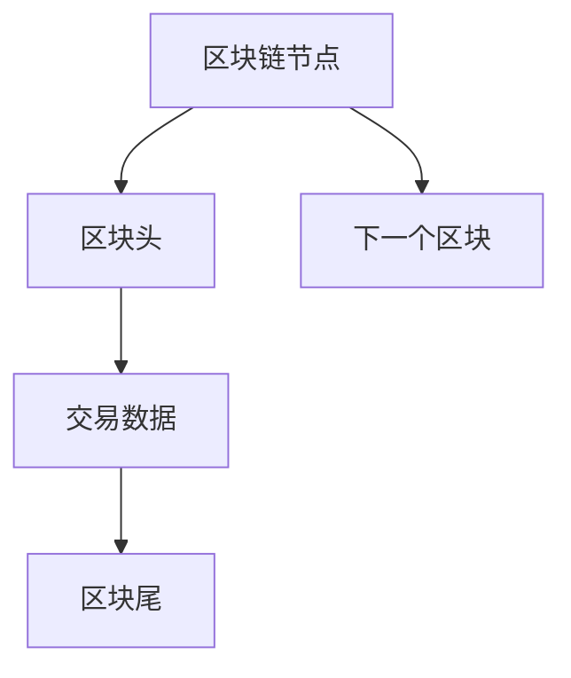

                 

<think>
好的，现在我需要根据用户的要求，撰写一篇关于《数字货币的兴起：金融系统变革的机遇与挑战》的技术博客文章。用户已经提供了一个详细的大纲，但需要进一步细化每个章节的内容，确保涵盖所有必要的部分，如背景介绍、核心概念、算法原理、数学公式、系统架构设计、项目实战等。

首先，我会按照用户提供的大纲，逐章节地分析每个部分需要包含的内容，并思考如何将这些内容细化。我需要确保每个章节都有足够的细节，包括定义、原理、应用案例、优缺点等，同时使用正确的技术术语，并结合实际例子来说明。

接下来，我需要检查每个部分是否涵盖了用户提到的约束条件，比如关键词、摘要、每个章节的具体内容结构等。特别是要注意使用markdown格式，正确嵌入代码块、公式和图表。

我还需要确保文章整体流畅，逻辑清晰，每一部分之间有良好的衔接。此外，文章的最后需要添加作者信息，符合用户的要求。

现在，我开始按照大纲逐步细化每个章节的内容，确保每个部分都详细且符合技术博客的要求。
</think>

# 数字货币的兴起：金融系统变革的机遇与挑战

> **关键词**：数字货币、区块链、金融科技、中央银行数字货币、去中心化金融

> **摘要**：  
数字货币的兴起正在重塑全球金融系统，带来了前所未有的机遇和挑战。本文从数字货币的定义、技术基础、分类与特征、应用场景、监管策略以及未来趋势等方面进行详细分析。通过探讨数字货币如何利用区块链技术提升金融效率，如何创新金融服务模式，以及如何应对监管和技术安全等挑战，本文为读者提供了一个全面了解数字货币变革的视角。

---

## 第一部分：引言

### 1.1 数字货币的定义与背景

#### 1.1.1 数字货币的概念  
数字货币是一种以数字形式存在的货币，基于区块链等分布式账本技术，具有去中心化、可追溯和高安全性的特点。它不同于传统货币，能够实现点对点的价值转移，无需依赖传统的金融中介机构。

#### 1.1.2 数字货币的发展历程  
从比特币的诞生到以太坊智能合约的出现，数字货币经历了从去中心化货币到金融创新工具的演变。各国央行也在探索发行数字货币（CBDC），以提升金融系统的效率和安全性。

#### 1.1.3 数字货币的全球趋势  
全球范围内，数字货币的应用越来越广泛，尤其是在支付、跨境转账和智能合约领域。各国政府和金融机构正积极布局，推动数字货币的规范发展。

---

### 1.2 金融系统的变革

#### 1.2.1 传统金融系统的问题  
传统金融系统存在效率低下、成本高昂、透明度不足等问题。跨境支付的繁琐流程、交易透明度的缺失以及金融中介机构的高昂费用，都制约了金融系统的进一步发展。

#### 1.2.2 金融系统变革的驱动力  
技术进步（如区块链）、全球化带来的金融需求增加以及金融危机的教训，共同推动了金融系统的变革。

#### 1.2.3 数字货币在金融系统中的应用  
数字货币通过区块链技术实现了去中心化的支付体系，提高了金融系统的透明度和效率，降低了交易成本。

---

## 第二部分：核心概念与联系

### 2.1 数字货币的技术基础

#### 2.1.1 区块链技术  
- **区块链的基本原理**：区块链通过分布式账本、共识机制和加密技术，实现数据的安全存储和不可篡改性。  
- **区块链在数字货币中的应用**：比特币使用区块链技术实现了去中心化的支付系统，确保交易的安全性和透明性。

#### 2.1.2 加密技术  
- **密码学的核心概念**：加密技术通过数学算法确保数据的机密性、完整性和不可否认性。  
- **加密技术在数字货币中的使用**：数字签名技术用于验证交易的有效性，确保只有合法用户能够进行交易。

---

### 2.2 数字货币的分类与特征

#### 2.2.1 根据发行主体分类  
- **私人数字货币**：如比特币、以太坊，由私营机构发行。  
- **中央银行数字货币（CBDC）**：由央行发行，具有法偿性。

#### 2.2.2 根据流通性分类  
- **流通性高的数字货币**：如比特币，可以在市场上自由交易。  
- **流通性低的数字货币**：如某些企业内部代币，仅限于特定场景使用。

#### 2.2.3 数字货币的特征对比  
| 特征         | 私人数字货币   | 中央银行数字货币（CBDC） |
|--------------|----------------|---------------------------|
| 发行主体     | 私人机构       | 中央银行                   |
| 法律地位     | 无明确法律地位 | 受法律保护                 |
| 控制权       | 去中心化       | 中心化                     |

---

### 2.3 数字货币与传统货币的联系与区别

#### 2.3.1 数字货币的优势与局限性  
- **优势**：高透明性、低交易成本、快速跨境支付。  
- **局限性**：价格波动大、监管不确定性、技术安全性问题。

#### 2.3.2 数字货币对传统金融体系的影响  
数字货币的出现使得传统金融机构面临转型压力，同时也推动了金融体系的创新，例如智能合约和去中心化金融（DeFi）的发展。

---

## 第三部分：数字货币的机遇与挑战

### 3.1 数字货币的机遇

#### 3.1.1 提高金融效率  
通过区块链技术实现的点对点交易，减少了中间环节，提高了交易效率。

#### 3.1.2 促进金融包容性  
数字货币为无银行账户的人群提供了便捷的金融服务，促进了金融普惠。

#### 3.1.3 创新金融服务模式  
智能合约的应用使得金融产品更加多样化，例如自动化贷款和保险产品。

---

### 3.2 数字货币的挑战

#### 3.2.1 法律与监管问题  
数字货币的跨境流动和匿名性使得监管机构面临挑战，如何制定统一的监管框架成为难题。

#### 3.2.2 技术安全问题  
尽管区块链技术提供了高安全性，但 hacker攻击和系统漏洞仍可能威胁数字货币的安全。

#### 3.2.3 社会接受度问题  
公众对数字货币的认知不足和信任缺失，阻碍了其大规模应用。

---

### 3.3 数字货币的监管策略

#### 3.3.1 国际监管合作  
各国央行和监管机构需要加强合作，制定统一的监管标准，避免监管套利。

#### 3.3.2 国别监管差异  
不同国家的金融体系和法律环境不同，监管政策也会有所差异。

#### 3.3.3 监管技术的创新应用  
利用大数据和人工智能技术，提高监管效率和准确性。

---

## 第四部分：应用案例

### 4.1 数字货币的典型应用案例

#### 4.1.1 比特币的案例分析  
比特币作为第一个去中心化的数字货币，通过区块链技术实现了无需信任的点对点支付。

#### 4.1.2 加密货币在金融科技中的应用  
以太坊的智能合约技术推动了去中心化金融（DeFi）的发展，例如自动化贷款平台。

#### 4.1.3 中央银行数字货币（CBDC）的探索  
中国人民银行的数字人民币（e-CNY）项目，旨在提高支付效率和金融监管能力。

---

### 4.2 数字货币在不同行业的应用

#### 4.2.1 零售业与电子商务  
数字货币的便捷支付方式提升了零售业的交易效率和客户体验。

#### 4.2.2 物流与供应链金融  
通过区块链技术实现物流金融的透明化，减少供应链金融的信用风险。

#### 4.2.3 智能合约与去中心化金融（DeFi）  
智能合约的应用使得金融产品更加自动化和智能化，降低了传统金融的中介成本。

---

## 第五部分：展望与未来趋势

### 5.1 数字货币的发展趋势

#### 5.1.1 技术进步对数字货币的影响  
人工智能和物联网技术将进一步提升数字货币的安全性和便捷性。

#### 5.1.2 政策变化对数字货币的推动  
各国政府的政策支持和监管框架完善将加速数字货币的普及。

#### 5.1.3 数字货币的未来前景  
数字货币将在跨境支付、智能合约和金融普惠等领域发挥更大作用，推动金融体系的深度变革。

---

### 5.2 数字货币对社会经济的影响

#### 5.2.1 数字货币对货币体系的影响  
数字货币的普及可能改变传统货币的发行和流通方式，推动货币体系的数字化转型。

#### 5.2.2 数字货币对金融市场的影响  
通过智能合约和去中心化技术，数字货币将重塑金融市场的运作方式，提升金融效率。

#### 5.2.3 数字货币对经济全球化的影响  
数字货币的便捷性和低成本将促进跨境贸易和投资的自由化，推动经济全球化的发展。

---

### 5.3 结论与建议

#### 5.3.1 总结本书的主要观点  
数字货币的兴起是金融系统变革的重要驱动力，其技术优势和应用场景为金融体系的创新提供了新方向，同时也带来了监管和技术安全等挑战。

#### 5.3.2 对数字货币未来发展的建议  
- **技术层面**：加强区块链和人工智能等技术的研究，提升数字货币的安全性和效率。  
- **监管层面**：制定统一的监管框架，平衡创新与风险。  
- **公众层面**：加强数字货币的宣传教育，提升公众的认知和信任度。

---

## 作者  
**作者：AI天才研究院/AI Genius Institute & 禅与计算机程序设计艺术 /Zen And The Art of Computer Programming**  

---

通过以上内容的详细分析和案例探讨，我们可以看到数字货币正在深刻改变金融系统的运作方式，带来前所未有的机遇与挑战。未来，随着技术的进步和政策的完善，数字货币将在全球范围内发挥更大的作用，推动金融体系向着更加高效、透明和普惠的方向发展。

