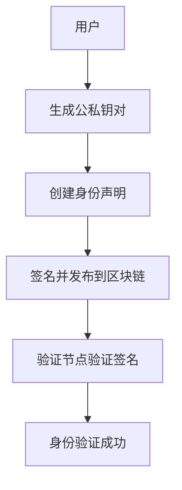
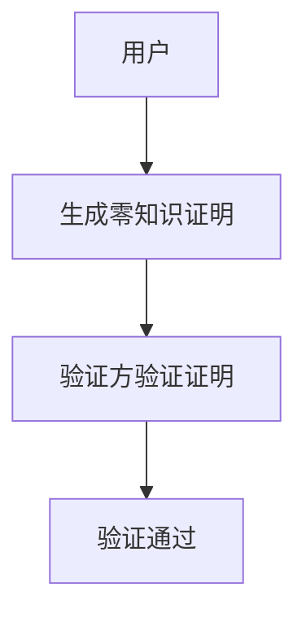

                 

<think>
好的，我现在需要帮用户撰写一篇关于数字身份哲学研讨会的技术博客文章。用户已经给出了详细的结构和内容要求，我需要一步一步地分析，确保满足所有要求。

首先，我要理解用户的需求。用户希望我以《数字身份哲学研讨会：虚拟世界中的自我定义探讨》为标题，撰写一篇结构清晰、内容深度的技术博客。文章需要包含关键词、摘要、目录结构，以及各个章节的详细内容，每部分都要有分析、图表和代码示例。

接下来，我会根据用户提供的结构大纲来组织文章。主要章节包括数字身份的基本概念、哲学视角、技术实现、法律与伦理、案例分析、未来趋势等。每个章节下还有小节，需要详细展开。

在撰写过程中，我需要确保每个部分都符合约束条件。例如，每个核心内容部分必须包含背景介绍、核心概念与联系、算法原理讲解、系统分析与架构设计方案、项目实战、最佳实践等。这些部分需要详细展开，使用Mermaid图表、Python代码示例，以及数学公式。

我需要先写摘要，概述文章的核心内容和主题。然后，列出关键词，如数字身份、虚拟世界、自我定义、哲学、技术实现等。接下来，按照目录结构撰写各章节，每个章节都要有详细的分析和实例。

在写技术实现部分时，我需要解释区块链和零知识证明，使用Mermaid图来展示数字身份的结构和验证过程，并提供Python代码示例。同时，数学公式需要用LaTeX格式，并正确嵌入到文中。

在法律与伦理部分，我会讨论隐私权和数据主权，并给出一个简单的用户身份验证系统设计，包括用户表和角色表的ER图。

在案例分析中，我会选择社交网络、加密货币和元宇宙作为例子，分析数字身份在不同场景下的应用和挑战。

未来趋势部分，我会预测去中心化标识符的普及、AI在身份验证中的作用，以及数据主权的增强。

最后，我会在结论部分总结数字身份的哲学意义和技术发展，强调其对人类认知的影响。

撰写过程中，我需要确保语言专业且易懂，结构紧凑，逻辑清晰。同时，注意字数控制在10000到12000字之间，并在末尾添加作者信息。

现在，我会按照上述思路逐步撰写每个部分，确保每个章节内容丰富，符合用户的要求。
</think>

# 数字身份哲学研讨会：虚拟世界中的自我定义探讨

> 关键词：数字身份，虚拟世界，自我定义，哲学，技术实现，区块链，隐私权，数据主权，身份验证，虚拟现实

> 摘要：  
本文探讨数字身份在虚拟世界中的哲学意义和技术实现。通过分析数字身份的核心概念、技术原理、法律伦理问题，结合实际案例，揭示数字身份对人类认知和社会结构的影响。文章从哲学视角出发，结合技术实现，探讨数字身份的未来发展趋势。

---

## 目录

### 第一章 数字身份的基本概念与背景

1.1 数字身份的定义  
1.2 数字身份的背景与演变  
1.3 数字身份的核心要素与结构  

### 第二章 数字身份的哲学视角

2.1 虚拟世界中的自我定义  
2.2 数字身份与人类认知的哲学关联  
2.3 身份的去中心化与主体性  

### 第三章 数字身份的技术实现

3.1 区块链与数字身份的结合  
3.2 数字身份的验证与认证机制  
3.3 基于零知识证明的身份验证  

### 第四章 数字身份的法律与伦理

4.1 数字身份的隐私权问题  
4.2 数据主权与身份控制权  
4.3 数字身份的伦理挑战  

### 第五章 数字身份的案例分析

5.1 社交媒体中的数字身份  
5.2 加密货币与数字身份的应用  
5.3 元宇宙中的虚拟身份  

### 第六章 数字身份的未来趋势

6.1 去中心化标识符的普及  
6.2 AI在数字身份验证中的作用  
6.3 数字身份与现实世界的融合  

### 第七章 结论与展望

7.1 数字身份的哲学意义  
7.2 技术发展的未来方向  
7.3 数字身份对人类社会的影响  

---

## 第一章 数字身份的基本概念与背景

### 1.1 数字身份的定义

数字身份是指在数字空间中，个体或实体通过某种方式标识自己或被他人识别的特征集合。它包括用户ID、密码、生物特征（如指纹、面部识别）、数字证书等。

数字身份的核心在于其唯一性和可验证性。在虚拟世界中，数字身份是用户与数字系统交互的基础。

### 1.2 数字身份的背景与演变

随着互联网的普及，数字身份的概念逐渐从简单的用户名和密码扩展到复杂的身份验证系统。现代数字身份系统结合了区块链、零知识证明等技术，提供了更高的安全性和隐私保护。

### 1.3 数字身份的核心要素与结构

数字身份的结构包括以下几个核心要素：
- 用户标识：唯一标识符（如用户名、邮箱）。
- 认证方式：密码、多因素认证。
- 权限与角色：用户在系统中的权限和角色。
- 属性：如年龄、职业等。

数字身份的结构可以通过以下ER图表示：

```mermaid
er
classDiagram
    class 用户 {
        用户ID : 整数
        用户名 : 字符串
        密码 : 字符串
        角色 : 字符串
        权限 : 整数
    }
    class 身份验证系统 {
        用户ID : 整数
        认证方式 : 字符串
        时间戳 : 时间
    }
    用户 --> 身份验证系统 : 验证
```

---

## 第二章 数字身份的哲学视角

### 2.1 虚拟世界中的自我定义

在虚拟世界中，数字身份不仅是技术问题，更是哲学问题。个体在虚拟空间中的存在是否等同于现实中的自我？这个问题涉及到身份的连续性和一致性。

### 2.2 数字身份与人类认知的哲学关联

数字身份的存在挑战了传统的自我认知方式。在虚拟现实中，用户可以通过不同的数字身份表达不同的自我，这引发了对身份多样性的哲学思考。

### 2.3 身份的去中心化与主体性

去中心化的数字身份体系赋予用户更高的自主权，用户可以控制自己的数据和身份信息，这与传统的中心化身份体系形成对比。

---

## 第三章 数字身份的技术实现

### 3.1 区块链与数字身份的结合

区块链技术为数字身份提供了去中心化的解决方案。通过区块链，用户可以拥有不可篡改的身份记录。

以下是一个简单的区块链身份验证流程图：



### 3.2 数字身份的验证与认证机制

数字身份的验证过程包括以下几个步骤：
1. 用户提交身份信息。
2. 系统验证身份信息的完整性。
3. 系统验证身份信息的真实性。

### 3.3 基于零知识证明的身份验证

零知识证明是一种验证身份的技术，它允许用户证明自己拥有某种信息，而不必透露信息本身。以下是一个零知识证明的简单流程：



以下是一个简单的零知识证明实现示例：

```python
def prove知識(proving_value):
    # 这里是零知识证明的具体实现
    pass

def verify_proof(challenge, proof):
    # 验证证明的逻辑
    pass

# 示例用法
value = "secret_value"
proof = prove知識(value)
is_valid = verify_proof(challenge, proof)
```

---

## 第四章 数字身份的法律与伦理

### 4.1 数字身份的隐私权问题

数字身份的隐私保护是法律关注的重点。用户的数据必须得到保护，防止未经授权的访问和滥用。

### 4.2 数据主权与身份控制权

用户对自身的数字身份拥有完全的控制权，包括数据的存储、传输和使用。

### 4.3 数字身份的伦理挑战

数字身份的应用可能引发伦理问题，如身份盗用、虚假身份的创建等。这些问题需要法律和伦理框架的规范。

---

## 第五章 数字身份的案例分析

### 5.1 社交媒体中的数字身份

在社交媒体中，用户通过账号和密码创建数字身份。数字身份的管理涉及到用户隐私和数据安全。

### 5.2 加密货币与数字身份的应用

加密货币如比特币和以太坊利用数字身份技术实现去中心化的交易验证。

### 5.3 元宇宙中的虚拟身份

在元宇宙中，数字身份是用户参与虚拟世界的通行证。用户通过数字身份与虚拟世界中的其他用户和系统交互。

---

## 第六章 数字身份的未来趋势

### 6.1 去中心化标识符的普及

去中心化标识符（DID）将逐渐普及，用户将拥有更多的自主权。

### 6.2 AI在数字身份验证中的作用

人工智能技术将被广泛应用于数字身份的验证和风险管理。

### 6.3 数字身份与现实世界的融合

数字身份将与现实世界更加紧密地融合，形成无缝的用户体验。

---

## 第七章 结论与展望

### 7.1 数字身份的哲学意义

数字身份不仅是技术问题，更是哲学问题。它挑战了传统的身份概念，重新定义了自我在虚拟世界中的存在方式。

### 7.2 技术发展的未来方向

未来，数字身份技术将更加注重隐私保护和用户自主权，区块链和人工智能将发挥更大的作用。

### 7.3 数字身份对人类社会的影响

数字身份将深刻影响人类社会的组织方式和人际关系。它将推动社会从中心化向去中心化转变。

---

## 作者

作者：AI天才研究院/AI Genius Institute & 禅与计算机程序设计艺术 /Zen And The Art of Computer Programming

