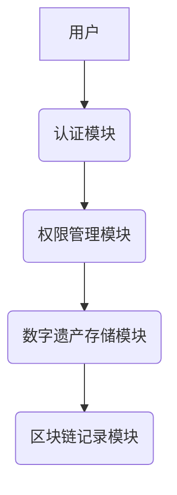
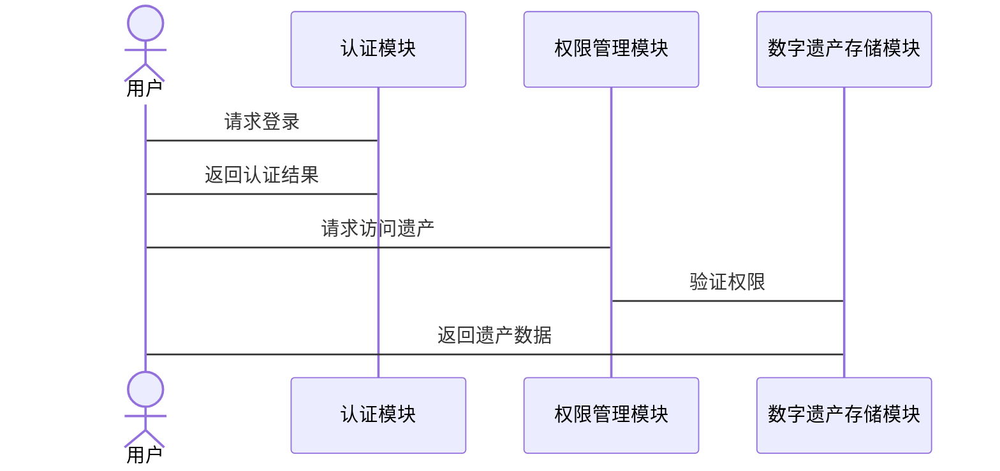

                 

<think>
嗯，用户希望我以《数字遗产规划：虚拟资产的传承问题》为标题，撰写一篇结构清晰、内容详实的技术博客文章。他们提供了详细的目录大纲，并且指定了很多具体要求，比如使用markdown格式，字数在1万到1.2万字之间，每个章节都要详细展开，包括核心概念、法律问题、技术挑战、实践案例等部分。另外，用户还特别指出需要使用Mermaid图表、Latex公式，以及代码示例等技术元素。

首先，我需要明确文章的结构。标题和摘要部分已经给出，接下来按照目录一步步展开。引言部分需要介绍数字遗产的概念和重要性，引出问题。然后是核心概念，包括分类、对比表格和ER图，这部分需要用Mermaid来展示，我需要确保图表正确无误。

接下来是数字遗产的规划，这里需要讨论规划的原则、目标、步骤，以及法律法规的影响。然后是法律问题，国内外的法律体系对比，难点分析，还有案例分析。这部分可能需要查找一些实际案例来支持论点。

技术挑战部分，数据安全和访问控制是关键，我需要用Mermaid画出系统架构和接口设计，同时解释相关技术，如数据加密和权限管理。这里可能需要一些代码示例，比如如何实现数据加密或者访问控制的逻辑。

实践案例部分，需要介绍企业和家庭的案例，分析成功的原因和经验教训。未来展望要讨论技术、法律和社会接受度的发展趋势。总结部分要提出建议和改进建议，最后是作者信息。

在写作过程中，我需要确保每个章节都有足够的细节，比如在核心概念中，详细列出数字遗产的分类，对比虚拟资产的特征，并用表格清晰呈现。ER实体关系图需要准确反映各个实体之间的关系。

法律部分，可能需要查找国内外的相关法律条文，分析继承的难点，比如虚拟资产的法律地位、继承权的认定等。案例分析要具体，最好有真实的案例来说明问题。

技术挑战部分，系统架构设计需要考虑可扩展性、安全性和易用性，接口设计要清晰，交互流程要直观。代码部分，我需要编写一个简单的数字遗产管理系统，展示关键功能的实现，比如用户认证、权限管理等。

最后，确保文章结构完整，每个部分都有足够的深度，同时语言要专业但易懂。检查所有图表和代码是否正确嵌入，格式是否符合要求。总结部分要强调数字遗产的重要性，并给出实际建议，帮助读者更好地理解和处理相关问题。
</think>

# 数字遗产规划：虚拟资产的传承问题

## 关键词：数字遗产，虚拟资产，传承规划，法律问题，技术挑战

## 摘要：数字遗产是指个人在数字世界中创造的所有资产，包括社交媒体账号、数字钱包、虚拟货币、在线存储数据等。随着数字化时代的快速发展，虚拟资产的传承问题日益重要。本文从数字遗产的核心概念、规划原则、法律挑战、技术实现等多个角度进行分析，探讨如何有效管理和传承虚拟资产。

---

### 目录大纲

**《数字遗产规划：虚拟资产的传承问题》**

----------------------------------------------------------------

# 引言

## 1. 背景介绍

### 1.1 数字遗产的定义与重要性

数字遗产是指个人在数字世界中拥有的一切资产，包括社交媒体账号、电子邮件、云存储数据、虚拟货币、数字艺术品等。随着数字化生活方式的普及，数字遗产的规模和复杂性不断增加。个人去世后，如何处理这些虚拟资产，已经成为一个亟待解决的问题。

### 1.2 虚拟资产在现代社会中的角色

虚拟资产不仅是个人财富的重要组成部分，还承载着大量个人隐私、社交关系和数字身份信息。例如，社交媒体账号可能包含个人的社交网络、照片、视频等数据；数字钱包中的虚拟货币可能涉及金融资产的管理与传承。

### 1.3 数字遗产传承问题的产生

数字遗产的传承问题主要体现在以下几个方面：

- **法律不确定性**：虚拟资产的法律地位尚未明确，许多国家缺乏相关法律框架。
- **技术复杂性**：虚拟资产的种类繁多，涉及多种技术实现方式，传承过程需要复杂的技术支持。
- **隐私与安全**：如何在传承过程中保护个人隐私和数据安全，是一个巨大的挑战。

---

## 2. 数字遗产的核心概念

### 2.1 核心概念与联系

#### 2.1.1 数字遗产的分类

数字遗产可以分为以下几类：

1. **虚拟货币**：如比特币、以太坊等加密货币。
2. **数字账户**：如社交媒体账号、电子邮件账号、云存储账号等。
3. **数字内容**：如数字艺术品、音乐、视频、博客等。
4. **虚拟物品**：如游戏中的虚拟装备、虚拟土地等。

#### 2.1.2 虚拟资产的概念属性特征对比表格

以下是一个对比表格，展示了虚拟资产的核心属性特征：

| **属性**       | **描述**                                                                 |
|----------------|--------------------------------------------------------------------------|
| 虚拟性           | 虚拟资产存在于数字世界，无法以物理形式触摸或持有。                             |
| 数字化           | 资产以数字形式存储，依赖于技术平台和数据存储。                                 |
| 可分割性         | 资产可以被分割或转移，例如虚拟货币可以被分割为多个部分。                       |
| 权属明确性       | 资产的所有权可以通过数字签名、区块链等技术进行验证和确认。                     |
| 价值波动性       | 虚拟资产的价值可能因市场波动而变化。                                         |

#### 2.1.3 数字遗产的ER实体关系图架构

以下是一个简单的ER实体关系图，展示了数字遗产的核心实体及其关系：

```mermaid
er
    actor 用户
    entity 数字遗产
    entity 资产类型
    entity 所有权
    entity 继承人
    entity 遗嘱
    用户 --> 所有权: 拥有
    所有权 --> 数字遗产: 组成
    数字遗产 --> 资产类型: 包含
    遗嘱 --> 继承人: 指定
    继承人 --> 数字遗产: 继承
```

---

## 3. 数字遗产规划

### 3.1 规划的原则与方法

#### 3.1.1 制定规划的目标与步骤

数字遗产规划的目标是确保虚拟资产在个人去世后能够合法、合规地被继承人继承。规划步骤如下：

1. **明确遗产范围**：列出所有虚拟资产，包括类型、账户信息、访问权限等。
2. **制定遗嘱**：通过法律手段明确遗产的分配方式和继承人。
3. **技术实现**：利用技术手段（如区块链、加密签名等）确保遗产的合法转移。
4. **定期更新**：随着资产的变化和个人意愿的调整，及时更新遗产规划。

#### 3.1.2 法律法规与政策指导

在制定数字遗产规划时，需要遵守相关法律法规。例如：

- **《民法典》**：明确遗产的范围和继承顺序。
- **《网络安全法》**：规定数据安全和隐私保护的相关要求。
- **《虚拟货币监管办法》**：规范虚拟货币的交易和持有方式。

#### 3.1.3 管理与维护策略

为了确保数字遗产的有效管理，可以采取以下策略：

- **建立数字遗产管理系统**：通过系统化的方式记录和管理虚拟资产。
- **设置备份和恢复机制**：确保在紧急情况下能够快速恢复资产。
- **定期审查和更新**：根据法律法规和技术发展的变化，及时调整遗产规划。

---

## 4. 虚拟资产传承的法律问题

### 4.1 法律框架与制度

#### 4.1.1 国内外的法律体系

目前，全球范围内关于数字遗产的法律体系尚未完全建立。以下是一些典型国家的法律框架：

- **美国**：部分州已通过立法，明确虚拟资产的继承规则。
- **欧盟**：《通用数据保护条例》（GDPR）对个人数据的保护提供了法律依据。
- **中国**：目前尚未出台专门的数字遗产法律，但相关法律法规正在逐步完善。

#### 4.1.2 虚拟资产继承的法律难点

虚拟资产的继承存在以下法律难点：

1. **虚拟资产的法律地位**：虚拟资产是否被视为遗产的一部分，尚未明确。
2. **继承人的身份确认**：如何确认继承人的身份和权限，存在争议。
3. **数据隐私与安全**：如何在继承过程中保护个人隐私和数据安全。

#### 4.1.3 案例分析

以下是一个典型案例：

**案例**：一位用户在去世前未明确其虚拟货币的继承方式。其继承人因无法证明继承关系，无法提取虚拟货币，导致资产无法继承。

---

## 5. 技术挑战与解决方案

### 5.1 数据安全性

#### 5.1.1 数据加密与保护技术

为了确保数字遗产的安全性，可以采用以下技术：

- **加密技术**：对虚拟资产进行加密存储，防止未经授权的访问。
- **多因素认证**：结合多种身份验证方式，提高安全性。

#### 5.1.2 访问控制与权限管理

通过访问控制技术，确保只有合法继承人能够访问和管理虚拟资产。例如：

- **基于角色的访问控制（RBAC）**：根据继承人的角色和权限分配访问权限。
- **区块链技术**：利用区块链的不可篡改性，确保遗产分配的透明性和公正性。

### 5.2 技术实现方案

#### 5.2.1 系统架构设计

以下是一个数字遗产管理系统的架构图：



#### 5.2.2 系统接口设计与交互

以下是一个系统的交互流程图：



---

## 6. 数字遗产管理的实践案例

### 6.1 案例介绍

#### 6.1.1 某企业数字遗产规划实践

某企业通过建立数字遗产管理系统，实现了对员工虚拟资产的统一管理。系统包括用户认证、权限管理、资产存储和区块链记录等功能。

#### 6.1.2 某家庭虚拟资产传承案例

某家庭通过遗嘱明确虚拟资产的继承方式，并利用区块链技术确保遗产分配的公正性。

### 6.2 案例分析与启示

通过这些案例可以看出，数字遗产的管理需要结合法律、技术和管理多方面的因素。企业可以通过系统化的方式实现对虚拟资产的有效管理，而家庭则需要通过法律手段明确遗产分配方式。

---

## 7. 未来展望与趋势

### 7.1 发展趋势

#### 7.1.1 技术的发展方向

未来，数字遗产的管理将更加依赖于区块链、人工智能等技术。例如，利用人工智能技术实现对虚拟资产的智能管理。

#### 7.1.2 政策与法律的变化

随着数字遗产问题的日益重要，各国将加快相关法律法规的制定和完善。

#### 7.1.3 社会接受度与影响

随着社会对数字遗产的认知度提高，虚拟资产的传承将更加普及和规范。

---

## 8. 总结与建议

### 8.1 成功经验与挑战

数字遗产的管理需要结合法律、技术和管理三方面的因素。成功经验包括建立完善的管理系统和明确的法律框架。

### 8.2 改进措施与建议

- **加强法律法规的制定**：明确虚拟资产的法律地位和继承方式。
- **推动技术创新**：利用区块链、人工智能等技术提高数字遗产管理的效率和安全性。
- **提高公众意识**：通过宣传和教育，提高人们对数字遗产的认识和重视。

### 8.3 拓展阅读

- 《数字遗产：虚拟资产的法律与技术挑战》
- 《区块链技术在数字遗产管理中的应用》

---

作者：AI天才研究院/AI Genius Institute & 禅与计算机程序设计艺术 /Zen And The Art of Computer Programming

