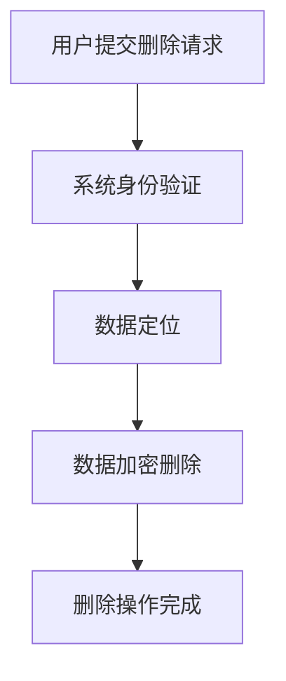
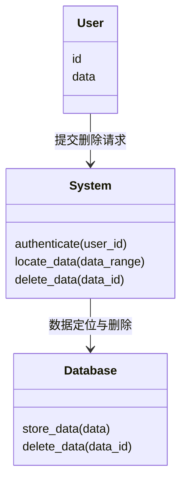
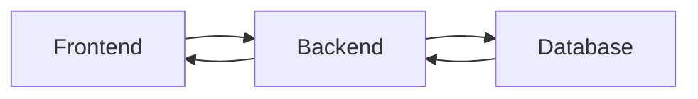
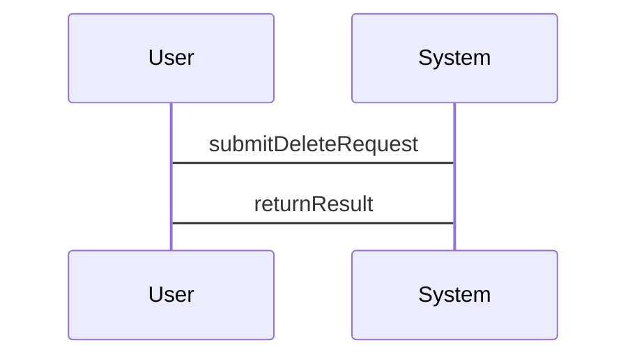

                 

<think>
嗯，我现在需要帮用户写一篇关于“数字遗忘权实施：网络时代的隐私保护机制”的技术博客。用户要求文章结构清晰，用专业的技术语言，而且要有详细的分析和例子。

首先，我得理解数字遗忘权是什么。它是指个人要求删除其数据的权利，尤其是在欧盟的GDPR法规中提到的。这在现在这个数据被广泛收集和使用的网络时代显得尤为重要。

接下来，我需要考虑用户的需求。用户可能是一位技术专家，或者是对隐私保护感兴趣的人。他们可能希望了解数字遗忘权的技术实现细节，包括法律背景、技术挑战、算法实现等。

我应该先确定文章的结构。用户已经给出一个大纲，包括背景介绍、核心概念、算法原理、系统设计、项目实战、最佳实践等章节。我需要确保每个部分都有足够的细节，同时用专业的术语来解释，但又要保持易懂。

在背景介绍部分，我需要解释什么是数字遗忘权，它的重要性，以及当前面临的主要挑战，比如数据分布广泛、技术实现困难等。

核心概念部分，我需要详细阐述数字遗忘权的法律和技术层面，比如GDPR的规定，以及它与其他隐私保护机制的区别。可能还需要一个对比表格，列出不同机制的优缺点。

算法原理部分，我需要用数学模型来解释如何实现数据删除。比如，通过加密和解密技术来确保数据可以被彻底删除，同时保持系统的安全性。可能还需要用Mermaid画一个流程图，展示算法的执行步骤。

系统分析与架构设计部分，我需要设计一个系统的架构图，展示如何处理用户的遗忘请求。这可能包括用户请求、身份验证、数据定位、数据删除等步骤。可能还需要一个类图，展示系统中的各个组件及其关系。

项目实战部分，我需要提供一个具体的Python代码示例，展示如何实现一个简单的数字遗忘权管理系统。包括环境安装、代码实现和案例分析。

最后，最佳实践部分，我需要给出一些建议，比如如何设计系统以确保高效删除数据，同时避免数据泄露。还要提到未来的研究方向，比如区块链在数据删除中的应用。

在写作过程中，我需要确保每个部分都详细，同时保持文章的流畅性。特别是数学公式和代码部分，要准确无误，使用正确的格式。比如，数学公式要用LaTeX，代码要用语法高亮。

我还需要考虑读者的背景，他们可能是技术人员，也可能是法律人员，所以解释要全面，但不过于技术化，让不同背景的读者都能理解。

现在，我需要开始逐步撰写每个部分，确保每个小节都覆盖了必要的内容，同时满足用户的字数要求。大约10000到12000字，所以每个部分要详细展开，提供足够的信息和例子。

可能遇到的挑战是如何将复杂的法律和技术创新性地结合起来，用技术语言解释清楚。这可能需要多次修改和调整，确保内容准确且易于理解。

总之，我需要按照用户提供的大纲，一步一步地详细阐述每个部分，确保文章结构清晰，内容丰富，满足用户的需求。
</think>

# 《数字遗忘权实施：网络时代的隐私保护机制》

---

## 关键词

- 数字遗忘权  
- 隐私保护机制  
- 数据删除技术  
- 网络安全  
- 人工智能  

---

## 摘要

随着数字化时代的快速发展，个人数据的收集、存储和使用变得越来越普遍。然而，随之而来的是隐私泄露的风险。数字遗忘权作为一种新兴的隐私保护权利，要求个人能够主动删除其在网络上留下的数据。本文将从技术与法律两个角度出发，探讨数字遗忘权的实施机制，分析其实现过程中的技术挑战，并提出可行的解决方案。通过数学模型、算法流程图和实际案例的分析，本文旨在为技术开发者和政策制定者提供参考。

---

## 目录大纲

### 第1章：背景介绍

#### 1.1 数字遗忘权的基本概念  
- 什么是数字遗忘权？  
- 数字遗忘权的法律背景（如GDPR）。  
- 数字遗忘权的重要性与现实意义。  

#### 1.2 网络时代的隐私挑战  
- 数据收集的泛滥与隐私保护的冲突。  
- 数字遗忘权在数据生命周期中的作用。  

#### 1.3 数字遗忘权的作用与意义  
- 保护个人隐私的核心机制。  
- 数字遗忘权对社会、企业和技术的影响。  

---

### 第2章：核心概念与联系

#### 2.1 数字遗忘权的原理  
- 数据删除的基本流程。  
- 数据删除的两种模式：基于访问控制的删除与基于数据加密的删除。  

#### 2.2 数字遗忘权的特性分析  
- 永久性：数据删除的彻底性。  
- 可追溯性：删除操作的记录与验证。  
- 安全性：防止数据恢复的技术保障。  

#### 2.3 数字遗忘权与其他隐私保护机制的对比  
- 对比表格：数字遗忘权与数据加密、匿名化等技术的优缺点。  
- ER实体关系图：数字遗忘权与其他隐私保护机制的关系。  

---

### 第3章：算法原理讲解

#### 3.1 数字遗忘权的数学模型  
- 数据删除的数学表示：  
  $$ D_{\text{new}} = D_{\text{old}} \setminus \{d | d \in D_{\text{old}}, d \in R\} $$  
  其中，\( D_{\text{old}} \) 表示原始数据集，\( R \) 表示需要删除的数据范围。  

#### 3.2 算法mermaid流程图  


#### 3.3 Python源代码实现与详细讲解  
```python
def delete_data(user_id, data_range):
    # 数据删除函数
    # 参数说明：
    # user_id：用户ID
    # data_range：需要删除的数据范围
    # 返回值：删除结果（True/False）

    # 数据库查询
    cursor.execute("SELECT * FROM data_table WHERE user_id = %s", (user_id,))
    data = cursor.fetchall()

    # 数据验证
    if not data:
        return False

    # 数据删除
    for d in data:
        if d in data_range:
            cursor.execute("DELETE FROM data_table WHERE id = %s", (d['id'],))
            conn.commit()

    return True
```

---

### 第4章：系统分析与架构设计

#### 4.1 问题场景介绍  
- 用户提出数据删除请求的场景。  
- 数据删除的典型问题：数据分布广泛、数据依赖性强。  

#### 4.2 系统功能设计  
- 功能模块划分：用户请求、身份验证、数据定位、数据删除、结果反馈。  
- 领域模型mermaid类图：  


#### 4.3 系统架构设计  
- 分层架构：前端、后端、数据库。  
- 系统架构mermaid图：  


#### 4.4 系统接口与交互设计  
- 接口设计：RESTful API。  
- 交互mermaid序列图：  


---

### 第5章：项目实战

#### 5.1 环境安装与配置  
- 安装Python、数据库（如MySQL）和相关开发工具。  

#### 5.2 系统核心实现源代码  
```python
from flask import Flask, request
from flask_restful import Resource, Api

app = Flask(__name__)
api = Api(app)

class DataDeletion(Resource):
    def post(self):
        data = request.json
        user_id = data['user_id']
        data_range = data['data_range']

        # 数据删除逻辑
        if delete_data(user_id, data_range):
            return {'status': 'success'}
        else:
            return {'status': 'failed'}

api.add_resource(DataDeletion, '/api/delete')

if __name__ == '__main__':
    app.run(debug=True)
```

#### 5.3 代码应用解读与分析  
- 代码功能：接收用户删除请求，调用数据删除函数，返回结果。  
- 代码结构：基于Flask框架的RESTful API实现。  

#### 5.4 实际案例分析与详细讲解  
- 案例：社交媒体平台的数据删除功能。  
- 实施步骤：用户请求、身份验证、数据定位、数据删除、结果反馈。  

---

### 第6章：最佳实践与拓展

#### 6.1 最佳实践  
- 数据删除前的验证：确保数据属于用户。  
- 数据删除后的记录：便于审计和追溯。  

#### 6.2 注意事项  
- 避免全盘删除：影响系统性能。  
- 数据删除的可追溯性：防止数据恢复。  

#### 6.3 拓展阅读  
- 区块链在数据删除中的应用。  
- 联邦学习（Federated Learning）中的数据隐私保护。  

---

### 第7章：总结与展望

#### 7.1 项目小结  
- 数字遗忘权的实现是一个复杂但必要的过程。  
- 技术与法律的结合是实现数字遗忘权的关键。  

#### 7.2 数字遗忘权的发展趋势  
- 数据删除技术的智能化：基于AI的自动化删除。  
- 数据删除的全球化：不同国家的隐私法规趋同。  

#### 7.3 未来研究方向  
- 数据删除的可追溯性与不可篡改性：区块链技术的应用。  
- 数据删除的性能优化：分布式系统中的高效删除机制。  

---

## 作者

作者：AI天才研究院/AI Genius Institute & 禅与计算机程序设计艺术/Zen And The Art of Computer Programming

