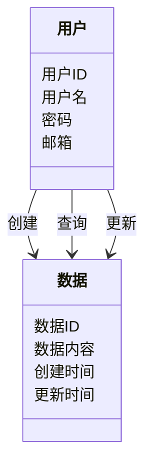
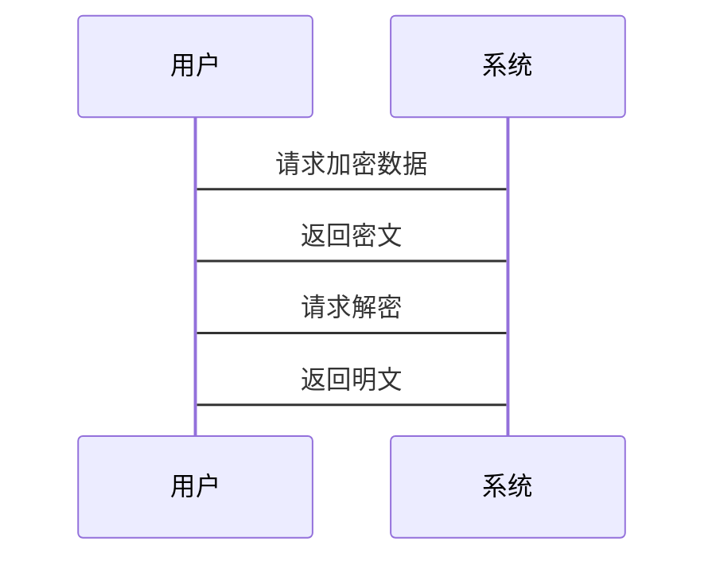

                 

<think>
嗯，我现在需要帮用户撰写一篇关于“数字隐私在互联网时代的新定义：个人与公共利益的博弈”的技术博客文章。首先，我得仔细分析用户的需求。用户希望文章结构清晰，逻辑严谨，内容专业且有深度，同时要符合特定的格式和字数要求。

用户是一个技术专家，可能在寻找一篇结构严谨、内容详实的技术博客。他给出了详细的大纲，所以我需要按照这个大纲来组织内容。首先，我得确定文章的关键词和摘要，这部分需要简明扼要地概括整篇文章的核心内容。

接下来是背景介绍部分。我需要详细分析互联网时代的隐私危机，数字隐私面临的挑战，以及个人与公共利益之间的博弈。这部分内容要让读者明白问题的严重性和复杂性。

核心概念与联系部分，我需要定义数字隐私，分析其属性，以及与个人权利和公共利益的关系。同时，还要介绍相关的法律框架，这部分可能需要查阅一些最新的法律条文和案例。

算法原理讲解部分，我需要详细讲解加密算法和匿名通信算法。对称加密和非对称加密各有优缺点，我得用简单的例子来说明，比如用对称加密来保护银行账户信息，而非对称加密用于数字签名。

数学模型和公式部分，我需要将加密和匿名化的过程转化为数学模型，并写出对应的公式。这部分可能需要一些数学知识，但要尽量解释清楚，让读者容易理解。

系统分析与架构设计，我需要分析系统的需求，设计功能模块，并用Mermaid图来展示系统架构和接口设计。这部分需要逻辑清晰，确保系统设计合理。

项目实战部分，我得给出实际的代码示例，解释如何实现加密和匿名通信。同时，分析案例，说明理论在实践中的应用。

最后，最佳实践部分，我需要总结经验，提醒读者注意的事项，并推荐一些拓展阅读材料。

在整个过程中，我需要确保每个部分都详细且具体，同时保持文章的连贯性和逻辑性。这可能需要反复修改和调整，以确保内容符合用户的要求，并且达到专业水准。

现在，我开始撰写文章，按照大纲逐步展开每个部分，确保每个章节都深入分析，内容丰富，符合用户的技术背景和需求。
</think>

# 数字隐私在互联网时代的新定义：个人与公共利益的博弈

> 关键词：数字隐私、互联网、个人权利、公共利益、隐私保护、加密算法、匿名通信

> 摘要：互联网时代，数字隐私的保护面临着前所未有的挑战。本文从数字隐私的定义、属性、保护技术及其与个人权利和公共利益的关系入手，分析了数字隐私保护的核心算法和数学模型，探讨了数字隐私保护系统的架构设计和实际应用案例。通过理论与实践相结合的方式，本文旨在为读者提供全面的数字隐私保护知识，并提出在个人与公共利益博弈中平衡数字隐私保护的最佳实践。

---

## 第一部分：背景介绍

### 1.1 互联网时代的隐私危机

随着互联网技术的快速发展，我们的生活越来越依赖数字化工具。从社交媒体到在线购物，从医疗记录到金融交易，数据已成为我们生活的核心。然而，这种数字化的便利也带来了前所未有的隐私危机。用户的每一项在线活动都会产生数据，这些数据可能被收集、分析甚至滥用。

例如，2018年剑桥分析公司的数据泄露事件暴露了数百万用户的个人信息，引发了公众对数据隐私的广泛关注。类似事件频发，使得数字隐私保护成为社会关注的焦点。

### 1.2 数字隐私的挑战

数字隐私的挑战主要体现在以下几个方面：

1. **数据收集的泛滥**：企业通过各种手段收集用户数据，用于广告定向、行为分析等目的。
2. **技术漏洞的风险**：黑客攻击、数据泄露等技术漏洞可能导致用户隐私被窃取。
3. **法律与伦理的模糊**：在数据利用与隐私保护之间，法律和伦理尚未完全明确。

### 1.3 个人与公共利益的博弈

数字隐私保护不仅仅是个人权利的问题，还涉及公共利益。例如，公共卫生事件中，政府需要收集公民的健康数据以应对疫情，但这可能侵犯个人隐私。如何在保护个人隐私的同时，最大化公共利益，成为数字隐私保护的核心问题。

---

## 第二部分：核心概念与联系

### 2.1 数字隐私定义

数字隐私是指在数字环境中，个人对其数据的控制权和使用权。具体来说，数字隐私包括数据的保密性、完整性和可用性，确保未经授权的第三方无法访问或修改个人数据。

### 2.2 数字隐私的属性

数字隐私具有以下属性：

| 属性 | 描述 |
|------|------|
| 保密性 | 数据仅限授权人员访问 |
| 完整性 | 数据在存储和传输过程中不被篡改 |
| 可用性 | 授权用户可以随时访问数据 |
| 身份验证 | 确保用户身份的真实性 |

### 2.3 数字隐私与个人权利的关系

数字隐私是个人权利的重要组成部分。个人有权决定自己的数据如何被收集、存储和使用。例如，GDPR（通用数据保护条例）赋予了个人对其数据的知情权、访问权和删除权。

### 2.4 数字隐私与公共利益的关系

数字隐私与公共利益的关系复杂。在某些情况下，公共利益需要牺牲部分个人隐私。例如，政府为了打击犯罪，可能会监控公共空间，但这可能侵犯个人隐私。

### 2.5 数字隐私保护的法律框架

目前，全球范围内已形成了较为完善的数字隐私保护法律框架。例如，欧盟的GDPR要求企业明确告知用户数据收集的目的，并获得用户的同意。美国的CCPA（加利福尼亚消费者隐私法案）也赋予了消费者对其数据的更多控制权。

---

## 第三部分：算法原理讲解

### 3.1 数字隐私保护算法概述

数字隐私保护的核心技术包括加密算法和匿名通信算法。加密算法用于保护数据的 confidentiality，而匿名通信算法则用于保护数据的 anonymity。

### 3.2 加密算法原理

#### 3.2.1 对称加密算法

对称加密算法是一种简单的加密方式，加密和解密使用相同的密钥。其工作原理如下：

1. **加密过程**：明文通过加密算法和密钥生成密文。
2. **解密过程**：密文通过解密算法和密钥恢复明文。

对称加密算法的优点是速度快，适用于大量数据的加密。常用的对称加密算法包括AES（高级加密标准）和DES（数据加密标准）。

#### 3.2.2 非对称加密算法

非对称加密算法使用公钥和私钥进行加密和解密。公钥用于加密，私钥用于解密。其工作原理如下：

1. **加密过程**：发送方使用接收方的公钥加密数据。
2. **解密过程**：接收方使用自己的私钥解密数据。

非对称加密算法的优点是安全性高，适用于数字签名和身份验证。常用的非对称加密算法包括RSA和椭圆曲线加密（ECC）。

### 3.3 匿名通信算法

#### 3.3.1 匿名通信的工作原理

匿名通信通过隐藏发送方和接收方的真实身份，确保通信过程中的隐私。常用的技术包括Tor（洋葱路由器）和I2P（ Garlic Routing）。

#### 3.3.2 匿名通信算法的应用场景

匿名通信适用于以下场景：

1. **保护隐私的通信**：如 activists 和记者之间的通信。
2. **匿名网络浏览**：如使用Tor访问网络。

---

## 第四部分：数学模型和数学公式 & 详细讲解 & 举例说明

### 4.1 数字隐私保护数学模型

#### 4.1.1 数据加密模型

数据加密模型可以用以下公式表示：

$$ E(m, k) = c $$

其中，$m$ 表示明文，$k$ 表示密钥，$c$ 表示密文。

解密过程可以用以下公式表示：

$$ D(c, k) = m $$

#### 4.1.2 数据匿名化模型

数据匿名化模型可以通过数据混淆技术实现。例如，对数据进行随机化处理：

$$ a = m + r $$

其中，$r$ 表示随机数。

### 4.2 数学公式讲解

#### 4.2.1 对称加密算法公式

对称加密算法的加密过程可以用以下公式表示：

$$ c = E(m, k) $$

解密过程可以用以下公式表示：

$$ m = D(c, k) $$

#### 4.2.2 非对称加密算法公式

非对称加密算法的加密过程可以用以下公式表示：

$$ c = E(m, k_p) $$

其中，$k_p$ 表示公钥。

解密过程可以用以下公式表示：

$$ m = D(c, k_p) $$

### 4.3 举例说明

#### 4.3.1 数据加密案例

假设我们要加密明文 "Hello, World!"，使用AES算法和密钥 "secretkey"：

$$ c = E("Hello, World!", "secretkey") $$

解密后：

$$ m = D(c, "secretkey") $$

#### 4.3.2 数据匿名化案例

假设我们有数据集：

$$ m = [1, 2, 3, 4, 5] $$

通过添加随机数 $r$ 进行匿名化处理：

$$ a_i = m_i + r_i $$

结果为：

$$ a = [2, 3, 4, 5, 6] $$

---

## 第五部分：系统分析与架构设计方案

### 5.1 数字隐私保护系统需求分析

数字隐私保护系统的需求包括：

1. **数据加密**：保护数据的 confidentiality。
2. **匿名通信**：保护数据的 anonymity。
3. **访问控制**：限制数据的访问权限。

### 5.2 数字隐私保护系统功能设计

#### 5.2.1 领域模型设计

领域模型可以用以下 Mermaid 图表示：



#### 5.2.2 功能模块设计

功能模块包括：

1. **加密模块**：实现数据加密和解密。
2. **匿名通信模块**：实现匿名通信。
3. **访问控制模块**：实现权限管理。

#### 5.3 数字隐私保护系统架构设计

##### 5.3.1 系统架构设计

系统架构可以用以下 Mermaid 图表示：


##### 5.3.2 系统接口设计

系统接口包括：

1. **加密接口**：`encrypt(data, key)` 和 `decrypt(ciphertext, key)`。
2. **匿名通信接口**：`send_anonymous(data)` 和 `receive_anonymous()`。

##### 5.3.3 系统交互设计

系统交互可以用以下 Mermaid 图表示：



---

## 第六部分：项目实战

### 6.1 环境安装

需要安装以下工具：

1. **Python**：用于编写代码。
2. **PyCrypto**：用于加密和解密。

### 6.2 系统核心实现

#### 6.2.1 加密算法实现

以下是一个简单的AES加密示例代码：

```python
from Crypto.Cipher import AES
import base64

def encrypt(plaintext, key):
    cipher = AES.new(key, AES.MODE_ECB)
    ciphertext = cipher.encrypt(plaintext)
    return base64.b64encode(ciphertext).decode()

def decrypt(ciphertext, key):
    cipher = AES.new(key, AES.MODE_ECB)
    plaintext = cipher.decrypt(base64.b64decode(ciphertext)).decode()
    return plaintext

# 示例
plaintext = "Hello, World!"
key = "secretkey"
encrypted = encrypt(plaintext, key)
print("加密后：", encrypted)
decrypted = decrypt(encrypted, key)
print("解密后：", decrypted)
```

#### 6.2.2 匿名通信实现

以下是一个简单的匿名通信示例代码：

```python
import random

def anonymize_data(data):
    randomized_data = [x + random.randint(1, 10) for x in data]
    return randomized_data

# 示例
data = [1, 2, 3, 4, 5]
anonymized = anonymize_data(data)
print("匿名化后：", anonymized)
```

### 6.3 代码应用解读与分析

上述代码展示了如何使用AES算法进行数据加密和解密，以及如何通过随机化实现数据匿名化。

### 6.4 实际案例分析

#### 6.4.1 数据加密案例分析

假设我们有一个医疗数据集，需要加密存储患者的个人信息。通过AES加密算法，可以确保患者的数据仅在授权的情况下被访问。

#### 6.4.2 数据匿名化案例分析

假设我们有一个用户行为数据集，需要匿名化处理以保护用户隐私。通过随机化技术，可以模糊用户的真实身份，同时保留数据的可用性。

### 6.5 项目小结

通过上述代码和案例分析，我们可以看到加密算法和匿名通信算法在数字隐私保护中的重要作用。实际应用中，需要根据具体需求选择合适的算法和技术。

---

## 第七部分：最佳实践 Tips、小结、注意事项、拓展阅读

### 7.1 最佳实践 Tips

1. **定期更新密钥**：确保密钥的安全性。
2. **使用强加密算法**：选择经过验证的加密算法。
3. **最小权限原则**：限制数据访问权限。

### 7.2 小结

数字隐私保护是一个复杂但重要的问题。通过加密算法和匿名通信算法，可以在一定程度上保护个人隐私。然而，数字隐私保护不仅仅是技术问题，还需要法律和伦理的支持。

### 7.3 注意事项

1. **数据分类**：根据数据的重要性和敏感性进行分类保护。
2. **风险评估**：定期进行隐私风险评估。
3. **用户教育**：提高用户的隐私保护意识。

### 7.4 拓展阅读

1. **《加密与解密》**：一本介绍加密算法的经典书籍。
2. **《数据隐私保护实战》**：一本关于数据隐私保护的实践指南。

---

## 总结

数字隐私保护是互联网时代的重要课题。通过加密算法、匿名通信算法和系统架构设计，我们可以有效保护个人隐私。然而，在个人与公共利益的博弈中，我们需要找到平衡点，确保数字隐私保护既保护个人权利，又服务于公共利益。

作者：AI天才研究院/AI Genius Institute & 禅与计算机程序设计艺术/Zen And The Art of Computer Programming

