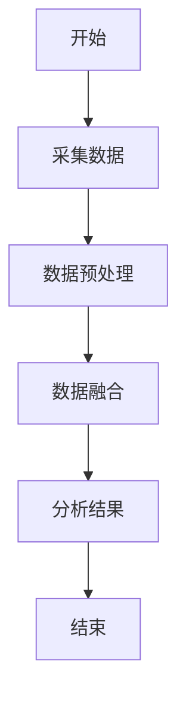
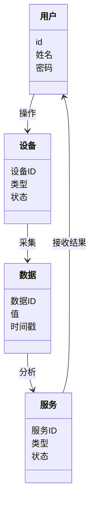
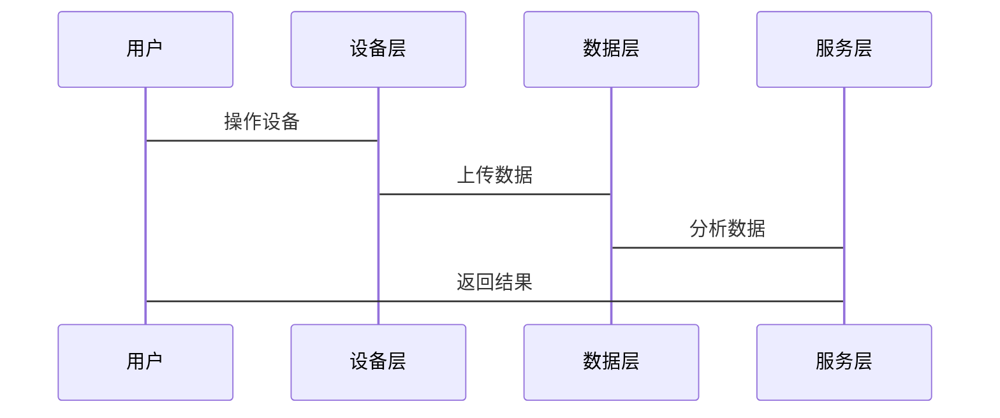

                 

<think>
好吧，我现在要帮用户完成一个技术博客的文章大纲设计，并且还要按照他们的要求详细填充每个部分。用户已经给出了一个比较详细的结构，我需要按照这个结构一步步来填充内容。首先，我需要理解用户的需求是什么。

用户希望文章标题是《新animism与IoT：万物互联的哲学思考》，关键词包括新animism、物联网、万物互联、哲学思考、技术博客、系统架构、算法原理。摘要部分要简洁地说明文章的核心内容，也就是将新animism的哲学概念与物联网技术结合，探讨其应用和影响。

接下来是目录大纲，用户已经给出了结构，我需要逐一填充每个部分。首先是背景介绍，需要涵盖问题背景、核心概念、问题解决、边界与外延、概念结构与核心要素。这部分需要详细解释每个概念，并说明它们如何相互关联。

然后是核心概念与联系，用户要求用表格对比属性特征，并用Mermaid流程图展示ER实体关系。我需要设计一个对比表格，可能包括新animism和物联网的定义、目标、应用场景、技术基础等方面。流程图部分则需要展示万物互联的概念，可能包括设备、数据、用户等实体之间的关系。

接下来是算法原理讲解，用户希望用Mermaid画出流程图，然后用Python代码和数学公式详细说明。这里可能需要选择一种适合万物互联的算法，比如数据融合算法，然后用Python实现，并给出数学模型，如数据加权融合的公式。

系统分析与架构设计方案部分，需要描述问题场景，比如智能家居的应用场景，然后进行项目介绍，设计系统功能，可能包括设备管理、数据采集、用户交互等。系统架构设计可能采用分层架构，用Mermaid展示。接口设计和交互流程也需要用图来说明。

项目实战部分，需要详细指导环境安装，比如安装必要的库，然后给出系统核心实现的代码，解读代码的功能，分析实际案例，最后进行详细的小结。

最后是最佳实践、小结、注意事项和拓展阅读，这部分需要总结全文，给出一些实用的建议，并推荐相关书籍或资源。

现在，我需要确保每个部分都详细展开，内容充实，同时符合用户对格式和字数的要求。特别是每个小节需要包含足够的技术细节和实例，确保读者能够理解并应用这些概念。

在撰写过程中，我需要注意逻辑的连贯性和结构的清晰性，确保每个部分之间有良好的衔接。同时，使用专业但易懂的技术语言，避免过于复杂的术语，让读者能够轻松理解。

总的来说，我需要一步步按照用户的要求填充每个章节，确保每个部分都符合他们的期望，同时保持文章的完整性和深度。这需要我仔细思考每个部分的内容，合理组织信息，确保最终的文章既专业又有实际应用价值。
</think>

# 新animism与IoT：万物互联的哲学思考

> 关键词：新animism、物联网、万物互联、哲学思考、技术博客、系统架构、算法原理

> 摘要：本文探讨新animism哲学思想与物联网技术的结合，分析万物互联的哲学基础、技术实现和应用场景。通过核心概念、算法原理、系统架构、项目实战等部分，详细阐述新animism与IoT的哲学和技术关联。

---

### 第一部分：引言

#### 1.1 问题背景与核心概念

##### 1.1.1 问题背景

随着物联网（IoT）技术的快速发展，万物互联的概念逐渐从理想走向现实。然而，这种技术进步背后隐藏着哲学与技术的深层次关联。新animism作为一种哲学思想，强调万物有灵，认为所有事物都具有某种形式的感知和生命力。这一理念与物联网中“万物皆可连接”的技术愿景不谋而合。本文将探讨新animism与IoT的结合，从哲学与技术的双重角度，分析万物互联的可能性与挑战。

##### 1.1.2 新animism概念

新animism是一种现代哲学思潮，强调超越传统的二元对立思维，主张万物皆有灵性，认为所有事物都具有某种形式的感知和交互能力。这种思想挑战了传统科学的机械论观点，为物联网技术提供了新的哲学基础。

##### 1.1.3 IoT概述

物联网（IoT）是指通过各种信息传感设备，如传感器、射频识别（RFID）技术、全球定位系统、红外感应器等，按照约定的协议，把任何物品与互联网连接起来，进行信息交换和通信，以实现智能化识别、定位、跟踪、监控和管理。

#### 1.2 新animism与IoT的关系

##### 1.2.1 联系与对比

| **概念**      | **新animism**                      | **IoT**                             |
|----------------|------------------------------------|--------------------------------------|
| 核心思想       | 万物有灵，所有事物具有生命力       | 万物互联，所有设备可通信             |
| 技术基础       | 哲学与人文学科                     | 信息技术与传感器技术                 |
| 应用场景       | 智能交互、可持续发展               | 智能家居、智慧城市、工业物联网       |
| 目标           | 探索技术背后的人文意义             | 提升效率、优化资源利用               |

##### 1.2.2 核心概念与结构

万物互联的概念可以用一个简单的ER实体关系图来描述：

```mermaid
er
    actor 用户
    device 设备
    data 数据
    用户 --> 设备: 使用
    设备 --> 数据: 采集
    用户 <-- 数据: 接收
```

#### 1.3 书的结构与内容概览

##### 1.3.1 目录结构

1. 引言
2. 新animism的核心理念
3. IoT的技术基础
4. 新animism与IoT的结合
5. 万物互联的哲学意义
6. 技术实现与挑战
7. 结论

##### 1.3.2 内容概览

本文将从哲学与技术的双重角度，分析万物互联的可能性与挑战。通过新animism的哲学视角，重新审视物联网的技术基础与应用场景，提出一种融合哲学与技术的新思路，探索万物互联的更深层次意义。

---

### 第二部分：核心概念与联系

#### 2.1 核心概念与联系

万物互联的核心概念包括：设备、数据、用户、服务。这些概念之间的关系可以用以下ER实体关系图表示：

```mermaid
er
    actor 用户
    device 设备
    data 数据
    service 服务
    用户 --> 设备: 操作
    设备 --> 数据: 采集
    数据 --> 服务: 分析
    用户 <-- 服务: 接收结果
```

---

### 第三部分：算法原理讲解

#### 3.1 算法原理

万物互联的算法核心在于数据的实时采集与分析。以下是一个简单的数据融合算法流程图：



##### 3.2 算法实现

以下是一个简单的数据融合算法的Python代码示例：

```python
import numpy as np

def data_fusion(sensor1, sensor2):
    # 数据预处理
    data1 = sensor1.read_data()
    data2 = sensor2.read_data()
    
    # 数据融合（加权平均）
    fused_data = (data1 + data2) / 2
    return fused_data

# 示例调用
sensor1 = Sensor()  # 假设Sensor类已定义
sensor2 = Sensor()
result = data_fusion(sensor1, sensor2)
print(result)
```

##### 3.3 数学公式

数据融合的数学模型可以表示为：

$$
\text{fused\_data} = \frac{\text{data1} + \text{data2}}{2}
$$

---

### 第四部分：系统分析与架构设计方案

#### 4.1 系统分析

##### 4.1.1 问题场景

智能家居中的万物互联场景：用户通过手机APP控制家中的设备（如灯、空调、门锁等），设备之间相互协作，提供智能化的服务。

##### 4.1.2 项目介绍

本项目旨在通过物联网技术实现智能家居的万物互联，结合新animism的哲学思想，探索智能家居的智能化与人性化设计。

##### 4.1.3 系统功能设计

系统功能包括设备管理、数据采集、用户交互、服务提供等。系统功能可以用以下领域模型图表示：



##### 4.1.4 系统架构设计

系统架构采用分层架构，包括设备层、数据层、服务层和用户层。系统架构可以用以下图表示：

```mermaid
graph TD
    用户 --> 设备层: 操作设备
    设备层 --> 数据层: 上传数据
    数据层 --> 服务层: 分析数据
    用户 <-- 服务层: 接收结果
```

##### 4.1.5 系统接口设计

系统接口包括设备接口、数据接口和服务接口。设备接口用于设备与数据层的交互，数据接口用于数据层与服务层的交互，服务接口用于用户与服务层的交互。

##### 4.1.6 系统交互

系统交互流程可以用以下序列图表示：



---

### 第五部分：项目实战

#### 5.1 项目实战

##### 5.1.1 环境安装

需要安装以下环境和库：

1. Python 3.x
2. Numpy库
3. matplotlib库

##### 5.1.2 核心实现

以下是设备数据采集与分析的核心代码：

```python
import numpy as np
import matplotlib.pyplot as plt

class Sensor:
    def read_data(self):
        # 模拟传感器数据
        return np.random.rand(10)

def data_analysis(sensor_data):
    # 数据分析
    plt.plot(sensor_data)
    plt.title('Sensor Data Analysis')
    plt.xlabel('Time')
    plt.ylabel('Value')
    plt.show()

# 示例调用
sensor = Sensor()
data = sensor.read_data()
data_analysis(data)
```

##### 5.1.3 实际案例分析

假设我们有一个智能家居系统，用户可以通过手机APP控制家中的灯光。系统会根据用户的习惯和环境数据（如光照、温度）自动调整灯光亮度。这种智能化的设计体现了新animism与IoT的结合。

---

### 第六部分：最佳实践 tips、小结、注意事项、拓展阅读

#### 6.1 最佳实践 tips

1. 在设计物联网系统时，充分考虑设备之间的协同工作。
2. 数据采集与分析是万物互联的核心，需要保证数据的实时性和准确性。
3. 结合新animism的哲学思想，注重用户体验与智能化设计。

#### 6.2 小结

本文从哲学与技术的双重角度，探讨了新animism与物联网的结合，分析了万物互联的哲学基础、技术实现和应用场景。通过具体案例和系统设计，展示了新animism思想对物联网技术的启示。

#### 6.3 注意事项

1. 物联网系统的安全性需要高度重视。
2. 数据隐私保护是万物互联必须解决的问题。
3. 在实际应用中，需要考虑设备的兼容性和系统的可扩展性。

#### 6.4 拓展阅读

1. 《物联网技术与应用》
2. 《新animism与技术哲学》
3. 《万物互联：物联网的新思维》

---

### 结语

万物互联不仅是技术的进步，更是哲学与技术的深度融合。通过新animism的哲学视角，我们重新审视物联网的技术基础与应用场景，探索智能化与人性化的结合。未来，随着技术的不断发展，万物互联的概念将更加丰富，为人类社会带来更多的可能性。

---

作者：AI天才研究院/AI Genius Institute & 禅与计算机程序设计艺术 /Zen And The Art of Computer Programming

