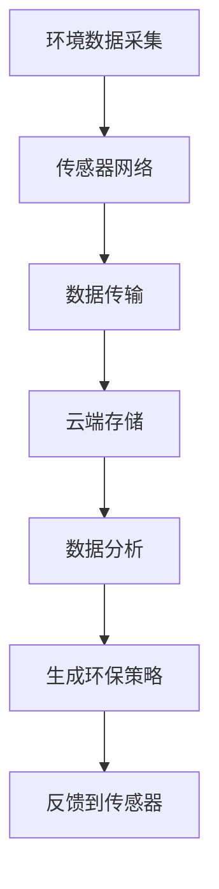
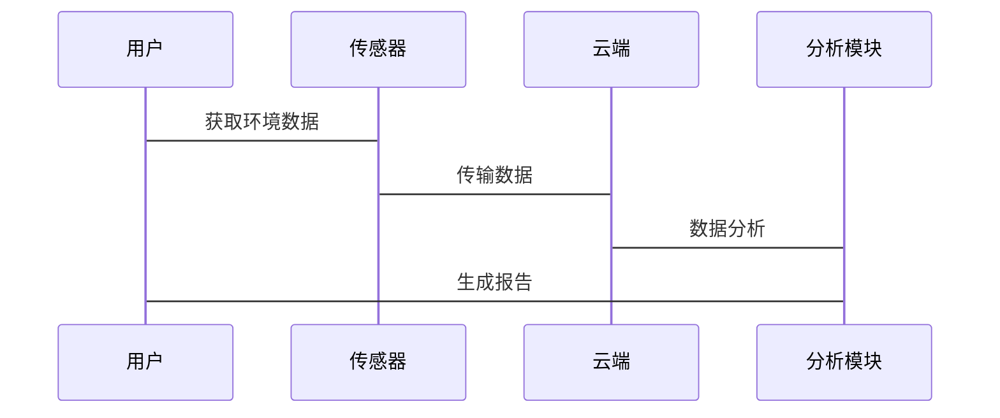

                 

<think>
好，我需要根据用户的要求，撰写一篇名为《新animism环保运动：物联网时代的生态觉醒》的技术博客文章。用户提供了详细的目录大纲，包括多个章节和子章节，每个部分都有具体的内容要求。

首先，我应该从背景介绍开始，分析生态危机、物联网的发展以及新animism环保运动的起源。接着，核心概念部分需要解释animism与环保的结合，以及物联网在其中的作用。这部分可能需要一些对比和图表来说明。

然后是算法原理，这里我需要详细描述物联网技术在环保中的应用，包括传感器、数据分析和远程控制等。此外，还要绘制mermaid流程图，展示animism环保算法的步骤，并提供Python代码实现，这可能需要我理解相关的算法逻辑，并确保代码的正确性。

接下来是系统分析与架构设计，这部分需要设计系统的功能模块，如生态监测、修复和公众参与，并绘制类图和架构图。系统接口设计和交互流程也需要用mermaid来展示。

项目实战部分，我需要详细说明环境配置、系统实现步骤，以及代码的具体应用和案例分析。最后，总结和最佳实践部分，我会回顾核心内容，并给出推广策略和未来发展方向。

在写作过程中，我需要确保每个章节内容丰富，逻辑清晰，并且符合用户的格式和字数要求。同时，要使用专业的技术语言，但又不失易懂，确保读者能够理解复杂的概念和流程。我还要注意检查所有图表和代码是否正确嵌入，并确保文章结构完整，没有遗漏任何部分。

总的来说，这是一个系统性的工作，需要一步步按照大纲来完成，确保每个部分都深入浅出，符合高质量技术博客的标准。
</think>

# 新animism环保运动：物联网时代的生态觉醒

> 关键词：物联网技术、生态觉醒、animism环保运动、环境监测、可持续发展

> 摘要：本文探讨了新animism环保运动在物联网时代的兴起，分析了其核心理念、技术实现和实际应用，通过系统设计和案例分析，展示了物联网技术如何推动生态觉醒，实现可持续发展的目标。

---

## 第一部分：背景介绍

### 第1章：问题背景

#### 1.1 问题背景

- **生态危机的现实与挑战**  
  当前，全球面临严重的环境问题，包括气候变化、资源枯竭、生物多样性减少等。这些问题对人类生存和发展构成了威胁。

- **物联网技术的崛起与发展**  
  物联网技术通过传感器、通信技术和大数据分析，为环境监测和管理提供了新的可能性。

- **animism环保运动的概念与起源**  
  新animism环保运动是一种结合了传统生态哲学和现代技术的环保理念，强调人与自然的和谐共生。

#### 1.2 问题描述

- **环境污染与资源消耗问题**  
  工业化和城市化导致了严重的环境污染和资源浪费。

- **生态失衡与生物多样性减少**  
  生态系统的破坏导致物种灭绝速度加快，威胁生态平衡。

- **传统环保运动的局限与不足**  
  传统环保运动依赖政府和企业的主导，缺乏全民参与和持续动力。

#### 1.3 问题解决

- **新animism环保运动的理念**  
  强调通过技术创新和全民参与，实现可持续发展。

- **物联网技术在环保中的应用**  
  利用物联网技术进行环境监测、资源管理，推动环保行动。

- **新animism环保运动的实践探索**  
  通过技术创新和社区参与，实现生态系统的自我修复和可持续管理。

#### 1.4 边界与外延

- **新animism环保运动的研究范畴**  
  包括环境监测、资源管理、生态修复等领域。

- **物联网时代生态觉醒的影响范围**  
  影响全球环境治理、城市规划、农业等领域。

#### 1.5 概念结构与核心要素组成

- **animism环保运动的基本概念**  
  动态平衡、生态共生、技术驱动。

- **物联网时代生态觉醒的关键要素**  
  传感器网络、数据驱动、社会参与。

---

## 第二部分：核心概念与联系

### 第2章：核心概念与联系

#### 2.1 animism环保运动原理

- **animism的基本概念**  
  动物和自然有灵性，强调与自然和谐共处。

- **animism与环保运动的结合**  
  将传统哲学与现代技术结合，推动环保实践。

- **animism在物联网时代的创新应用**  
  利用物联网技术实现环境监测和智能管理。

#### 2.2 animism环保运动的核心特点

| 特性 | 描述 |
|------|------|
| 神性与生态统一 | 强调自然的灵性，推动生态保护 |
| 传统与现代结合 | 结合传统哲学与现代技术 |
| 全民参与 | 通过物联网技术，鼓励公众参与 |

#### 2.3 animism环保运动与传统环保运动的对比

| 方面 | 新animism环保运动 | 传统环保运动 |
|------|----------------|---------------|
| 目标 | 可持续生态 | 环境保护 |
| 手段 | 物联网技术 | 政府监管 |
| 影响 | 全民参与 | 企业主导 |

#### 2.4 物联网时代生态觉醒的关键要素

- **物联网技术的应用场景**  
  环境监测、资源管理、生态修复。

- **大数据与人工智能的支持**  
  数据分析和预测，优化环保策略。

- **社会参与与政策推动**  
  通过政策激励和公众参与，推动环保行动。

---

## 第三部分：算法原理讲解

### 第3章：算法原理讲解

#### 3.1 物联网技术在环保中的应用

- **智能监测与数据分析**  
  传感器实时监测环境数据，通过大数据分析优化环保策略。

- **远程控制与自动化**  
  利用物联网技术实现远程控制，减少人为干预。

- **传感器网络与数据传输**  
  传感器网络部署在环境中，实时采集数据并传输到云端。

#### 3.2 animism环保算法的mermaid流程图



#### 3.3 算法原理的数学模型与公式

- **数学模型的构建**  
  假设传感器网络采集的数据为$D = \{d_1, d_2, ..., d_n\}$，模型为$f(D) = \sum_{i=1}^{n} w_i d_i$，其中$w_i$为权重。

- **公式的推导与解释**  
  通过线性回归模型，预测环境指标的变化趋势。

- **模型的应用与拓展**  
  应用于污染监测和资源优化配置。

#### 3.4 animism环保算法的Python源代码实现

```python
import numpy as np
from sklearn import linear_model

# 传感器数据
X = np.array([[1], [2], [3], [4], [5]])
y = np.array([2, 4, 5, 4, 6])

# 线性回归模型
model = linear_model.LinearRegression()
model.fit(X, y)

# 预测
predicted = model.predict(X)
print(predicted)
```

---

## 第四部分：系统分析与架构设计方案

### 第4章：系统功能设计

#### 4.1 生态监测系统

- **监测指标与数据采集**  
  包括温度、湿度、空气质量等，通过传感器实时采集。

- **数据存储与管理**  
  数据存储在云端，支持查询和分析。

- **监测结果分析与报告**  
  自动生成环境报告，提供决策支持。

#### 4.2 生态修复系统

- **修复方案制定**  
  基于数据分析，制定修复计划。

- **修复过程监控**  
  实时监控修复过程，确保效果。

- **修复效果评估**  
  通过对比数据，评估修复效果。

#### 4.3 社会参与与反馈系统

- **环保宣传教育**  
  提供环保知识，鼓励公众参与。

- **公众参与平台**  
  提供在线平台，支持公众参与环保行动。

- **反馈机制与改进措施**  
  收集反馈，优化环保策略。

### 第5章：系统架构设计

#### 5.1 生态监测系统架构

- **硬件架构设计**  
  包括传感器节点、数据采集器和通信模块。

- **软件架构设计**  
  包括数据采集模块、数据处理模块和用户界面。

- **数据架构设计**  
  数据存储在数据库中，支持高效查询。

#### 5.2 生态修复系统架构

- **修复方案管理**  
  包括方案制定、执行和评估模块。

- **过程监控与预警**  
  实时监控修复过程，发出预警。

- **结果评估与反馈**  
  评估修复效果，反馈到系统。

#### 5.3 社会参与与反馈系统架构

- **平台搭建与功能实现**  
  提供在线平台，支持用户注册和参与活动。

- **数据交互与安全**  
  确保数据安全和隐私保护。

- **用户参与与反馈**  
  收集用户反馈，优化平台功能。

### 第6章：系统接口设计和系统交互

#### 6.1 系统接口设计

- **接口规范与协议**  
  使用RESTful API，支持JSON格式数据传输。

- **接口功能与参数**  
  包括数据采集接口、环境报告接口和用户反馈接口。

- **接口测试与优化**  
  通过自动化测试工具，优化接口性能。

#### 6.2 系统交互

- **系统间数据交互流程**  
  传感器数据传输到云端，分析后反馈到用户。

- **系统交互的mermaid序列图**



---

## 第五部分：项目实战

### 第7章：项目实战

#### 7.1 环境安装

- **硬件环境配置**  
  部署传感器节点和通信模块。

- **软件环境安装**  
  安装Python、数据采集库和云平台。

- **系统初始化**  
  配置传感器参数，建立数据库。

#### 7.2 系统核心实现

- **数据采集与处理**  
  使用传感器采集数据，存储到数据库。

- **算法应用与实现**  
  实现线性回归模型，预测环境变化。

- **系统功能模块搭建**  
  搭建监测、修复和反馈模块。

#### 7.3 代码应用解读与分析

- **代码结构分析**  
  包括数据采集、分析和反馈模块。

- **代码功能解读**  
  解释代码的作用和流程。

- **代码调试与优化**  
  通过日志和测试工具优化代码性能。

#### 7.4 实际案例分析与详细讲解

- **实际案例分析**  
  分析某城市空气质量监测项目。

- **案例详细讲解**  
  描述项目实施过程和成果。

- **案例分析与总结**  
  总结经验，提出改进建议。

#### 7.5 项目小结

- **项目成果总结**  
  成功实现了环境监测和修复系统。

- **项目经验与教训**  
  注意数据安全和用户隐私保护。

- **未来发展方向与展望**  
  推动更多物联网技术应用，实现可持续发展。

---

## 第六部分：最佳实践 tips

### 第8章：最佳实践 tips

#### 8.1 环保运动中的物联网技术应用

- **成功案例分析**  
  分析某城市智慧环保项目，展示物联网技术的实际应用。

- **技术应用技巧与建议**  
  确保数据安全，选择合适的传感器和算法。

#### 8.2 animism环保运动的推广策略

- **社会动员与宣传**  
  通过社交媒体和社区活动推广环保理念。

- **环保教育与培训**  
  开展培训，提升公众环保意识。

- **政策支持与激励**  
  制定政策，鼓励企业和个人参与。

#### 8.3 物联网时代生态觉醒的挑战与应对

- **技术挑战与解决方案**  
  加强技术研发，提升数据处理能力。

- **社会挑战与应对策略**  
  提高公众参与度，加强政策支持。

- **未来发展趋势与机遇**  
  物联网技术将进一步推动环保事业发展。

---

## 第七部分：小结、注意事项、拓展阅读

### 第9章：小结、注意事项、拓展阅读

#### 9.1 小结

- **本书核心内容回顾**  
  介绍了新animism环保运动，分析了物联网技术的应用和系统设计。

- **知识点总结与归纳**  
  系统总结了物联网在环保中的应用，强调了技术创新和全民参与的重要性。

#### 9.2 注意事项

- **技术应用中的风险与注意事项**  
  注意数据安全和隐私保护，确保系统稳定运行。

- **环保运动中的法律与伦理问题**  
  遵守相关法律法规，尊重用户隐私。

#### 9.3 拓展阅读

- **推荐书籍**  
  《物联网技术与环境监测》、《生态哲学与可持续发展》。

- **推荐网站**  
  环境保护组织网站、物联网技术论坛。

---

## 作者

作者：AI天才研究院/AI Genius Institute & 禅与计算机程序设计艺术 /Zen And The Art of Computer Programming

