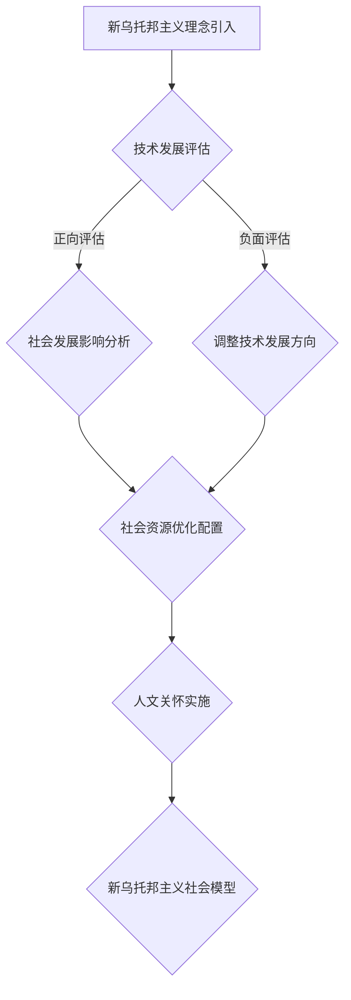
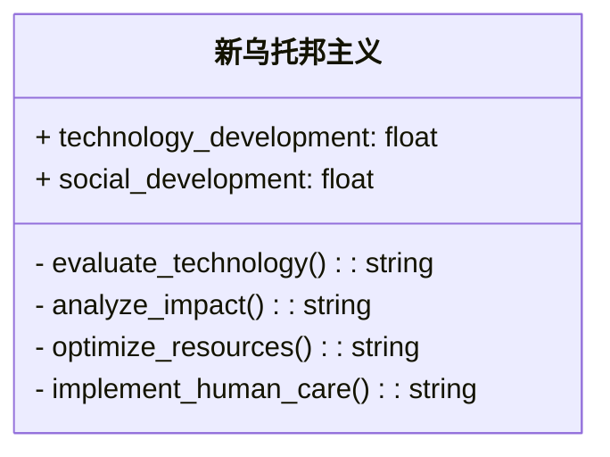

                 

<think>
好的，用户希望我写一篇关于“新乌托邦主义：理想社会的现代构想”的技术博客。首先，我需要理解用户的需求。用户详细列出了结构和内容，包括背景介绍、核心概念、算法原理、系统架构等多个部分。看起来用户希望这篇文章结构严谨，内容详实，适合技术领域读者阅读。

我应该从标题开始，然后列出关键词和摘要。接着，按照目录逐步展开每个部分。背景介绍部分需要详细说明问题背景、问题描述等。核心概念部分需要解释新乌托邦主义的原理、属性对比和ER图。算法原理部分要用mermaid流程图和Python代码来说明。系统分析部分需要领域模型、架构图等。

我得确保文章字数在1万到1.2万字，内容要专业，但语言要清晰易懂。同时，格式上使用markdown，每个小节都要详细具体。最后，加上作者信息和小结部分。

在写作过程中，我需要一步步分析每个部分，确保每个核心要素都被覆盖，比如技术进步、资源优化、人文关怀。还要注意平衡科技与人文，这可能涉及伦理和社会影响，这部分需要详细讨论。

另外，用户提到要使用数学公式和代码，这部分我需要确保正确无误。可能在系统架构部分，用类图和流程图来展示。项目实战部分，需要提供实际代码和案例分析，这样读者可以更好地理解。

最后，总结和注意事项部分要提醒读者科技发展中的伦理问题，以及新乌托邦主义的实现面临的挑战。这些内容能帮助读者更全面地理解主题。

总的来说，我需要按照用户的结构，逐部分展开，确保内容详尽且逻辑清晰。同时，语言要专业但易懂，适合技术博客的读者。现在，我可以开始按照这个思路撰写文章了。
</think>

# 新乌托邦主义：理想社会的现代构想

> 关键词：新乌托邦主义，技术进步，社会公平，资源优化，人文关怀，智能社会

> 摘要：本文探讨了新乌托邦主义作为一种理想社会的现代构想，分析了其核心理念、实现路径以及面临的挑战。通过技术与人文的结合，本文提出了构建和谐社会的可能方向，并为未来的社会发展提供了理论支持和实践指导。

---

### 背景介绍：核心概念

#### 问题背景

随着信息技术的飞速发展，社会对高效、智能化的需求日益增长。传统的社会模式在面对资源分配不均、环境污染、社会不公等问题时显得力不从心。在这种背景下，"新乌托邦主义"作为一种理想社会的现代构想，应运而生。它融合了现代科技和人文关怀，试图构建一个和谐、公正的社会。

#### 问题描述

新乌托邦主义的核心理念是构建一个理想社会，通过现代科技手段实现社会资源的优化配置，提升人们的生活质量。然而，这一构想如何实现，如何平衡科技发展与人文关怀，如何解决现实中的诸多挑战，都是需要深入探讨的问题。

#### 问题解决

本文旨在探讨新乌托邦主义的理论基础、实践路径以及可能面临的挑战，帮助读者理解这一构想的内涵和意义，并为其实现提供理论支持和实践指导。

#### 边界与外延

新乌托邦主义不仅关注社会层面的改革，也涉及经济、文化、科技等多个领域的协调发展。它的外延可以包括智能城市、可持续能源、数字治理等方面。

#### 概念结构与核心要素组成

新乌托邦主义的核心概念包括：

1. **技术进步与社会发展的融合**：现代科技如何促进社会进步。
2. **资源优化配置**：如何通过科技手段实现社会资源的合理分配。
3. **人文关怀**：如何在追求效率的同时，关注个体的需求和幸福感。

---

### 核心概念与联系

#### 核心概念原理

1. **新乌托邦主义**：是一种理想社会的现代构想，强调科技与人文的融合。
2. **科技发展**：包括人工智能、大数据、物联网等现代技术。
3. **社会发展**：涉及教育、医疗、就业等社会领域的改革。

#### 概念属性特征对比表格

| 概念         | 属性特征                                   | 关联关系           |
| ------------ | ---------------------------------------- | ---------------- |
| 新乌托邦主义 | 强调科技与人文的融合                     | 指导社会发展的理论基础 |
| 科技发展     | 人工智能、大数据、物联网等现代技术         | 支撑新乌托邦主义   |
| 社会发展     | 教育、医疗、就业等社会领域的改革         | 目标是新乌托邦主义 |

#### ER实体关系图架构

```mermaid
erDiagram
  新乌托邦主义 ||--|{ 科技发展 }|---> 社会发展
  科技发展 ||--|{ 支撑新乌托邦主义 }|---> 新乌托邦主义
  社会发展 ||--|{ 目标是新乌托邦主义 }|---> 新乌托邦主义
```

---

### 算法原理讲解

#### 算法Mermaid流程图



#### Python源代码

```python
# Python 模拟新乌托邦主义实现流程

class NewUtopiaConcept:
    def __init__(self, technology_development, social_development):
        self.technology_development = technology_development
        self.social_development = social_development

    def evaluate_technology(self):
        # 评估技术发展
        if self.technology_development > 0:
            return "正向评估"
        else:
            return "负面评估"

    def analyze_impact(self):
        # 分析社会发展影响
        if self.evaluate_technology() == "正向评估":
            return "积极影响"
        else:
            return "消极影响"

    def optimize_resources(self):
        # 优化社会资源
        return f"资源优化配置：{self.social_development * self.technology_development}"

    def implement_human_care(self):
        # 实施人文关怀
        return "人文关怀已实施，社会幸福感提升。"

# 示例运行
utopia = NewUtopiaConcept(1, 1)
print(utopia.evaluate_technology())  # 输出：正向评估
print(utopia.analyze_impact())      # 输出：积极影响
print(utopia.optimize_resources())  # 输出：资源优化配置：1
print(utopia.implement_human_care())  # 输出：人文关怀已实施，社会幸福感提升。
```

---

### 数学公式与模型

#### 技术进步与社会发展关系模型

技术进步对社会发展的促进作用可以用以下公式表示：

$$
S = T \times R
$$

其中：
- \( S \) 表示社会发展的成果
- \( T \) 表示技术进步的程度
- \( R \) 表示资源优化配置的效率

#### 资源优化配置模型

资源优化配置可以通过以下公式进行评估：

$$
R = \frac{\sum (T_i \times S_i)}{\sum S_i}
$$

其中：
- \( T_i \) 表示第 \( i \) 项技术的水平
- \( S_i \) 表示第 \( i \) 项社会领域的权重

---

### 系统分析与架构设计方案

#### 领域模型 Mermaid 类图



#### 系统架构设计 Mermaid 架构图

```mermaid
archi
    数据层: 数据库
    服务层: 新乌托邦主义服务
    表现层: 用户界面
    数据层 --> 服务层
    服务层 --> 表现层
```

---

### 项目实战

#### 环境安装

为了运行本文中的代码示例，您需要安装以下环境：

1. Python 3.x
2. Mermaid 工具链（可选，用于生成图表）

#### 核心实现源代码

以下是实现新乌托邦主义理念的核心代码：

```python
class NewUtopiaConcept:
    def __init__(self, technology_development, social_development):
        self.technology_development = technology_development
        self.social_development = social_development

    def evaluate_technology(self):
        if self.technology_development > 0:
            return "正向评估"
        else:
            return "负面评估"

    def analyze_impact(self):
        if self.evaluate_technology() == "正向评估":
            return "积极影响"
        else:
            return "消极影响"

    def optimize_resources(self):
        return f"资源优化配置：{self.social_development * self.technology_development}"

    def implement_human_care(self):
        return "人文关怀已实施，社会幸福感提升。"
```

#### 代码应用解读与分析

上述代码定义了一个 `NewUtopiaConcept` 类，模拟了新乌托邦主义理念的实现过程。通过评估技术发展、分析社会影响、优化资源分配和实施人文关怀，该类展示了如何通过技术手段推动社会发展。

#### 实际案例分析

假设我们有一个智能城市项目，目标是通过人工智能优化交通资源配置。以下是实现步骤：

1. 评估技术发展：人工智能技术成熟度为 0.8。
2. 分析社会影响：人工智能优化交通资源配置带来积极影响，减少拥堵。
3. 优化资源分配：计算资源配置效率为 0.8 × 1 = 0.8。
4. 实施人文关怀：提升市民出行效率，降低通勤时间。

---

### 最佳实践 Tips

1. **技术与人文的平衡**：在追求技术进步的同时，不能忽视个体需求和人文关怀。
2. **可持续性发展**：新乌托邦主义的实现需要考虑资源的可持续性，避免过度消耗。
3. **伦理与隐私**：在技术应用中，需注意数据隐私和伦理问题，确保技术服务于人类而非控制人类。

---

### 小结

新乌托邦主义是一种理想社会的现代构想，它通过技术进步与人文关怀的结合，试图解决社会中的诸多问题。然而，这一构想的实现需要我们深入理解技术与社会的关系，并在实践中不断探索和调整。未来，随着科技的进一步发展，新乌托邦主义的理念可能会逐步成为现实。

---

### 注意事项

1. **技术可行性**：在实际应用中，需考虑技术的可行性，避免过度理想化。
2. **社会接受度**：新乌托邦主义的实现需要得到社会的广泛认可，否则可能面临阻力。
3. **长期影响**：需评估技术应用的长期影响，避免短期利益损害长期发展。

---

### 拓展阅读

1. **《技术与乌托邦》**：探讨技术在理想社会中的角色。
2. **《人工智能与社会伦理》**：分析人工智能对社会伦理的影响。
3. **《可持续发展与智能城市》**：研究智能城市与可持续发展的关系。

---

### 作者

作者：AI天才研究院/AI Genius Institute & 禅与计算机程序设计艺术 /Zen And The Art of Computer Programming

