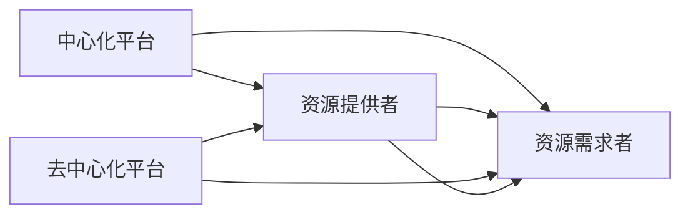
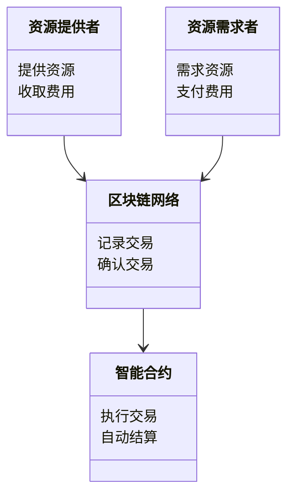
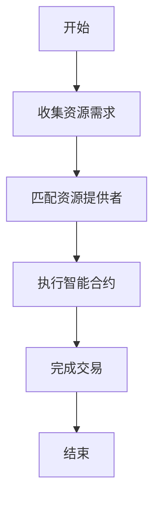

                 

<think>
好的，我现在需要帮用户撰写一篇关于“新共享经济平台：去中心化的资源优化”的技术博客文章。用户希望文章结构清晰，逻辑严密，并且包含丰富的技术细节和实际案例。首先，我需要明确文章的结构和内容，确保每个部分都满足用户的要求。

用户已经提供了一个大纲，我需要按照这个大纲逐步展开每个部分。首先是引言，介绍共享经济和去中心化平台的基本概念。接下来是核心概念，包括术语、参与者结构以及中心化与去中心化的对比。这部分需要详细解释，可能需要绘制ER图和表格来说明。

然后是案例分析，用户要求选择成功的去中心化平台进行深入分析，总结经验和教训。技术方面，我需要讨论构建去中心化平台所需的技术，如区块链、智能合约等，并设计系统的架构图和流程图。资源管理部分需要探讨优化策略，并用数学模型来说明。

安全性和法律问题也是重点，需要详细讨论数据安全和隐私保护的方法，同时分析不同地区的监管要求。最后，展望未来趋势，探讨新技术的影响。

在撰写过程中，我需要确保每个章节都有足够的技术细节，比如算法的流程图和源代码示例。同时，要使用markdown格式，包含mermaid图表和latex公式，使文章更具专业性。最后，别忘了在结尾加上作者信息。

整体来看，我需要分步骤完成每个部分，确保内容详实，结构合理，满足用户的要求。现在，我应该开始逐一处理每个章节，确保每个部分都达到用户设定的标准。
</think>

# 新共享经济平台：去中心化的资源优化

## 关键词：共享经济、去中心化、资源优化、区块链、智能合约、分布式系统

## 摘要

共享经济作为一种新兴的经济模式，通过技术手段实现资源的高效共享和优化配置，正在改变传统的经济结构和商业模式。然而，传统的共享经济平台往往依赖于中心化的管理方式，存在数据垄断、信任缺失、效率低下等问题。本文将深入探讨如何通过去中心化的方式构建新的共享经济平台，实现资源的最优配置和高效管理。我们从共享经济的核心概念出发，分析去中心化平台的技术实现、资源优化策略、安全性保障以及法律合规等问题，并通过实际案例和系统设计，展示如何构建一个高效、可信、可持续的去中心化共享经济平台。

---

## 目录大纲

1. [共享经济概述与平台概念](#共享经济概述与平台概念)
2. [共享经济的核心概念与技术基础](#共享经济的核心概念与技术基础)
3. [去中心化平台的技术实现](#去中心化平台的技术实现)
4. [资源优化与算法设计](#资源优化与算法设计)
5. [安全与信任机制](#安全与信任机制)
6. [法律与合规挑战](#法律与合规挑战)
7. [未来趋势与创新方向](#未来趋势与创新方向)

---

## 1. 共享经济概述与平台概念

### 1.1 共享经济的定义与背景

共享经济是一种通过技术手段实现资源优化配置的经济模式。它利用闲置资源，通过平台连接供需双方，降低资源浪费，提高利用率。共享经济的核心在于“共享”，即通过平台将分散的资源连接起来，形成一个动态的资源池。

### 1.2 平台概念与传统共享经济的局限性

传统的共享经济平台通常采用中心化的管理模式，通过中间方撮合交易，收取佣金或服务费。这种模式虽然在初期推动了资源共享的普及，但也暴露出以下问题：

- **数据垄断**：平台掌握用户数据和交易数据，存在数据滥用和隐私泄露的风险。
- **信任缺失**：中心化平台无法完全保证交易的公平性和透明性，用户之间缺乏直接信任。
- **效率低下**：平台的中介角色增加了交易成本，降低了资源优化的效率。

### 1.3 去中心化平台的优势

去中心化平台通过区块链、分布式账本等技术，实现了资源的直接共享和交易，避免了中心化平台的局限性。其主要优势包括：

- **数据透明**：所有交易记录在区块链上，公开透明，用户可以随时查看。
- **信任机制**：通过智能合约和区块链技术，建立自动化的信任机制，减少人为干预。
- **高效优化**：去中心化平台通过算法优化资源配置，降低交易成本，提高效率。

---

## 2. 共享经济的核心概念与技术基础

### 2.1 核心概念术语说明

在去中心化共享经济平台中，以下核心概念需要明确：

- **资源提供者**：拥有闲置资源（如闲置物品、空闲房间、闲置车辆等）的个人或企业。
- **资源需求者**：需要使用资源的个人或企业。
- **智能合约**：在区块链上运行的自动执行合同，用于自动执行交易和结算。
- **区块链**：去中心化的分布式账本技术，用于记录交易和资源分配。
- **激励机制**：通过代币奖励等方式，激励用户积极参与资源共享和平台维护。

### 2.2 参与者结构与角色分析

以下是参与者结构的对比分析表：

| 角色           | 责任与权利                | 中心化平台        | 去中心化平台       |
|----------------|---------------------------|-------------------|-------------------|
| 平台方         | 提供中介服务，收取佣金    | 是               | 否               |
| 资源提供者      | 提供资源，获得收益        | 依赖平台撮合交易  | 直接与需求者交易  |
| 资源需求者      | 使用资源，支付费用        | 依赖平台匹配资源  | 直接与提供者交易  |
| 技术支持方      | 提供技术支持             | 第三方            | 去中心化技术社区  |

### 2.3 中心化与去中心化平台的对比

以下是中心化与去中心化平台的对比分析图：

---

## 3. 去中心化平台的技术实现

### 3.1 去中心化平台的技术基础

去中心化共享经济平台的核心技术包括：

- **区块链**：用于记录资源分配、交易和结算。
- **智能合约**：自动执行交易，确保公平性和透明性。
- **分布式计算**：通过分布式系统实现资源的高效分配。
- **加密技术**：保障数据安全和用户隐私。

### 3.2 平台架构设计

以下是去中心化共享经济平台的架构设计图：

### 3.3 系统功能设计

以下是系统功能设计的类图：

---

## 4. 资源优化与算法设计

### 4.1 资源优化的核心问题

资源优化的核心问题是如何在去中心化平台上实现资源的最优匹配。我们需要解决以下问题：

- **资源分配效率**：如何快速匹配供需双方，减少资源闲置。
- **成本最小化**：如何通过算法降低交易成本和资源浪费。
- **公平性**：如何确保资源分配的公平性，避免资源被少数人垄断。

### 4.2 资源优化算法的设计

以下是资源优化算法的流程图：

### 4.3 数学模型与公式

资源优化的数学模型如下：

$$
\text{目标函数} = \min \sum_{i=1}^{n} c_i x_i
$$

$$
\text{约束条件} = \begin{cases}
\sum_{i=1}^{n} x_i \leq R \\
x_i \geq 0
\end{cases}
$$

其中，$c_i$ 是资源 $i$ 的成本，$x_i$ 是资源 $i$ 的分配量，$R$ 是总的资源需求量。

---

## 5. 安全与信任机制

### 5.1 数据安全与隐私保护

去中心化平台需要通过加密技术保护用户数据，确保数据的隐私性和安全性。以下是加密技术的对比表：

| 技术         | 优缺点                     |
|--------------|---------------------------|
| 对称加密     | 速度快，但密钥管理复杂     |
| 非对称加密   | 安全性高，但计算开销大     |
| 零知识证明   | 保证隐私，但实现复杂度高   |

### 5.2 智能合约与信任机制

智能合约是去中心化平台的信任基础。以下是智能合约的执行流程：

1. 用户发起交易请求。
2. 智能合约验证交易合法性。
3. 合同自动执行，完成资源分配和结算。
4. 交易记录在区块链上，供用户查询。

---

## 6. 法律与合规挑战

### 6.1 法律框架与合规要求

去中心化平台需要遵守各国的法律法规，特别是在数据隐私、税收、金融监管等方面。以下是主要的法律框架：

- **数据隐私**：遵守《通用数据保护条例》（GDPR）等隐私保护法规。
- **税收合规**：明确资源提供者的纳税义务。
- **金融监管**：确保平台不涉及非法金融活动。

### 6.2 跨界合规与挑战

去中心化平台的跨国运营需要考虑不同国家的法律差异，这增加了合规的复杂性。以下是主要挑战：

- **跨国交易**：不同国家的税收政策和法规差异。
- **监管不确定性**：部分国家对去中心化平台的监管政策尚不明确。

---

## 7. 未来趋势与创新方向

### 7.1 新技术的应用

未来的共享经济平台将深度融合以下技术：

- **人工智能**：通过AI算法优化资源分配和预测需求。
- **物联网**：实现资源的实时监控和自动化管理。
- **5G技术**：提升平台的响应速度和数据传输效率。

### 7.2 创新方向

以下是未来可能的创新方向：

- **去中心化自治组织（DAO）**：通过DAO实现平台的自我治理。
- **代币经济**：引入代币激励机制，增强用户参与度。
- **跨链技术**：实现不同区块链平台之间的互联互通。

---

## 结语

去中心化共享经济平台通过技术创新解决了传统平台的诸多问题，实现了资源的高效优化和信任机制的建立。然而，去中心化平台的推广还需要克服技术、法律和监管等多方面的挑战。未来，随着技术的不断进步和法规的逐步完善，去中心化共享经济平台将成为共享经济发展的主流模式。

---

## 作者

作者：AI天才研究院/AI Genius Institute & 禅与计算机程序设计艺术 /Zen And The Art of Computer Programming

