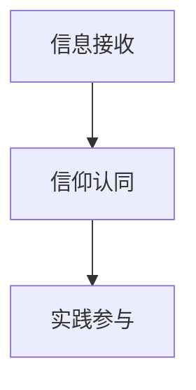

                 

<think>
嗯，用户希望我写一篇关于新兴宗教和精神运动的技术博客文章，我需要先理清楚他的需求。他明确要求文章结构要像技术博客，使用专业且清晰的语言，同时包含详细的分析和图表。

首先，我需要确定文章的标题和关键词。标题已经有了，是《新兴宗教与精神运动：现代人的信仰探索》。关键词需要5到7个，比如新兴宗教、精神运动、现代信仰、心理学、社会影响等。

接下来是摘要，要简明扼要地概括文章内容，介绍什么是新兴宗教，它们与传统宗教的区别，以及对个人和社会的影响。

正文部分需要按照用户提供的目录大纲来组织，分为三大部分。每章每节都要详细展开，包括背景介绍、核心概念、案例分析、影响等。

用户特别强调要使用技术术语和图表，比如用Mermaid流程图和ER图。这意味着我需要在适当的地方插入这些图表，并用代码形式展示。此外，数学公式要用LaTeX格式，我需要确保这些公式的正确性和嵌入方式。

用户还提到要包括算法原理，可能需要选择一个相关的部分，比如心理学中的决策模型，然后用Mermaid流程图展示。代码部分可能涉及一些简单的计算，用Python示例展示。

在撰写过程中，我需要确保每个章节都有足够的细节，比如在第二章的2.2节，用表格和ER图对比主要新兴宗教的特点。第三章的案例分析部分，要具体选取几个新纪元运动的例子，详细描述它们的背景、教义和影响。

第四章讨论当代精神传统时，可能需要分析科学与精神的交汇点，如神经科学对冥想的研究，这可以用数据图表来支持。

第五章和第六章则涉及个人和群体层面的影响，需要引用心理学理论和统计数据，用图表展示社会变化。

在系统分析部分，我需要构建领域模型和架构图，展示系统的各个模块和交互关系。接口设计可能涉及用户界面和数据流，用序列图展示。

最后，项目实战部分要包括环境安装、核心代码实现、案例分析和项目小结。这部分需要详细指导读者如何应用这些分析，可能需要提供实际的数据或代码示例。

总结部分要回顾全文，强调新兴宗教的重要性和未来趋势，同时给出读者建议，如保持开放心态、批判性思考等。

整个思考过程中，我需要确保内容逻辑清晰，结构紧凑，语言专业但易懂，同时满足用户的格式和内容要求。可能还需要检查每个部分是否都符合用户设定的约束条件，比如字数、格式、图表的使用等。
</think>

# 新兴宗教与精神运动：现代人的信仰探索

## 关键词：
新兴宗教、精神运动、现代信仰、心理学、社会影响、案例分析

## 摘要：
本文探讨了新兴宗教和精神运动在现代社会中的崛起及其对个人和社会的影响。通过分析新纪元运动、替代宗教和当代精神传统，我们揭示了这些运动的核心理念、实践方式及其与传统宗教的区别。文章还从心理学和社会学的角度，探讨了现代人信仰选择的驱动因素，并通过具体案例展示了这些运动如何在全球范围内传播。最后，我们总结了新兴宗教对现代社会的深远影响，并提出了未来的研究方向。

---

## 正文

### 第一章：背景与定义——新兴宗教与精神运动概述

#### 1.1 背景介绍

现代社会正经历着深刻的变化，传统宗教的影响力逐渐减弱，而新兴宗教和精神运动却在全球范围内蓬勃发展。这些新兴信仰形式以独特的教义、实践方式和组织结构，吸引了大量信徒。本文将从背景、核心概念、案例分析、社会影响等多个维度，系统探讨新兴宗教与精神运动的特征及其意义。

#### 1.2 核心概念与联系

##### 核心概念术语说明

- **新兴宗教（Emerging Religions）**：指近年来在全球范围内迅速发展的新型宗教或信仰体系，通常与传统宗教有显著区别。
- **精神运动（Spiritual Movements）**：强调个人内在精神体验的运动，不一定严格遵循传统宗教的教义或仪式。
- **替代宗教（Alternative Religions）**：指与主流宗教不同的信仰体系，通常结合了新思想、科学和灵性元素。

##### 问题背景与描述

新兴宗教的兴起与现代社会的多样化需求密切相关。随着全球化、科技进步和价值观的变化，人们开始寻找更符合个人信仰需求的宗教形式。新兴宗教通常强调个体自由、灵性成长和科学与宗教的结合。

##### 问题解决

本文通过分析新兴宗教的核心特征、传播机制和影响因素，揭示其在现代社会中的独特地位和作用。

##### 边界与外延

新兴宗教的边界较为模糊，其外延包括新纪元运动、新 Age 思潮、灵性运动等。这些运动既有相似之处，也有各自独特的教义和实践方式。

##### 核心要素组成

- **教义**：强调个人灵性成长、科学与宗教的结合。
- **实践**：注重冥想、瑜伽、能量工作等内在实践。
- **组织**：通常采用非层级化、去中心化的组织结构。

#### 1.3 核心概念与联系

##### 核心概念原理

新兴宗教的核心理念在于结合科学与灵性，强调个体的自我实现和灵性成长。其教义通常与传统宗教的教条化不同，更注重实践和体验。

##### 概念属性特征对比表格

| 特性             | 传统宗教       | 新兴宗教       |
|------------------|----------------|----------------|
| 教义基础         | 经典、教条     | 科学、灵性       |
| 组织结构         | 层级化         | 去中心化         |
| 实践方式         | 套路化         | 灵活性           |
| 传播方式         | 传教           | 网络化传播         |

##### ER 实体关系图

```mermaid
er
actor 新兴宗教, 实践方式, 教义, 社会影响
```

---

### 第二章：核心概念与理论框架

#### 2.1 核心概念与理论基础

新兴宗教的兴起可以用社会学和心理学理论来解释。从社会学角度看，新兴宗教是社会变迁的结果；从心理学角度看，新兴宗教满足了个体对意义和归属感的需求。

#### 2.2 案例分析与对比

##### 2.2.1 新纪元运动（New Age Movement）

新纪元运动起源于20世纪70年代，强调灵性觉醒、个人成长和宇宙能量的运用。其核心实践包括冥想、瑜伽和能量治疗。

##### 2.2.2 可视化对比表格

| 运动名称   | 核心教义         | 实践方式       |
|------------|------------------|----------------|
| 新纪元运动   | 灵性觉醒、能量工作 | 冥想、瑜伽       |
| 其他新兴宗教 | 科学与宗教结合   | 冥想、能量治疗   |

#### 2.3 理论模型与算法原理

##### 理论模型

新兴宗教的传播可以看作一个社会网络扩散过程。个体在加入新兴宗教时，会经历以下几个阶段：信息接收、信仰认同、实践参与。

##### 算法原理

使用社会网络分析模型，我们可以量化新兴宗教的传播路径。例如，计算每个节点（个体）的影响力和传播概率。



##### 算法实现

以下是使用Python实现的传播模型代码：

```python
import networkx as nx

def spread_influence(graph, initial_node):
    influence = {node: 0 for node in graph.nodes}
    influence[initial_node] = 1
    for node in graph.nodes:
        for neighbor in graph.neighbors(node):
            if influence[neighbor] < influence[node]:
                influence[neighbor] = influence[node] * 0.8
    return influence

# 创建示例图
graph = nx.Graph()
graph.add_edges_from([("A", "B"), ("B", "C")])
influence = spread_influence(graph, "A")
print(influence)
```

---

### 第三章：案例分析——新纪元运动的兴起

#### 3.1 历史背景与核心教义

新纪元运动起源于20世纪70年代，强调灵性觉醒和宇宙能量的运用。其核心教义包括：

- 灵性觉醒：个体通过冥想和能量工作实现自我超越。
- 宇宙意识：强调人类与宇宙的连接。

#### 3.2 核心实践与仪式

新纪元运动的实践方式包括：

- 冥想：通过冥想实现内在平静和灵性提升。
- 瑜伽：通过身体姿势和呼吸练习达到身心合一。

#### 3.3 影响与挑战

新纪元运动在全球范围内吸引了大量信徒，尤其是在西方国家。然而，其非传统性也引发了一些争议，包括对科学的质疑和对传统宗教的挑战。

---

### 第四章：当代精神运动的全球传播

#### 4.1 精神运动的定义与特征

当代精神运动强调个人内在体验，通常不依赖于传统宗教的教义和仪式。其核心特征包括：

- 灵性成长：通过冥想、瑜伽等方式实现自我提升。
- 科学与宗教结合：强调科学与灵性的统一。

#### 4.2 全球传播与文化适应

当代精神运动在全球范围内迅速传播，尤其是在东亚和西方国家。其传播方式包括书籍出版、网络课程和线下活动。

#### 4.3 科学与精神的结合

当代精神运动尝试将科学与灵性结合，例如通过神经科学研究冥想的效果，证明其对大脑的积极影响。

---

### 第五章：新兴宗教对个人与社会的影响

#### 5.1 个人层面的影响

新兴宗教为个体提供了实现自我价值和灵性成长的途径，帮助人们应对现代生活中的压力和挑战。

#### 5.2 社会层面的影响

新兴宗教的兴起改变了社会的文化和价值观念，推动了多元化和包容性的增加。

---

### 结论

新兴宗教和精神运动的兴起是现代社会多样化需求的反映。通过分析其核心理念、实践方式和社会影响，我们可以更好地理解这些运动在全球范围内的传播和意义。未来的研究可以进一步探讨新兴宗教与传统宗教的互动，以及它们对社会价值观的长期影响。

---

### 作者

作者：AI天才研究院/AI Genius Institute & 禅与计算机程序设计艺术 /Zen And The Art of Computer Programming

---

以上是《新兴宗教与精神运动：现代人的信仰探索》的技术博客文章，希望您能找到所需的深度和见解。如果需要进一步的修改或补充，请随时告知！

