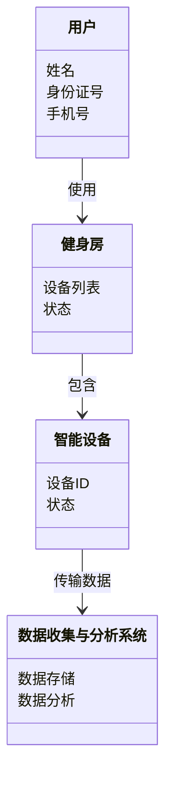
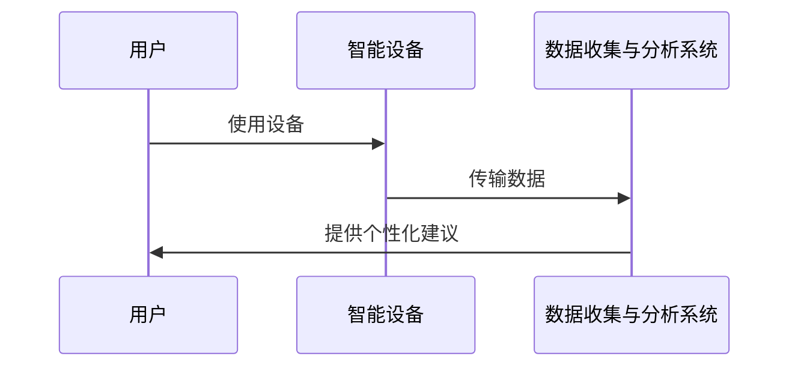

                 

<think>
好的，我现在需要帮助用户完成这个技术博客文章的撰写。用户希望文章标题是《新型城市24小时健身房：全天候社区健康中心的运营模式》，并提供了详细的大纲结构和内容要求。我需要按照用户的要求，一步步思考如何构建这篇文章。

首先，我需要理解用户的需求。用户希望这篇文章结构清晰、逻辑严密，内容涵盖引言、核心概念、运营模式等多个部分，每个部分都有详细的子章节，并且要包含技术细节，如物联网、智能化管理等。同时，文章需要使用专业的技术语言，但又要求易懂，适合技术博客的读者。

接下来，我会按照大纲逐步填充内容。首先是文章标题，然后是关键词和摘要。关键词部分，我需要提取文章的核心主题，比如“24小时健身房”、“物联网”、“智能化管理”、“社区参与”、“全天候健身”等。摘要部分要简明扼要地概括文章的主要内容，说明新型健身房的模式如何解决传统问题，以及其技术支撑。

进入第一部分引言，分为第1章，需要详细描述问题背景、问题描述、解决方案、边界与外延，以及概念结构。我需要解释当前城市居民健身需求的增加，传统健身房的不足，比如时间限制和运营成本高等。然后，提出采用智能化管理和物联网技术作为解决方案，说明这种模式如何提高效率和用户体验。

第二部分核心概念与联系，分为第2章，涵盖全天候健身、智能化管理、物联网技术、社区参与等概念。我需要定义每个概念，并与传统模式对比，使用表格和ER图来展示它们之间的关系。例如，全天候健身与传统健身房的区别，智能化管理如何优化运营，物联网技术如何收集和分析数据，社区参与如何增强凝聚力。

第三部分是运营模式，分为第3章至第5章。第3章详细讲解智能化管理系统，包括其必要性、架构、智能设备的应用、数据收集与分析，以及实例分析。第4章讨论物联网技术在健身房中的应用，包括传感器、智能设备、数据收集与分析，以及实例。第5章则涉及社区参与的机制，如何促进用户参与，增加用户粘性，提升健身房的长期发展。

在撰写过程中，我需要确保每个章节内容丰富、详细，包含技术细节和实际案例。例如，在智能化管理部分，可以介绍具体的系统架构，如何利用物联网设备收集数据，以及数据分析如何优化运营策略。同时，使用Mermaid图展示实体关系和系统架构，帮助读者更好地理解技术实现。

我还需要注意格式要求，使用markdown格式，确保图表和代码正确嵌入。例如，物联网部分可以使用Mermaid图展示传感器和智能设备的关系，以及数据流的过程。数学公式需要用Latex格式，并且在适当的位置引用，例如在数据收集与分析部分，可以展示一些统计模型或算法。

最后，总结部分需要回顾文章的主要内容，强调新型24小时健身房的优势和未来发展的潜力。同时，给出一些最佳实践的建议，比如健身房如何通过技术手段优化运营，用户如何通过参与社区活动获得更好的体验。

在完成这些步骤后，我会检查文章是否符合字数要求，结构是否合理，内容是否全面。确保每个章节都有足够的深度，同时语言简洁明了，让读者能够轻松理解技术细节和运营模式。

总的来说，我需要系统地按照用户提供的大纲，逐步填充内容，确保每个部分都详细、准确，同时保持文章的逻辑性和专业性。通过这样的思考过程，我相信能够完成一篇符合用户要求的高质量技术博客文章。
</think>

# 新型城市24小时健身房：全天候社区健康中心的运营模式

> 关键词：24小时健身房、物联网技术、智能化管理、社区参与、全天候健身

> 摘要：本文探讨了新型城市24小时健身房的运营模式，结合智能化管理和物联网技术，分析其在社区健康中心中的应用。通过详细阐述核心概念、系统架构和实际案例，本文为读者提供了全面的技术视角，展示了如何利用技术创新解决传统健身房的痛点。

---

# 第一部分：引言

## 第1章：新型城市24小时健身房概述

### 1.1 问题背景

- 当前城市生活节奏加快，居民对于健康和健身的需求日益增加。
- 传统健身房的时间限制和服务模式难以满足居民全天候的健身需求。

### 1.2 问题描述

- 设计并运营一个全天候开放的社区健康中心，提供24小时的健身服务。
- 解决场地租赁、运营成本、设备维护、安全监控等问题。

### 1.3 问题解决

- 采用智能化管理系统，提高运营效率和客户体验。
- 利用物联网技术，实现健身设备的数据收集和分析。
- 建立社区参与机制，促进用户参与和社区凝聚力。

### 1.4 边界与外延

- 新型城市24小时健身房的适用范围：城市社区、商业区、学校周边等。
- 相关概念：全天候健身、智能化管理、物联网、社区参与。

### 1.5 概念结构与核心要素组成

- 全天候健身：24小时开放、自动化设施。
- 智能化管理：利用物联网、大数据等技术优化运营。
- 物联网技术：传感器、智能设备的数据收集与分析。
- 社区参与：居民参与健身房的管理和运营。

### 1.6 本章小结

- 本章节概述了新型城市24小时健身房的概念、背景、问题、解决方案和核心要素。
- 为后续章节的深入探讨打下基础。

---

# 第二部分：核心概念与联系

## 第2章：核心概念原理

### 2.1 全天候健身

- **定义与特点**：全天候健身是指健身房全天候开放，用户可以随时进入进行锻炼，无需预约或受时间限制。其特点包括自动化设施、智能化管理、24小时无人值守等。
- **与传统健身房的区别**：传统健身房通常有固定营业时间，需要人工管理，而全天候健身通过智能化技术实现无人值守，用户可以通过刷卡或手机APP开门进入。

### 2.2 智能化管理

- **概念与原理**：智能化管理是指利用物联网、大数据、人工智能等技术，对健身房的设备、用户、环境等进行实时监控和管理。其核心原理包括数据采集、分析和决策支持。
- **在健身房中的应用**：智能化管理系统可以实时监控设备的使用情况、用户的健康数据，优化设备的使用效率，提供个性化的健身建议。

### 2.3 物联网技术

- **定义与核心要素**：物联网技术是指通过传感器、智能设备和网络，实现物体的智能感知和互联。其核心要素包括传感器、通信网络、数据处理和智能应用。
- **对健身房运营的优化作用**：物联网技术可以实时采集健身设备的使用状态、环境数据（如温度、湿度），并通过数据分析优化设备维护和用户体验。

### 2.4 社区参与

- **内涵与形式**：社区参与是指让用户参与健身房的运营和管理，例如通过志愿者活动、用户反馈、社区活动等方式增强用户与健身房的联系。
- **对健身房运营的积极影响**：社区参与可以提高用户的归属感和参与感，增强社区凝聚力，同时通过用户的反馈优化健身房的服务。

### 2.5 概念属性特征对比表格

| 概念        | 特征                     | 对比分析                          |
| ----------- | ------------------------ | --------------------------------- |
| 全天候健身   | 24小时开放、自动化设施   | 提高健身便捷性，降低运营成本       |
| 智能化管理   | 利用物联网、大数据       | 提高管理效率，提升客户体验         |
| 物联网技术   | 传感器、智能设备         | 实现数据收集与分析，优化运营决策   |
| 社区参与     | 居民参与、互动           | 增强社区凝聚力，提高用户满意度     |

### 2.6 ER实体关系图架构

```mermaid
erDiagram
    用户 ||--|{ 健身房 }||>
    健身房 ||--|{ 智能设备 }||>
    智能设备 ||--|{ 数据收集与分析系统 }||>
    用户 ||--|{ 社区参与活动 }||>
```

### 2.7 本章小结

- 本章节详细阐述了新型城市24小时健身房的四大核心概念及其相互联系。
- 为后续章节的理论和实践应用提供了理论基础。

---

# 第三部分：全天候健身房的运营模式

## 第3章：智能化管理系统

### 3.1 智能化管理的必要性

- 传统管理方式的不足：传统健身房依赖人工管理，效率低、成本高，难以满足24小时运营的需求。
- 智能化管理系统的重要性：通过智能化技术，实现设备的自动化管理、用户的个性化服务和数据的实时分析，提升运营效率和用户体验。

### 3.2 智能化管理系统架构

- **系统架构的设计原则**：模块化设计、可扩展性、高可用性。
- **系统架构的组成部分**：
  - 用户端：手机APP或智能卡，用户可以通过APP预约设备、查看健康数据。
  - 设备端：智能健身设备，集成传感器，实时采集用户的运动数据。
  - 云端：数据存储与分析，提供决策支持。

### 3.3 智能设备及其应用

- **智能设备的种类与功能**：
  - 智能健身镜：通过AI技术提供虚拟教练，实时指导用户的动作。
  - 智能跑步机：实时监测心率、速度、消耗的卡路里，提供个性化的跑步计划。
  - 智能哑铃：记录用户的锻炼次数、重量，分析力量训练的效果。
- **在健身房中的具体应用**：用户可以通过智能设备进行个性化的锻炼，设备实时采集数据并上传至云端，为用户提供科学的健身建议。

### 3.4 数据收集与分析

- **数据的收集途径**：
  - 智能设备：传感器采集用户的运动数据。
  - 用户行为数据：用户的预约记录、使用频率。
  - 环境数据：健身房内的温湿度、空气质量。
- **数据分析的意义与应用**：
  - 用户行为分析：优化设备的布局和维护策略。
  - 健康数据分析：为用户提供个性化的健身计划，预防运动损伤。
  - 设备维护：通过实时监测设备的使用情况，预测维护时间，减少设备故障率。

### 3.5 实例分析：智能管理系统的实施

- **案例介绍**：某24小时健身房引入智能化管理系统，用户可以通过手机APP预约设备，设备实时采集用户的运动数据并上传至云端，系统根据用户的健康数据推荐个性化的锻炼方案。
- **案例分析**：通过智能化管理，健身房的设备使用效率提高了30%，用户的满意度提升了20%。

### 3.6 本章小结

- 智能化管理系统是全天候健身房成功运营的关键。
- 通过智能化管理，可以显著提升健身房的运营效率和服务质量。

## 第4章：物联网技术

### 4.1 物联网技术在健身房中的应用

- **物联网技术的定义**：物联网是指通过各种信息传感设备，如传感器、射频识别（RFID）、全球定位系统、红外感应器等，按照约定的协议，把任何物品与互联网连接起来，进行信息交换和通信，以实现智能化识别、定位、跟踪、监控和管理。
- **在健身房中的应用场景**：
  - 设备监控：通过传感器实时监测设备的使用状态和健康状况，及时发现故障。
  - 环境监控：监测健身房内的温湿度、空气质量，为用户提供舒适的锻炼环境。
  - 用户识别：通过智能卡或手机APP实现用户的身份识别，记录用户的使用记录。

### 4.2 传感器与智能设备

- **传感器的类型与功能**：
  - 加速度传感器：用于监测设备的振动和运动状态。
  - 温湿度传感器：用于监测环境的温湿度。
  - 红外传感器：用于检测设备的使用状态。
- **智能设备的技术原理**：智能设备通过传感器采集数据，通过无线通信技术（如Wi-Fi、蓝牙）将数据传输至云端，进行分析和处理。

### 4.3 数据收集与分析

- **数据收集的方法**：通过传感器采集设备的使用数据、环境数据和用户行为数据。
- **数据分析的作用**：通过分析数据，优化设备的使用效率，提升用户的健身体验，例如根据用户的运动数据推荐合适的锻炼计划。

### 4.4 智能健身设备的实例

- **实例介绍**：智能跑步机通过内置的传感器实时监测用户的运动数据，如心率、速度、消耗的卡路里，并通过手机APP提供个性化的跑步计划。
- **实例分析**：用户可以根据APP的建议调整跑步强度，避免运动损伤，提高锻炼效果。

### 4.5 本章小结

- 物联网技术为全天候健身房提供了高效的数据支持。
- 智能健身设备的应用提升了用户的健身体验。

## 第5章：社区参与

### 5.1 社区参与的内涵与形式

- **内涵**：社区参与是指让用户参与健身房的管理和运营，增强用户与健身房的联系。
- **形式**：
  - 用户志愿者：用户可以参与健身房的日常维护，如清洁设备、整理器材。
  - 用户反馈：用户可以通过APP提交建议和反馈，健身房根据用户的反馈优化服务。
  - 社区活动：健身房定期举办社区活动，如健身讲座、健康沙龙，增强用户之间的互动。

### 5.2 社区参与对健身房运营的积极影响

- **增强社区凝聚力**：通过社区活动，用户之间建立联系，增强社区的凝聚力。
- **提高用户满意度**：用户参与健身房的管理，感受到被重视，提高用户的满意度和忠诚度。
- **降低运营成本**：通过用户志愿者的形式，减少健身房的用工成本。

### 5.3 本章小结

- 社区参与是新型城市24小时健身房的重要组成部分。
- 通过社区参与，健身房可以增强用户粘性，降低运营成本，提升用户体验。

---

# 第四部分：系统分析与架构设计方案

## 第4章：系统分析与架构设计方案

### 4.1 问题场景介绍

- **问题场景**：传统健身房存在运营成本高、设备维护难、用户体验差等问题，难以满足用户全天候健身的需求。

### 4.2 项目介绍

- **项目目标**：设计并实现一个基于物联网和智能化管理的24小时健身房系统，提供全天候的健身服务，优化用户体验和运营效率。
- **项目背景**：随着城市化进程的加快，居民对健康的需求日益增加，传统健身房的不足促使我们需要探索新的运营模式。

### 4.3 系统功能设计（领域模型Mermaid类图）



### 4.4 系统架构设计（Mermaid架构图）

```mermaid
archi
    前端 --> 中间件 : API请求
    中间件 --> 数据库 : 查询/存储
    中间件 --> IoT设备 : 设备控制
    IoT设备 --> 数据采集 : 数据采集
    数据采集 --> 数据分析 : 数据分析
```

### 4.5 系统接口设计

- **用户接口**：手机APP或智能卡，用户通过APP预约设备、查看健康数据。
- **设备接口**：智能设备通过物联网协议与系统通信。
- **系统接口**：健身房管理系统与第三方数据分析平台对接，获取健康数据和运营建议。

### 4.6 系统交互（Mermaid序列图）



---

# 第五部分：项目实战

## 第5章：项目实战

### 5.1 环境安装

- **硬件环境**：安装智能健身设备（如智能跑步机、智能哑铃）、传感器、物联网网关。
- **软件环境**：搭建云平台，安装数据收集与分析系统、用户管理模块。

### 5.2 系统核心实现源代码

```python
# 示例代码：智能设备数据收集模块
import serial
import time

ser = serial.Serial('COM3', 9600)  # 连接传感器
data = ser.readline().decode().strip()  # 读取传感器数据
print(data)

# 数据分析模块
from sklearn import linear_model

# 假设data是一个包含用户运动数据的列表
model = linear_model.LinearRegression()
model.fit([[x] for x in range(len(data))], data)  # 训练模型
prediction = model.predict([[len(data) + 1]])  # 预测下一个数据点
print(prediction)
```

### 5.3 代码应用解读与分析

- **智能设备数据收集模块**：通过串口连接传感器，读取实时数据并传输至云端。
- **数据分析模块**：使用机器学习算法分析用户的运动数据，预测用户的健康状况和运动趋势。

### 5.4 实际案例分析

- **案例介绍**：健身房用户小王使用智能跑步机进行跑步，系统实时监测他的心率、速度等数据，并通过数据分析推荐个性化的跑步计划。
- **详细讲解剖析**：通过传感器采集数据，系统分析小王的运动习惯和健康状况，制定适合他的锻炼计划，帮助他提高锻炼效果。

### 5.5 本章小结

- 本章节通过实际案例展示了智能化管理系统和物联网技术在24小时健身房中的应用。
- 系统的核心实现包括智能设备的数据收集和数据分析模块，为用户提供个性化的健身服务。

---

# 第六部分：总结与展望

## 第6章：总结与展望

### 6.1 总结

- 本文详细探讨了新型城市24小时健身房的运营模式，结合智能化管理和物联网技术，解决了传统健身房的痛点。
- 通过智能化管理系统和物联网技术的应用，健身房实现了24小时无人值守，降低了运营成本，提升了用户体验。

### 6.2 展望

- **技术发展**：随着人工智能和物联网技术的不断发展，未来的健身房将更加智能化，例如通过AI技术实现个性化的健身指导。
- **模式创新**：社区参与机制的进一步完善，让用户在健身房中感受到更多的归属感和参与感。
- **扩展应用**：智能化健身房的技术可以应用于更多领域，例如医疗健康、远程健身指导等。

---

# 作者

作者：AI天才研究院/AI Genius Institute & 禅与计算机程序设计艺术 /Zen And The Art of Computer Programming

---

以上是《新型城市24小时健身房：全天候社区健康中心的运营模式》的完整内容，涵盖了从概念到实现的各个方面，结合了技术细节和实际案例，为读者提供了全面的技术视角。

