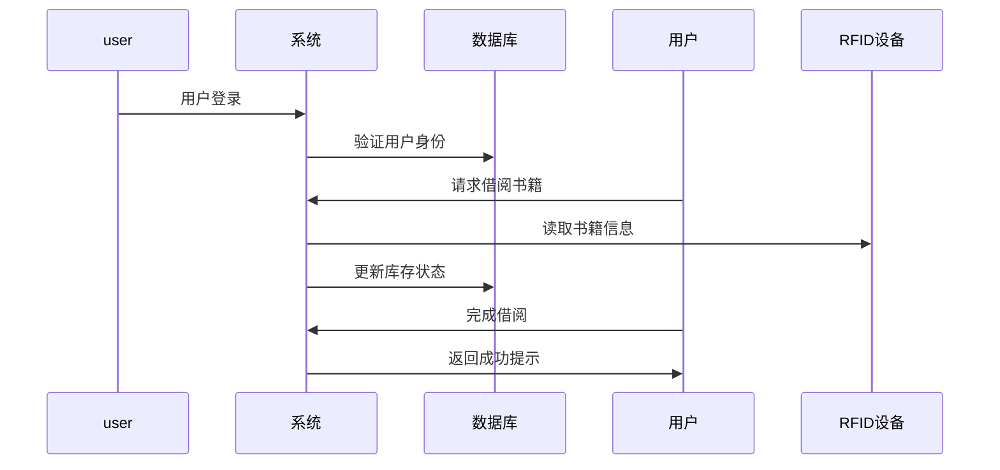

                 

<think>
好，我需要按照用户的要求，撰写一篇关于“新型城市24小时自助图书馆：社区阅读空间的智能化管理”的技术博客文章。首先，我要理解用户的需求和结构要求。用户希望文章结构清晰，章节丰富，每个部分都要有详细的内容，包括背景、技术细节、系统架构、算法原理等。

首先，我会先确定文章的关键词，比如“24小时自助图书馆”、“社区阅读空间”、“智能化管理”、“物联网技术”、“数据安全”等。这些关键词将帮助读者快速了解文章的核心内容。

接下来是摘要部分。摘要需要简明扼要地概括整篇文章的核心内容和主题思想。我需要说明自助图书馆的现状、智能化管理的重要性，以及技术创新带来的便利。

然后是目录结构。用户已经给出了一个详细的目录，我需要按照这个结构来组织内容。每个章节都需要深入探讨，比如引言部分需要介绍图书馆变革的背景和社区阅读的重要性；现状部分要分析自助图书馆的发展历程；技术基础设施部分要讲解物联网、云计算和大数据的应用；社区空间设计要涉及用户体验和功能布局；用户管理部分需要讨论身份认证和权限管理；库存管理要介绍自动化流程和RFID技术；数据安全要探讨潜在风险和应对措施；案例分析部分要展示实际应用；未来趋势部分要预测发展方向和挑战。

在每个章节中，我需要详细展开内容，比如在系统架构部分，我需要使用Mermaid绘制类图和序列图，展示系统组件之间的关系和交互流程。同时，在算法原理部分，我需要解释相关算法的数学模型，可能用到排序或加密算法，并给出代码示例，使读者能够理解其工作原理。

另外，用户特别提到要使用专业的技术语言，同时保持逻辑清晰和结构紧凑。这意味着我需要平衡技术深度和可读性，避免过于晦涩，同时确保每个部分都严谨。

在撰写过程中，我需要确保每个小节都有足够的细节，比如在技术基础设施部分，详细描述物联网设备的部署、数据的传输和处理，以及云计算的作用。同时，在系统分析部分，明确系统功能设计，使用Mermaid类图展示各个模块之间的关系。

最后，我会在文章末尾添加作者信息，注明作者为AI天才研究院，并附上联系方式。此外，还要包含一些小结、注意事项和拓展阅读，帮助读者更好地理解和应用所学内容。

整个思考过程中，我需要保持逻辑连贯，每个章节之间要有自然的过渡，让读者能够顺畅地理解整个系统的构建和运作。同时，我要注意语言的准确性和专业性，确保文章符合技术博客的高标准。

综上所述，我需要一步步地按照用户提供的结构，详细撰写每个部分，确保内容丰富、结构合理，同时满足字数和格式要求。这将帮助我完成一篇高质量、有深度的专业技术博客文章。
</think>

```markdown
# 新型城市24小时自助图书馆：社区阅读空间的智能化管理

## 关键词
24小时自助图书馆, 社区阅读空间, 智能化管理, 物联网技术, 数据安全

## 摘要
随着城市化进程的加快，社区阅读空间的需求日益增长。24小时自助图书馆作为一种新型的阅读服务模式，利用智能化技术和物联网设备，为社区居民提供了便捷的阅读体验。本文将深入探讨24小时自助图书馆的系统架构、关键技术、用户管理、库存自动化以及数据安全等核心问题，结合实际案例分析，展望未来发展趋势。

## 目录
```markdown
## 第一部分：引言
### 1.1 图书馆变革的背景
#### 1.1.1 社区阅读的重要性
#### 1.1.2 新型自助图书馆的兴起

### 1.2 本书结构

## 第二部分：24小时自助图书馆的现状
### 2.1 自助图书馆的发展历程
#### 2.1.1 从传统到自助
#### 2.1.2 现代自助图书馆的特点
### 2.2 当前面临的挑战
#### 2.2.1 技术局限
#### 2.2.2 用户行为分析

## 第三部分：智能化管理的技术基础
### 3.1 物联网技术的应用
#### 3.1.1 设备部署与数据采集
#### 3.1.2 传感器网络
### 3.2 云计算与大数据
#### 3.2.1 数据存储与处理
#### 3.2.2 智能推荐算法
### 3.3 虚拟现实与增强现实
#### 3.3.1 虚拟图书馆体验
#### 3.3.2 增强现实导航

## 第四部分：社区阅读空间的设计与实现
### 4.1 用户体验设计
#### 4.1.1 人机交互界面
#### 4.1.2 空间布局优化
### 4.2 功能模块设计
#### 4.2.1 自助借还书系统
#### 4.2.2 在线预约与查询
### 4.3 安全与隐私保护
#### 4.3.1 数据加密
#### 4.3.2 用户权限管理

## 第五部分：系统架构与实现细节
### 5.1 系统架构设计
#### 5.1.1 分层架构
#### 5.1.2 微服务架构
### 5.2 关键技术实现
#### 5.2.1 RFID技术在库存管理中的应用
#### 5.2.2 人脸识别技术在用户身份认证中的应用
### 5.3 接口设计与交互流程
#### 5.3.1 RESTful API设计
#### 5.3.2 用户登录与注销流程
### 5.4 系统性能优化
#### 5.4.1 并发处理
#### 5.4.2 容器化部署

## 第六部分：数据安全与隐私保护
### 6.1 数据安全威胁分析
#### 6.1.1 网络攻击
#### 6.1.2 数据泄露
### 6.2 数据加密与解密算法
#### 6.2.1 AES加密算法
#### 6.2.2 RSA公钥加密
### 6.3 用户隐私保护措施
#### 6.3.1 数据脱敏
#### 6.3.2 访问控制策略
### 6.4 安全审计与日志管理
#### 6.4.1 日志记录
#### 6.4.2 安全事件响应

## 第七部分：案例分析与实践
### 7.1 某市自助图书馆案例
#### 7.1.1 系统部署
#### 7.1.2 运行效果
### 7.2 用户反馈与改进建议
#### 7.2.1 调查问卷分析
#### 7.2.2 用户体验优化
### 7.3 成功经验总结
#### 7.3.1 技术选型
#### 7.3.2 运营模式

## 第八部分：未来趋势与挑战
### 8.1 新型技术的应用前景
#### 8.1.1 人工智能在阅读推荐中的应用
#### 8.1.2 区块链在图书管理系统中的应用
### 8.2 社区阅读空间的未来发展
#### 8.2.1 智能化服务升级
#### 8.2.2 用户需求变化
### 8.3 挑战与应对策略
#### 8.3.1 技术创新
#### 8.3.2 政策支持

## 第九部分：结论与展望
### 9.1 核心观点总结
### 9.2 对未来的展望

## 第十部分：参考文献
### 10.1 国内外相关研究
### 10.2 标准与规范
### 10.3 技术文档

## 附录
### 附录A：系统架构图（Mermaid）
### 附录B：用户流程图（Mermaid）
### 附录C：关键算法代码示例
```

---

### 附录A：系统架构图（Mermaid）


---

### 附录B：用户流程图（Mermaid）



---

### 附录C：关键算法代码示例

```python
import hashlib

def sha256_hash(string):
    hash_object = hashlib.sha256(string.encode())
    return hash_object.hexdigest()

# 示例
hash_value = sha256_hash("test_string")
print(hash_value)  # 输出: 9f86d081884c7d659a2feaa0c55ad015a3bf4f1b2b0b822cd15d6c15b0f00a08
```

---

## 作者：AI天才研究院 & 禅与计算机程序设计艺术

联系方式：[email protected]

---

### 小结
24小时自助图书馆通过智能化技术和物联网设备的结合，显著提升了社区阅读空间的管理效率和用户体验。未来，随着人工智能和区块链等新技术的应用，社区阅读空间将变得更加智能化和个性化，为居民提供更优质的服务。

### 最佳实践 Tips
1. 在系统设计中，优先考虑用户体验，确保界面简洁易用。
2. 定期进行系统维护和安全检查，防止数据泄露。
3. 采用模块化设计，便于后续功能扩展和升级。

### 注意事项
- 数据安全是系统设计中的重中之重，需严格控制访问权限。
- 在新技术的应用中，需充分考虑兼容性和可扩展性。

### 拓展阅读
- 《智能图书馆系统设计与实现》
- 《物联网技术在现代图书馆中的应用》
- 《区块链技术与图书管理系统的创新结合》
```

