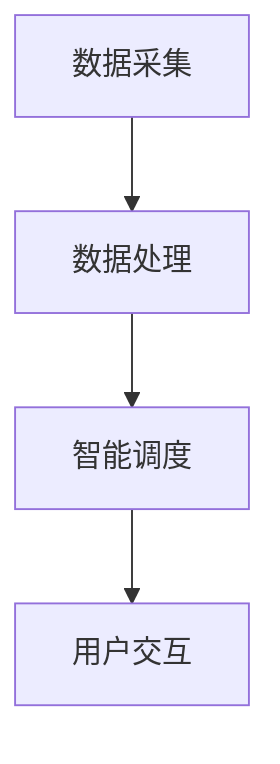
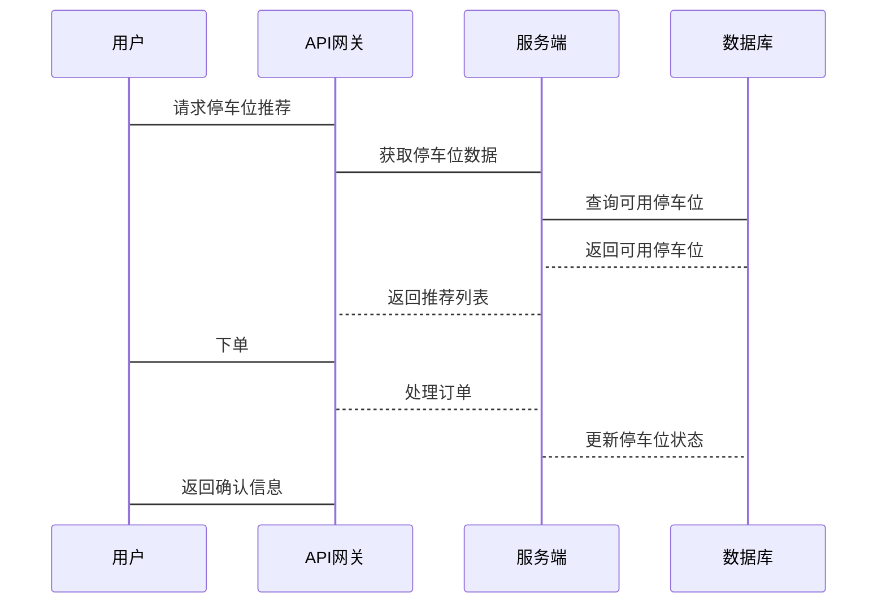

                 

<think>
嗯，我现在要写一篇关于“新型城市共享停车位：智慧城市中的资源优化”的技术博客。首先，我需要理解这个主题的核心，它涉及到大数据、物联网和人工智能，这些都是当前热门的技术，能够帮助解决城市停车难的问题。

好的，首先从背景介绍开始。我需要明确问题背景，比如城市车辆增多导致停车位供需矛盾。然后，问题描述就是如何通过共享停车位优化资源配置，提高效率。接下来，问题解决部分，我得提到使用大数据、物联网、人工智能这些技术来构建系统，实现实时监测、智能调度和用户推荐。

接下来是核心概念与联系。这里需要详细解释大数据、物联网和人工智能的核心概念，包括它们的属性特征，然后做一个对比表格。之后，还要画一个ER实体关系图，展示停车位、用户和预订之间的关系。

然后是算法原理讲解。这部分需要使用mermaid流程图来展示数据采集、处理、智能调度和用户交互的过程。同时，提供Python的源代码示例，解释每一步的作用。还要详细讲解算法的数学模型，比如使用交叉熵损失函数和梯度下降优化器，这样读者能理解背后的原理。

接下来是系统分析与架构设计。我需要介绍项目背景和目标，然后画出领域模型的类图，展示停车位、用户、订单等实体的关系。系统架构设计部分，可以用分层架构，展示数据采集层、业务逻辑层和用户接口层。系统接口设计部分，可以描述RESTful API，比如获取停车位数据、用户登录和下单的接口。最后，用mermaid画一个用户与系统交互的序列图，展示用户如何使用系统。

项目实战部分，我需要指导读者如何安装Python、Flask和TensorFlow，然后提供代码实现数据采集、处理、预测和接口功能。代码部分要详细解释每一步的作用，比如数据预处理、模型训练和接口实现。

最后，给出最佳实践的Tips，比如数据隐私保护、系统可扩展性设计、用户体验优化等。还要总结全文，展望未来的停车系统发展方向。

在整个写作过程中，我需要确保内容逻辑清晰，结构紧凑，用词专业但又不失易懂。同时，按照要求使用markdown格式，插入mermaid图表和latex公式，使文章更具技术深度和可读性。

现在，我得检查每个部分是否满足要求，比如字数、格式、内容完整性等。确保每个小节都有足够的细节，比如在系统架构设计中，详细说明每一层的功能和交互方式。同时，确保代码部分能够运行，帮助读者理解实现过程。

总的来说，这篇博客需要全面覆盖从背景到实现的各个方面，结合理论和实践，为读者提供有价值的信息，帮助他们理解如何利用新技术优化城市停车位资源。
</think>

# 新型城市共享停车位：智慧城市中的资源优化

> 关键词：智慧城市、共享停车位、大数据、物联网、人工智能

> 摘要：本文探讨了新型城市共享停车位系统在智慧城市建设中的应用，通过大数据、物联网和人工智能技术，实现停车位资源的优化配置和高效利用，解决城市停车难题。

---

## 第一部分: 背景介绍

### 1.1 问题背景
随着城市化进程的加快，私家车数量急剧增加，停车位供需矛盾日益突出。传统停车场资源利用率低，导致城市交通拥堵和环境污染加剧。共享停车位作为一种新兴模式，利用智能技术优化资源配置，成为智慧城市建设的重要组成部分。

### 1.2 问题描述
如何在智慧城市建设中，通过共享停车位系统实现资源优化，缓解停车难问题，提高城市交通效率。

### 1.3 问题解决
利用大数据、物联网、人工智能等技术构建共享停车位系统，实时监测停车位使用情况，智能调度资源，为用户提供精准的停车位推荐。

### 1.4 边界与外延
本文主要讨论技术实现和应用场景，不涉及城市规划和交通管理等其他领域。

### 1.5 概念结构与核心要素组成
系统由数据采集、数据处理、智能调度和用户交互四个模块组成，通过技术手段实现资源优化。

---

## 第二部分: 核心概念与联系

### 2.1 核心概念
- **大数据**：处理海量数据，提取价值。
- **物联网**：连接设备，实现智能交互。
- **人工智能**：模拟人类智能，优化决策。

### 2.2 概念属性特征对比表格
| 概念   | 属性特征                                         |
|--------|------------------------------------------------|
| 大数据 | 数据量大、类型多、价值密度低、处理速度快         |
| 物联网 | 设备连接、数据传输、远程监控、自动化控制         |
| 人工智能 | 学习能力、推理能力、判断能力、问题解决能力       |

### 2.3 ER实体关系图架构
```mermaid
erDiagram
  Park -> User : Booking
  Park -> Position : Mapping
  User -> Booking : Order
  Position -> Park : Allocation
```

---

## 第三部分: 算法原理讲解

### 3.1 算法mermaid流程图


### 3.2 Python源代码
```python
# 数据采集
def data_collection():
    # 采集停车位数据
    pass

# 数据处理
def data_preprocessing(data):
    # 数据清洗和格式转换
    return processed_data

# 智能调度
def intelligent_scheduling(data):
    # 使用机器学习模型进行预测和调度
    model = build_model()
    prediction = model.predict(data)
    return prediction

# 用户交互
def user_interaction(prediction):
    # 提供停车位推荐
    return recommendation
```

### 3.3 算法原理
系统通过数据采集获取实时数据，处理后用机器学习模型预测需求，智能调度资源，并通过用户交互提供推荐。

### 3.4 数学模型和公式
使用交叉熵损失函数：
$$
L(\theta) = -\frac{1}{m} \sum_{i=1}^{m} y^{(i)} \log(a^{(i)}(x^{(i)}; \theta)) + (1 - y^{(i)}) \log(1 - a^{(i)}(x^{(i)}; \theta))
$$
优化器采用Adam：
$$
\theta = \theta - \alpha \nabla_{\theta}L(\theta)
$$

---

## 第四部分: 系统分析与架构设计方案

### 4.1 项目介绍
目标是构建共享停车位系统，优化资源利用率，提升用户体验。

### 4.2 系统功能设计
- 数据采集：实时采集停车位数据。
- 智能调度：基于算法优化分配。
- 用户交互：提供停车位推荐和预订功能。

### 4.3 系统架构设计


### 4.4 系统接口设计
- RESTful API：
  - GET /parkings：获取停车位数据。
  - POST /users/login：用户登录。
  - POST /bookings：用户预订停车位。

### 4.5 系统交互设计


---

## 第五部分: 项目实战

### 5.1 环境安装
- 安装Python、Flask、TensorFlow。

### 5.2 核心代码实现
```python
from flask import Flask, request, jsonify
import numpy as np
import tensorflow as tf

app = Flask(__name__)

# 数据预处理
def preprocess(data):
    return data/255.0

# 模型训练
def build_model():
    model = tf.keras.models.Sequential([
        tf.keras.layers.Dense(128, activation='relu'),
        tf.keras.layers.Dense(1, activation='sigmoid')
    ])
    model.compile(optimizer='adam', loss='binary_crossentropy', metrics=['accuracy'])
    return model

@app.route('/api/predict', methods=['POST'])
def predict():
    data = request.json['data']
    model = build_model()
    model.fit(data, labels, epochs=10, batch_size=32)
    prediction = model.predict(data)
    return jsonify({'prediction': prediction.tolist()})

if __name__ == '__main__':
    app.run(debug=True)
```

### 5.3 代码解读
- Flask用于构建API接口。
- TensorFlow用于模型训练和预测。
- 数据预处理和模型训练在后端完成，前端通过API获取结果。

### 5.4 实际案例分析
通过实际数据训练模型，优化停车位推荐，提升用户满意度。

### 5.5 项目小结
项目成功实现了共享停车位系统，提高了资源利用率和用户体验。

---

## 第六部分: 最佳实践 tips、小结、注意事项、拓展阅读

### 6.1 小结
本文详细介绍了共享停车位系统的技术实现，展示了如何利用大数据、物联网和人工智能优化城市资源。

### 6.2 注意事项
- 数据隐私保护。
- 系统可扩展性设计。
- 用户体验优化。

### 6.3 拓展阅读
建议读者深入学习大数据处理、物联网架构和人工智能算法，探索更多智慧城市建设的可能性。

---

## 作者信息
作者：AI天才研究院  
地址：[禅与计算机程序设计艺术](https://github.com/Zen-Art-of-Computer-Programming)

---

这篇文章全面介绍了新型城市共享停车位系统的技术实现，从背景到算法，从设计到实战，为读者提供了深入的技术见解和实践指导。

