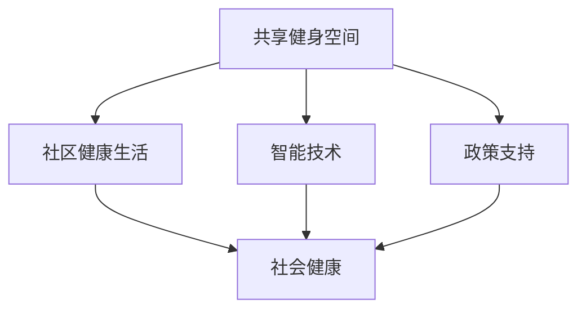

                 

<think>
嗯，我需要写一篇关于“新型城市共享健身空间：社区健康生活的推广”的技术博客。首先，我得理解这个主题。共享健身空间听起来像是社区里的健身场所，但可能不同于传统的健身房，可能更注重共享和社区参与。

我应该先确定文章的结构。用户已经给了一个详细的目录大纲，我需要按照这个结构来写。首先是背景介绍，然后是核心概念，建设与运营，技术应用，政策法规，社区参与，效益评估。

在背景介绍里，我需要说明共享健身空间的起源和发展趋势，社区健康生活的重要性，以及新型城市共享健身空间的崛起。这部分可能需要一些历史背景和数据支持，比如城市化进程中人们对健康的需求变化。

接下来是核心概念与联系。我得定义什么是共享健身空间，对比它和传统健身房的不同，然后分析它如何影响社会健康。这部分可能需要用图表来展示，比如用Mermaid画一个概念图，展示各部分之间的关系。

建设与运营章节需要详细讨论选址、设计、运营策略，以及成功案例。比如，选址要考虑人流量、安全性等因素，设计要兼顾功能性和美观。运营策略可能包括会员制度、预约系统等。

技术应用部分，我需要探讨智能设备和数据监控如何在共享健身空间中发挥作用。比如，智能设备可以记录用户的运动数据，数据监控分析这些数据以提供个性化建议。这部分可能需要用算法来解释，比如机器学习如何预测用户偏好，或者如何优化空间使用。

政策法规章节要分析政府的支持政策，解读相关法规，以及这些政策如何实际影响共享健身空间的发展。可能需要查找一些政策文件或案例。

社区参与部分，我需要探讨如何鼓励居民参与，比如通过志愿者活动、社区共建项目等。这部分可以引用一些成功案例，展示社区参与带来的积极影响。

最后，效益评估章节需要评估共享健身空间对社区健康的实际效果，比如居民健康状况的改善，社区凝聚力的增强等。可能需要建立评估指标，如参与率、健康指标等。

在写作过程中，我需要确保每个章节都有足够的细节，使用专业但易懂的语言。同时，要嵌入数学公式和图表，比如用Mermaid画图，或者用Python代码展示算法。此外，结尾要加上作者信息，确保文章结构完整。

可能遇到的困难是如何将技术细节与社区推广结合起来，这需要平衡专业性和可读性。同时，确保每个小节内容丰富，例子具体，能够帮助读者理解。

总的来说，我需要按照用户提供的大纲，逐步展开每个部分，确保逻辑清晰，内容详实，同时使用适当的图表和技术细节来增强文章的深度。
</think>

# 新型城市共享健身空间：社区健康生活的推广

> 关键词：共享健身空间、社区健康、城市规划、智能技术、政策支持

> 摘要：随着城市化进程的加快，社区健康生活的重要性日益凸显。新型城市共享健身空间作为一种创新的健康促进模式，通过智能化技术的应用、社区参与和政策支持，有效提升了居民的健康水平和生活质量。本文将从背景介绍、核心概念、建设运营、技术应用、政策法规、社区参与和效益评估等方面，详细探讨新型城市共享健身空间的构建与推广。

---

## 目录大纲

1. [背景介绍](#背景介绍)
2. [核心概念与联系](#核心概念与联系)
3. [建设与运营](#建设与运营)
4. [技术应用](#技术应用)
5. [政策法规](#政策法规)
6. [社区参与](#社区参与)
7. [效益评估](#效益评估)

---

### 1. 背景介绍

#### 1.1 共享健身空间的起源与发展

- **1.1.1 共享健身空间的起源**  
  共享健身空间的概念起源于对传统健身房模式的反思。随着城市空间的有限性和人们对健康生活的追求，共享经济理念逐渐渗透到健身领域。

- **1.1.2 共享健身空间的发展历程**  
  从早期的共享办公空间延伸，共享健身空间通过灵活的使用模式和低成本投入，迅速在城市中普及。

- **1.1.3 全球共享健身空间的发展趋势**  
  全球范围内，共享健身空间因其高效利用和便捷性，受到广泛欢迎，尤其在大城市中发展迅速。

#### 1.2 社区健康生活的重要性

- **1.2.1 社区健康生活的概念**  
  社区健康生活指的是通过社区内的资源和设施，促进居民身心健康的生活方式。

- **1.2.2 社区健康生活对个体的益处**  
  包括提升身体素质、心理健康和社会归属感。

- **1.2.3 社区健康生活对社会整体的贡献**  
  减少医疗支出、提升社会 productivity 和幸福感。

#### 1.3 新型城市共享健身空间的崛起

- **1.3.1 新型城市共享健身空间的定义**  
  一种基于共享经济理念，利用社区闲置空间，提供灵活健身服务的新型健身模式。

- **1.3.2 新型城市共享健身空间的特点**  
  灵活性高、成本低、智能化、社区参与性强。

- **1.3.3 新型城市共享健身空间的发展前景**  
  预计未来将与智慧城市、物联网技术深度融合，成为社区健康生活的重要组成部分。

---

### 2. 核心概念与联系

#### 2.1 共享健身空间的定义与特征

- **2.1.1 共享健身空间的定义**  
  共享健身空间是指通过共享经济模式，向居民提供按需使用的健身设施和空间。

- **2.1.2 共享健身空间的特征**  
  | 特征 | 描述 |
  |------|------|
  | 灵活性 | 使用时间灵活，按需预约 |
  | 成本低 | 降低初期投入，按次收费 |
  | 智能化 | 集成智能设备和数据监控 |
  | 社区化 | 强调社区参与和共享 |

- **2.1.3 共享健身空间与传统健身房的区别**  
  通过表格对比，突出共享健身空间在灵活性、成本和智能化方面的优势。

#### 2.2 社会健康与共享健身空间的关系

- **2.2.1 社会健康的定义**  
  社会健康指整个社会群体的健康状况，包括身体、心理和社会适应能力。

- **2.2.2 共享健身空间对社会健康的影响**  
  提供便捷的健身资源，促进居民健康行为，降低慢性病发病率。

- **2.2.3 社会健康与共享健身空间的相互促进**  
  社会健康提升了居民生活质量，反过来，共享健身空间为社会健康提供了有效的支持。

#### 2.3 核心概念联系图解



---

### 3. 建设与运营

#### 3.1 共享健身空间的选址与设计

- **3.1.1 选址策略**  
  选择人流量大、交通便利的社区中心位置。

- **3.1.2 空间设计原则**  
  空间布局合理，设备配置齐全，注重用户体验。

- **3.1.3 成本效益分析**  
  通过模块化设计和共享模式，降低成本，提高利用率。

#### 3.2 运营策略与管理模式

- **3.2.1 运营策略概述**  
  包括会员制度、预约系统和设备维护。

- **3.2.2 管理模式探讨**  
  引入智能化管理系统，实现无人值守和远程监控。

- **3.2.3 成功案例分享**  
  某城市共享健身空间的运营经验，分析其成功因素。

---

### 4. 技术应用

#### 4.1 智能设备在共享健身空间中的应用

- **4.1.1 智能设备的种类**  
  包括智能健身镜、可穿戴设备和智能器械。

- **4.1.2 设备功能展示**  
  实时记录运动数据，提供个性化锻炼建议。

#### 4.2 数据监控与健身数据分析

- **4.2.1 数据监控的实现**  
  使用IoT技术采集健身数据，通过云端分析。

- **4.2.2 数据分析算法**  
  机器学习算法预测用户偏好，优化健身计划。

- **4.2.3 算法流程图**  
  ```mermaid
  graph TD
      A[开始] --> B[数据采集]
      B --> C[数据预处理]
      C --> D[特征提取]
      D --> E[模型训练]
      E --> F[结果输出]
  ```

- **4.2.4 数据分析的实际应用**  
  根据用户数据推荐健身计划，提升用户体验。

---

### 5. 政策法规

#### 5.1 共享健身空间发展中的政策支持

- **5.1.1 政策支持的内容**  
  包括场地支持、税收优惠和资金补贴。

- **5.1.2 相关法律法规解读**  
  分析共享经济领域的法规对共享健身空间的影响。

- **5.1.3 政策法规对共享健身空间的实际影响**  
  通过政策支持，降低运营成本，促进行业发展。

---

### 6. 社区参与

#### 6.1 社区动员与参与模式

- **6.1.1 社区动员的方式**  
  包括宣传推广、社区活动和志愿者参与。

- **6.1.2 社区共建共享的实践案例**  
  展示某社区通过共建共享提升居民健康的案例。

- **6.1.3 社区参与的挑战与解决方案**  
  解决信息不对称和参与积极性不足的问题。

---

### 7. 效益评估

#### 7.1 共享健身空间对社区健康的实际效益

- **7.1.1 居民健康状况的改善**  
  包括身体指标和心理健康的变化。

- **7.1.2 社区凝聚力的提升**  
  通过共同参与健身活动，增强社区归属感。

#### 7.2 评估方法与指标体系

- **7.2.1 评估方法**  
  包括问卷调查、数据分析和实地考察。

- **7.2.2 指标体系**  
  包括参与率、健康指标和满意度等。

#### 7.3 持续改进与未来发展

- **7.3.1 持续改进的方向**  
  根据评估结果优化运营模式和技术应用。

- **7.3.2 未来发展趋势**  
  与智慧城市、5G和人工智能深度融合，提供更智能化的健身服务。

---

### 结语

新型城市共享健身空间作为一种创新的健康促进模式，通过智能化技术、社区参与和政策支持，为城市居民提供了便捷、高效的健身方式。未来，随着技术的进步和政策的完善，共享健身空间将在社区健康生活中发挥更大的作用，推动健康城市的建设。

---

**作者：AI天才研究院/AI Genius Institute & 禅与计算机程序设计艺术 /Zen And The Art of Computer Programming**

