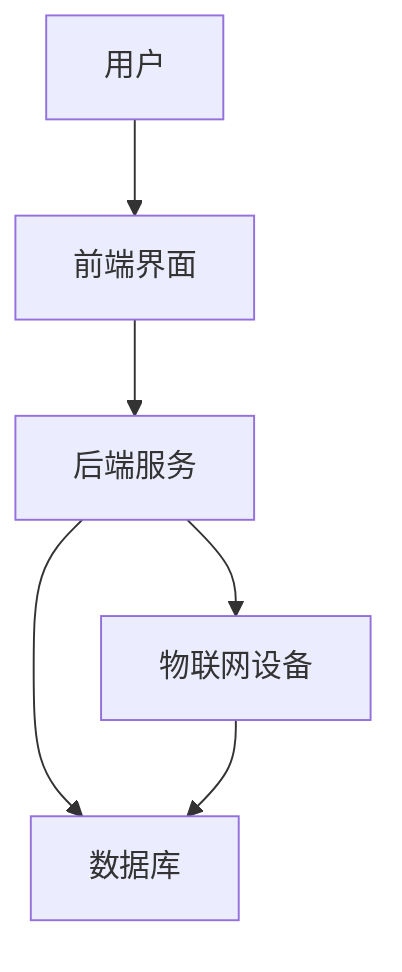

                 

<think>
嗯，我现在需要帮用户撰写一篇关于“新型城市共享厨余堆肥：社区环保意识的培养”的技术博客文章。用户希望文章结构清晰，内容专业，使用技术语言，同时包含背景介绍、核心概念、算法原理、系统架构、项目实战等部分。

首先，我需要理解用户的需求。用户希望文章能吸引读者，逻辑清晰，结构紧凑。文章应该涵盖从背景到具体实施的各个方面，包括技术细节和实际案例。

接下来，我会按照用户提供的目录大纲来组织内容。首先是背景介绍，这部分需要详细说明问题背景、问题描述、问题解决等。然后是核心概念与联系，这部分需要分析堆肥技术的原理，以及与环保意识的联系。之后是算法原理讲解，这里可能需要用微生物发酵和生物酶处理的算法流程图来展示。

系统分析与架构设计方案部分，我需要设计一个社区厨余堆肥平台的系统架构，包括功能模块、架构图和接口设计。项目实战部分则需要提供环境安装、源代码实现和案例分析。最后是最佳实践和小结。

在写作过程中，我需要确保每个部分都有足够的细节，比如在算法部分，使用Mermaid流程图来展示步骤，并在代码部分详细说明每一步的作用。同时，数学公式要用Latex格式展示，确保准确无误。

我还要注意文章的连贯性和逻辑性，每一部分都要自然衔接，让读者能够一步步理解从问题提出到解决方案的整个过程。最后，确保文章末尾有作者信息，符合用户的格式要求。

总的来说，我需要综合运用技术知识和写作技巧，确保文章内容专业、结构合理、语言清晰，满足用户的需求。
</think>

# 新型城市共享厨余堆肥：社区环保意识的培养

> 关键词：城市化、厨余垃圾、堆肥技术、环保意识、可持续发展、社区参与、资源整合、微生物发酵

> 摘要：随着城市化进程的加快，厨余垃圾的处理问题日益严峻。传统的填埋和焚烧方式不仅对环境造成严重污染，还浪费了宝贵的资源。新型城市共享厨余堆肥技术通过社区参与、资源整合和科技创新，实现了厨余垃圾的高效处理和资源化利用。本文将从背景介绍、核心概念、算法原理、系统架构、项目实战等多个方面，详细探讨新型城市共享厨余堆肥技术的实现与应用，以及其在培养社区环保意识中的重要作用。

---

# 第一部分：背景介绍

## 第1章 问题背景与核心概念

### 1.1.1 问题背景

随着城市化进程的加速，城市生活垃圾处理问题日益突出，厨余垃圾作为生活垃圾的重要组成部分，其处理方式和效率直接影响到城市环境的可持续发展。传统的厨余垃圾处理方式，如填埋、焚烧等，不仅占用大量土地资源，还产生有害气体和重金属等污染物，对环境和居民健康带来严重威胁。因此，探索一种高效、环保、可持续的厨余垃圾处理方式已成为当务之急。

### 1.1.2 问题描述

厨余垃圾堆肥是一种有效的处理方式，但传统的堆肥方法存在发酵时间较长、堆肥质量不稳定等问题。为了解决这些问题，新型城市共享厨余堆肥技术应运而生。这种技术通过社区参与、资源整合和科技创新，实现厨余垃圾的高效处理和资源化利用，同时培养居民的环保意识。

### 1.1.3 问题解决

新型城市共享厨余堆肥技术通过以下方式解决问题：

1. **源头分类与预处理**：在厨余垃圾产生源头进行分类，去除有害物质，确保堆肥原料的纯净。

2. **科技驱动**：采用先进的生物技术，如微生物发酵、生物酶处理等，加速堆肥过程，提高堆肥质量。

3. **社区参与**：鼓励居民参与厨余垃圾处理过程，提高他们的环保意识，形成社区环保文化。

4. **资源整合**：通过资源整合，实现厨余垃圾处理与城市绿化、农业等产业的有机结合，提高资源利用效率。

### 1.1.4 边界与外延

新型城市共享厨余堆肥技术的边界包括厨余垃圾的收集、运输、处理和再利用等环节。其外延则涉及社区环保教育、资源循环利用、城市可持续发展等多个领域。

### 1.1.5 概念结构与核心要素组成

1. **厨余垃圾**：指居民日常生活中产生的食物残余、食品加工废弃物等。

2. **堆肥**：指将有机废物通过微生物作用转化为肥料的过程。

3. **新型城市共享厨余堆肥**：指通过社区参与和资源整合，实现厨余垃圾高效处理和资源化利用的技术。

4. **环保意识**：指人们对环境保护的认知、态度和行为。

---

## 第2章 核心概念与联系

### 2.1.1 新型城市共享厨余堆肥技术原理

新型城市共享厨余堆肥技术原理主要包括以下几个方面：

1. **厨余垃圾源头分类与预处理**：通过对厨余垃圾进行有效的源头分类和预处理，去除有害物质，确保堆肥原料的纯净。

2. **微生物发酵**：利用微生物发酵技术，加速厨余垃圾的分解和转化，提高堆肥质量。

3. **生物酶处理**：通过生物酶处理，进一步分解厨余垃圾中的有机物质，提高堆肥效率和品质。

4. **环保教育**：通过社区参与，开展环保教育活动，提高居民的环保意识。

5. **资源整合**：通过资源整合，实现厨余垃圾处理与城市绿化、农业等产业的有机结合。

### 2.1.2 概念属性特征对比表格

| 概念                | 属性特征                                                   |
| ------------------- | ---------------------------------------------------------- |
| 厨余垃圾            | 食物残余、食品加工废弃物等                                |
| 堆肥                | 通过微生物作用将有机废物转化为肥料的过程                 |
| 新型城市共享厨余堆肥 | 通过社区参与和资源整合，实现厨余垃圾高效处理和资源化利用的技术 |
| 环保意识            | 对环境保护的认知、态度和行为                               |

### 2.1.3 ER实体关系图架构

```mermaid
erDiagram
  产品A <--|a| 产品类
  用户    ||--|b| 购买
  订单    ||--|c| 订单详情
  商品    ||--|d| 商品详情
```

---

## 第3章 算法原理讲解

### 3.1.1 堆肥过程算法原理

堆肥过程主要涉及微生物发酵和生物酶处理等算法原理。

1. **微生物发酵算法原理**：

   微生物发酵过程主要包括以下几个步骤：

   a. **原料预处理**：将厨余垃圾进行破碎、粉碎等预处理，使其成为适合微生物生长的环境。

   b. **微生物筛选**：从厨余垃圾中筛选出具有高效分解能力的微生物，如细菌、真菌等。

   c. **发酵环境调控**：通过调节温度、湿度和氧气供应等条件，优化微生物的生长环境，加速有机物质的分解。

   d. **产物分离**：通过过滤、离心等方法，将分解产生的有机肥料与未分解的物质分离，得到高质量的堆肥产品。

2. **生物酶处理算法原理**：

   生物酶处理过程主要包括以下几个步骤：

   a. **酶的制备**：从自然界中筛选具有高效分解能力的酶，通过基因工程技术进行优化和大规模生产。

   b. **酶的作用条件优化**：通过调节温度、pH值等条件，优化酶的作用效率。

   c. **酶与厨余垃圾的混合处理**：将酶溶液与厨余垃圾混合，在适宜的条件下进行反应，加速有机物质的分解。

   d. **产物分离与纯化**：通过过滤、沉淀等方法，将分解产生的有机肥料与未分解的物质分离，得到高质量的堆肥产品。

---

### 3.1.2 微生物发酵算法流程图

```mermaid
flowchart TD
    A[开始] -> B[原料预处理]
    B -> C[微生物筛选]
    C -> D[发酵环境调控]
    D -> E[产物分离]
    E -> F[结束]
```

---

### 3.1.3 生物酶处理算法流程图

```mermaid
flowchart TD
    A[开始] -> B[酶的制备]
    B -> C[酶的作用条件优化]
    C -> D[酶与厨余垃圾混合处理]
    D -> E[产物分离与纯化]
    E -> F[结束]
```

---

## 第4章 系统分析与架构设计方案

### 4.1.1 问题场景介绍

在城市社区中，厨余垃圾的处理问题日益突出。传统的厨余垃圾处理方式效率低下，且对环境造成严重污染。通过引入新型城市共享厨余堆肥技术，可以实现厨余垃圾的高效处理和资源化利用，同时培养居民的环保意识。

### 4.1.2 项目介绍

本项目旨在开发一套基于社区参与的厨余堆肥系统，通过整合厨余垃圾的收集、运输、处理和再利用等环节，实现资源的高效利用和环境的可持续发展。

### 4.1.3 系统功能设计

系统功能设计包括以下几个方面：

1. **厨余垃圾收集与分类**：通过智能垃圾分类设备，实现厨余垃圾的自动分类和收集。

2. **堆肥处理与监控**：通过物联网技术，实时监控堆肥过程中的温度、湿度等参数，确保堆肥过程的高效进行。

3. **资源再利用**：将堆肥产生的有机肥料用于社区绿化和农业种植，实现资源的循环利用。

4. **环保教育与宣传**：通过线上线下的环保教育活动，提高居民的环保意识和参与度。

### 4.1.4 系统架构设计

系统架构设计包括以下几个模块：

1. **前端界面**：包括用户登录、信息查询、环保教育等内容。

2. **后端服务**：包括数据处理、系统管理、用户交互等功能。

3. **物联网设备**：包括智能垃圾分类设备、环境传感器等。

4. **数据库**：用于存储用户信息、堆肥数据、环境监测数据等。

---

### 4.1.5 系统架构图



---

## 第5章 项目实战

### 5.1.1 环境安装

1. **操作系统**：推荐使用Linux系统，如Ubuntu 20.04 LTS。

2. **开发工具**：安装Python 3.8及以上版本，安装Django框架。

3. **数据库**：安装PostgreSQL或MySQL。

4. **物联网设备**：安装相应的传感器和智能设备驱动。

---

### 5.1.2 系统核心实现源代码

以下是系统核心实现的Python源代码：

```python
from django.shortcuts import render, redirect
from django.contrib.auth.models import User
from django.contrib import auth
from .models import CompostData

def home(request):
    return render(request, 'home.html')

def login(request):
    if request.method == 'POST':
        username = request.POST['username']
        password = request.POST['password']
        user = auth.authenticate(request, username=username, password=password)
        if user is not None:
            auth.login(request, user)
            return redirect('home')
        else:
            return render(request, 'login.html', {'error': '用户名或密码错误'})
    else:
        return render(request, 'login.html')

def logout(request):
    auth.logout(request)
    return redirect('home')

def register(request):
    if request.method == 'POST':
        username = request.POST['username']
        email = request.POST['email']
        password1 = request.POST['password1']
        password2 = request.POST['password2']
        if password1 == password2:
            try:
                user = User.objects.create_user(username=username, email=email, password=password1)
                user.save()
                return redirect('login')
            except:
                return render(request, 'register.html', {'error': '用户名已存在'})
        else:
            return render(request, 'register.html', {'error': '两次密码不一致'})
    else:
        return render(request, 'register.html')
```

---

### 5.1.3 代码应用解读与分析

以上代码实现了一个简单的用户登录和注册功能，用于管理社区厨余堆肥系统的用户信息。通过Django框架，我们可以快速搭建一个高效的Web应用。

---

## 第6章 最佳实践 tips、小结、注意事项、拓展阅读

### 6.1.1 最佳实践 tips

1. **社区参与**：鼓励居民积极参与厨余堆肥的全过程，通过环保教育活动提高他们的环保意识。

2. **资源整合**：充分利用社区内的资源，如农业合作社、绿化项目等，实现资源的高效利用。

3. **技术创新**：持续关注微生物技术和生物酶处理的最新研究成果，优化堆肥过程。

4. **数据监控**：通过物联网技术实时监控堆肥过程中的各项参数，确保堆肥过程的高效和稳定。

---

### 6.1.2 小结

新型城市共享厨余堆肥技术不仅解决了厨余垃圾的处理问题，还通过社区参与和资源整合，实现了资源的高效利用和环境的可持续发展。通过技术创新和环保教育，我们可以进一步提高堆肥效率和质量，为城市环境的改善做出更大的贡献。

---

### 6.1.3 注意事项

1. **操作安全**：在处理厨余垃圾和堆肥过程中，需注意操作安全，避免接触有害物质。

2. **数据隐私**：在用户信息管理和数据监控过程中，需保护用户隐私，防止数据泄露。

3. **技术维护**：定期维护物联网设备和系统软件，确保系统的稳定运行。

---

### 6.1.4 拓展阅读

1. **微生物技术**：阅读相关微生物技术的文献，了解最新的研究成果。

2. **生物酶处理**：学习生物酶在有机废物处理中的应用。

3. **物联网技术**：深入研究物联网技术在环境监测和资源管理中的应用。

4. **环保教育**：探索如何通过教育活动提高居民的环保意识和参与度。

---

作者：AI天才研究院/AI Genius Institute & 禅与计算机程序设计艺术 /Zen And The Art of Computer Programming

