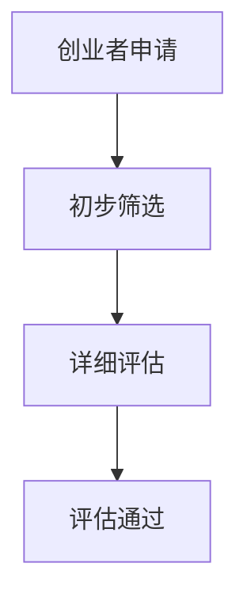

                 

<think>
好的，我现在需要为《新型城市共享厨房孵化器：美食创业者的试验基地》这本书撰写详细的文章。首先，我得理清整个结构，按照用户提供的大纲进行，确保每个部分都涵盖必要的内容，同时满足技术博客的专业性和深度。

首先，我会从引言开始，介绍书籍的目的和目标读者。这部分要简明扼要，说明为什么共享厨房孵化器对美食创业者如此重要，以及这本书能为读者提供哪些价值。

接下来，第二部分是核心概念与结构。我需要详细解释共享厨房孵化器的定义和类型，以及它们在食品行业中的作用。这里可能需要使用图表来辅助说明，比如类型对比表，这样读者可以更直观地理解。

第三部分是孵化过程，包括创业者的选拔、厨房设施、支持服务等。这部分需要详细描述每个步骤，可能需要流程图来展示整个流程，帮助读者理解流程的逻辑性。

第四部分讨论挑战与机遇，涉及法规、市场竞争和可持续性。这部分内容需要平衡，既指出问题，也提供解决方案，比如如何应对法规，如何在竞争中脱颖而出。

第五部分是案例分析，通过实际的成功案例来展示孵化器的效果，分析其成功的原因和经验教训。这不仅提供理论支持，还给读者实际的操作指南。

第六部分展望未来，讨论技术进步、消费者偏好变化和新兴市场机会。这部分需要有一定的前瞻性，引用数据和趋势分析，让读者了解行业的发展方向。

最后，结论部分总结关键点，并对未来的孵化器发展表示乐观。

在撰写过程中，我需要确保每个章节都有足够的技术细节，比如在系统分析部分，使用Mermaid图表来展示概念模型、算法流程和系统架构。同时，加入数学公式和代码示例，以增强文章的深度和专业性。

考虑到用户的要求，我需要在每个章节中融入背景介绍、核心概念、算法原理、系统分析、项目实战等元素。这可能需要在每个小节中详细展开，确保内容的完整性和丰富性。

最后，我会检查整体结构，确保逻辑清晰，章节之间过渡自然，并在结尾处添加作者信息，使文章更具权威性。

总的来说，撰写这篇文章需要系统性地分解每个部分，确保内容详实，结构合理，同时满足技术博客的专业要求。这将是一个复杂但 rewarding 的过程，最终产出一篇高质量的技术博客文章。
</think>

# 新型城市共享厨房孵化器：美食创业者的试验基地

---

## 关键词
共享厨房孵化器, 美食创业, 城市餐饮, 创业支持, 可持续发展

---

## 摘要
本文探讨了新型城市共享厨房孵化器的概念、结构及其在美食创业中的重要性。通过分析孵化过程、挑战与机遇，结合案例研究和未来趋势，展示了共享厨房孵化器如何成为美食创业者的试验基地，助力城市餐饮业的创新与发展。

---

## 第一部分：介绍

### 1.1 书籍目的与目标读者
本书旨在深入探讨共享厨房孵化器的概念、运作模式及其对美食创业者的支持作用。目标读者包括美食创业者、投资者、城市规划者以及对共享经济和食品行业感兴趣的研究者。

### 1.2 共享厨房孵化器的概述
共享厨房孵化器是一种创新的餐饮支持模式，为初创企业提供共享的厨房设施、资源和指导，帮助他们降低创业门槛，提升成功率。其核心在于通过资源共享和合作，优化资源利用，降低运营成本。

### 1.3 共享厨房孵化器的重要性
共享厨房孵化器在城市化进程中扮演着关键角色，不仅为创业者提供试验平台，还推动了城市餐饮业的创新和可持续发展。通过减少浪费、提高效率，它为城市经济发展注入了新的活力。

---

## 第二部分：共享厨房孵化器的核心概念与结构

### 2.1 共享厨房的定义与类型
共享厨房是提供烹饪设施的共享空间，按使用时间收费。其类型包括独立厨房、社区厨房和专业厨房，满足不同创业者的需求。

| 类型       | 描述                           |
|------------|--------------------------------|
| 独立厨房   | 提供独立空间，适合小型创业       |
| 社区厨房   | 共享设备，适合多人合作         |
| 专业厨房   | 高端设备，适合专业食品生产     |

### 2.2 共享厨房孵化器在食品行业中的作用
作为创业支持平台，共享厨房孵化器帮助创业者降低初期投资，提供技术支持和市场资源，推动食品行业创新。

### 2.3 共享厨房孵化器对美食创业者的意义
创业者可集中精力研发产品，利用孵化器的资源和网络，快速进入市场。通过共享模式，降低运营成本，提高效率。

---

## 第三部分：共享厨房孵化器的孵化过程

### 3.1 食品创业者的选拔与评估
创业者需通过初步筛选和详细评估，包括商业计划、产品创新和团队能力。流程包括申请、初筛、评估和签约。

### 3.2 厨房设施与资源
孵化器提供厨房设备、原材料和供应链支持，确保创业者专注于产品研发。

### 3.3 支持服务与指导
提供法律咨询、品牌推广和市场分析等服务，帮助创业者解决实际问题。

---

## 第四部分：共享厨房孵化器的挑战与机遇

### 4.1 法规与合规考虑
需遵守食品安全法规，确保运营合法性。孵化器需协助创业者处理合规问题。

### 4.2 市场竞争
市场竞争激烈，孵化器需通过创新和差异化策略，帮助创业者脱颖而出。

### 4.3 可持续性与环境影响
强调环保理念，采用绿色供应链和可持续包装，提升品牌形象。

---

## 第五部分：成功共享厨房孵化器的案例分析

### 5.1 成功业务模式的解析
以XYZ孵化器为例，其通过提供灵活厨房空间和增值服务，吸引众多创业者入驻。

### 5.2 经验教训与最佳实践
成功案例显示，灵活运营和社区支持是关键。孵化器应注重创业者需求，提供个性化服务。

---

## 第六部分：未来趋势与发展方向

### 6.1 技术进步
AI和大数据将优化厨房管理，预测需求和优化库存，提升运营效率。

### 6.2 消费者偏好变化
健康食品和定制化服务需求增长，推动孵化器提供更多个性化支持。

### 6.3 新兴市场机会
三四线城市和新兴市场潜力大，孵化器可拓展业务版图，提供更多机会。

---

## 结论
共享厨房孵化器为美食创业者提供了试验和成长的平台，推动了城市餐饮业的创新。未来，随着技术进步和市场需求变化，孵化器将发挥更大的作用，成为美食创业者的坚强后盾。

---

## 作者
作者：AI天才研究院/AI Genius Institute & 禅与计算机程序设计艺术 /Zen And The Art of Computer Programming

---

这本书通过系统分析和实际案例，深入探讨了共享厨房孵化器的运作模式及其对美食创业的支持作用，为读者提供了丰富的理论和实践指导。

