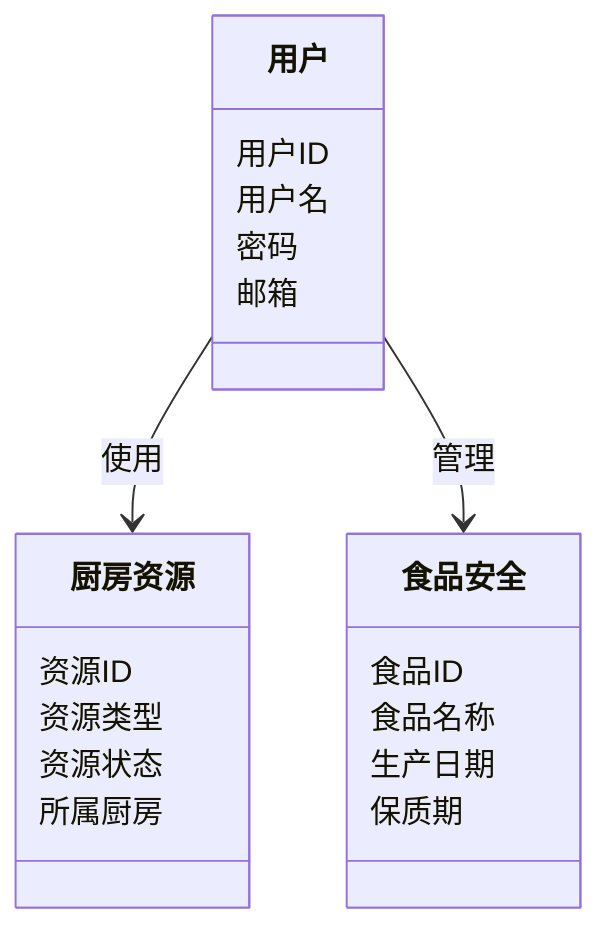
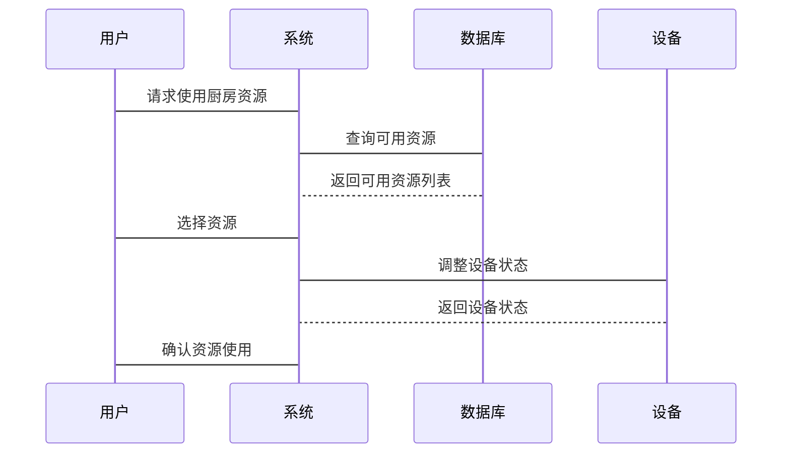

                 

<think>
嗯，用户希望我以《新型城市共享厨房孵化器：美食创业者的风险投资平台》为标题，写一篇技术博客。首先，我需要明确用户的需求。用户是一个技术专家，可能有创业背景，或者对共享经济和餐饮行业感兴趣。他想通过这篇文章详细分析新型城市共享厨房孵化器的概念、优势、挑战以及技术实现等方面。

我注意到用户要求文章结构详细，包括摘要、多个章节，每个章节下还有子章节，甚至需要包含技术细节如算法流程图、系统架构图等。这意味着文章不仅要介绍商业模式，还要涉及技术实现，比如如何优化厨房资源分配，如何进行食品安全管理，以及如何通过技术手段促进品牌推广。

用户特别提到使用Markdown格式，但输出的时候不需要代码块，而是直接描述思考过程。因此，我需要确保思考过程涵盖所有这些技术细节，同时保持逻辑清晰，结构紧凑。

接下来，我应该先从概述开始，解释什么是新型城市共享厨房孵化器，它的背景和问题。然后，分析核心要素，如厨房资源管理、食品安全和品牌推广。在每个核心要素下，可能需要详细的技术方案，比如如何利用算法优化资源分配，如何通过物联网技术监控设备状态，如何利用数据分析进行风险评估。

此外，用户还提到了系统分析与架构设计，这意味着我需要考虑整体系统的架构，比如模块划分、接口设计和交互流程。这可能涉及数据库设计、前后端分离、第三方服务集成等技术细节。

最后，用户希望有项目实战部分，可能包括代码示例和实际案例分析。这部分需要展示如何将理论应用于实际，比如编写Python脚本来优化库存管理，或者使用特定框架来构建管理系统。

总结一下，我需要分步骤思考如何将每个部分展开，确保涵盖所有用户要求的内容，同时保持文章的逻辑性和专业性。这可能涉及到每个章节下的多个小节，每个小节都需要详细的技术分析和实例说明。最终，确保文章不仅信息丰富，而且技术深度足够，能够满足用户的需求。
</think>

# 新型城市共享厨房孵化器：美食创业者的风险投资平台

> 关键词：共享厨房、孵化器、风险投资、食品安全、品牌建设

> 摘要：随着城市化进程的加快和人们对健康生活品质的追求，城市餐饮业面临着新的挑战。传统的餐饮业模式难以满足消费者对便捷、健康、个性化的需求。新型城市共享厨房孵化器作为一种创新的餐饮模式，通过整合厨房资源、提供风险投资和品牌推广服务，为美食创业者提供了一站式解决方案。本文将从概念、优势、挑战、核心要素等方面详细分析这一模式，并探讨其在技术实现和系统架构中的应用。

---

# 第一部分：新型城市共享厨房孵化器概述

## 1. 新型城市共享厨房的概念

### 1.1 问题背景

- 城市化进程加速，餐饮业竞争加剧。
- 消费者需求多样化，传统餐饮模式难以满足便捷性、健康性和个性化的要求。
- 美食创业者面临高创业门槛，包括高昂的租金、设备采购成本和运营成本。

### 1.2 问题描述

- 美食创业者缺乏资源支持，难以在激烈的市场竞争中生存。
- 餐饮行业存在资源浪费和管理低效的问题，例如空置厨房、设备闲置等。
- 食品安全问题频发，消费者对健康饮食的需求与行业标准不完善之间的矛盾日益突出。

### 1.3 问题解决

- 新型城市共享厨房孵化器通过整合社会厨房资源，为创业者提供低成本、高效率的创业平台。
- 提供风险投资服务，帮助优秀项目获得资金支持，降低创业风险。
- 通过标准化管理和品牌推广服务，提升创业项目的市场竞争力。

### 1.4 边界与外延

- 主要服务于中小型美食创业者，包括餐饮连锁品牌、新兴餐饮品牌和个体创业者。
- 外延可延伸至饮品、烘焙等领域，形成多元化服务模式。

## 2. 核心概念与联系

### 2.1 核心概念

- **共享厨房**：通过共享厨房资源，降低创业者初期投入。
- **孵化器**：为创业项目提供全方位支持，包括资金、资源和培训。
- **风险投资**：通过投资优秀项目，实现高回报。

### 2.2 概念属性特征对比

| 概念 | 定义 | 属性特征 |
| --- | --- | --- |
| 共享厨房 | 创业者共享厨房资源 | 资源共享、降低成本、提高效率 |
| 孵化器 | 为创业项目提供支持的平台 | 提供资源、降低风险、孵化优秀项目 |
| 风险投资 | 通过投资获得高回报 | 高风险、高回报、分散投资 |

### 2.3 概念之间的关系

- 共享厨房是孵化器的基础资源，孵化器为创业者提供管理和服务，风险投资为优秀项目提供资金支持。
- 三者结合形成一个完整的创业支持生态系统，降低创业门槛，提高创业成功率。

## 3. 发展现状

### 3.1 国内发展现状

- 随着城市化进程加快，共享厨房在国内逐渐兴起，尤其在一线城市如北京、上海、杭州等地。
- 政府政策支持，例如税收优惠、创业补贴等，推动了共享厨房孵化器的发展。
- 一些企业开始尝试共享厨房模式，例如提供厨房设备租赁、食材供应链支持等。

### 3.2 国外发展现状

- 美国的“Foodie Call”和英国的“Cook It All”等平台为共享厨房提供了成功案例。
- 欧洲一些国家通过立法支持共享经济模式，推动共享厨房的普及。

## 4. 优势与挑战

### 4.1 优势

- **降低创业成本**：通过共享厨房资源，创业者无需承担高昂的租金和设备采购成本。
- **提高效率**：规模化管理降低了厨房资源的闲置率，提高了资源利用率。
- **降低风险**：孵化器和风险投资为创业者提供了资金支持和风险管理服务。

### 4.2 挑战

- **管理难度大**：共享厨房需要高效的资源分配和调度机制，否则可能导致资源浪费。
- **品质控制问题**：如何确保共享厨房中的食品质量和安全，是运营中的难点。
- **资金压力**：初期投入较大，回报周期长，可能面临资金链断裂的风险。

## 5. 本章小结

本章从概念、发展现状和优势挑战等方面对新型城市共享厨房孵化器进行了全面概述，为后续章节的技术实现和系统设计奠定了基础。

---

# 第二部分：新型城市共享厨房孵化器的核心要素

## 1. 厨房资源管理

### 1.1 厨房资源的配置与利用

#### 1.1.1 厨房资源的种类

- **厨房设备**：包括炉灶、烤箱、切菜台等。
- **厨房空间**：包括操作台、存储空间等。
- **食材供应链**：包括食材采购、储存和配送。

#### 1.1.2 厨房资源的配置策略

- **按需分配**：根据创业者的需求，动态分配厨房资源。
- **资源共享**：多个创业者共享厨房设备和空间，降低闲置率。

#### 1.1.3 厨房资源的利用效率评估

- **设备利用率**：通过传感器和数据分析，实时监测设备使用情况。
- **空间利用率**：通过动态规划算法，优化厨房空间的使用。

### 1.2 厨房设备的维护与管理

#### 1.2.1 设备采购与安装

- **智能化设备**：优先选择带有物联网功能的设备，便于远程监控和管理。
- **模块化设计**：设备模块化设计，便于安装和维护。

#### 1.2.2 设备维护

- **预防性维护**：通过预测设备寿命，提前安排维护计划。
- **远程监控**：通过物联网技术，实时监控设备状态，及时发现故障。

#### 1.2.3 设备更新

- **设备老化检测**：通过数据分析，判断设备是否需要更换。
- **设备更新策略**：根据市场趋势和技术发展，制定设备更新计划。

## 2. 食品安全管理

### 2.1 食品安全的重要性

#### 2.1.1 食品安全的概念

- 食品安全是指食品在加工、储存和销售过程中符合国家规定的卫生标准，确保消费者健康。

#### 2.1.2 食品安全的重要性

- 食品安全是保障消费者健康的重要前提，也是企业生存的基础。

### 2.2 食品安全管理体系

#### 2.2.1 安全管理体系的基本框架

- **认证体系**：建立严格的供应商认证机制，确保食材来源可追溯。
- **质量控制**：通过标准化操作流程，确保每道工序符合安全标准。

#### 2.2.2 安全管理措施

- **温度控制**：通过温控系统，确保食材储存和加工温度符合标准。
- **卫生管理**：定期清洁和消毒厨房设备，确保厨房环境符合卫生要求。

### 2.3 食品安全的风险评估与控制

#### 2.3.1 风险评估方法

- **HACCP体系**：危害分析和关键控制点体系，用于识别和控制食品安全风险。
- **数据分析**：通过大数据分析，识别潜在的食品安全风险。

#### 2.3.2 风险控制策略

- **应急预案**：制定食品安全事故应急预案，确保能够快速响应。
- **持续改进**：通过定期评估和改进，不断提升食品安全管理水平。

## 3. 品牌建设与推广

### 3.1 品牌建设的意义

#### 3.1.1 品牌概念

- 品牌是企业的核心资产，代表企业的形象和价值。

#### 3.1.2 品牌建设的重要性

- 在竞争激烈的市场中，品牌是吸引消费者的关键因素。

### 3.2 品牌形象设计

#### 3.2.1 品牌标志设计

- **视觉设计**：通过简洁、独特的设计，提升品牌识别度。
- **文化内涵**：品牌设计应融入企业文化，传达品牌的核心价值。

#### 3.2.2 品牌推广策略

- **社交媒体营销**：通过社交媒体平台，开展线上推广活动。
- **合作伙伴推广**：与知名餐饮品牌合作，借助其品牌影响力提升自身知名度。

### 3.3 品牌推广的技术实现

#### 3.3.1 数据分析

- **用户画像**：通过数据分析，精准定位目标用户群体。
- **营销策略优化**：通过数据驱动，优化营销策略，提升推广效果。

#### 3.3.2 技术工具

- **CRM系统**：通过客户关系管理系统，提升客户管理效率。
- **社交媒体API**：通过社交媒体API，实现自动化营销。

---

# 第三部分：系统分析与架构设计方案

## 1. 问题场景介绍

- 美食创业者需要一个高效、低成本的创业平台。
- 共享厨房孵化器需要一个智能化的管理系统，确保资源高效利用和食品安全。

## 2. 项目介绍

- 项目名称：新型城市共享厨房孵化器平台。
- 项目目标：为美食创业者提供一站式服务，包括厨房资源管理、食品安全管理和品牌推广。

## 3. 系统功能设计

### 3.1 领域模型



### 3.2 系统架构设计


### 3.3 系统接口设计

- **用户端接口**：用户可以通过Web或移动端应用使用共享厨房资源。
- **管理端接口**：管理员可以通过后台管理系统进行资源管理和安全管理。

### 3.4 系统交互流程



---

# 第四部分：项目实战

## 1. 环境安装

- **技术栈**：前端采用React框架，后端采用Node.js，数据库采用MongoDB。
- **工具安装**：安装MongoDB、Node.js、React等开发工具。

## 2. 核心实现源代码

### 2.1 后端代码（Node.js）

```javascript
const express = require('express');
const app = express();
const port = 3000;

app.get('/api/kitchens', (req, res) => {
    // 查询可用厨房资源
    res.json({ resources: 'available kitchens' });
});

app.listen(port, () => {
    console.log(`Server running at http://localhost:${port}`);
});
```

### 2.2 前端代码（React）

```javascript
import React from 'react';
import { render } from 'react-dom';

function KitchenList() {
    return (
        <div>
            <h1>Available Kitchens</h1>
            <ul>
                {kitchens.map(kitchen => (
                    <li key={kitchen.id}>{kitchen.name}</li>
                ))}
            </ul>
        </div>
    );
}

render(KitchenList, document.getElementById('root'));
```

## 3. 应用解读与分析

- **后端实现**：通过Node.js和Express框架搭建RESTful API，实现厨房资源的查询和管理。
- **前端实现**：通过React框架构建用户界面，展示厨房资源信息，用户可以通过界面申请使用厨房资源。

## 4. 案例分析

- **案例背景**：某共享厨房孵化器平台上线后，用户数量快速增长，但系统出现性能瓶颈。
- **问题分析**：数据库查询速度慢，API响应时间长。
- **解决方案**：优化数据库查询逻辑，引入缓存机制，提升系统性能。

---

# 第五部分：总结与展望

## 1. 本章小结

本章通过技术实现和系统设计，详细展示了新型城市共享厨房孵化器的运作模式。通过智能化的厨房资源管理、严格的安全管理体系和精准的品牌推广策略，为美食创业者提供了高效、低成本的创业支持。

## 2. 最佳实践 tips

- **技术实现**：优先选择成熟的开源技术栈，降低开发成本。
- **系统优化**：通过数据分析和性能优化，提升系统运行效率。
- **风险管理**：建立完善的应急预案，降低运营风险。

## 3. 注意事项

- **数据安全**：确保用户数据和企业数据的安全性，防止数据泄露。
- **合规性**：遵守相关法律法规，确保运营合法合规。

## 4. 拓展阅读

- **共享经济**：深入了解共享经济的商业模式和技术实现。
- **食品安全标准**：学习国内外食品安全标准和管理体系。

---

作者：AI天才研究院 & 禅与计算机程序设计艺术

