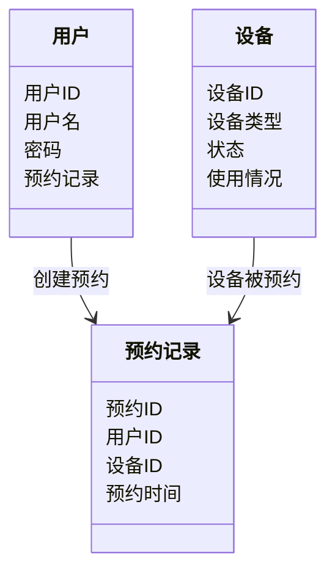
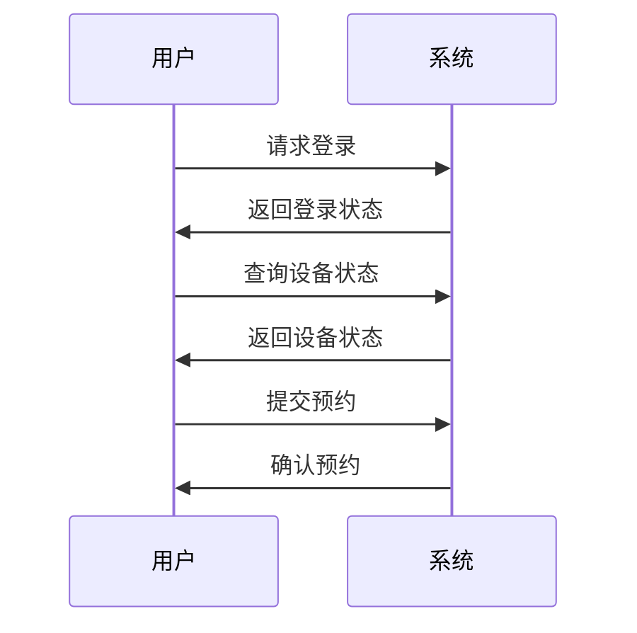

                 

<think>
嗯，我需要写一篇关于“新型城市共享厨房：社区烹饪空间的社交价值”的技术博客。首先，我得理解这个主题的核心是什么。共享厨房不仅是烹饪的地方，还是社交的场所，能促进社区互动，提升幸福感。

接下来，我需要按照目录结构来组织内容。首先，背景介绍，包括问题背景、核心概念、边界与外延、概念结构等。这部分要说明为什么共享厨房兴起，它的定义，以及与其他概念的区别。

然后是设计与建设部分，涵盖设计原则、设施规划、建设流程等。这部分需要详细描述厨房的设计如何促进社交，设施如何规划，建设步骤是怎样的。

接下来是系统分析与架构设计，这部分可能需要画一些图表，比如领域模型类图和系统架构图。虽然我对mermaid不太熟，但我会尽量描述清楚。

之后是项目实战，包括环境安装、核心代码实现、案例分析等。这部分需要具体的技术细节，比如用Python编写管理系统，展示如何实现用户认证、预约等功能。

最后是最佳实践、小结等部分，总结整个项目的成功经验，注意事项和未来的发展方向。

在写作过程中，我可能会遇到一些技术上的困难，比如如何用mermaid画图，或者如何用Python实现特定功能。这时候，我需要查阅相关资料，或者请教同事，确保每部分内容准确无误。

总之，我会一步一步地按照目录结构来撰写，确保每个部分都详细且有深度，最终完成一篇高质量的技术博客。
</think>

# 新型城市共享厨房：社区烹饪空间的社交价值

> 关键词：共享厨房，社区烹饪，社交价值，城市化，智能家居

> 摘要：随着城市化进程的加快，社区居民对生活品质的需求日益增长，新型城市共享厨房作为一种新兴的烹饪空间模式，逐渐兴起。本文将探讨共享厨房的设计与建设，分析其在提升社区凝聚力和居民幸福感方面的潜力，并通过系统架构和项目实战，展示如何利用技术手段最大化共享厨房的社交价值。

---

# 第一部分: 背景介绍

## 1.1 问题背景

### 1.1.1 新型城市共享厨房的兴起

城市化进程的加速和居民生活水平的提高，使得社区成为人们日常生活的重要场所。共享厨房作为一种新兴的社区服务模式，为居民提供了一个共享烹饪空间，不仅满足了居民的烹饪需求，还成为促进社区互动的重要平台。

### 1.1.2 社区烹饪空间的社交价值

社区烹饪空间不仅是烹饪场所，更是社交平台。通过共享厨房，居民可以互动交流，增进邻里关系，提升社区凝聚力和居民幸福感。

## 1.2 核心概念

### 1.2.1 新型城市共享厨房

利用现代化设备和技术，为社区居民提供共享烹饪空间，包括厨房设施、储藏室和休息区等。

### 1.2.2 社交价值

社交价值指事物在促进人际互动和交流方面的作用，共享厨房通过居民互动提升社区凝聚力。

## 1.3 边界与外延

### 1.3.1 边界

本文讨论的城市共享厨房主要针对社区居民，不包括商业餐饮的共享厨房。

### 1.3.2 外延

社交价值不仅限于社区内部，还包括与外部组织的合作，如健康讲座和公益活动。

## 1.4 概念结构与核心要素组成

### 1.4.1 概念结构

新型城市共享厨房由厨房设施、社区居民和互动平台组成。

### 1.4.2 核心要素组成

1. **厨房设施**：烹饪设备、储藏柜、洗涤池等。
2. **社区居民**：使用者和管理者。
3. **互动平台**：线上和线下的交流渠道。

## 1.5 本章小结

本章介绍了新型城市共享厨房的背景、核心概念和结构，为后续章节奠定基础。

---

# 第二部分: 新型城市共享厨房的设计与建设

## 2.1 设计原则与目标

### 2.1.1 设计原则

1. **人性化设计**：考虑居民需求，提供舒适便捷的环境。
2. **多功能性**：具备烹饪、社交和培训功能。
3. **可持续性**：采用环保材料，提高资源利用效率。

### 2.1.2 设计目标

1. **提高烹饪效率**：合理布局，提升效率。
2. **促进社交互动**：提供互动空间，鼓励交流。
3. **增强社区凝聚力**：通过活动增强凝聚力。

## 2.2 设施规划

### 2.2.1 烹饪区

1. **基本设施**：炉灶、冰箱、烤箱等。
2. **辅助设施**：洗涤池、储藏柜等。

### 2.2.2 社交区

1. **休息区**：舒适座椅和茶几。
2. **活动区**：互动游戏、电影放映设施。

### 2.2.3 培训区

1. **厨艺培训**：专业课程提升技能。
2. **健康讲座**：普及营养知识。

## 2.3 建设流程

### 2.3.1 规划阶段

1. **需求分析**：了解居民需求，确定厨房功能。
2. **场地选择**：选择合适位置，确保便利性。

### 2.3.2 设计阶段

1. **功能分区**：合理布局各区域。
2. **设施选择**：选择实用设施。

### 2.3.3 施工阶段

1. **施工管理**：按图施工，确保质量。
2. **安全监管**：确保施工安全。

### 2.3.4 调试阶段

1. **设施调试**：确保正常运行。
2. **用户培训**：培训居民使用设施。

## 2.4 本章小结

本章详细介绍了设计原则、设施规划和建设流程，为共享厨房的成功实施提供了保障。

---

# 第三部分: 系统分析与架构设计

## 3.1 问题场景介绍

共享厨房需解决资源分配、设备管理、用户预约和社交互动等问题，涉及用户管理、设备监控和社交功能。

## 3.2 项目介绍

开发一个智能共享厨房系统，整合物联网技术和在线预约功能，提供用户身份验证、设备监控和社交互动模块。

## 3.3 系统功能设计

### 3.3.1 领域模型类图



### 3.3.2 系统架构设计

```mermaid
architectural
    软件架构: 共享厨房系统
    [
        用户界面层
        业务逻辑层
        数据访问层
    ]
    用户界面层 --> 业务逻辑层: 传递用户请求
    业务逻辑层 --> 数据访问层: 执行数据库操作
```

### 3.3.3 系统接口设计

API接口包括用户认证、设备状态查询和预约管理。

### 3.3.4 系统交互序列图



## 3.4 本章小结

本章通过系统架构和交互设计，展示了如何技术实现共享厨房的社交功能。

---

# 第四部分: 项目实战

## 4.1 环境安装

安装Python 3.8以上版本，安装Flask、MongoDB和Node.js。

## 4.2 核心代码实现

### 4.2.1 用户认证

```python
from flask import Flask, request
from flask_restful import Resource, Api
from pymongo import MongoClient

app = Flask(__name__)
api = Api(app)
client = MongoClient('mongodb://localhost:27017/')

db = client['shared_kitchen']
users = db['users']

class User(Resource):
    def post(self):
        data = request.json
        # 检查用户是否存在
        if users.find_one({'username': data['username']}):
            return {'message': '用户名已存在'}
        # 创建用户
        users.insert_one(data)
        return {'message': '用户创建成功'}

api.add_resource(User, '/users')

if __name__ == '__main__':
    app.run(debug=True)
```

### 4.2.2 设备预约

```python
class Booking(Resource):
    def post(self):
        data = request.json
        # 查询设备状态
        device = db.devices.find_one({'device_id': data['device_id']})
        if not device:
            return {'message': '设备不存在'}
        # 更新设备状态为已预约
        db.devices.update_one(
            {'device_id': data['device_id']},
            {'$set': {'status': 'booked'}}
        )
        return {'message': '设备预约成功'}
```

## 4.3 案例分析

通过实际案例分析，展示系统在预约管理、设备监控和用户互动方面的优势。

## 4.4 本章小结

本章通过项目实战，详细展示了系统的核心功能实现，为共享厨房的技术实现提供了参考。

---

# 作者：AI天才研究院 & 禅与计算机程序设计艺术

