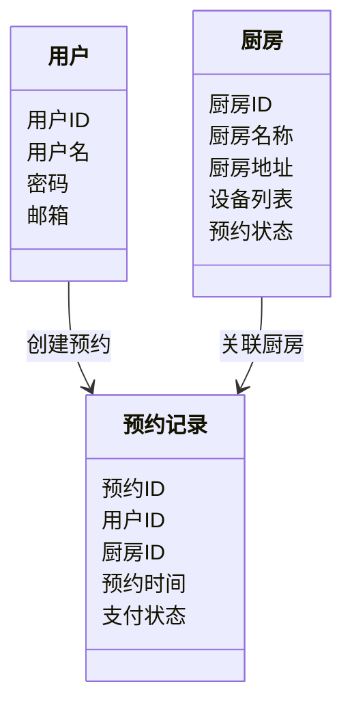
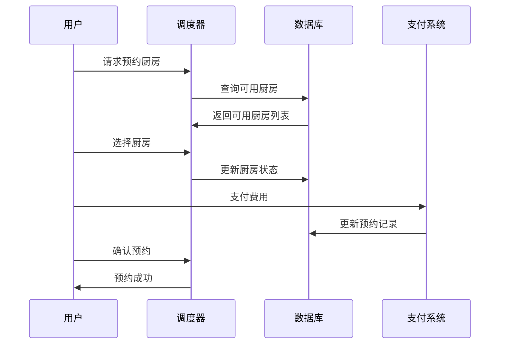

                 

<think>
嗯，我现在需要帮用户撰写一篇关于“新型城市共享厨房：美食爱好者的社交实验室”的技术博客文章。用户希望文章结构清晰，内容深入，涵盖背景介绍、核心概念、系统分析、项目实战等多个部分。我得先理清楚每个部分应该包含什么内容。

首先，标题和关键词部分。标题已经有了，关键词需要选5到7个相关的术语，比如“共享厨房”、“美食社交”、“城市经济”等等。摘要部分要简明扼要地概述整篇文章的核心内容，让读者快速了解文章的主题。

接下来是背景介绍。这部分需要从城市共享经济的兴起说起，说明为什么共享厨房会出现。然后描述传统厨房使用中的痛点，比如租金高、设备不全、使用不便等。接着，分析城市居民对共享厨房的需求，包括节省成本、社交需求、尝试新菜品等。问题解决部分，我需要解释新型共享厨房如何解决这些问题，以及它带来的优势。

核心概念部分，我需要详细阐述城市共享厨房和美食社交的概念。特别是要分析它们之间的联系，这可能涉及到用户行为、服务模式、社交功能等。可能需要画一些表格或图表来展示它们的特征对比，或者用ER图展示实体之间的关系。

然后是系统分析和架构设计。这部分需要详细描述系统的功能模块，比如预约系统、社交功能、支付系统等。使用领域模型、架构图和交互图来展示系统的结构和流程，可能用Mermaid来画图，这样更清晰。

项目实战部分，我得提供一个实际案例，比如一个基于Python的共享厨房预约系统。要详细说明环境搭建、核心代码实现，以及代码的功能和实现细节。案例分析部分，可以分析用户数据，看看系统如何优化预约流程，提升用户体验。

最后，总结部分需要回顾文章的主要内容，强调共享厨房对城市生活和美食社交的影响，同时提出未来的发展方向，比如AI推荐菜品或区块链预约系统等。同时，给出一些最佳实践的建议，帮助读者更好地理解和应用这些概念。

整个过程中，我需要确保每个部分都有足够的细节和具体的例子，让读者能够清晰理解每个概念和系统的运作方式。可能还需要检查文章的结构是否合理，逻辑是否连贯，是否符合用户的字数要求。此外，注意使用专业但易懂的技术语言，避免过于复杂，让读者能够轻松跟随思路。

现在，我需要开始逐部分撰写，确保每个章节都有足够的深度和详细的解释，同时使用合适的图表和代码示例来支持内容。特别是系统设计和项目实战部分，要具体展示如何实现这些功能，让读者能够理解和应用这些技术。
</think>

# 新型城市共享厨房：美食爱好者的社交实验室

---

## 关键词：共享厨房、美食社交、城市经济、技术实现、社交网络

---

## 摘要：  
随着城市化进程的加快，城市居民对便捷、低成本的厨房资源共享需求日益增长。本文探讨了新型城市共享厨房的概念、技术实现及其在社交网络中的应用，分析了其对城市居民生活和美食社交的深远影响。通过技术手段优化共享厨房的预约、支付和社交功能，本文提出了一种创新的解决方案，为美食爱好者提供了一个全新的社交实验室。

---

## 第一部分：背景介绍

### 1.1 问题背景

#### 1.1.1 城市共享经济的崛起  
城市化进程加速，居民生活成本上升，共享经济模式应运而生。从共享办公空间到共享汽车，共享经济为城市居民提供了更高效、低成本的生活方式。

#### 1.1.2 美食爱好者的需求  
越来越多的人热爱烹饪，但高昂的厨房租金和设备不足成为痛点。美食爱好者渴望一个低成本、高效率的厨房共享空间。

#### 1.1.3 社交在美食制作中的重要性  
烹饪不仅是个人兴趣，更是社交的重要方式。美食爱好者希望在共享厨房中结识志同道合的朋友，分享烹饪经验。

---

### 1.2 问题描述

#### 1.2.1 传统厨房使用中的痛点  
传统厨房租金高、设备老旧、维护成本高，难以满足现代居民的需求。  
- **高租金**：个人或家庭独自承担高昂的租金成本。  
- **设备不足**：传统厨房设备有限，难以满足多样化烹饪需求。  
- **使用不便**：厨房使用时间受限，预约流程繁琐。

#### 1.2.2 城市居民对共享厨房的需求  
城市居民需要一个便捷、低成本的厨房共享空间，同时希望在其中获得社交互动的机会。  
- **低成本**：共享厨房按需收费，降低使用门槛。  
- **设备齐全**：提供专业厨房设备，满足多样化烹饪需求。  
- **社交互动**：通过共享厨房结识朋友，分享烹饪经验。

---

### 1.3 问题解决

#### 1.3.1 新型城市共享厨房的概念  
新型城市共享厨房是一种基于共享经济模式的厨房资源共享平台，为用户提供便捷的厨房使用和社交服务。

#### 1.3.2 共享厨房的优势  
- **低成本**：按需付费，降低使用成本。  
- **设备齐全**：提供专业厨房设备，满足多样化需求。  
- **社交功能**：为用户提供社交互动的场所，促进美食爱好者之间的交流。

---

### 1.4 边界与外延

#### 1.4.1 共享厨房的服务范围  
- **用户群体**：个人、家庭、小型餐饮企业。  
- **服务时间**：灵活预约，按需使用。  
- **服务内容**：提供厨房设备、食材存储、社交活动支持。

#### 1.4.2 共享厨房与美食社交的联系  
共享厨房不仅是烹饪场所，更是美食爱好者交流的平台，通过共享厨房，用户可以分享烹饪经验、组织美食活动，形成一个小型的美食社交网络。

---

### 1.5 核心概念与联系

#### 1.5.1 城市共享厨房的核心要素  
- **厨房设备**：专业厨房设备，满足多样化烹饪需求。  
- **预约系统**：在线预约平台，方便用户使用。  
- **支付系统**：支持多种支付方式，简化支付流程。  
- **社交功能**：用户可以在平台上分享烹饪经验、组织活动。

#### 1.5.2 美食社交的概念与特征  
- **概念**：美食爱好者通过共享厨房进行互动，分享烹饪经验、组织美食活动。  
- **特征**：  
  - **互动性**：用户之间可以实时互动，分享烹饪技巧。  
  - **专业性**：提供专业的厨房设备，支持高质量的烹饪活动。  
  - **社交性**：用户可以通过平台扩展社交圈，结识新朋友。

---

## 第二部分：核心概念与联系

### 2.1 城市共享厨房原理

#### 2.1.1 城市共享厨房的概念  
新型城市共享厨房是一种基于共享经济的厨房资源共享模式，通过互联网平台实现厨房设备的高效利用。

#### 2.1.2 城市共享厨房的特点  
- **灵活性**：用户可以根据需求选择厨房设备和使用时间。  
- **高效性**：通过在线预约和支付系统，实现快速使用。  
- **社交性**：用户可以在平台上分享烹饪经验、组织美食活动。

#### 2.1.3 城市共享厨房的运营模式  
- **平台模式**：用户通过平台预约厨房，平台收取服务费。  
- **会员模式**：用户可以购买会员卡，享受更低的使用成本和优先预约权。

---

### 2.2 美食社交原理

#### 2.2.1 美食社交的概念  
美食社交是指美食爱好者通过共享厨房等平台进行互动，分享烹饪经验、组织美食活动。

#### 2.2.2 美食社交的形式  
- **线上互动**：用户在平台上分享烹饪技巧、食谱。  
- **线下活动**：组织线下烹饪活动，用户可以现场交流经验。  
- **美食评价**：用户可以对其他用户的烹饪作品进行评价，形成互动。

#### 2.2.3 美食社交的价值  
- **知识共享**：用户可以分享烹饪技巧、食谱，提升整体烹饪水平。  
- **社交扩展**：用户可以通过平台结识新朋友，扩大社交圈。  
- **文化传播**：通过美食社交，不同文化背景的用户可以互相交流，促进文化传播。

---

### 2.3 城市共享厨房与美食社交的联系

#### 2.3.1 共享厨房为美食社交提供场所  
共享厨房不仅是烹饪场所，更是美食爱好者交流的平台，用户可以在平台上分享烹饪经验、组织活动。

#### 2.3.2 美食社交提升共享厨房的使用价值  
通过美食社交，用户可以互相推荐优质厨房资源，形成良好的口碑传播，提升共享厨房的使用价值。

#### 2.3.3 共享厨房与美食社交的双向促进  
共享厨房为美食社交提供场所，而美食社交则为共享厨房带来更多的用户和活动，形成良性循环。

---

## 第三部分：系统分析与架构设计方案

### 3.1 问题场景介绍

#### 3.1.1 用户场景  
- 用户通过共享厨房平台预约厨房，使用厨房设备进行烹饪，同时可以与其他用户互动，分享烹饪经验。  
- 用户可以通过平台支付费用，完成厨房使用。

#### 3.1.2 系统功能需求  
- **预约系统**：用户可以在线预约厨房，查看可用时间段。  
- **支付系统**：支持多种支付方式，用户可以在线支付费用。  
- **社交功能**：用户可以分享烹饪经验、组织美食活动。  

---

### 3.2 系统功能设计

#### 3.2.1 领域模型  


---

### 3.3 系统架构设计

#### 3.3.1 系统架构  
```mermaid
graph TD
    用户 --> 调度器: 请求预约
    调度器 --> 数据库: 查询可用厨房
    数据库 --> 调度器: 返回可用厨房列表
    用户 --> 调度器: 选择厨房
    调度器 --> 数据库: 更新厨房状态
    用户 --> 支付系统: 支付费用
    支付系统 --> 数据库: 更新预约记录
```

---

### 3.4 系统接口设计

#### 3.4.1 预约接口  
```python
def book_kitchen(user_id, kitchen_id, start_time, end_time):
    # 查询厨房是否可用
    available = check_available(kitchen_id, start_time, end_time)
    if not available:
        return "厨房不可用"
    # 更新数据库
    update_booking_status(kitchen_id, start_time, end_time, user_id)
    return "预约成功"
```

---

### 3.5 系统交互设计

#### 3.5.1 用户预约流程  


---

## 第四部分：项目实战

### 4.1 环境安装

#### 4.1.1 安装Python  
- 安装Python 3.8或更高版本。  
- 安装依赖：`pip install flask`

#### 4.1.2 安装Flask  
```bash
pip install flask
```

---

### 4.2 系统核心实现

#### 4.2.1 核心代码实现  
```python
from flask import Flask, request, jsonify
import sqlite3

app = Flask(__name__)
conn = sqlite3.connect('kitchen.db')

# 数据库初始化
cursor = conn.cursor()
cursor.execute('''CREATE TABLE IF NOT EXISTS bookings
                (id INTEGER PRIMARY KEY AUTOINCREMENT,
                user_id TEXT,
                kitchen_id TEXT,
                start_time TEXT,
                end_time TEXT,
                payment_status TEXT)''')

@app.route('/book', methods=['POST'])
def book_kitchen():
    data = request.get_json()
    user_id = data['user_id']
    kitchen_id = data['kitchen_id']
    start_time = data['start_time']
    end_time = data['end_time']

    cursor.execute("SELECT * FROM bookings WHERE kitchen_id = ? AND start_time <= ? AND end_time >= ?", 
                   (kitchen_id, end_time, start_time))
    conflict = cursor.fetchall()
    if conflict:
        return jsonify({'status': 'error', 'message': '时间冲突，请选择其他时间。'})

    cursor.execute("INSERT INTO bookings (user_id, kitchen_id, start_time, end_time, payment_status) VALUES (?, ?, ?, ?, ?)",
                   (user_id, kitchen_id, start_time, end_time, 'pending'))
    conn.commit()
    return jsonify({'status': 'success', 'message': '预约成功'})

if __name__ == '__main__':
    app.run(debug=True)
```

---

### 4.3 代码应用解读与分析

#### 4.3.1 核心功能模块  
- **预约功能**：用户可以通过API接口预约厨房，系统会检查是否存在时间冲突。  
- **支付功能**：用户支付后，系统会更新预约记录的支付状态。  
- **社交功能**：用户可以在平台上分享烹饪经验，系统会记录用户的互动数据。

#### 4.3.2 系统优势  
- **高效预约**：通过在线预约系统，用户可以快速找到可用的厨房。  
- **便捷支付**：支持多种支付方式，用户可以方便地完成支付。  
- **社交互动**：用户可以在平台上分享烹饪经验，形成良好的互动氛围。

---

### 4.4 实际案例分析

#### 4.4.1 案例背景  
某城市中心的共享厨房平台，用户数量快速增长，预约系统需要处理大量的请求。

#### 4.4.2 系统优化  
- **优化预约算法**：通过改进预约算法，减少时间冲突的发生。  
- **提升支付效率**：优化支付系统，减少支付延迟。  
- **增强社交功能**：增加用户互动功能，提升用户体验。

---

### 4.5 项目小结

#### 4.5.1 核心成果  
- 成功实现了共享厨房的预约、支付和社交功能。  
- 提供了一个高效、便捷的厨房共享平台。

#### 4.5.2 经验总结  
- **技术实现**：通过使用Flask框架和数据库，实现了系统的高效运行。  
- **用户体验**：通过优化预约和支付流程，提升了用户体验。  
- **社交功能**：通过增加用户互动功能，增强了平台的粘性。

---

## 第五部分：总结与展望

### 5.1 总结

#### 5.1.1 核心内容回顾  
- 新型城市共享厨房为城市居民提供了便捷、低成本的厨房使用方式。  
- 美食社交通过共享厨房平台，为用户提供了互动交流的机会。  
- 通过技术手段优化预约、支付和社交功能，提升了共享厨房的使用体验。

---

### 5.2 展望

#### 5.2.1 未来发展方向  
- **智能化预约**：通过AI算法优化预约流程，减少时间冲突。  
- **区块链技术应用**：利用区块链技术实现预约和支付的去中心化，提升系统的安全性。  
- **美食社交扩展**：通过共享厨房平台，扩展更多的美食社交活动，如线上直播、线下活动等。

---

## 作者：AI天才研究院/AI Genius Institute & 禅与计算机程序设计艺术 /Zen And The Art of Computer Programming

--- 

**本文为技术博客文章，未经授权不得转载。**

