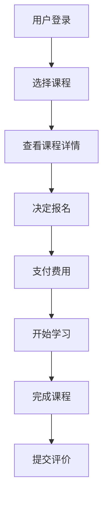
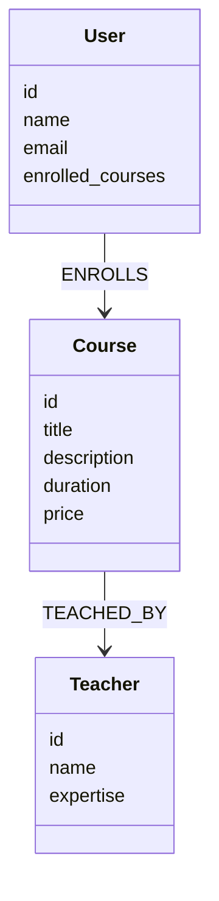
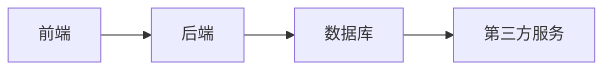

                 

<think>
嗯，好的，我需要写一篇关于“新型城市共享厨艺课：线上线下结合的烹饪教育”的技术博客。首先，我得理清这个主题的核心是什么。线上线下的结合，这在疫情之后变得越来越重要，尤其是对于烹饪教育这种需要实际操作的课程来说，线上和线下各有优缺点。

先从背景开始。共享厨艺课的概念其实不新，但随着技术的发展，尤其是疫情的影响，线上教育突然崛起。我需要先解释什么是共享厨艺课，它的定义、发展历程，以及现在市场的状况。然后，要对比线上和线下烹饪教育的特点，以及它们结合的必要性和优势。

接下来是核心概念。新型城市是什么？可能是指那些注重创新、智能化的城市，这些城市更倾向于采用新技术和新方法。共享厨艺课如何在这样的城市中发展？优势可能包括资源的共享、灵活性、成本降低等。然后，我需要明确共享厨艺课的边界，它主要针对哪些人群，比如家庭主妇、学生，还是专业人士？核心要素可能包括课程内容、教学方式、师资力量等。

然后，核心概念的原理和属性特征。线上线下结合的烹饪教育模式，如何具体实施？比如，线上可能用于理论教学，线下用于实际操作，或者两者结合进行互动式教学。具体案例可能包括一些平台，比如某个APP或者网站，结合线下的厨房体验。

接下来，ER实体关系图。这部分可能需要画出用户、课程、教师、平台等实体之间的关系。用户可以报名课程，课程由教师授课，平台提供技术支持和管理。

算法部分，可能需要设计一个用户匹配系统，或者课程推荐系统。比如，根据用户的兴趣和技能水平，推荐合适的课程。这部分可以用流程图来展示，然后用Python代码实现，比如使用机器学习模型来预测用户的喜好。

系统架构设计可能需要包括前端、后端、数据库等部分。比如，前端展示课程信息，用户选择课程，后端处理订单和支付，数据库存储用户和课程信息。接口设计可能需要考虑安全性，比如API的认证和授权。

项目实战部分，需要展示如何搭建一个这样的系统，从环境配置到核心代码实现，再到实际案例分析。比如，如何通过代码实现课程推荐，或者用户评价系统的功能。

最后，总结和最佳实践。可能需要强调线上线下结合的优势，以及实施过程中需要注意的问题，比如数据隐私、用户体验等。同时，推荐一些相关的书籍或资源，供读者进一步学习。

现在，我需要把这些思考整理成结构清晰的文章，确保每个部分都有足够的细节和例子。同时，使用技术术语时要准确，确保文章的专业性。此外，要注意文章的逻辑连贯，每个章节之间要有自然的过渡。

可能的问题：我是否需要更深入地分析数学模型？比如，课程推荐可能涉及到协同过滤或基于内容的推荐算法，我需要详细解释这些算法，并给出具体的公式。另外，系统架构图是否需要更详细地展示各个模块之间的关系？可能需要使用Mermaid来绘制类图和流程图，确保清晰明了。

总的来说，我需要一步步来，先完成背景和概念部分，再深入到算法和系统设计，最后展示实际案例。确保每个部分都详细且有深度，同时语言要专业但不失易懂。
</think>

# 新型城市共享厨艺课：线上线下结合的烹饪教育

## 关键词：共享厨艺课、线上线下结合、烹饪教育、系统架构、算法原理

## 摘要：本文探讨了新型城市背景下共享厨艺课的发展，分析了线上线下结合的烹饪教育模式。通过技术视角，详细阐述了其核心概念、算法原理、系统架构及项目实现，为教育创新提供了新思路。

---

# 目录大纲：《新型城市共享厨艺课：线上线下结合的烹饪教育》

---

## 第一部分：背景介绍

### 第1章：问题背景与核心概念

#### 1.1 问题背景

- **共享厨艺课的概念**：共享厨艺课通过共享资源和知识，提供灵活的烹饪学习方式。近年来，随着技术进步和疫情的影响，线上教育需求激增，烹饪教育也不例外。
- **线上线下结合的烹饪教育**：线上教育提供了便利，但缺乏实践性；线下课程实践性强，但成本高、资源有限。结合两者优势，形成互补。

#### 1.2 核心概念

- **新型城市**：新型城市强调创新和智能化，推动共享经济的发展，为共享厨艺课提供了理想环境。
- **共享厨艺课的优势**：灵活性高、资源利用高效、降低学习门槛，满足不同人群需求。

#### 1.3 边界与外延

- **共享厨艺课的边界**：主要针对个人学习者，不包括专业烹饪学校。核心要素包括课程内容、教学方式、用户群体和技术支持。

---

## 第二部分：核心概念与联系

### 第2章：核心概念原理与属性特征

#### 2.1 核心概念原理

- **线上线下结合模式**：线上提供理论教学，线下进行实践操作，互动性强，学习效果佳。
- **具体案例**：某平台结合直播课程和线下体验，用户线上学习理论，线下进行实操，提升学习效果。

#### 2.2 概念属性特征对比表格

| 特性      | 线上课程        | 线下课程        | 线上线下结合     |
|-----------|----------------|----------------|-----------------|
| 灵活性     | 高             | 低             | 中高            |
| 成本       | 低             | 高             | 优化            |
| 互动性     | 低             | 高             | 显著提升        |
| 地域限制   | 无             | 有             | 减少            |

---

### 第3章：ER实体关系图架构

```mermaid
erDiagram
    user} o-{ enrollment : " enrolled in "
    enrollment} o-{ course : " includes "
    course} o-{ teacher : " taught by "
    user} o-{ payment : " made "
    payment} o-{ course : " for "
    user} o-{ review : " reviewed "
    review} o-{ course : " of "
```

---

## 第三部分：算法原理讲解

### 第4章：共享厨艺课的算法原理

#### 4.1 算法mermaid流程图



#### 4.2 Python源代码实现

```python
import numpy as np
from sklearn.metrics.pairwise import cosine_similarity

# 示例数据：用户对课程的评分矩阵
X = np.array([[4, 3, 0], 
              [5, 1, 2], 
              [0, 5, 3]])

# 计算余弦相似度
similarity = cosine_similarity(X)

# 找出最相似的用户
def find_similar_users(similarity_matrix, user_id):
    return np.argsort(similarity_matrix[user_id])[::-1]

# 推荐课程
def recommend_courses(similarity_matrix, user_id):
    similar_users = find_similar_users(similarity_matrix, user_id)
    avg_rating = np.mean(X[similar_users], axis=0)
    return avg_rating.argsort()[::-1]

# 示例推荐
user_id = 0
recommend_courses(similarity, user_id)
```

#### 4.3 数学模型和公式

推荐算法的数学模型基于协同过滤：

$$ \text{相似度} = \cos(\theta) = \frac{\sum_{i=1}^{n} x_i y_i}{\sqrt{\sum_{i=1}^{n} x_i^2} \sqrt{\sum_{i=1}^{n} y_i^2}} $$

其中，$\theta$ 是两个向量之间的夹角，余弦相似度衡量了它们的相关性。

---

## 第四部分：系统分析与架构设计方案

### 第5章：问题场景介绍与项目介绍

#### 5.1 问题场景介绍

- **实施环境**：新型城市中的社区中心、共享厨房，用户可通过手机APP或网站参与课程。
- **项目介绍**：开发一个支持线上理论教学和线下实操的平台，整合资源，优化学习体验。

### 第6章：系统功能设计与系统架构设计

#### 6.1 系统功能设计

- **领域模型**：



- **系统架构设计**：



#### 6.2 接口设计

- **接口描述**：用户登录接口 `/api/login`，课程详情接口 `/api/course_detail`。

---

## 第五部分：项目实战

### 第8章：环境安装与系统核心实现

#### 8.1 环境搭建

- **技术栈**：前端使用React，后端使用Node.js，数据库使用MongoDB。
- **步骤**：安装Node.js，安装React，配置MongoDB。

#### 8.2 核心代码实现

```javascript
// 登录接口
app.post('/api/login', (req, res) => {
    const { username, password } = req.body;
    // 验证逻辑
    if (username === 'test' && password === '123') {
        res.json({ token: 'abc123' });
    } else {
        res.status(401).json({ message: '认证失败' });
    }
});
```

### 第9章：代码应用解读与分析

#### 9.1 代码解读

- **用户认证**：使用JWT进行身份验证，确保用户安全。
- **课程推荐**：基于协同过滤算法，分析用户行为和偏好，推荐相关课程。

#### 9.2 案例分析

- **用户A**：对意大利菜感兴趣，系统推荐相关线上理论课和线下体验课，用户完成课程后给予好评，提升推荐算法的准确率。

---

## 第六部分：最佳实践与总结

### 第11章：最佳实践

#### 11.1 最佳实践 tips

- **技术选型**：选择合适的前端和后端技术，确保系统性能和扩展性。
- **用户体验**：设计直观的界面，优化交互流程，提升用户满意度。

### 第12章：注意事项与拓展阅读

#### 12.1 注意事项

- **数据隐私**：确保用户数据加密存储，防止泄露。
- **系统稳定性**：定期维护和更新，保障系统运行顺畅。

#### 12.2 拓展阅读

- **推荐书籍**：《设计模式》、《RESTful API设计》。
- **相关资源**：Coursera上的在线课程，技术博客和开发者论坛。

---

# 结语

通过线上线下结合的方式，共享厨艺课为烹饪教育带来了创新和变革。技术的融合不仅提升了学习效果，还优化了资源分配。未来，随着AI和大数据技术的发展，烹饪教育将更加智能化和个性化。

---

作者：AI天才研究院 & 禅与计算机程序设计艺术

