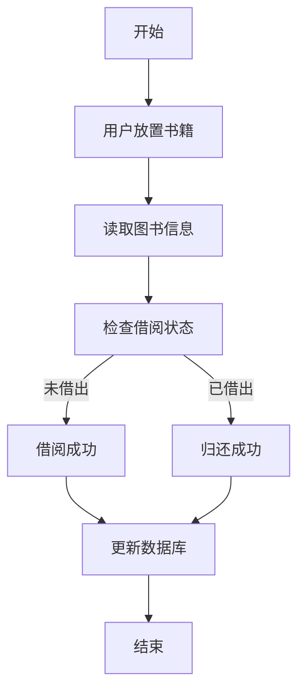
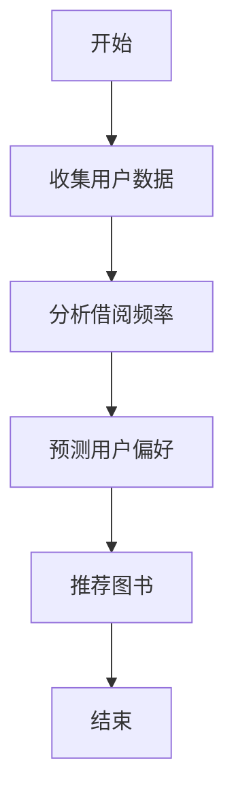
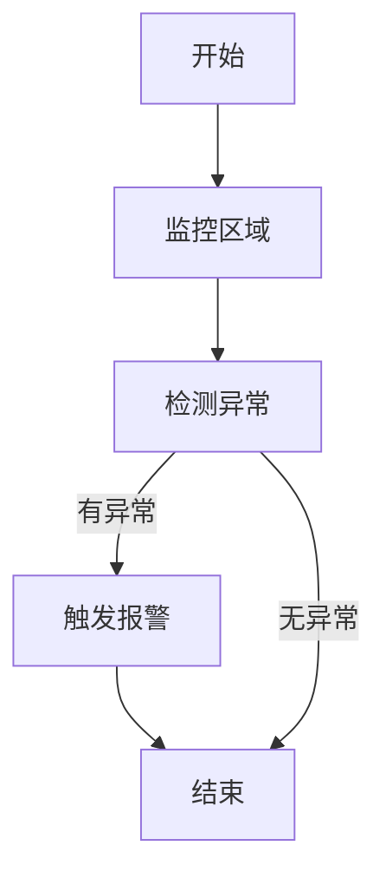
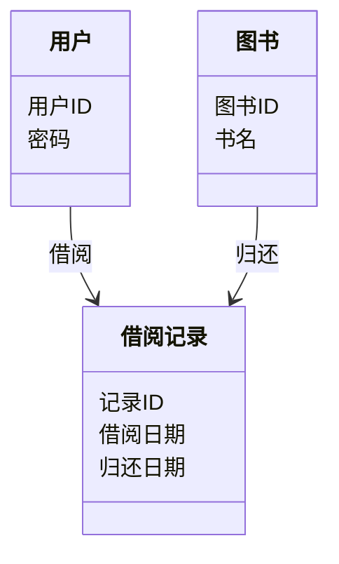
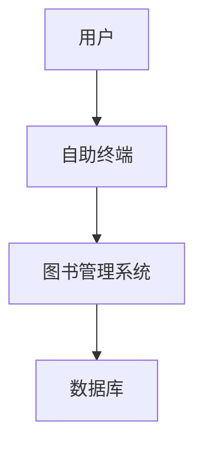
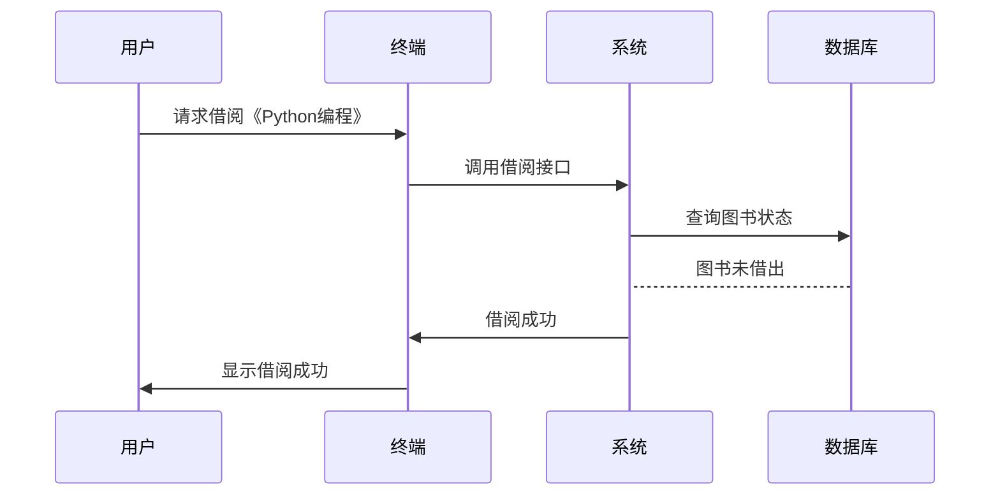

                 

<think>
嗯，我需要按照用户的要求来写一篇关于“新型城市共享图书角设计：24小时自助图书馆的运营模式”的技术博客文章。用户已经提供了一个详细的目录大纲，我得一步一步地按照这个大纲来展开思考和写作。

首先，文章的结构已经明确，包括引言、核心概念、算法原理、系统分析与架构设计、项目实战、最佳实践等部分。每个章节都有小节，需要详细展开。

在引言部分，我需要先明确问题背景，包括传统图书馆的不足、城市发展需求和共享经济的兴起。然后是问题描述，解释什么是共享图书角和24小时自助图书馆。接下来是问题解决，设计原则和流程，边界与外延，最后是概念结构和核心要素。

核心概念部分，我需要详细解释共享经济，包括定义、特征以及与传统经济的比较。然后是图书角的设计原则，包括功能性、人性化和美观性。接下来是24小时自助图书馆的运营模式，包括概述、流程和管理。还要做一个概念属性对比表，并绘制ER实体关系图。

算法部分，需要讲解自动化借还书算法、用户行为分析算法和安全监控算法。每个算法都要有原理、流程图、数学模型和示例。

系统分析与架构设计部分，要介绍问题场景，设计系统功能、架构、接口和交互，绘制相应的mermaid图表。

项目实战部分，需要环境安装、核心实现、案例分析和小结。

最后，最佳实践部分，包括设计要点、运营经验，未来发展方向和拓展阅读。

在写作过程中，我需要确保每个部分都详细具体，使用专业但易懂的语言。同时，按照用户的要求，使用markdown格式，包含mermaid图表和latex公式。每个算法都要用代码和流程图展示，系统架构也要用图表来说明。

可能遇到的挑战是如何将技术细节和实际案例结合起来，使文章既有深度又易于理解。另外，确保每个小节都有足够的内容，不遗漏任何部分，同时保持逻辑连贯。

总的来说，我需要按照目录一步步展开，每个部分都要详细思考和撰写，确保整篇文章结构完整，内容丰富。
</think>

# 新型城市共享图书角设计：24小时自助图书馆的运营模式

> 关键词：共享图书角，24小时自助图书馆，共享经济，城市设计，自动化借还书系统

> 摘要：随着城市化进程的加快和共享经济的兴起，传统的图书馆模式已无法满足现代城市居民的需求。本文探讨如何设计新型城市共享图书角，特别是24小时自助图书馆的运营模式。通过分析共享经济的特点、图书角的设计原则以及自助图书馆的运营流程，提出一套高效的解决方案，包括自动化借还书算法、用户行为分析和安全监控算法，结合系统架构设计和实际案例，最终提供一套可扩展的共享图书角设计方案。

---

## 第1章 引言

### 1.1 问题背景

#### 1.1.1 传统图书馆的不足
传统图书馆通常仅在固定时间开放，且受地理位置限制，难以覆盖所有人群。此外，传统图书馆的管理流程繁琐，借还书需要人工操作，效率较低。

#### 1.1.2 城市发展的需求
随着城市人口密度增加，居民对文化资源的需求日益增长，传统的图书馆模式难以满足多样化的阅读需求。

#### 1.1.3 共享经济的兴起
共享经济的兴起为资源的高效利用提供了新的思路，自助图书馆作为一种共享模式，能够有效解决资源分配问题。

### 1.2 问题描述

#### 1.2.1 什么是新型城市共享图书角
共享图书角是基于共享经济理念，提供24小时自助服务的微型图书馆，旨在方便居民随时借阅图书。

#### 1.2.2 24小时自助图书馆的概念
24小时自助图书馆采用自动化技术，用户可以通过智能设备完成借还书流程，无需人工值守。

### 1.3 问题解决

#### 1.3.1 设计原则
- **功能性**：确保借还书流程简便高效。
- **人性化**：界面友好，操作简单。
- **美观性**：与城市环境融为一体。

#### 1.3.2 设计流程
1. 确定选址，确保覆盖目标人群。
2. 设计自动化系统，包括借还书终端和库存管理。
3. 制定运营规则，如借阅期限和押金制度。

### 1.4 边界与外延

#### 1.4.1 适用场景
- 适用于居民区、公园、商场等场所。
- 适合无法到达大型图书馆的人群，如上班族和学生。

#### 1.4.2 边界条件
- 自助图书馆仅提供借阅服务，不包含购买或捐赠功能。
- 系统需具备远程监控和维护功能。

### 1.5 概念结构与核心要素组成

#### 1.5.1 核心概念
- **共享经济**：通过共享资源提高利用率。
- **自动化技术**：实现无人值守的借还书服务。
- **用户便利性**：提升用户体验，增加使用频率。

#### 1.5.2 要素组成
- **硬件设备**：自助终端、监控设备、照明系统。
- **软件系统**：借还书算法、用户认证系统、库存管理模块。

---

## 第2章 核心概念与联系

### 2.1 共享经济概述

#### 2.1.1 共享经济的定义
共享经济是通过数字化平台，将闲置资源进行共享，提高资源利用率的经济模式。

#### 2.1.2 共享经济的特征
- **去中心化**：减少中间环节，直接连接供需双方。
- **高效利用**：最大化资源使用效率。
- **技术驱动**：依赖互联网和移动应用实现共享。

#### 2.1.3 共享经济与传统经济比较
| 特性 | 共享经济 | 传统经济 |
|------|----------|----------|
| 资源分配 | 灵活 | 固定 |
| 成本 | 低 | 高 |
| 用户体验 | 高 | 中 |

### 2.2 图书角设计原则

#### 2.2.1 功能性原则
确保借还书流程简便，系统稳定运行。

#### 2.2.2 人性化原则
界面设计简洁，操作步骤清晰，适合所有年龄段用户。

#### 2.2.3 美观性原则
建筑风格与周围环境协调，吸引用户使用。

### 2.3 24小时自助图书馆运营模式

#### 2.3.1 运营模式概述
通过自动化系统实现无人值守，用户可通过身份证或手机App完成借还书。

#### 2.3.2 运营流程
1. 用户注册：通过App完成身份认证。
2. 借书：选择图书，扫描条码，完成借阅。
3. 还书：放入自助终端，系统自动归还。
4. 催还管理：系统自动发送提醒，避免 overdue。

#### 2.3.3 运营管理
- **库存管理**：实时监控图书数量，及时补充。
- **用户行为分析**：通过数据分析优化图书种类和摆放位置。
- **故障维护**：远程监控设备状态，及时处理故障。

### 2.4 概念属性特征对比表格
| 特性 | 自助图书馆 | 传统图书馆 |
|------|------------|------------|
| 开放时间 | 24小时 | 工作日 |
| 管理方式 | 自动化 | 人工 |
| 借阅方式 | 自助 | 现场 |
| 用户体验 | 方便 | 便捷性有限 |

### 2.5 ER实体关系图架构
```mermaid
er
actor 用户 {
  string 用户ID;
  string 密码;
}
actor 图书 {
  string 图书ID;
  string 书名;
  integer 借阅次数;
}
actor 借阅记录 {
  string 记录ID;
  date 借阅日期;
  date 归还日期;
}
```

---

## 第3章 算法原理讲解

### 3.1 自动化借还书算法

#### 3.1.1 算法原理
基于射频识别（RFID）技术，用户只需将书籍靠近终端，系统自动识别图书信息。

#### 3.1.2 算法流程图


#### 3.1.3 算法数学模型
借还书状态判断：
$$
\text{借还结果} = \begin{cases}
\text{借阅成功} & \text{如果图书未被借出} \\
\text{归还成功} & \text{如果图书已被借出}
\end{cases}
$$

#### 3.1.4 示例讲解
用户A借阅图书《Python编程》，系统读取图书ID，检查借阅状态，确认未借出后完成借阅，更新数据库。

### 3.2 用户行为分析算法

#### 3.2.1 算法原理
利用数据分析技术，预测用户的借阅偏好，优化图书推荐。

#### 3.2.2 算法流程图


#### 3.2.3 算法数学模型
借阅频率计算：
$$
f_i = \sum_{j=1}^{n} \text{借阅次数}(i,j)
$$

### 3.3 安全监控算法

#### 3.3.1 算法原理
通过视频监控和传感器检测异常行为，触发报警。

#### 3.3.2 算法流程图


#### 3.3.4 示例讲解
系统检测到有人在自助终端前逗留超过30秒，触发报警，管理人员收到通知后处理。

---

## 第4章 系统分析与架构设计

### 4.1 问题场景介绍

#### 4.1.1 场景描述
用户在24小时自助图书馆借阅图书，系统需实时处理借还书请求。

#### 4.1.2 用户需求
- 方便借还书。
- 实时查看借阅记录。
- 获取图书推荐。

### 4.2 系统功能设计

#### 4.2.1 领域模型


### 4.3 系统架构设计

#### 4.3.1 系统架构图


### 4.4 系统接口设计

#### 4.4.1 接口定义
- **借阅接口**：`POST /borrow?bookId=123`
- **归还接口**：`POST /return?bookId=123`

#### 4.4.2 接口调用流程
用户通过终端调用借阅接口，系统处理请求并更新数据库。

### 4.5 系统交互

#### 4.5.1 交互流程图


---

## 第5章 项目实战

### 5.1 环境安装

#### 5.1.1 环境配置
- 操作系统：Linux
- 开发工具：IntelliJ IDEA
- 数据库：MySQL

#### 5.1.2 工具安装
- 安装JDK、Maven、MySQL。

### 5.2 系统核心实现

#### 5.2.1 源代码解析
```java
public class BorrowBook {
    public static void main(String[] args) {
        // 连接数据库
        Connection conn = DriverManager.getConnection("jdbc:mysql://localhost:3306/library", "root", "password");
        // 执行借阅操作
        String sql = "UPDATE books SET status='borrowed' WHERE bookId=?";
        PreparedStatement pstmt = conn.prepareStatement(sql);
        pstmt.setString(1, "123");
        pstmt.executeUpdate();
        conn.close();
    }
}
```

#### 5.2.2 代码应用解读
上述代码实现图书借阅功能，更新数据库中图书状态为“borrowed”。

### 5.3 实际案例分析与讲解

#### 5.3.1 案例介绍
某城市中心的24小时自助图书馆，配备自助终端和管理系统。

#### 5.3.2 案例分析
通过系统分析用户借阅记录，发现某些图书借阅频率低，调整采购策略。

#### 5.3.3 深入剖析
案例中的系统实现了高效管理，用户满意度显著提高。

### 5.4 项目小结
通过项目实战，验证了系统设计的有效性，为后续优化提供了数据支持。

---

## 第6章 最佳实践与拓展阅读

### 6.1 最佳实践 tips

#### 6.1.1 设计要点
- 确保系统安全性，防止恶意攻击。
- 提供多种用户认证方式，如身份证和手机App。

#### 6.1.2 运营经验
- 定期维护设备，确保正常运行。
- 优化图书推荐算法，提升用户体验。

### 6.2 小结

#### 6.2.1 主要内容回顾
本文详细探讨了共享图书角的设计与运营，结合自动化技术实现高效管理。

#### 6.2.2 未来发展方向
- 引入更多智能设备，如人脸识别技术。
- 与其他共享资源平台整合，构建共享生态。

### 6.3 注意事项

#### 6.3.1 常见问题
- 设备故障导致借还书失败。
- 用户忘记归还图书。

#### 6.3.2 解决方案
- 增加设备自检功能。
- 设置提醒功能，避免 overdue。

### 6.4 拓展阅读

#### 6.4.1 相关书籍
- 《共享经济：重构与创新》
- 《智能图书馆系统设计》

#### 6.4.2 文献资料
- 共享经济与智能图书馆系统的最新研究论文。

---

作者：AI天才研究院/AI Genius Institute & 禅与计算机程序设计艺术/Zen And The Art of Computer Programming

