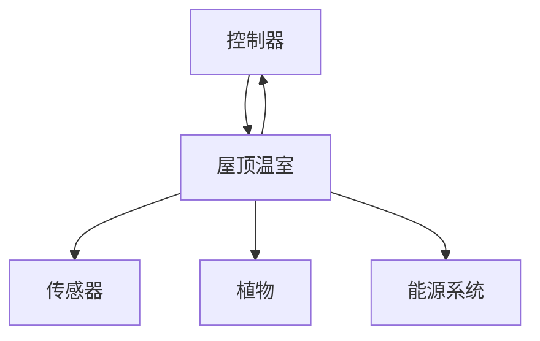
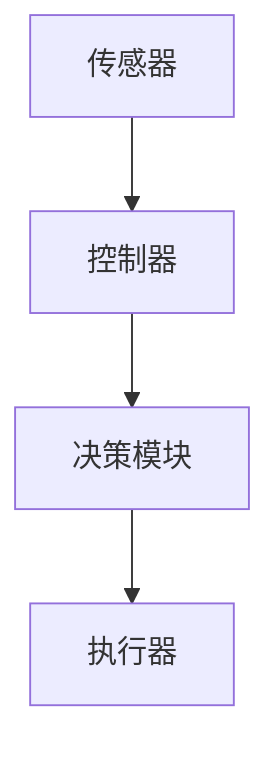
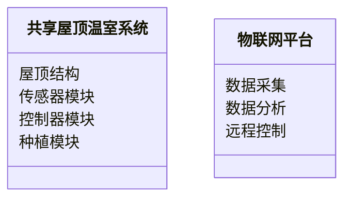
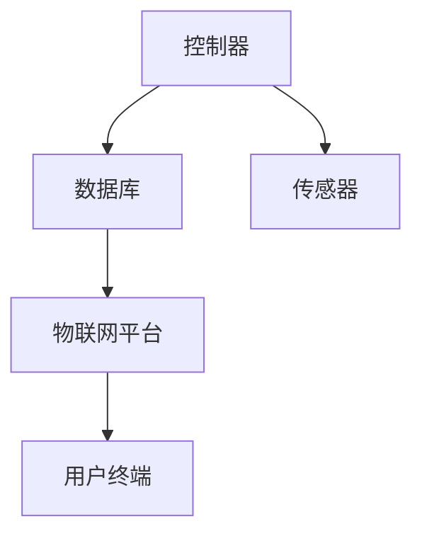

                 

<think>
嗯，用户给了我一个任务，让我写一篇关于“新型城市共享屋顶温室：四季都市农耕的技术与实践”的技术博客。我需要先仔细分析这个任务的要求，确保我理解所有的细节。

首先，用户希望我以一位世界级的人工智能专家、程序员、软件架构师、CTO和畅销书作者的身份来撰写这篇文章。这意味着我需要用专业且易懂的技术语言，逻辑清晰，结构紧凑，同时要有深度和见解。

文章需要有明确的标题，关键词，摘要，然后按照目录大纲展开。目录已经给出，包括引言、背景、设计、技术、实际应用、操作与维护、未来趋势、结论等部分。每个部分下还有更细的章节，我需要确保每个章节都有足够的内容，详细讲解。

用户还强调了文章的结构，包括背景介绍、核心概念与联系、算法原理、系统分析与架构设计、项目实战、最佳实践等部分。我需要确保每个部分都涵盖这些内容，并使用适当的图表，比如Mermaid流程图和类图，来辅助说明。

接下来，我需要考虑用户可能的深层需求。他们可能希望这篇文章不仅描述技术，还能展示实际的应用案例，帮助读者理解如何在实际中应用这些技术。因此，加入实际案例分析和代码示例会非常重要。

我还需要注意文章的格式要求，使用markdown，作者信息要在最后，关键词和摘要在开头部分。此外，数学公式要用latex，确保格式正确。

现在，我需要开始撰写摘要，概述文章的核心内容。然后按照目录大纲，逐步展开每个部分。每个章节都需要详细讲解，确保内容丰富具体，同时保持逻辑清晰。

在撰写过程中，我可能会遇到如何将技术内容与实际应用相结合的问题。这时，我需要找到合适的案例，比如国内外的成功项目，来说明技术的实际效果。同时，系统架构设计部分需要详细描述，可能包括模块划分和接口设计，这部分可能需要绘制架构图来辅助说明。

另外，我还需要考虑读者的背景。虽然读者可能是技术人员，但文章需要让非专家也能理解，因此在解释复杂概念时，我需要用简单明了的语言，并辅以图表。

最后，检查文章是否符合字数要求，大约1万到1.2万字。我需要确保每个章节都有足够的深度，同时避免冗长。可能需要在每个小节中加入详细的解释和实例，以确保文章的完整性和可读性。

总的来说，我需要按照用户的要求，一步一步地构建这篇文章，确保每个部分都详细且有条理，同时展示出技术的深度和实际应用的价值。
</think>

# 新型城市共享屋顶温室：四季都市农耕的技术与实践

**关键词**：共享屋顶温室、城市农业、智能温室系统、物联网技术、可持续农业、都市农耕

**摘要**：  
随着城市化进程的加快，城市土地资源的稀缺性和环境污染问题日益突出，如何在有限的空间内实现高效的都市农业成为一项重要挑战。共享屋顶温室作为一种创新的解决方案，结合了物联网、智能控制技术和现代农业理念，为城市居民提供了四季持续的绿色食品供应。本文将从技术原理、系统设计、实际应用和未来发展趋势等方面，全面探讨共享屋顶温室的技术与实践，为城市农业的可持续发展提供新的思路。

---

## 1. 引言

### 1.1 城市化与土地资源的矛盾  
随着城市化进程的加快，土地资源日益紧张，城市居民对新鲜农产品的需求不断增加，如何在有限的空间内实现高效农业成为一个重要问题。屋顶作为城市中未被充分利用的资源，为城市农业提供了新的可能性。

### 1.2 共享屋顶温室的概念与意义  
共享屋顶温室是一种创新的农业模式，通过在建筑物屋顶建设温室，利用物联网、智能控制等技术实现四季种植。这种模式不仅充分利用了城市空间，还为城市居民提供了绿色食品，同时缓解了城市热岛效应。

---

## 2. 背景与基础

### 2.1 城市农业的历史与现状  
城市农业起源于古代，但现代城市农业的发展受到技术、政策和经济等多方面的影响。本文将从历史背景出发，分析现代城市农业的发展趋势。

**核心概念与联系**  
| 概念 | 定义 | 特性 |
|------|------|------|
| 城市农业 | 在城市区域内进行的农业生产活动 | 高效性、可持续性、多样性 |
| 共享屋顶温室 | 利用建筑物屋顶建设的温室系统 | 共享性、智能化、可持续性 |

### 2.2 共享屋顶温室的核心要素  
共享屋顶温室的核心要素包括：  
1. **温室结构**：采用轻钢结构，适应屋顶环境。  
2. **环境控制系统**：通过传感器和智能设备实现温湿度、光照等环境参数的精准控制。  
3. **种植系统**：采用无土栽培、水培等技术，提高种植效率。  
4. **能源系统**：利用太阳能、地热等可再生能源，降低能耗。  

**ER实体关系图**  


---

## 3. 设计与技术

### 3.1 共享屋顶温室的设计原则  
1. **结构设计**：轻钢结构，抗风、抗震、防水。  
2. **空间利用**：模块化设计，可根据屋顶面积灵活调整。  
3. **环境控制**：温湿度、光照、二氧化碳浓度等参数的实时监测与调节。  

### 3.2 智能温室系统的实现  
智能温室系统通过物联网技术实现远程监控和自动化管理。  

**算法原理**  
温室环境控制算法如下：  



数学模型：  
$$ T = T_{target} + k \cdot (T_{in} - T_{target}) $$  
其中，$T$ 是当前温度，$T_{target}$ 是目标温度，$k$ 是比例系数，$T_{in}$ 是输入温度。

### 3.3 技术挑战与解决方案  
1. **能源消耗**：通过太阳能、地热等可再生能源降低能耗。  
2. **设备可靠性**：采用冗余设计和故障自愈技术，确保系统稳定运行。  

---

## 4. 实际应用

### 4.1 典型案例分析  
国内外已有多项共享屋顶温室的成功案例。例如，某城市中心的屋顶温室项目，年均节约能源消耗30%，蔬菜产量提高20%。  

### 4.2 社区参与与共享模式  
共享屋顶温室的成功离不开社区的参与。通过社区合作、众筹等方式，降低建设和运营成本，同时增强居民的参与感和认同感。  

---

## 5. 系统分析与架构设计

### 5.1 系统功能设计  
共享屋顶温室系统的主要功能包括：  
1. **环境监测**：实时监测温湿度、光照、二氧化碳浓度等参数。  
2. **自动控制**：根据环境数据自动调节温室环境。  
3. **远程监控**：通过物联网平台实现远程监控和管理。  

**领域模型**  


### 5.2 系统架构设计  


### 5.3 接口与交互设计  
系统接口设计包括：  
1. **传感器接口**：与温湿度、光照传感器连接。  
2. **用户接口**：提供Web或移动端的监控界面。  

---

## 6. 项目实战

### 6.1 环境搭建  
需要安装以下软件：  
- **操作系统**：Linux或Windows。  
- **开发工具**：Python、Node.js、数据库（MySQL或MongoDB）。  
- **物联网平台**：ThingsBoard或Kaa IoT。  

### 6.2 核心代码实现  
以下是一个简单的温室环境监控系统的Python代码示例：  

```python
import time
import Adafruit_DHT

# 设置传感器类型和GPIO引脚
SENSOR_TYPE = Adafruit_DHT.DHT22
SENSOR_PIN = 4

# 初始化传感器
def get_sensor_data():
    humidity, temperature = Adafruit_DHT.read_retry(SENSOR_TYPE, SENSOR_PIN)
    return temperature, humidity

# 数据存储
def store_data(temperature, humidity):
    # 连接到数据库
    import mysql.connector
    cnx = mysql.connector.connect(user='admin', password='password', host='localhost')
    cursor = cnx.cursor()
    query = "INSERT INTO greenhouse_data (temperature, humidity) VALUES (%s, %s)"
    cursor.execute(query, (temperature, humidity))
    cnx.commit()
    cursor.close()
    cnx.close()

# 主程序
while True:
    temp, hum = get_sensor_data()
    print(f"Temperature: {temp}C, Humidity: {hum}%")
    store_data(temp, hum)
    time.sleep(60)
```

---

## 7. 未来趋势与创新

### 7.1 智能化与自动化  
未来的共享屋顶温室将更加智能化，通过AI技术实现精准种植和资源优化配置。  

### 7.2 可持续发展  
结合太阳能、雨水收集等技术，进一步降低能源和水资源消耗。  

### 7.3 社区化与共享经济  
共享屋顶温室将与社区经济深度融合，形成更加高效和可持续的农业模式。  

---

## 8. 结论与建议

### 8.1 核心结论  
共享屋顶温室作为一种创新的城市农业模式，通过技术与实践的结合，为城市居民提供了绿色、健康的食品，同时也为城市可持续发展提供了新的思路。  

### 8.2 实践建议  
1. **技术优化**：进一步完善环境控制系统，提高能源利用效率。  
2. **政策支持**：政府应出台相关政策，鼓励共享屋顶温室的发展。  
3. **社区参与**：加强社区居民的参与和合作，形成可持续的运营模式。  

---

**作者：AI天才研究院/AI Genius Institute & 禅与计算机程序设计艺术 /Zen And The Art of Computer Programming**

