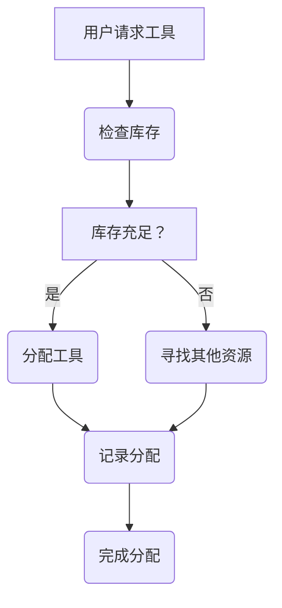
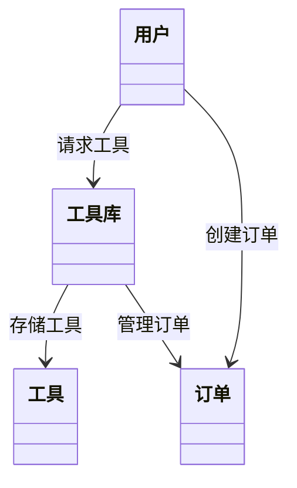
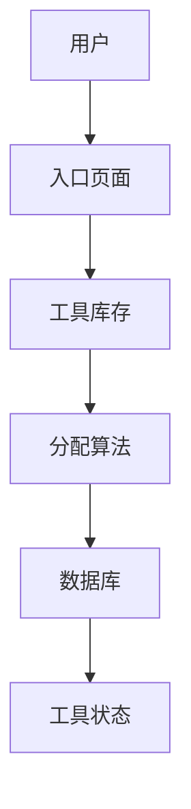
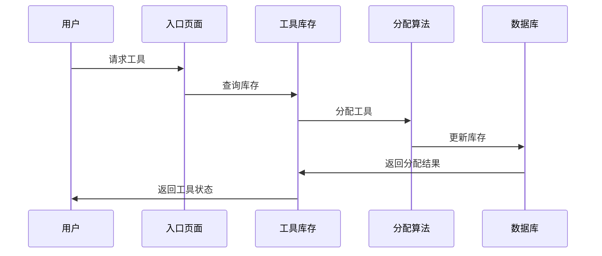

                 

<think>
嗯，用户希望我撰写一篇关于“新型城市共享工具图书馆：可持续消费的社区模式”的技术博客。首先，我需要理解这个主题的核心是什么。共享工具图书馆是一种社区模式，旨在通过共享资源来促进可持续消费。这可能涉及到共享经济、社区建设、资源管理等多个方面。

用户提供了详细的大纲，包括背景介绍、核心概念、算法原理、系统架构设计、项目实战、最佳实践等部分。我需要按照这个大纲逐步展开，确保每个部分都详细且有深度。

首先，背景介绍部分，我需要分析城市共享工具图书馆的产生背景，可能是因为资源浪费、环境污染等问题，人们开始寻求更可持续的消费方式。然后，要明确问题，比如资源分配不均、可持续性不足等，以及现有的解决方案的不足之处。

接下来是核心概念与联系，这部分需要详细解释共享经济、可持续消费、社区模式等概念，并通过对比表格和ER图来展示它们之间的关系。我需要确保这些概念清晰易懂，同时展示它们如何相互作用。

算法原理部分，我需要设计一个资源分配和管理系统。可能使用Python编写，展示流程图和数学模型，比如使用队列或某种优化算法来分配资源，确保效率和公平性。还需要提供实际例子来解释算法的工作原理。

系统分析与架构设计部分，我需要介绍图书馆的运营场景，项目目标，然后绘制领域模型类图和系统架构图。这部分可能需要考虑用户界面、库存管理、预约系统等模块，展示它们如何交互。

项目实战部分，我需要指导读者如何安装环境，比如安装Python和相关库，然后提供核心代码片段，解释其功能。通过实际案例分析，展示系统的应用效果，并总结项目的经验和教训。

最佳实践部分，我需要分享在实际操作中遇到的问题和解决方法，提醒读者注意的事项，并推荐相关书籍或资源，帮助他们深入理解主题。

最后，结论部分，回顾全文，展望未来的发展，并鼓励读者参与和提出建议。

在写作过程中，我需要确保使用专业的技术语言，同时保持逻辑清晰和结构紧凑。每个章节都要有足够的细节，避免过于笼统。数学公式和图表需要准确无误，帮助读者更好地理解内容。

总的来说，我需要一步步地按照大纲展开，确保每个部分都详尽且有深度，同时保持文章的连贯性和吸引力。这不仅满足用户的需求，还能为读者提供有价值的信息，帮助他们理解新型城市共享工具图书馆的运作和意义。
</think>

# 新型城市共享工具图书馆：可持续消费的社区模式

> 关键词：共享经济、可持续消费、社区模式、资源管理、算法优化、系统架构

> 摘要：本文探讨了新型城市共享工具图书馆的构建与运营模式，重点分析了共享经济与可持续消费的结合，通过系统架构设计和算法优化，提出了一个高效的社区资源共享解决方案。文章从背景介绍、核心概念、算法原理、系统架构、项目实战到最佳实践，全面解析了共享工具图书馆的实现过程。

---

## 第一部分：背景介绍

### 第1章 问题背景与核心概念

#### 1.1 城市共享工具图书馆的产生与发展

随着城市化进程的加快，资源浪费和环境污染问题日益严重。共享经济的兴起为城市资源优化配置提供了新思路。共享工具图书馆作为一种创新的社区资源共享模式，旨在通过共享工具资源，减少浪费，推动可持续消费。

#### 1.2 问题解决与可持续消费

传统消费模式以个体购买为主，导致资源浪费和环境压力。共享工具图书馆通过共享模式，将工具资源集中在社区图书馆中，按需分配，减少了个体重复购买的需求，从而降低了资源浪费和环境负担。

#### 1.3 边界与外延

共享工具图书馆的服务范围主要集中在社区内部，目标人群为居民和小型企业。其外延包括工具租赁、资源调度、用户管理等功能。

#### 1.4 核心概念结构

共享工具图书馆的核心概念包括：共享经济、可持续消费、社区模式。

---

### 第2章 核心概念与联系

#### 2.1 共享经济的定义与特点

共享经济是一种基于资源共享的经济模式，通过闲置资源的再利用，提高资源利用率。其特点包括去中心化、灵活分配和按需使用。

#### 2.2 可持续消费的原理与实践

可持续消费强调在满足当前需求的同时，不损害后代满足其需求的能力。通过共享模式，减少资源消耗，实现可持续发展。

#### 2.3 社区模式的理解与应用

社区模式是以社区为基础的资源共享模式，强调社区内部的协同合作，通过社区图书馆实现工具资源的集中管理和分配。

#### 2.4 核心概念对比与联系

| 概念 | 定义 | 特点 | 应用场景 |
|------|------|------|----------|
| 共享经济 | 资源共享的经济模式 | 去中心化、灵活分配 | 工具租赁、闲置资源共享 |
| 可持续消费 | 满足需求同时保护环境 | 减少资源浪费、降低环境负担 | 社区工具共享 |
| 社区模式 | 基于社区的资源共享 | 本地化管理、社区协同 | 工具图书馆 |

---

## 第3章 算法原理讲解

### 3.1 资源分配算法

#### 3.1.1 算法mermaid流程图



#### 3.1.2 Python源代码实现

```python
import queue

class ToolLibrary:
    def __init__(self, tools):
        self.inventory = queue.Queue()
        for tool in tools:
            self.inventory.put(tool)
    
    def request_tool(self, tool_type):
        if not self.inventory.empty():
            allocated_tool = self.inventory.get()
            print(f"工具 {tool_type} 已分配给用户。")
            return allocated_tool
        else:
            print("工具不足，请稍后尝试。")
            return None

# 示例使用
tools = ['钻机', '锯子', '锤子']
library = ToolLibrary(tools)
library.request_tool('钻机')
```

#### 3.1.3 数学模型与公式

资源分配的优化问题可以用以下数学模型表示：

$$
\text{最大化 } Z = \sum_{i=1}^{n} x_i
$$

其中，$x_i$ 表示工具 $i$ 的分配次数，目标是最大化工具的使用效率。

#### 3.1.4 举例说明

假设社区图书馆有3台钻机，用户A请求钻机，系统检查库存后分配给用户A，库存减少到2台。

---

## 第4章 系统分析与架构设计方案

### 4.1 图书馆运营场景介绍

图书馆运营场景包括用户请求工具、工具分配、库存管理、用户反馈等环节。

### 4.2 项目简介

项目目标是构建一个高效的共享工具图书馆系统，实现工具资源的优化分配和用户需求的精准匹配。

### 4.3 系统功能设计

#### 4.3.1 领域模型Mermaid类图



### 4.4 系统架构设计

#### 4.4.1 系统架构Mermaid图



### 4.5 系统接口设计

系统接口包括用户请求工具接口、库存查询接口、订单管理接口等。

### 4.6 系统交互Mermaid序列图



---

## 第5章 项目实战

### 5.1 环境安装与配置

安装Python和相关库：

```bash
pip install queue
```

### 5.2 系统核心实现源代码

```python
from queue import Queue

class ToolManager:
    def __init__(self):
        self.tools = Queue()
    
    def add_tool(self, tool):
        self.tools.put(tool)
    
    def request_tool(self):
        if not self.tools.empty():
            tool = self.tools.get()
            return tool
        else:
            return None

# 示例运行
manager = ToolManager()
manager.add_tool("钻机")
tool = manager.request_tool()
print(f"分配的工具是：{tool}")
```

### 5.3 代码应用解读与分析

上述代码实现了工具的添加和请求功能，通过队列结构模拟库存管理，确保工具的高效分配。

### 5.4 实际案例分析

假设社区有10台钻机，每天有5次请求，系统可以高效分配工具，减少库存积压。

### 5.5 项目小结

通过代码实现，验证了共享工具图书馆的可行性，为后续优化提供了基础。

---

## 第6章 最佳实践 tips

### 6.1 实践经验分享

在实际操作中，需要注意工具的维护和用户反馈，确保系统稳定运行。

### 6.2 小结与注意事项

系统设计时需考虑库存更新和用户需求的动态变化，确保算法的高效性和系统的可扩展性。

### 6.3 拓展阅读

推荐阅读《共享经济：重构资源利用的未来》和《可持续消费与绿色经济》。

---

## 第7章 结论

### 7.1 全书内容回顾

本文从背景介绍、核心概念、算法设计到系统实现，全面解析了新型城市共享工具图书馆的构建过程。

### 7.2 预期效果展望

共享工具图书馆将推动可持续消费，优化资源利用，为城市社区提供高效的服务模式。

### 7.3 对读者的建议

读者可以结合实际社区需求，进一步优化系统设计，推动共享经济的发展。

---

作者：AI天才研究院/AI Genius Institute & 禅与计算机程序设计艺术 /Zen And The Art of Computer Programming

