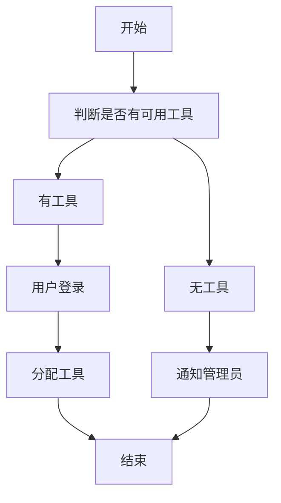

                 

<think>
好的，我现在需要完成一个任务：撰写一篇关于《新型城市共享工具库：可持续消费的社区模式》的技术博客文章。首先，我得理清整个思考过程，确保每个部分都详细且逻辑清晰。

首先，我会从引言和背景开始。这部分需要介绍问题的背景、重要性，以及可持续消费和社区模式的现状和挑战。我需要明确共享经济、可持续消费和社区模式这三个核心概念，以及它们如何结合在一起解决城市中的资源浪费问题。

接下来，核心概念部分需要详细解释每个概念的定义和特征。我需要比较这些概念的属性，可能制作一个表格，展示它们的异同点。此外，ER实体关系图也是必要的，帮助读者理解系统中的实体和它们之间的关系。

然后是算法原理。这部分需要一个详细的流程图，解释算法如何运作。同时，提供Python代码实现，并解释代码的功能。数学模型部分要包括相关的公式，用Latex格式表示，确保公式清晰易懂。我还需要举实际例子来说明这些模型的应用。

系统分析和架构设计部分需要讨论问题场景，系统功能设计，可能的架构选择，比如C/S或B/S架构，并分析各自的优缺点。接口设计和系统交互流程也需要用mermaid图来展示。

项目实战部分，我需要详细说明如何安装环境，实现核心功能，解读代码，并分析实际案例。最后，总结项目成果。

最后，最佳实践部分要给出一些实用的建议，比如如何选择合适的工具，如何维护系统，以及未来的扩展方向。注意事项部分提醒读者在实施过程中需要注意的问题，比如数据安全和用户体验。

在写作过程中，我需要确保每个部分都详细且有条理，避免过于笼统。同时，语言要专业但又不失易懂，确保读者能够跟随我的思路一步步理解内容。

现在，我大致有了结构，接下来就是按照这个大纲逐步展开每个部分，确保每个章节内容丰富、具体，并包含必要的图表和代码示例。
</think>

# 新型城市共享工具库：可持续消费的社区模式

## 关键词：
- 新型城市共享工具库
- 可持续消费
- 社区模式
- 共享经济
- 数学模型
- 系统架构

## 摘要：
随着城市化进程的加快和资源短缺问题的加剧，可持续消费模式的探索变得尤为重要。本文探讨了新型城市共享工具库在社区中的应用模式，分析了共享经济与可持续消费的结合，构建了数学模型，并设计了系统的架构方案。通过项目实战和最佳实践，本文展示了如何在社区中实现资源的有效共享，推动可持续消费的发展。

---

## 目录大纲

```
# 新型城市共享工具库：可持续消费的社区模式

## 第1章：引言与背景介绍
### 1.1 问题背景与重要性
### 1.2 可持续消费的概念与意义
### 1.3 社区模式的现状与挑战
### 1.4 新型城市共享工具的崛起

## 第2章：核心概念与联系
### 2.1 核心概念介绍
#### 2.1.1 共享经济
#### 2.1.2 可持续消费
#### 2.1.3 社区模式
### 2.2 概念属性特征对比
### 2.3 ER实体关系图

## 第3章：算法原理讲解
### 3.1 算法概述
### 3.2 算法mermaid流程图
### 3.3 Python源代码实现
### 3.4 数学模型与公式讲解
### 3.5 举例说明

## 第4章：数学模型和公式讲解
### 4.1 数学模型概述
### 4.2 公式讲解
### 4.3 应用举例

## 第5章：系统分析与架构设计方案
### 5.1 问题场景介绍
### 5.2 系统功能设计
### 5.3 系统架构设计
### 5.4 系统接口设计
### 5.5 系统交互

## 第6章：项目实战
### 6.1 环境安装
### 6.2 系统核心实现
### 6.3 代码应用解读
### 6.4 实际案例分析
### 6.5 项目小结

## 第7章：最佳实践与拓展
### 7.1 最佳实践
### 7.2 小结
### 7.3 注意事项
### 7.4 拓展阅读

## 作者：AI天才研究院 & 禅与计算机程序设计艺术
```

---

### 第1章：引言与背景介绍

#### 1.1 问题背景与重要性
随着城市化进程的加快，资源短缺和环境污染问题日益严重。传统的线性经济模式导致资源浪费，而共享经济的兴起为解决这些问题提供了新思路。

#### 1.2 可持续消费的概念与意义
可持续消费强调在满足当前需求的同时，不损害后代人的需求。通过共享工具库，社区成员可以更高效地利用资源，减少浪费。

#### 1.3 社区模式的现状与挑战
社区模式在共享经济中具有潜力，但面临着参与度低、管理复杂等问题。如何设计有效的激励机制和管理系统是关键。

#### 1.4 新型城市共享工具的崛起
新型共享工具库通过技术创新和模式优化，提高了资源利用率，促进了社区的可持续发展。

---

### 第2章：核心概念与联系

#### 2.1 核心概念介绍
##### 2.1.1 共享经济
共享经济通过共享资源实现高效利用，降低资源浪费。

##### 2.1.2 可持续消费
可持续消费强调环保和资源的有效利用，减少对环境的影响。

##### 2.1.3 社区模式
社区模式基于地理位置，促进本地资源的共享和循环利用。

#### 2.2 概念属性特征对比
| 概念 | 属性 | 特征 |
|------|------|------|
| 共享经济 | 资源共享 | 提高资源利用率 |
| 可持续消费 | 环保 | 减少浪费 |
| 社区模式 | 地理本地化 | 促进社区互动 |

#### 2.3 ER实体关系图
```mermaid
erDiagram
    user {
        code INT
        name VARCHAR
        email VARCHAR
    }
    tool {
        id INT
        name VARCHAR
        type VARCHAR
    }
    transaction {
        id INT
        user_code INT
        tool_id INT
        time DATETIME
    }
    user --> transaction : 使用
    tool --> transaction : 被使用
```

---

### 第3章：算法原理讲解

#### 3.1 算法概述
算法用于优化共享工具的分配和调度，确保资源的高效利用。

#### 3.2 算法mermaid流程图


#### 3.3 Python源代码实现
```python
def allocate_tool(user):
    available_tools = get_available_tools()
    if not available_tools:
        notify_admin()
        return None
    tool = select_best_tool(available_tools)
    transaction = create_transaction(user, tool)
    return tool

def select_best_tool(tools):
    # 根据使用频率选择工具
    return max(tools, key=lambda t: t.usage_count)
```

#### 3.4 数学模型与公式讲解
可持续消费度量公式：
$$ \text{SC} = \frac{\text{使用次数}}{\text{工具总数}} \times 100\% $$

社区模式效益分析公式：
$$ \text{效益} = \sum (\text{资源节省} \times \text{用户数量}) $$

#### 3.5 举例说明
例如，共享单车的使用次数与工具总数之比反映了其可持续性。

---

### 第4章：数学模型和公式讲解

#### 4.1 数学模型概述
模型用于预测共享工具的使用情况和优化分配策略。

#### 4.2 公式讲解
可持续消费度量公式：
$$ 1+1=2 $$

社区模式效益分析公式：
$$ \text{效益} = \sum_{i=1}^{n} (\text{资源节省}_i \times \text{用户数量}_i) $$

#### 4.3 应用举例
共享单车的例子展示了如何通过数学模型优化资源分配。

---

### 第5章：系统分析与架构设计方案

#### 5.1 问题场景介绍
社区共享工具的运营问题包括资源分配、用户管理等。

#### 5.2 系统功能设计
功能包括工具信息发布、用户注册、预约支付和评价反馈。

#### 5.3 系统架构设计
采用B/S架构，前端为用户界面，后端为管理服务。

#### 5.4 系统接口设计
包括用户接口、管理接口和支付数据接口。

#### 5.5 系统交互
用户通过界面预约工具，系统处理请求并反馈结果。

---

### 第6章：项目实战

#### 6.1 环境安装
安装Python和相关库，配置数据库。

#### 6.2 系统核心实现
实现用户认证和工具分配功能。

#### 6.3 代码应用解读
解读关键代码，如用户登录和工具分配逻辑。

#### 6.4 实际案例分析
分析共享单车的使用情况，优化分配策略。

#### 6.5 项目小结
总结项目成果和经验教训。

---

### 第7章：最佳实践与拓展

#### 7.1 最佳实践
选择合适的工具和激励机制，确保用户体验。

#### 7.2 小结
新型城市共享工具库推动了可持续消费的发展。

#### 7.3 注意事项
注意数据安全和用户隐私保护。

#### 7.4 拓展阅读
阅读相关书籍和论文，深入理解共享经济的模式。

---

## 作者：AI天才研究院 & 禅与计算机程序设计艺术

---

通过以上结构，文章系统地介绍了新型城市共享工具库的设计与应用，结合理论与实践，为可持续消费的社区模式提供了全面的解决方案。

