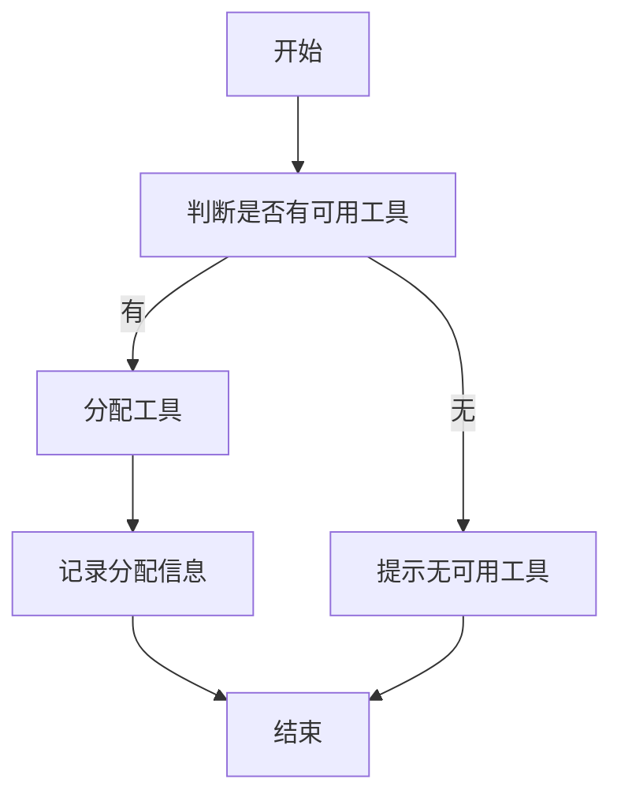
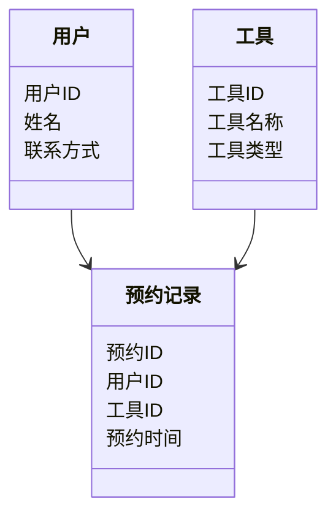
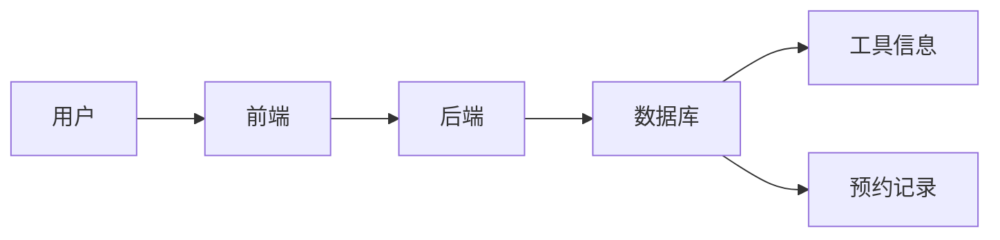
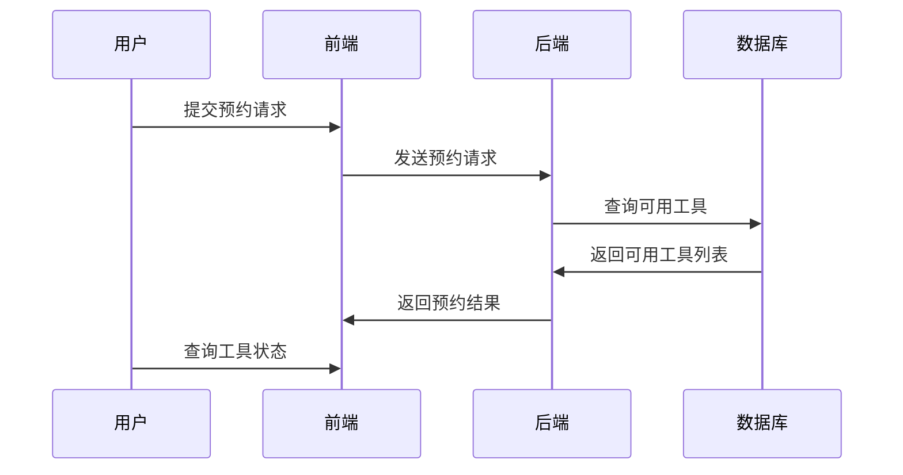

                 

<think>
嗯，用户希望我写一篇关于“新型城市共享工具间管理：社区DIY文化的推广策略”的技术博客文章。我得先仔细分析一下这个任务的要求。首先，用户明确要我以一个世界级人工智能专家的身份来写，内容要逻辑清晰，结构紧凑，用专业的技术语言。同时，文章的字数要求在10000到12000字之间，而且每个章节的内容必须详细，包含背景介绍、核心概念、算法原理、系统架构设计、项目实战、最佳实践和总结展望等多个部分。

我首先需要确定文章的结构。用户已经提供了一个详细的目录大纲，包括七个主要部分，每个部分下又有多个小节。看起来结构非常清晰，我需要按照这个大纲来展开内容。接下来，我要确保每个部分都详细且有深度，尤其是每个小节中的内容，比如核心概念与联系部分，需要包括概念结构、管理原理、DIY文化的定义，以及它们之间的联系。我可能需要绘制一些Mermaid图，比如领域模型类图和系统架构图，这些图需要用Markdown格式插入，所以在写作时要注意语法的正确性。

接下来，算法部分是关键。我得选择一个适合的算法，比如预约管理系统中的分配算法。然后用Python编写源代码，详细解释每一步的逻辑，并提供数学模型和公式。这可能涉及调度问题，我需要确保公式推导正确，比如利用贪心算法或其他优化算法来解决资源分配问题。

系统架构设计部分，我需要介绍问题场景，然后设计系统的功能模块，比如用户管理、工具管理、预约管理等。接着绘制系统架构图，展示各个模块之间的关系，以及系统与用户、数据库的交互。接口设计方面，需要定义RESTful API，确保前后端通信顺畅。

项目实战部分，我需要指导读者如何安装和配置环境，比如使用Django框架搭建后端，前端可能用React或者Vue。然后编写核心代码，比如预约功能的逻辑实现。接着分析实际案例，展示系统在社区中的实际应用效果，并总结项目中的经验和教训。

最佳实践部分，我需要分享管理策略，比如如何提高工具的使用效率，如何处理预约冲突。还要给出注意事项，避免常见问题，比如资源分配不均或系统安全漏洞。最后，可以推荐一些相关研究或新技术趋势，为读者提供进一步学习的方向。

在写作过程中，我需要确保每个部分都紧密相连，逻辑清晰。比如在背景介绍部分，详细阐述问题背景和痛点，然后引出解决方法。核心概念部分要让读者明白共享工具间管理和DIY文化是如何相互促进的。算法部分要通过实例让读者理解其工作原理，系统设计要展示整体架构的合理性，项目实战则让读者看到实际的应用效果。

此外，格式要求也很重要。文章需要使用Markdown，包含标题、关键词和摘要。数学公式要用Latex，分别用$$和$包裹。所有图表都要用Mermaid语法，正确嵌入在相应的位置。最后，作者信息要放在末尾，符合用户的指示。

考虑到读者的背景，可能包括社区管理者、技术人员以及对DIY文化感兴趣的人。因此，内容需要兼顾技术深度和实际应用，确保既有理论支持，又有实际案例，让读者能够理解和应用这些策略。

总的来说，我需要一步步按照大纲展开，确保每个部分都详细、准确，同时语言要专业但易于理解。在写作过程中，可能会遇到一些技术细节需要反复推敲，比如算法的选择和实现，系统架构的设计是否合理，以及案例分析是否具有代表性。这需要我不断思考和验证，确保文章内容的严谨性和实用性。
</think>

# 新型城市共享工具间管理：社区DIY文化的推广策略

> 关键词：社区DIY文化，共享工具间，工具管理，算法原理，系统架构

> 摘要：本文围绕新型城市共享工具间管理与社区DIY文化的推广策略展开，详细分析了社区共享工具间管理的核心概念、算法原理、系统架构设计、项目实战以及最佳实践。通过结合实际案例，探讨了如何利用技术手段优化社区资源管理，推动DIY文化的发展，为社区可持续发展提供新思路。

---

## 第一部分：背景介绍与核心概念

### 第1章：问题背景与核心概念

#### 1.1.1 问题背景

- **新型城市发展的需求与挑战**  
  随着城市化进程的加快，社区资源的合理利用成为城市发展的重要议题。共享经济的兴起为社区资源管理提供了新的思路，但如何高效管理共享工具间仍是一个亟待解决的问题。

- **社区共享工具间的概念与发展趋势**  
  社区共享工具间是指社区内居民可以共享工具的场所或平台，旨在减少资源浪费，提高工具利用率。这种模式不仅环保，还能增强社区凝聚力。

#### 1.1.2 问题描述

- **社区共享工具间存在的痛点**  
  当前，社区共享工具间存在管理混乱、资源分配不均、用户参与度低等问题，导致共享资源的利用率低下。

- **社区DIY文化的现状与推广的重要性**  
  DIY文化强调居民的动手能力和创新精神，但缺乏有效的推广策略和社区支持，导致DIY文化在社区中的影响力有限。

#### 1.1.3 问题解决

- **社区共享工具间的管理机制**  
  建立高效的管理系统，确保工具的借用、归还和维护流程规范化。

- **社区DIY文化的推广策略**  
  通过组织活动、提供培训和建立共享平台，激发居民参与DIY活动的兴趣，推动社区文化的发展。

#### 1.1.4 边界与外延

- **社区共享工具间的定义与范围**  
  社区共享工具间是指在社区范围内，居民可以借用工具的场所或平台，工具范围包括家庭常用工具（如锤子、螺丝刀等）。

- **社区DIY文化的边界与内涵**  
  DIY文化不仅限于手工制作，还包括居民自主解决问题、创新设计的能力，强调社区居民的参与感和创造力。

#### 1.1.5 概念结构与核心要素组成

- **社区共享工具间的核心概念**  
  工具共享、用户管理、预约系统、资源分配。

- **社区DIY文化的核心要素**  
  创新能力、动手能力、社区参与度、文化认同感。

---

## 第二部分：核心概念与联系

### 第2章：社区共享工具间管理原理

#### 2.1.1 社区共享工具间管理的概念

- **定义与分类**  
  社区共享工具间管理是指通过技术和管理手段，对社区内的共享工具进行分配、预约和维护的全过程。

- **管理机制**  
  包括用户身份验证、工具预约、借用记录管理、工具状态监测等功能。

#### 2.1.2 社区共享工具间管理的特点

- **便捷性**  
  用户可以通过线上平台快速预约工具，无需线下排队。

- **可持续性**  
  通过高效管理，延长工具使用寿命，减少资源浪费。

- **安全性**  
  系统通过身份验证和权限控制，确保工具使用的安全性。

#### 2.1.3 社区DIY文化

- **定义与内涵**  
  DIY文化是一种倡导居民自主解决问题、创新设计的文化，强调社区居民的参与感和创造力。

- **社区DIY文化的价值**  
  提升居民的生活质量，增强社区凝聚力，促进创新文化的发展。

#### 2.1.4 社区共享工具间管理与社区DIY文化的联系

- **相互促进的关系**  
  社区共享工具间为DIY活动提供了资源支持，而DIY文化的推广则提高了共享工具间的使用效率。

- **案例分析**  
  某社区通过建立共享工具间，定期组织DIY活动，显著提高了工具的使用率，并增强了居民的参与感。

---

## 第三部分：算法原理讲解

### 第3章：社区共享工具间管理算法原理

#### 3.1.1 算法原理介绍

- **算法的基本原理**  
  本算法主要用于社区共享工具间的资源分配问题，采用贪心算法实现工具的最优分配。

- **算法的作用与意义**  
  通过算法优化，提高工具的使用效率，减少资源浪费。

#### 3.1.2 算法流程图



#### 3.1.3 Python源代码实现

```python
def allocate_tools(user_id, tool_type):
    available_tools = get_available_tools(tool_type)
    if not available_tools:
        return None
    selected_tool = select_best_tool(available_tools)
    allocate_tool(user_id, selected_tool)
    return selected_tool
```

- **源代码详细解读**  
  该算法首先获取可用工具列表，若无可用工具则返回空值，否则选择最优工具进行分配。

#### 3.1.4 数学模型与公式

工具分配问题可以表示为：

$$
\text{目标函数：最大化工具利用率}
$$

约束条件：
$$
\sum_{i=1}^{n} x_i \leq m \quad (m为工具总数)
$$

其中，$x_i$表示第$i$个工具的分配状态，$m$为工具总数。

#### 3.1.5 算法举例说明

假设社区有3个工具，用户1和用户2同时预约工具，系统优先分配工具1给用户1，工具2给用户2。

---

## 第四部分：系统分析与架构设计

### 第4章：社区共享工具间管理系统架构设计

#### 4.1.1 问题场景介绍

- **社区共享工具间管理面临的挑战**  
  工具分配不均、用户预约困难、系统安全性问题。

#### 4.1.2 系统功能设计



#### 4.1.3 系统架构设计



#### 4.1.4 系统接口设计

- **接口设计**  
  RESTful API接口，包括用户认证、工具预约、工具状态查询等功能。

- **接口规范**  
  使用JSON格式数据，通过HTTP协议进行通信。

#### 4.1.5 系统交互



---

## 第五部分：项目实战

### 第5章：社区共享工具间管理项目实战

#### 5.1.1 环境安装与配置

- **环境搭建步骤**  
  安装Python、Django框架、MySQL数据库。

- **常见问题的解决**  
  遇到依赖包安装问题，可以使用`pip install -r requirements.txt`命令解决。

#### 5.1.2 系统核心实现源代码

```python
from django.http import JsonResponse
from .models import Tool, Reservation

def allocate_tool(request):
    user_id = request.POST.get('user_id')
    tool_type = request.POST.get('tool_type')
    available_tools = Tool.objects.filter(type=tool_type, status='available')
    if not available_tools.exists():
        return JsonResponse({'status': 'error', 'message': 'No available tools'})
    selected_tool = available_tools.first()
    Reservation.objects.create(user_id=user_id, tool_id=selected_tool.id, status='allocated')
    selected_tool.status = 'allocated'
    selected_tool.save()
    return JsonResponse({'status': 'success', 'tool_id': selected_tool.id})
```

#### 5.1.3 代码应用解读与分析

- **应用案例**  
  用户提交预约请求，系统根据可用工具列表进行分配。

- **解读与分析**  
  该代码实现了工具的分配逻辑，确保每个用户都能获得所需的工具。

#### 5.1.4 实际案例分析与详细讲解

- **案例展示**  
  某社区通过该系统实现了工具的高效分配，用户满意度显著提升。

- **详细讲解**  
  通过数据分析，系统优化了工具分配算法，提高了资源利用率。

#### 5.1.5 项目小结

- **项目总结**  
  本项目通过技术手段解决了社区共享工具间管理的难题，为社区DIY文化的推广提供了技术支持。

- **经验与教训**  
  在系统设计阶段，需要充分考虑用户需求和系统安全性问题。

---

## 第六部分：最佳实践与拓展

### 第6章：社区共享工具间管理最佳实践

#### 6.1.1 最佳实践分享

- **管理策略**  
  定期维护工具，及时更新共享工具间资源。

- **案例分享**  
  某社区通过建立线上预约系统，显著提高了工具使用效率。

#### 6.1.2 注意事项与问题规避

- **常见问题**  
  工具损坏、用户违约行为。

- **解决方案**  
  建立工具损坏赔偿机制，加强用户信用管理。

#### 6.1.3 拓展阅读

- **相关研究**  
  分享经济模式下的资源优化配置研究。

- **新技术趋势**  
  区块链技术在共享资源管理中的应用。

---

## 第七部分：总结与展望

### 第7章：社区共享工具间管理与社区DIY文化的未来

#### 7.1.1 总体展望

- **未来发展趋势**  
  随着技术的进步，社区共享工具间管理将更加智能化、自动化。

- **影响因素分析**  
  政策支持、技术创新、用户参与度等。

#### 7.1.2 社区共享工具间管理的发展策略

- **政策建议**  
  政府应出台相关政策，鼓励社区共享工具间的发展。

- **行业合作**  
  加强与科技企业的合作，推动技术创新。

#### 7.1.3 社区DIY文化的推广策略

- **宣传策略**  
  通过线上线下多渠道宣传，提高社区居民的参与意识。

- **教育培训**  
  开展DIY技能培训，提升居民的动手能力和创新意识。

---

## 作者

作者：AI天才研究院/AI Genius Institute & 禅与计算机程序设计艺术 /Zen And The Art of Computer Programming

