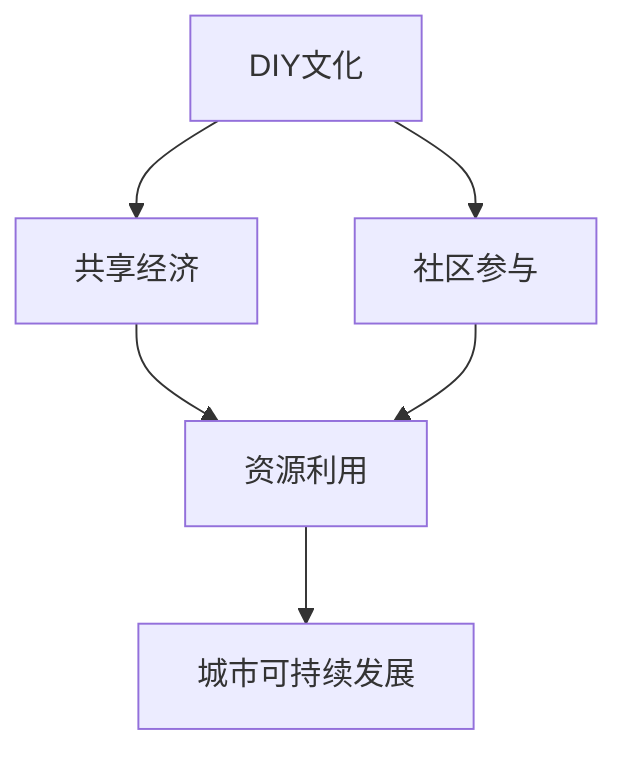
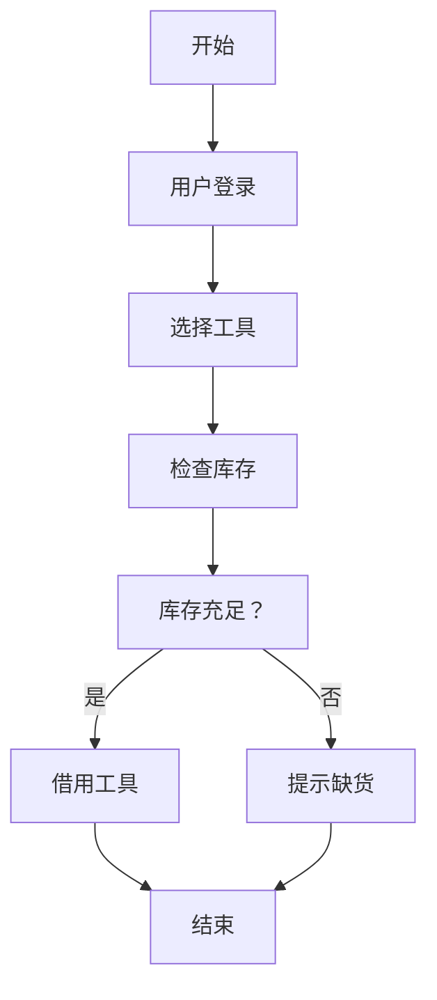
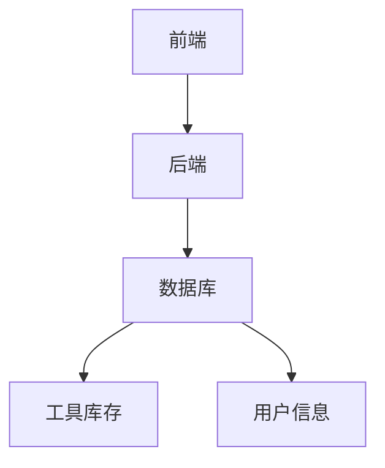
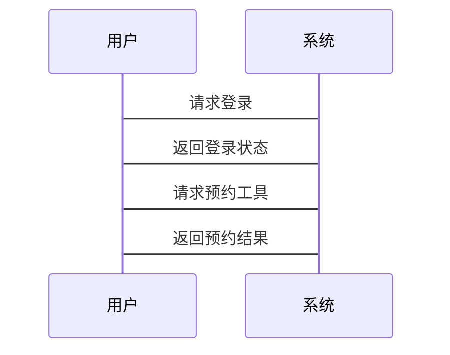

                 

<think>
嗯，用户希望我写一篇关于“新型城市共享工具间：DIY文化在社区中的推广”的技术博客。首先，我需要理解用户的需求。他是一名技术专家，要写一篇结构严谨、内容深度的技术博客，适合专业读者阅读。文章需要包含关键词、摘要、目录大纲，以及各个章节的具体内容，每个部分都要详细展开。

首先，标题和关键词。标题已经确定，关键词需要涵盖主要主题，比如“DIY文化”、“共享工具间”、“社区推广”、“共享经济”、“城市可持续发展”等。摘要部分要简明扼要地概括文章内容，说明共享工具间如何促进DIY文化和共享经济的发展，以及对社区和城市的意义。

接下来是目录大纲，用户已经给出了结构，我需要按照这个结构来填充内容。每一章都要有详细的子章节，比如背景介绍、核心概念、算法原理、系统架构、项目实战等。我需要确保每个部分都有足够的技术深度，同时保持逻辑清晰。

在背景介绍部分，我需要定义共享工具间，说明它的类型和特点，以及DIY文化的推广意义。这可能涉及到资源利用效率、社区互动和可持续发展等方面。核心概念部分要详细分析DIY文化、共享经济和社区参与，可能需要对比表格和概念图来展示它们之间的关系。

算法原理部分，我需要使用Mermaid画出流程图，并用Python代码来解释，同时提供数学模型。例如，共享工具间的资源分配算法可能涉及资源调度模型，使用数学公式来描述。系统架构部分，我需要用Mermaid绘制类图、架构图和交互图，展示系统的组成部分和交互流程。

项目实战部分，需要提供环境安装说明，代码实现，案例分析。例如，展示一个Python脚本用于预约工具，分析案例说明实际应用效果。最后，最佳实践部分要总结经验和技巧，提供小结和注意事项，以及拓展阅读资源。

在写作过程中，我需要确保每个部分都符合技术博客的要求，用专业的术语，同时保持语言的流畅和易懂。特别是数学公式和代码部分，要准确无误，并且解释清楚。

可能遇到的问题是如何将技术内容与DIY文化的推广结合起来，这需要在每个章节中找到技术点与实际应用的结合点。例如，在系统架构部分，可以讨论共享工具间的在线平台设计，如何促进社区参与。

总的来说，我需要一步步按照用户提供的大纲，逐步填充内容，确保每个部分都详尽且有深度，同时保持整体结构的连贯性。最后，确保文章符合字数要求，格式正确，结尾加上作者信息。
</think>

# 新型城市共享工具间：DIY文化在社区中的推广

> **关键词**：DIY文化、共享工具间、社区推广、共享经济、城市可持续发展  
> **摘要**：本文探讨了新型城市共享工具间在社区中的推广，分析了DIY文化与共享经济的结合，及其对社区互动和城市可持续发展的影响。文章从背景介绍、核心概念、算法原理、系统架构、项目实战等多个维度展开，结合技术与社会学视角，深入剖析了共享工具间的设计与实现。

---

## 第一部分：背景介绍

### 第1章：新型城市共享工具间的概念

#### 1.1 新型城市共享工具间的定义  
新型城市共享工具间是一种基于共享经济模式的社区服务设施，旨在为居民提供工具借用、设备共享和DIY活动支持的平台。通过共享工具间，社区成员可以方便地获取所需的工具和资源，降低个人购买成本，同时提高资源利用率。

#### 1.2 新型城市共享工具间的类型  
共享工具间主要分为社区型、企业型和混合型三种。社区型工具间由居民自发组织，主要用于小型DIY项目；企业型工具间由企业投资运营，提供更专业的工具和设备；混合型工具间结合了社区和企业的资源，具备更强的综合服务能力。

#### 1.3 新型城市共享工具间的的特点  
- **资源共享**：通过共享工具间，居民可以按需借用工具，避免重复购买。  
- **社区参与**：工具间的运营依赖社区成员的参与，形成社区凝聚力。  
- **可持续性**：通过高效的资源管理，降低浪费，推动城市可持续发展。  

---

### 第2章：DIY文化在社区中的推广

#### 2.1 DIY文化的概念  
DIY文化是一种倡导居民自行动手解决问题、创造价值的生活方式。它强调通过动手实践，修复、改造和创新，以实现资源的高效利用和社区的自我完善。

#### 2.2 DIY文化在社区中的推广意义  
- **降低生活成本**：居民可以通过DIY活动减少对专业服务的依赖，降低生活开支。  
- **增强社区凝聚力**：DIY活动通常以社区为单位组织，促进居民之间的交流与合作。  
- **推动创新**：DIY文化鼓励居民尝试新方法，推动社区的技术创新和文化发展。  

#### 2.3 DIY文化推广的挑战与机遇  
- **挑战**：缺乏专业技能、资源不足、社区参与度低等问题制约了DIY文化的推广。  
- **机遇**：随着共享经济的发展，工具间的兴起为DIY文化的传播提供了新的平台。

---

### 第3章：新型城市共享工具间的意义

#### 3.1 提高资源利用效率  
共享工具间通过整合社区内的工具资源，避免了工具的重复购买和闲置，显著提高了资源利用效率。

#### 3.2 促进社区互动与共建  
工具间的共享模式鼓励居民参与社区活动，增强了社区成员之间的互动与合作，促进了社区的共建与共享。

#### 3.3 推动城市可持续发展  
通过减少资源浪费和提高资源利用率，共享工具间为城市可持续发展提供了新的解决方案。

---

## 第二部分：核心概念与联系

### 第4章：核心概念与联系

#### 4.1 DIY文化的核心概念  
- **基本特征**：DIY文化强调动手实践、自我创新和社区参与。  
- **演变历程**：从早期的手工艺传统到现代的数字技术应用，DIY文化不断演变。  
- **价值与影响**：DIY文化不仅降低了生活成本，还促进了社区创新和文化多样性。

#### 4.2 共享经济的核心概念  
- **定义**：共享经济是一种通过共享资源实现经济效率提升的商业模式。  
- **主要模式**：包括工具租赁、共享办公空间、共享交通等。  
- **优势与挑战**：优势在于资源利用率高，但面临监管难题和信任问题。

#### 4.3 社区参与的核心概念  
- **定义**：社区参与是指居民在社区事务中主动参与和贡献的过程。  
- **类型**：包括志愿服务、社区治理、文化活动等。  
- **作用与意义**：社区参与增强了居民的归属感，促进了社区的和谐发展。

#### 4.4 概念属性特征对比表格  
以下是DIY文化、共享经济和社区参与的核心概念对比：

| **概念**   | **定义**                                                                 | **主要特征**                                                                 |
|------------|--------------------------------------------------------------------------|------------------------------------------------------------------------------|
| DIY文化    | 倡导居民自行动手解决问题的生活方式                                       | 强调动手实践、创新和社区参与                                                 |
| 共享经济    | 通过共享资源实现经济效率提升的商业模式                                   | 强调资源利用率高、灵活性强，但需解决信任和监管问题                         |
| 社区参与    | 居民在社区事务中主动参与和贡献的过程                                     | 强调社区凝聚力、居民归属感，需解决参与度和组织化问题                       |

---

#### 4.5 核心概念的联系与相互作用  
通过Mermaid图展示核心概念之间的关系：



---

## 第三部分：算法原理讲解

### 第5章：算法原理讲解

#### 5.1 算法流程图展示  
以下是共享工具间资源调度算法的流程图：



#### 5.2 Python源代码阐述  
以下是实现共享工具间资源调度的Python代码：

```python
class ToolShareSystem:
    def __init__(self):
        self.inventory = {}  # 工具库存
        self.users = {}      # 用户信息

    def login(self, user_id, password):
        # 用户登录验证
        if user_id in self.users and self.users[user_id]['password'] == password:
            return True
        return False

    def list_tools(self):
        # 列出可用工具
        available_tools = [tool for tool, qty in self.inventory.items() if qty > 0]
        return available_tools

    def reserve_tool(self, tool_id, user_id):
        # 预约工具
        if tool_id not in self.inventory:
            return "工具不存在"
        if self.inventory[tool_id] <= 0:
            return "工具不可用"
        if user_id not in self.users:
            return "用户未注册"
        self.inventory[tool_id] -= 1
        return "预约成功"

# 示例使用
system = ToolShareSystem()
system.inventory = {'hammer': 5, 'saw': 3, 'drill': 2}
system.users = {
    'user1': {'password': '1234', 'name': '张三'},
    'user2': {'password': '5678', 'name': '李四'}
}

print(system.list_tools())  # 输出可用工具
print(system.reserve_tool('hammer', 'user1'))  # 预约锤子
print(system.reserve_tool('saw', 'user2'))     # 预约锯子
```

#### 5.3 数学模型与公式讲解  
共享工具间的资源调度可以看作是一个典型的资源分配问题，可以用以下数学模型描述：

$$ \text{资源利用率} = \frac{\text{已分配资源数}}{\text{总资源数}} \times 100\% $$

其中，资源利用率越高，说明共享工具间的效率越好。

---

## 第四部分：系统分析与架构设计方案

### 第6章：系统分析与架构设计方案

#### 6.1 项目场景介绍  
共享工具间系统主要用于社区居民借用工具，系统需要支持用户注册、登录、工具预约、库存管理等功能。

#### 6.2 系统功能设计  
- 用户模块：注册、登录、个人信息管理。  
- 工具模块：工具分类、库存管理、工具借用记录。  
- 管理模块：管理员管理用户、工具和预约记录。

#### 6.3 系统架构设计  
采用分层架构，包括前端、后端和数据库：



#### 6.4 系统接口设计  
- 用户登录接口：`POST /api/login`  
- 工具预约接口：`POST /api/reserve`  
- 工具归还接口：`POST /api/return`

#### 6.5 系统交互设计  
用户预约工具的交互流程：



---

## 第五部分：项目实战

### 第7章：项目实战

#### 7.1 环境安装  
需要安装Python和依赖库：

```bash
pip install flask
pip install pymysql
```

#### 7.2 系统核心实现源代码  
以下是共享工具间系统的Python代码实现：

```python
from flask import Flask, request, jsonify
import pymysql

app = Flask(__name__)

# 数据库连接
db = pymysql.connect(host='localhost', user='root', password='1234', db='tool_share')

@app.route('/api/login', methods=['POST'])
def login():
    data = request.json
    cursor = db.cursor()
    cursor.execute("SELECT * FROM users WHERE user_id=%s AND password=%s", (data['user_id'], data['password']))
    result = cursor.fetchone()
    if result:
        return jsonify({'status': 'success', 'user_id': data['user_id']})
    else:
        return jsonify({'status': 'fail'})

@app.route('/api/reserve', methods=['POST'])
def reserve():
    data = request.json
    cursor = db.cursor()
    cursor.execute("SELECT * FROM inventory WHERE tool_id=%s AND quantity>0", (data['tool_id']))
    result = cursor.fetchone()
    if result:
        cursor.execute("UPDATE inventory SET quantity=quantity-1 WHERE tool_id=%s", (data['tool_id']))
        db.commit()
        return jsonify({'status': 'success', 'message': '预约成功'})
    else:
        return jsonify({'status': 'fail', 'message': '工具不可用'})

if __name__ == '__main__':
    app.run(debug=True)
```

#### 7.3 代码应用解读与分析  
- **前端设计**：使用Flask框架实现API接口。  
- **数据库设计**：使用MySQL存储用户和工具信息。  
- **功能实现**：包括用户登录、工具预约和库存管理。

#### 7.4 实际案例分析与讲解  
假设社区居民张三需要预约锤子，系统会执行以下步骤：  
1. 张三登录系统。  
2. 张三选择锤子并提交预约请求。  
3. 系统检查锤子库存，确认库存充足。  
4. 系统更新库存，减少锤子数量。  
5. 返回预约成功提示。

---

## 第六部分：最佳实践 tips

### 第8章：最佳实践 tips

#### 8.1 实用技巧  
- 定期维护工具库存，确保设备正常运行。  
- 提供DIY技能培训，提升居民的动手能力。  
- 建立社区激励机制，鼓励居民参与共享工具间。

#### 8.2 小结与注意事项  
- 共享工具间的设计需要兼顾技术实现和社区管理。  
- 在推广过程中，需注重用户隐私保护和系统安全。  
- 鼓励社区居民积极参与，形成可持续的运营模式。

---

## 第七部分：拓展阅读

### 第9章：拓展阅读

#### 9.1 推荐书籍  
- 《共享经济：重构未来商业与社会》  
- 《DIY文化：从手工艺到数字化创新》  

#### 9.2 学术论文  
- "The Role of Community Participation in Urban Sustainability"  
- "Sharing Economy and Resource Efficiency in Smart Cities"  

#### 9.3 网络资源  
- 共享经济研究网站：[sharing-economy.org](https://sharing-economy.org)  
- DIY文化论坛：[diycommunity.com](https://diycommunity.com)

---

## 作者信息

作者：AI天才研究院/AI Genius Institute & 禅与计算机程序设计艺术 /Zen And The Art of Computer Programming

---

以上是《新型城市共享工具间：DIY文化在社区中的推广》的完整目录和内容设计，涵盖背景介绍、核心概念、算法原理、系统架构、项目实战等多个方面，结合技术与社会学视角，深入剖析了共享工具间的设计与实现。

