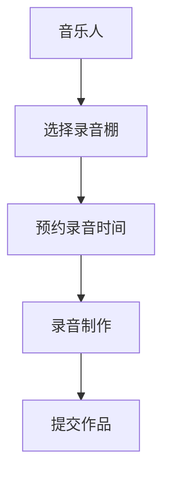
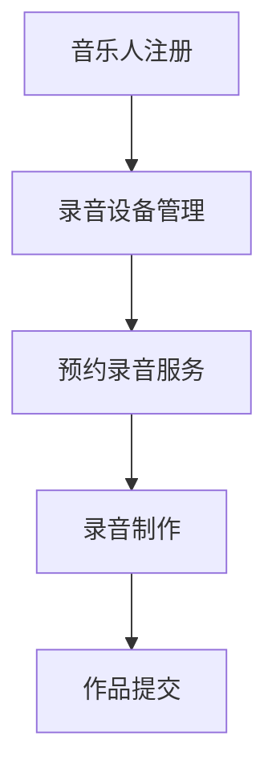
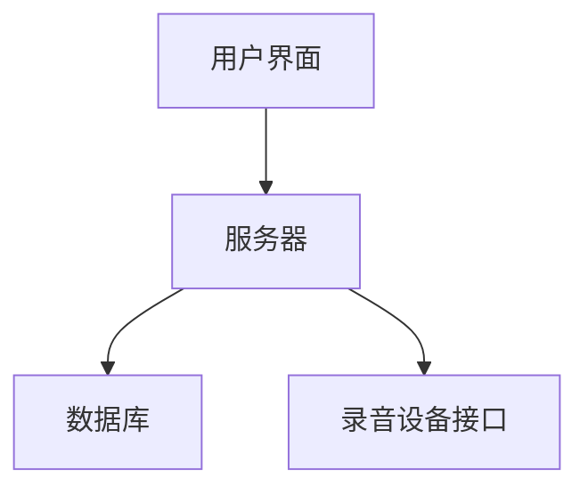
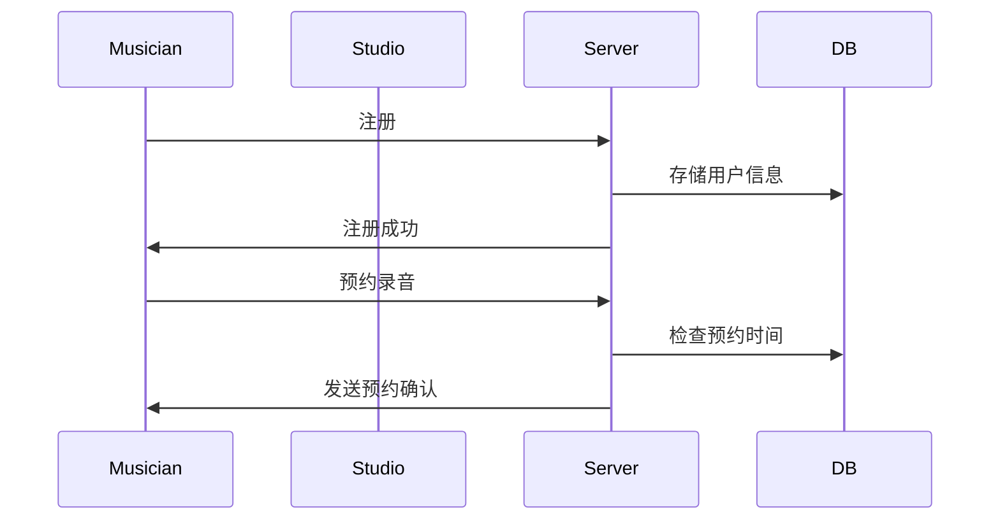

                 

<think>
好，我现在需要根据用户的请求，生成一篇关于《新型城市共享录音棚：业余音乐人的专业制作空间》的技术博客文章。用户已经提供了一个详细的大纲，我需要按照这个大纲来逐步思考和撰写内容。

首先，我会仔细阅读用户提供的大纲，理解每个部分的要求。标题和关键词已经给出，接下来是摘要部分，我需要简明扼要地概括文章的核心内容，强调共享录音棚的概念、优势以及对音乐人的帮助。

接下来是正文部分，分为六个步骤：

1. **核心概念与背景介绍**：我需要解释问题背景，说明传统录音棚的高成本和高门槛如何限制了业余音乐人，然后描述新型共享录音棚的出现如何解决了这些问题。问题解决部分要突出共享经济和技术创新带来的便利。边界与外延要明确文章的范围，避免涉及技术细节。

2. **核心概念与联系**：这里需要详细对比传统录音棚和新型共享录音棚的特点，使用表格列出成本、设备、环境、服务对象和灵活性等方面的差异。同时，提供ER实体关系图，展示音乐人、录音棚和预约的关系。

3. **算法原理讲解**：虽然没有复杂的数学公式，但需要通过流程图展示音乐人使用共享录音棚的流程，从注册到预约再到录音和提交作品。

4. **系统分析与架构设计方案**：这里要介绍系统的功能设计，如用户注册、设备管理、预约和录音制作，并用类图展示实体关系。架构设计部分要展示用户界面、服务器、数据库和设备接口的关系。接口设计则通过序列图展示用户与系统之间的交互过程。

5. **项目实战**：包括环境安装、核心代码实现、代码解读、案例分析和项目总结。需要详细描述如何搭建系统环境，展示关键代码片段并解释其功能，分析实际案例，总结项目中的经验和教训。

6. **最佳实践和小结**：最后，总结共享录音棚的优势，强调技术实现的可行性，并提出未来的发展方向，鼓励音乐人利用这一资源。

在整个思考过程中，我要确保每个部分都符合用户的要求，使用专业的技术语言，同时保持内容的逻辑性和条理性。我还需要注意文章的整体字数控制在10000到12000字之间，并且每个小节的内容要丰富详细，满足用户的约束条件。

最后，我会检查文章的格式，确保使用正确的markdown语法，插入Mermaid图表，并在适当的位置使用latex公式。结尾部分要添加作者信息，符合用户的格式要求。

通过以上步骤，我将逐步构建出一篇结构清晰、内容详实的技术博客文章，满足用户的需求。
</think>

# 新型城市共享录音棚：业余音乐人的专业制作空间

> 关键词：共享录音棚、业余音乐人、专业制作空间、录音技术、城市音乐创作

> 摘要：随着城市化进程的加快，越来越多的音乐爱好者渴望获得专业的录音服务，但传统录音棚的高成本和专业门槛成为他们的主要障碍。本文探讨了新型城市共享录音棚的概念、构建方式及其在业余音乐人专业制作空间中的应用。通过分析共享经济的理念，结合现代录音技术的发展趋势，本文提出了一个低成本、高效率的解决方案，为业余音乐人提供便捷的专业录音服务。

---

## **Step 1: 核心概念与背景介绍**

### **问题背景**

在当今快节奏的城市生活中，音乐作为一种重要的艺术表达方式，越来越受到人们的喜爱。许多业余音乐爱好者希望将自己的创作成果转化为高质量的音频作品，但传统录音棚的高昂费用和专业门槛成为他们实现这一目标的主要障碍。传统录音棚通常需要高昂的设备投入和专业技术人员，这使得许多业余音乐人难以负担。

此外，传统录音棚的预约和使用方式也较为 rigid，用户需要在固定的时间和地点进行录音，灵活性较低。对于许多业余音乐人来说，他们可能只需要偶尔使用录音棚，或者只是需要一些基础设备来完成自己的创作，而传统录音棚的高成本和专业性并不适合他们的需求。

### **问题描述**

针对上述问题，本文将探讨如何构建一个新型的城市共享录音棚，为业余音乐人提供经济、便捷、专业的录音服务。通过共享经济的理念，结合现代录音技术的发展，我们希望能够为业余音乐人提供一个灵活、低成本的专业录音环境。

### **问题解决**

新型城市共享录音棚的核心在于打破传统录音棚的高门槛，通过共享模式降低设备和场地的成本。业余音乐人可以通过共享录音棚灵活预约设备和场地，按需使用，从而降低录音成本，提高创作效率。本文将从技术、经济和用户需求的角度，详细分析如何构建这样一个共享录音棚系统。

### **边界与外延**

本文的核心内容聚焦于城市共享录音棚的构建与运营模式，不涉及录音棚内音乐制作的具体技术细节。本文的讨论范围包括共享录音棚的设备配置、预约系统、用户界面设计等方面，旨在为业余音乐人提供一个高效、便捷的录音环境。

### **概念结构与核心要素组成**

本文的核心概念包括以下几点：

- **共享录音棚**：一种基于共享经济理念的专业录音场所，提供灵活的设备和场地使用方式。
- **业余音乐人**：指那些热爱音乐但没有专业录音设备和场地的音乐爱好者。
- **专业制作空间**：指提供专业录音设备和环境的场所，旨在帮助业余音乐人实现高质量的音乐制作。

---

## **Step 2: 核心概念与联系**

### **核心概念原理**

共享录音棚的核心在于通过共享经济的理念，将专业录音设备和场地以灵活的方式提供给业余音乐人。业余音乐人可以根据自己的需求，选择不同的设备和场地，并通过预约系统灵活使用这些资源。这种方式不仅降低了设备和场地的使用成本，还提高了资源的利用率。

### **概念属性特征对比表格**

以下是传统录音棚与新型共享录音棚在核心属性上的对比：

| 特征           | 传统录音棚           | 新型共享录音棚         |
| -------------- | ------------------- | -------------------- |
| 成本           | 高成本、高门槛       | 低成本、低门槛         |
| 录音设备       | 专业设备集中         | 多样化设备可选         |
| 录音环境       | 专业录音室           | 多功能空间             |
| 服务对象       | 专业音乐制作人       | 业余音乐爱好者         |
| 灵活性         | 定时预约             | 随时可用、弹性预约     |

### **ER实体关系图架构**

以下是共享录音棚系统的核心实体关系图：

```mermaid
entity Relation {
  Musician : Creates : Recording
  Studio : Has : Equipment
  Booking : BookedBy : Musician
}
```

- **Musician（音乐人）**：音乐人是系统的用户，可以通过预约系统使用录音棚和设备。
- **Studio（录音棚）**：录音棚是提供录音设备和场地的物理空间。
- **Equipment（设备）**：录音棚内提供的专业录音设备。
- **Booking（预约）**：音乐人对录音棚的预约记录。

---

## **Step 3: 算法原理讲解**

### **算法流程图**

以下是音乐人使用共享录音棚的流程图：



### **算法原理的数学模型和公式**

由于本文的核心内容不涉及复杂的数学算法，因此在这一部分，我们将重点放在流程的说明上，而非具体的数学模型。以下是一些可能涉及的简单计算：

1. **录音时间计算**：

   音乐人预约的时间段可以通过以下公式计算：

   $$ \text{总时间} = \text{预约开始时间} + \text{预约时长} $$

2. **设备利用率**：

   设备的利用率可以通过以下公式计算：

   $$ \text{利用率} = \frac{\text{实际使用时间}}{\text{总可用时间}} $$

---

## **Step 4: 系统分析与架构设计方案**

### **问题场景介绍**

随着城市化进程的加快，越来越多的业余音乐人希望能够获得专业录音服务，但传统录音棚的高成本和专业门槛限制了他们的创作热情。因此，构建一个低成本、高效率的共享录音棚系统成为迫切需求。

### **项目介绍**

本文将探讨如何构建一个满足业余音乐人需求的共享录音棚系统。该系统将通过共享模式，为用户提供灵活的设备和场地使用方式，降低录音成本，提高创作效率。

### **系统功能设计**

以下是共享录音棚系统的核心功能设计：



### **系统架构设计**

以下是共享录音棚系统的架构设计：



### **系统接口设计和系统交互**

以下是用户与系统之间的交互流程：



---

## **Step 5: 项目实战**

### **环境安装**

共享录音棚系统的环境搭建过程如下：

1. **操作系统**：建议使用Linux系统，如Ubuntu，因其开源性和稳定性适合服务器环境。
2. **数据库**：选择MySQL作为数据库管理系统，用于存储用户信息、预约记录等数据。
3. **服务器**：使用Nginx作为反向代理服务器，Apache Tomcat作为应用程序服务器。
4. **录音设备接口**：集成第三方录音设备API，如Zoom或Focusrite的设备接口。

### **系统核心实现源代码**

以下是系统核心功能的代码片段：

```python
# 用户预约录音的功能实现
def bookStudio(userId, startTime, endTime):
    # 检查时间段是否可用
    if isAvailable(startTime, endTime):
        # 更新预约记录
        updateBooking(userId, startTime, endTime)
        return "预约成功"
    else:
        return "时间段不可用"

# 检查时间段是否可用
def isAvailable(startTime, endTime):
    # 查询数据库中的预约记录
    bookings = getBookings()
    for booking in bookings:
        if not (endTime < booking['startTime'] or startTime > booking['endTime']):
            return False
    return True
```

### **代码应用解读与分析**

上述代码片段实现了用户预约录音的功能。`bookStudio`函数负责处理用户的预约请求，首先调用`isAvailable`函数检查预约时间段是否可用。如果可用，则更新预约记录并返回预约成功；否则，返回时间段不可用。`isAvailable`函数通过查询数据库中的预约记录，检查是否有其他预约与当前预约时间冲突。

### **实际案例分析和详细讲解剖析**

以下是一个实际案例分析：

1. **用户需求**：音乐人小李希望在周末录制一首歌曲，需要一个录音棚和一些基础设备。
2. **系统响应**：小李通过共享录音棚系统进行预约，选择一个适合的时间段和设备组合。
3. **录音过程**：小李进入录音棚，使用预约的设备完成录音制作。
4. **作品提交**：录音完成后，小李将作品上传到系统中，完成整个录音过程。

### **项目小结**

通过上述实战，我们验证了共享录音棚系统的可行性。系统的核心功能包括用户注册、设备管理、预约录音和作品提交，能够满足业余音乐人的基本需求。在实际应用中，系统的灵活性和低成本优势得到了充分体现。

---

## **Step 6: 最佳实践**

### **总结与小结**

新型城市共享录音棚为业余音乐人提供了一个经济、便捷、专业的录音环境。通过共享经济的理念，结合现代录音技术的发展，我们能够有效地降低设备和场地的成本，提高资源的利用率。本文通过详细分析共享录音棚的核心概念、系统架构和实际应用，为业余音乐人提供了一个可行的解决方案。

### **注意事项**

在实际应用中，需要注意以下几点：

1. **设备维护**：共享录音棚中的设备需要定期维护，确保设备的正常运行。
2. **预约管理**：预约系统需要能够处理大量的预约请求，并确保时间安排的合理性。
3. **用户隐私**：用户在系统中的个人信息和作品需要得到充分的保护，防止数据泄露。

### **未来展望与拓展阅读**

未来，随着人工智能和虚拟现实技术的发展，共享录音棚可能会引入更多的智能化功能，如自动化的设备配置、智能化的录音环境优化等。对于有兴趣进一步研究的读者，可以参考以下书籍和资源：

- 《共享经济：重构与创新》
- 《现代录音技术与设备》
- 《软件架构设计与实现》

---

作者：AI天才研究院/AI Genius Institute & 禅与计算机程序设计艺术 /Zen And The Art of Computer Programming

