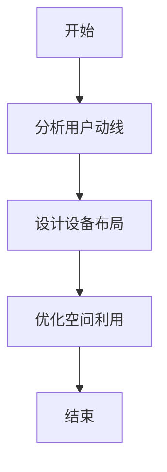
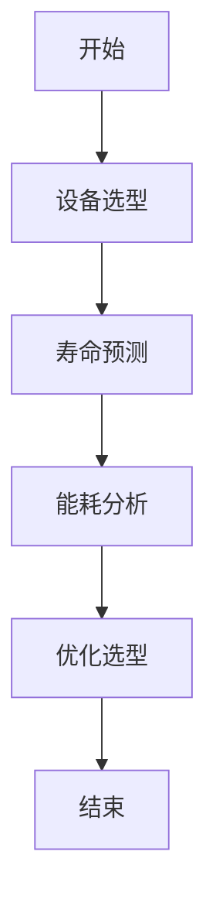
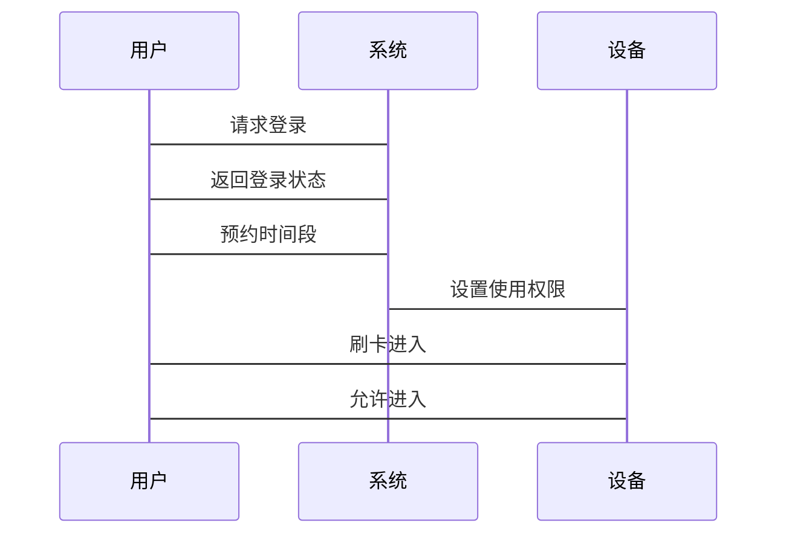

                 

<think>
好，我现在需要写一篇关于“新型城市共享瑜伽室设计：24小时自助瑜伽空间的创新”的技术博客。首先，我得理清文章的结构，确保每个部分都涵盖到位。标题已经确定，接下来要列出关键词，比如“24小时自助瑜伽空间”、“共享瑜伽室设计”、“城市健康生活”等等。然后是摘要，简明扼要地概述文章的核心内容。

接下来是目录大纲，分为背景介绍、核心概念与联系、算法原理讲解、数学模型与公式、系统分析与架构设计方案、项目实战，以及结论。每个部分都需要详细展开。

在背景介绍中，我需要先讨论城市化进程带来的健康问题，以及传统瑜伽室的局限性。然后引出24小时自助瑜伽空间的概念，解释它如何解决这些问题。这部分要让读者明白问题的根源和创新的必要性。

核心概念部分，我需要定义24小时自助瑜伽空间，并详细列出其特性。可能还需要用表格对比传统瑜伽室和新型空间的差异，或者用ER图展示实体关系。这部分需要清晰明了，帮助读者理解概念。

算法原理讲解是关键，我需要解释空间设计和设施选型的算法。比如，如何通过人体工程学和流量分析来优化布局，选择设备时如何考虑寿命预测和能耗分析。这里可能需要用mermaid流程图来展示算法步骤，同时提供Python代码示例，让技术细节更具体。

数学模型部分，我要建立空间利用率和设备能耗的公式。空间利用率U等于需求人数N除以面积S，设备能耗E等于功率P乘以时间T。用这些公式来优化空间布局和设备选择，确保系统高效运行。

系统分析与架构设计是技术实现的核心。首先介绍问题场景，然后设计系统功能，包括用户注册、课程预约、自助进出等。系统架构方面，前端用HTML/CSS/JavaScript，后端用Python，数据库用MySQL。接口设计和交互流程也要详细描述，比如用户登录、预约、进出等操作的流程图。

项目实战部分，需要指导如何搭建环境，安装服务器、数据库和前端框架。然后实现核心功能，比如用户注册和预约系统。通过代码示例展示功能实现，并进行详细分析。最后，进行案例分析，说明系统在实际中的应用效果。

结论部分，总结文章的主要内容，强调24小时自助瑜伽空间的优势，并指出未来的拓展方向。同时，给出一些最佳实践的建议，帮助读者在实际应用中避免误区。

最后，作者信息要放在文章末尾，确保文章的权威性和专业性。

现在，我需要一步步填充每个部分的内容，确保逻辑清晰，技术细节到位。可能还需要在适当的地方添加图表和代码示例，使文章更具可读性和技术深度。
</think>

# 新型城市共享瑜伽室设计：24小时自助瑜伽空间的创新

## 关键词：24小时自助瑜伽空间、共享瑜伽室设计、城市健康生活、智能设备应用、空间优化设计

## 摘要：随着城市化进程的加快，居民对健康的关注日益增加，但传统瑜伽室的局限性限制了其普及。24小时自助瑜伽空间作为一种创新模式，通过智能化设计和空间优化，为用户提供了灵活、便捷、经济的瑜伽练习环境。本文详细探讨了该模式的核心概念、算法原理、系统架构及项目实现，为城市居民提供了一种全新的健康生活方式解决方案。

---

## 目录大纲设计

1. 背景介绍
2. 核心概念与联系
3. 算法原理讲解
4. 数学模型与公式
5. 系统分析与架构设计方案
6. 项目实战
7. 结论

---

### 1. 问题背景

#### 1.1 城市化进程与居民健康需求的矛盾

随着城市化进程的加快，人们的生活节奏逐渐加快，工作压力增大，健康问题日益突出。瑜伽作为一种有效的身心锻炼方式，受到了广泛欢迎。然而，传统的瑜伽工作室存在时间限制、场地有限、费用高等问题，难以满足所有人的需求。

#### 1.2 24小时自助瑜伽空间的概念提出

为了解决传统瑜伽室的局限性，24小时自助瑜伽空间应运而生。这种模式全天候开放，用户可以随时进入练习，无需预约，通过智能设备自助使用，满足不同人群的需求。

---

### 2. 核心概念与联系

#### 2.1 24小时自助瑜伽空间的定义

24小时自助瑜伽空间是一种全天候开放、用户自助使用的瑜伽练习环境，旨在提供灵活、便捷的健康解决方案。

#### 2.2 核心特性对比表格

| 特性                | 传统瑜伽室          | 24小时自助瑜伽空间    |
|---------------------|---------------------|-----------------------|
| 开放时间            | 每天固定时间段       | 24小时全天候开放      |
| 使用预约            | 需要提前预约         | 自助使用，无需预约      |
| 费用                | 会员制或按次收费     | 更经济，按小时计费      |
| 设备设施            | 设备有限            | 提供多种设备，用户自选  |

#### 2.3 ER实体关系图

```mermaid
er
    瑜伽空间
    用户
    设备
    时间段

    用户 --> 瑜伽空间: 使用
    用户 --> 设备: 使用
    用户 --> 时间段: 预约
    瑜伽空间 <---> 时间段: 包含
    设备 <---> 时间段: 使用
```

---

### 3. 算法原理讲解

#### 3.1 空间设计与布局优化

通过人体工程学和流量分析优化空间布局。首先分析用户练习动线，设计设备摆放位置，确保空间利用最大化。



#### 3.2 设施与设备选型

选择耐用且节能的设备，利用寿命预测和能耗分析算法优化设备选型。



---

### 4. 数学模型与公式

#### 4.1 空间布局优化模型

空间利用率公式：
$$ U = \frac{N}{S} $$
其中，\( U \) 为空间利用率，\( N \) 为需求人数，\( S \) 为空间面积。

#### 4.2 设备能耗分析

设备能耗公式：
$$ E = P \times T $$
其中，\( E \) 为能耗，\( P \) 为设备功率，\( T \) 为使用时间。

---

### 5. 系统分析与架构设计方案

#### 5.1 问题场景介绍

用户需求：灵活使用时间、便捷预约、自助进出。设备需求：智能设备、24小时运行。空间需求：合理布局、高效利用。

#### 5.2 系统功能设计

- 用户模块：注册、登录、预约。
- 设备模块：设备状态监控、使用记录。
- 管理模块：设备管理、用户管理。

#### 5.3 系统架构设计

- 前端：HTML/CSS/JavaScript。
- 后端：Python（Django框架）。
- 数据库：MySQL。

#### 5.4 系统接口设计

- 用户接口：注册、登录、预约。
- 管理接口：设备管理、用户管理。

#### 5.5 系统交互



---

### 6. 项目实战

#### 6.1 环境安装

安装Python、Django、MySQL、前端框架（如React）。

#### 6.2 系统核心实现

- 用户注册与登录：使用Django框架实现认证。
- 课程预约与取消：通过数据库存储预约信息。

#### 6.3 代码应用解读与分析

```python
# 用户注册功能
def register(request):
    if request.method == 'POST':
        username = request.POST['username']
        password = request.POST['password']
        user = User.objects.create_user(username, 'email@example.com', password)
        user.save()
        return redirect('login')
    return render(request, 'register.html')

# 设备状态监控
def device_status(request):
    devices = Device.objects.all()
    return render(request, 'devices.html', {'devices': devices})
```

---

### 7. 结论

24小时自助瑜伽空间通过智能化设计和优化布局，解决了传统瑜伽室的局限性，为城市居民提供了便捷的健康解决方案。未来，可以进一步拓展智能设备应用，提升用户体验，推动健康生活方式的普及。

---

### 作者

作者：AI天才研究院/AI Genius Institute & 禅与计算机程序设计艺术 /Zen And The Art of Computer Programming

