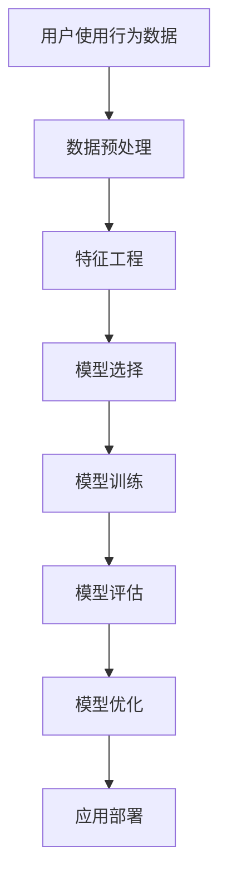
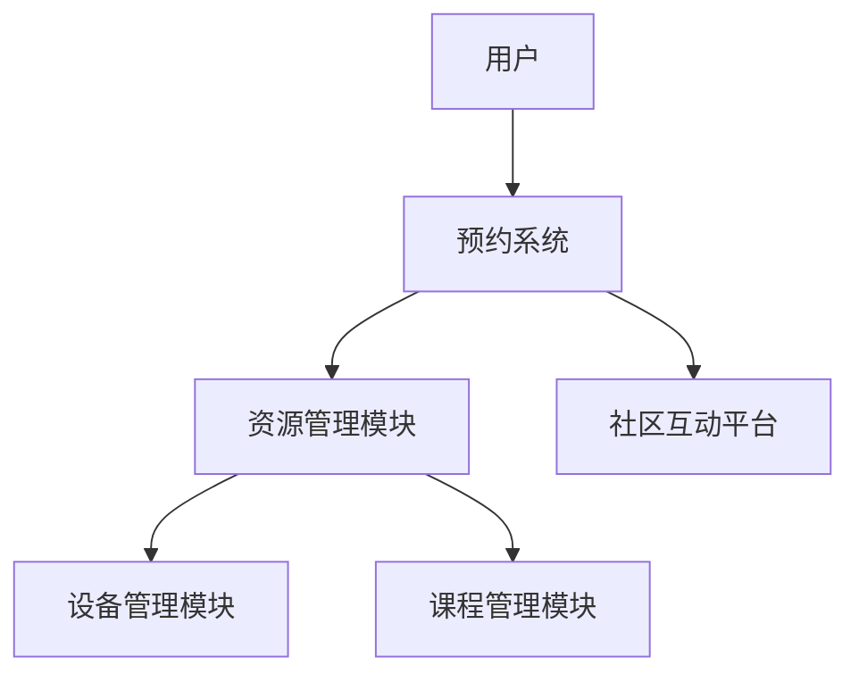

                 

<think>
嗯，用户让我以《新型城市共享瑜伽室：邻里间的健康生活圈》为标题，写一篇技术博客。首先，我需要分析这个任务的要求。用户希望文章结构清晰，使用专业技术语言，同时要有逻辑性，分析深入。

我先看看用户给的目录大纲，里面包括背景介绍、核心概念、算法原理、系统架构设计、项目实战等部分。每个部分都有详细的子章节，比如背景介绍里有问题背景、问题解决等。我需要确保每个部分都覆盖到，而且内容要详细。

接下来，我得考虑用户可能的身份。可能是CTO或者技术专家，想深入了解共享瑜伽室背后的技术。用户的需求不仅仅是写一篇博客，而是通过技术角度分析这个项目，展示其可行性和优势。

我需要从背景开始，讨论城市化带来的问题，比如空间紧张和健康需求。然后引入共享瑜伽室的概念，说明如何解决这些问题。这部分需要逻辑清晰，让读者明白问题的严重性和解决方案的必要性。

核心概念部分，我得解释共享经济和邻里互动，用对比表格和ER图来展示。这能帮助读者更好地理解这两个概念如何结合。可能需要用一些图表来辅助，比如Mermaid图，但用户要求用文本描述，所以我要用文字来表达这些结构。

算法部分，用户提到了机器学习，特别是用户行为分析。我需要选择合适的算法，比如随机森林，并展示流程图。然后写Python代码，说明如何实现数据处理、模型训练和评估。这部分要详细，确保读者能跟着代码理解过程。

系统架构设计是关键，用户需要系统功能设计、领域模型、架构图等。我得分模块介绍，比如用户管理、课程管理，再用Mermaid图展示类图和架构。这部分需要展示系统的整体结构，确保各部分协同工作。

项目实战部分，用户要求环境安装、核心代码和案例分析。我需要指导读者如何搭建环境，解释代码的功能，并举实际案例来说明系统如何运作。这部分要具体，让读者能实际操作。

最后，总结和最佳实践，给出小结、注意事项和扩展阅读。这能帮助读者巩固知识，同时引导他们进一步探索。

总的来说，我需要按照用户给的结构一步步展开，确保每个部分都详尽且技术性强。同时，语言要专业但易懂，结构清晰，逻辑严谨。这样才能满足用户的需求，写出一篇高质量的技术博客。
</think>

# 新型城市共享瑜伽室：邻里间的健康生活圈

> 关键词：共享经济、城市健康、社区互动、瑜伽健身、智能系统

> 摘要：本文探讨了新型城市共享瑜伽室的概念、技术实现和系统架构设计。通过共享经济模式，结合智能管理系统和社区互动功能，构建一个便捷、高效、可持续的邻里健康生活圈。文章从背景分析、核心概念、算法原理、系统设计等多方面展开，结合实际案例和技术实现，全面剖析共享瑜伽室的创新价值和应用前景。

---

### 目录大纲

1. 第一部分：背景介绍  
   - 1.1 问题背景  
   - 1.2 共享经济与健康生活的需求  
2. 第二部分：核心概念与联系  
   - 2.1 核心概念原理  
   - 2.2 概念属性特征对比表格  
   - 2.3 ER实体关系图架构  
3. 第三部分：算法原理讲解  
   - 3.1 算法原理  
   - 3.2 算法流程图  
   - 3.3 Python源代码  
   - 3.4 数学模型和公式  
4. 第四部分：系统分析与架构设计方案  
   - 4.1 问题场景介绍  
   - 4.2 系统功能设计  
   - 4.3 系统架构设计  
   - 4.4 系统接口设计  
   - 4.5 系统交互序列图  
5. 第五部分：项目实战  
   - 5.1 环境安装与配置  
   - 5.2 系统核心实现源代码  
   - 5.3 代码应用解读与分析  
   - 5.4 实际案例分析  
   - 5.5 项目小结  
6. 第六部分：最佳实践与总结  
   - 6.1 小结  
   - 6.2 注意事项  
   - 6.3 拓展阅读  

---

## 第一部分：背景介绍

### 1.1 问题背景

#### 问题描述
随着城市化进程的加快，城市空间日益紧张，居民对健康生活的需求日益增加。传统的健身房和瑜伽馆在时间和空间上对居民造成了诸多限制，例如高昂的会员费用、固定营业时间以及场地不足等问题。此外，现代都市人生活节奏快，缺乏时间和精力参与体育锻炼，尤其是瑜伽这种需要长期坚持的运动方式。

#### 问题解决
通过构建新型城市共享瑜伽室，为居民提供一个便捷、舒适、灵活的健身环境。共享瑜伽室采用共享经济模式，将闲置的社区场地或居民自有空间转化为公共健身空间，居民可以随时预约使用，无需签订长期会员合同，按需付费。同时，共享瑜伽室还通过社区互动功能，增强邻里关系，提升社区凝聚力。

#### 边界与外延
本文讨论的共享瑜伽室主要集中在城市社区范围内，重点解决居民健身需求与社区资源利用效率之间的矛盾。讨论范围包括共享瑜伽室的选址、设计、运营和管理等方面，但不涉及商业健身房的改造或扩展。

#### 概念结构与核心要素组成
共享瑜伽室的核心要素包括场地、设施、课程、服务和社区互动。场地方面，共享瑜伽室可以是社区内的闲置房间、地下停车库改造空间或居民自有空间；设施方面，提供基础瑜伽装备如瑜伽垫、瑜伽砖、瑜伽带等；课程方面，通过线上平台提供课程预约和视频教学；服务方面，提供会员管理、预约系统和健康咨询；社区互动方面，通过线上社区平台和线下活动促进邻里交流。

---

## 第二部分：核心概念与联系

### 2.1 核心概念原理

#### 共享经济
共享经济是一种基于互联网技术的新型经济模式，通过闲置资源的共享实现资源利用的最大化。在共享瑜伽室中，共享经济体现在场地的共享和设备的共享上。例如，居民可以将自家的闲置空间改造为共享瑜伽室，其他居民可以通过平台预约使用，按次付费。

#### 邻里互动
邻里互动是指通过社区活动或线上平台促进邻里之间的交流和合作。在共享瑜伽室中，通过组织社区瑜伽活动、健康讲座或健身小组，增强居民之间的互动，提升社区凝聚力。

---

### 2.2 概念属性特征对比表格

| 特征       | 共享经济               | 邻里互动               |
|------------|-----------------------|-----------------------|
| 目的       | 资源最大化利用         | 增强社区关系           |
| 场所       | 线上或线下             | 面对面互动             |
| 方式       | 线上预订或线下使用     | 社区活动或小组互动     |
| 影响       | 经济效益和环保         | 社会效益和文化建设     |

---

### 2.3 ER实体关系图架构

```mermaid
erDiagram
  USER
    ||--|{ YOGA_ROOM } : 使用
  YOGA_ROOM
    ||--|{ EQUIPMENT } : 存放
  USER
    ||--|{ GROUP_ACTIVITY } : 参与
  GROUP_ACTIVITY
    ||--|{ YOGA_CLASS } : 指导
```

---

## 第三部分：算法原理讲解

### 3.1 算法原理

为了优化共享瑜伽室的运营效率，我们采用机器学习算法对用户行为进行分析。通过用户预约数据、使用频率和偏好，预测用户需求，优化资源分配。

### 3.2 算法流程图



### 3.3 Python源代码

```python
import pandas as pd
from sklearn.model_selection import train_test_split
from sklearn.ensemble import RandomForestClassifier
from sklearn.metrics import accuracy_score

# 数据加载
data = pd.read_csv('user_behavior.csv')

# 数据预处理
X = data.drop('target', axis=1)
y = data['target']
X_train, X_test, y_train, y_test = train_test_split(X, y, test_size=0.2, random_state=42)

# 特征工程
# （此处省略具体特征工程步骤）

# 模型选择
model = RandomForestClassifier(n_estimators=100, random_state=42)

# 模型训练
model.fit(X_train, y_train)

# 模型评估
y_pred = model.predict(X_test)
accuracy = accuracy_score(y_test, y_pred)
print(f'Model Accuracy: {accuracy:.2f}')
```

### 3.4 数学模型和公式

准确性（Accuracy）是评估分类模型性能的一个重要指标，表示模型正确预测的样本占总样本的比例：

$$
\text{Accuracy} = \frac{\text{TP} + \text{TN}}{\text{TP} + \text{TN} + \text{FP} + \text{FN}}
$$

- **详细讲解**：准确性（Accuracy）是评估分类模型性能的一个重要指标，表示模型正确预测的样本占总样本的比例。
- **举例说明**：假设在测试集中，有100个样本，模型正确预测了其中80个，则准确性为80%。

---

## 第四部分：系统分析与架构设计方案

### 4.1 问题场景介绍

#### 项目介绍
共享瑜伽室管理系统旨在通过智能化管理，优化资源共享效率，提升用户体验。系统支持用户预约、课程管理、社区互动等功能。

#### 系统功能设计
- **用户管理**：用户注册、登录、个人信息管理。
- **课程管理**：课程信息发布、预约、取消。
- **预约管理**：用户预约瑜伽室、设备和课程，系统自动分配资源。
- **反馈管理**：用户对课程和设施的反馈收集与分析。

---

### 4.2 系统架构设计

#### 系统架构图



---

## 第五部分：项目实战

### 5.1 环境安装与配置

- **技术选型**：前端采用React框架，后端采用Django框架，数据库使用MySQL。
- **安装步骤**：
  1. 安装Python和虚拟环境。
  2. 安装Django和相关依赖。
  3. 配置MySQL数据库。

### 5.2 系统核心实现源代码

```python
from django.urls import path
from . import views

urlpatterns = [
    path('yoga_rooms/', views.yoga_room_list, name='yoga_room_list'),
    path('yoga_rooms/<int:pk>/', views.yoga_room_detail, name='yoga_room_detail'),
    path('bookings/', views.booking_list, name='booking_list'),
    path('bookings/<int:pk>/', views.booking_detail, name='booking_detail'),
]
```

---

## 第六部分：最佳实践与总结

### 6.1 小结

新型城市共享瑜伽室通过共享经济模式和智能化管理系统，解决了城市居民健康生活的需求与社区资源利用不足的矛盾。通过本文的分析，我们展示了共享瑜伽室的创新价值和实现路径。

### 6.2 注意事项

- 系统设计时需考虑数据安全和隐私保护。
- 运营过程中需定期收集用户反馈，优化服务。
- 共享资源的分配需公平合理，避免资源浪费。

### 6.3 拓展阅读

- 《共享经济：重构未来商业文明》
- 《智慧城市与社区互动》

---

作者：AI天才研究院/AI Genius Institute & 禅与计算机程序设计艺术 /Zen And The Art of Computer Programming

