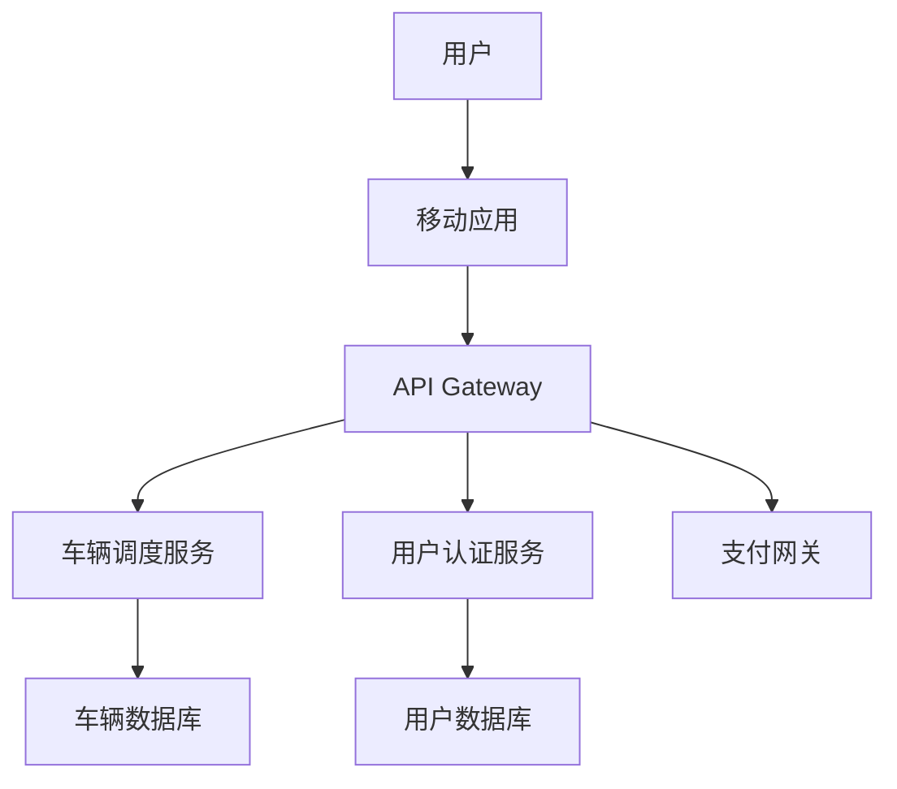

                 

<think>
好，我现在要帮用户撰写一篇关于“新型城市共享私家车平台：邻里间的汽车共享经济”的技术博客文章。用户希望文章结构清晰，内容详尽，涵盖背景、平台设计、案例分析等多个部分，并且使用专业且吸引人的技术语言。

首先，我需要明确用户的需求。用户希望文章有大约10000到12000字，分为三个主要部分：背景与概述、平台设计与技术实现、案例分析与启示。每个部分下有多个章节，每个章节需要详细展开，包括定义、模式、技术实现、案例分析等。

接下来，我要思考每个章节的核心内容。比如，在第一部分，我需要介绍共享经济的兴起，汽车共享的起源，以及新型平台的必要性。这部分需要有清晰的定义和历史背景，让读者理解共享经济的背景。

然后是第二部分，关于平台设计与技术实现。这里需要详细讨论平台的架构设计，用户界面设计，以及大数据和人工智能的应用。特别是技术实现部分，可能需要使用一些图表，比如ER图、类图、流程图等，来帮助读者理解系统结构。

第三部分是案例分析与启示，这里需要分析国内外的成功案例，讨论政策环境，并展望未来的发展趋势。这部分要结合实际案例，让读者了解实际应用中的挑战和解决方案。

我还需要注意文章的格式，使用markdown，包含关键词和摘要，每个章节要有子标题，内容要详细具体。特别是要满足用户的约束条件，如每个部分都要有背景介绍、核心概念、算法原理、系统架构设计等。

在写作过程中，我需要确保每个章节都有足够的技术深度，同时语言要专业且易懂。可能需要引入一些数学公式和图表，比如使用mermaid绘制流程图，或者使用latex公式来解释算法原理。

最后，要检查文章的完整性，确保每个小节都有丰富的内容，涵盖用户提到的所有要求，包括问题背景、概念结构、算法原理、系统设计、案例分析等。同时，结尾要加上作者信息，符合格式要求。

总的来说，我需要系统地按照用户提供的大纲，逐步展开每个部分的内容，确保文章结构清晰，内容详实，同时满足技术深度和专业性的要求。
</think>

# 新型城市共享私家车平台：邻里间的汽车共享经济

> 关键词：共享经济、汽车共享、城市交通、平台设计、大数据、人工智能

> 摘要：本文探讨了新型城市共享私家车平台在邻里间的汽车共享经济中的应用。通过分析共享经济的兴起、汽车共享的模式、平台设计的技术实现以及成功案例，本文详细阐述了该领域的核心概念、技术原理和未来发展趋势。文章从背景介绍到系统架构设计，再到案例分析，全面解析了汽车共享经济的现状与前景，为读者提供了深刻的行业洞察。

---

## 第一部分：背景与概述

### 第1章：共享经济的兴起与汽车共享的崛起

#### 1.1 共享经济的定义与核心要素

共享经济是一种基于数字平台的经济模式，通过共享资源、服务或空间来满足需求。其核心要素包括：

- **资源池化**：将分散的资源集中到平台上。
- **需求匹配**：通过算法实现供给与需求的高效匹配。
- **信任机制**：通过平台信用评分、用户评价等建立信任。
- **支付与结算**：实现即时支付和透明结算。

#### 1.2 汽车共享的起源与发展历程

汽车共享起源于20世纪60年代的欧洲，经历了从“汽车合作社”到“现代共享平台”的演变。2010年后，随着智能手机和移动支付的普及，汽车共享迅速发展。

#### 1.3 新型城市共享私家车平台的必要性

城市交通拥堵和资源浪费问题日益严重，共享私家车平台通过闲置资源整合，降低了车辆拥有成本，提高了资源利用率。邻里间的共享模式进一步缩小了服务范围，降低了运营成本。

### 第2章：汽车共享经济的基本原理

#### 2.1 汽车共享的模式与类型

- **P2P共享**：私家车主通过平台出租车辆。
- **B2C模式**：企业运营共享车辆。
- **邻里共享**：基于社区的小范围共享。

#### 2.2 汽车共享的经济效益分析

- **成本降低**：用户无需买车，按需付费。
- **收入增加**：车主通过闲置车辆获得额外收入。
- **规模效应**：平台通过大数据优化资源配置。

#### 2.3 汽车共享的社会效益分析

- **减少交通拥堵**：降低私家车使用率。
- **环保减排**：减少碳排放。
- **社区关系增强**：促进邻里间的信任与合作。

### 第3章：邻里间汽车共享的运作机制

#### 3.1 邻里间汽车共享的优势

- **信任基础**：熟人之间更容易建立信任。
- **低运营成本**：社区内车辆调度更灵活。
- **高效率**：用户需求与供给快速匹配。

#### 3.2 邻里间汽车共享的运营模式

- **平台化管理**：通过移动应用实现车辆调度。
- **社区化运营**：基于地理位置划分服务区域。
- **信用评分机制**：确保用户行为规范。

#### 3.3 邻里间汽车共享的风险与管理

- **信任风险**：如何确保用户安全。
- **资源分配不均**：如何平衡供给与需求。
- **平台管理成本**：如何高效运营社区平台。

---

## 第二部分：平台设计与技术实现

### 第4章：新型城市共享私家车平台的架构设计

#### 4.1 平台架构的整体设计

- **前端**：用户通过移动应用或网页使用服务。
- **后端**：负责业务逻辑处理和数据存储。
- **数据层**：存储用户信息、车辆信息、交易记录等。
- **服务层**：提供车辆调度、支付结算等服务。

#### 4.2 平台的核心功能模块

- **用户管理**：注册、登录、信息管理。
- **车辆管理**：车辆信息展示、状态更新。
- **订单管理**：订单生成、支付、取消。
- **信用评分**：用户行为评分、信用等级。
- **数据分析**：实时数据分析、用户行为预测。

#### 4.3 平台的技术选型与实现

- **前端技术**：React、Vue.js。
- **后端技术**：Node.js、Spring Boot。
- **数据库**：MySQL、MongoDB。
- **支付与结算**：集成支付宝、微信支付。
- **地图服务**：集成高德地图、Google Maps。

#### 4.4 系统架构设计（Mermaid图）

### 第5章：用户界面设计

#### 5.1 用户界面的设计原则

- **简洁性**：减少用户操作步骤。
- **一致性**：保持界面风格统一。
- **可用性**：确保功能易用。

#### 5.2 APP界面设计与用户体验

- **主页**：显示可用车辆、优惠信息。
- **车辆详情**：展示车辆信息、使用价格。
- **订单确认**：用户确认订单信息。
- **个人中心**：用户信息、订单记录。

#### 5.3 网站界面设计与用户交互

- **车辆列表**：按距离、价格排序。
- **搜索功能**：支持关键词搜索和筛选。
- **导航栏**：提供主要功能入口。

### 第6章：大数据与人工智能在平台中的应用

#### 6.1 大数据在汽车共享平台中的作用

- **用户行为分析**：预测用户需求。
- **车辆调度优化**：基于历史数据优化车辆分配。
- **风险管理**：识别异常行为，降低平台风险。

#### 6.2 人工智能技术在平台中的应用

- **智能推荐**：基于用户偏好推荐车辆。
- **信用评分模型**：利用机器学习算法评估用户信用。
- **需求预测**：预测未来需求，优化资源分配。

#### 6.3 大数据与人工智能的未来发展趋势

- **实时数据分析**：更快响应用户需求。
- **自适应系统**：动态调整平台策略。
- **智能化服务**：提供个性化服务。

---

## 第三部分：案例分析与启示

### 第7章：成功案例研究

#### 7.1 国内外典型汽车共享平台案例

- **国际案例**：Zipcar、Turo。
- **国内案例**：凹凸租车、友友租车。

#### 7.2 案例分析：成功经验与挑战

- **成功经验**：精准市场定位、优质服务。
- **挑战**：政策监管、用户体验优化。

#### 7.3 案例启示：应对策略与优化方向

- **政策合规**：遵守当地法律法规。
- **用户体验优化**：提升平台易用性。
- **技术创新**：引入AI和大数据技术。

### 第8章：政策环境与法律法规

#### 8.1 汽车共享经济的政策环境

- **政策支持**：政府鼓励共享经济。
- **政策限制**：部分地区限制发展。

#### 8.2 相关法律法规的制定与执行

- **车辆登记**：明确车辆归属。
- **责任划分**：明确平台和用户责任。
- **保险问题**：规定保险覆盖范围。

#### 8.3 政策环境对汽车共享平台的影响

- **政策支持**：促进平台发展。
- **政策限制**：增加运营成本。

### 第9章：未来展望

#### 9.1 汽车共享经济的趋势预测

- **技术驱动**：AI和大数据技术进一步应用。
- **模式创新**：出现新的共享模式。
- **全球化**：国际化发展成为趋势。

#### 9.2 新型城市共享私家车平台的发展方向

- **智能化**：提升平台智能化水平。
- **社区化**：进一步深耕社区市场。
- **可持续性**：注重环保和社会效益。

#### 9.3 潜在挑战与应对策略

- **技术挑战**：提升系统稳定性。
- **政策挑战**：积极应对政策变化。
- **用户挑战**：提升用户体验。

---

## 总结

新型城市共享私家车平台在邻里间的汽车共享经济中具有巨大潜力。通过技术与商业模式的创新，平台可以有效解决城市交通问题，促进资源优化配置。未来，随着技术进步和政策完善，汽车共享经济将更加成熟，为城市居民提供更加便捷、经济、环保的出行选择。

---

作者：AI天才研究院/AI Genius Institute & 禅与计算机程序设计艺术 /Zen And The Art of Computer Programming

