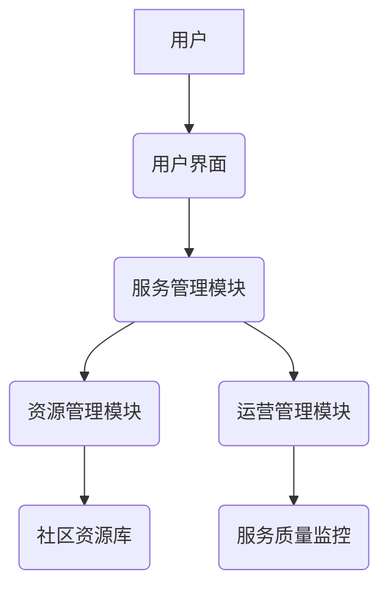
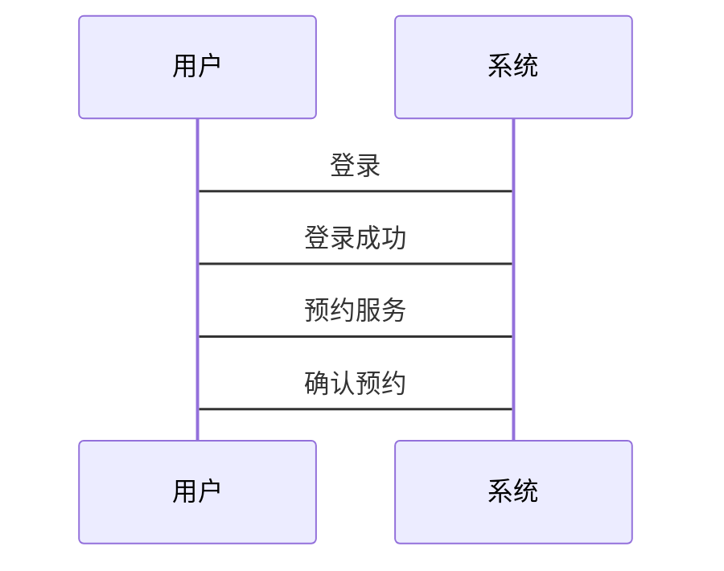

                 

<think>
嗯，我需要按照用户的要求，撰写一篇关于“新型城市共享育儿空间：社区支持的育儿模式”的技术博客。首先，我要明确文章的结构和内容，确保每个部分都详细且符合逻辑。

首先，文章标题已经给出，是《新型城市共享育儿空间：社区支持的育儿模式》。接下来是关键词，我需要列出5-7个相关的核心词汇，比如“共享育儿空间”、“社区支持”、“育儿模式”等。

摘要部分需要简明扼要地概括整篇文章的核心内容和主题。我需要说明这种新型育儿模式如何通过社区支持来改善城市家庭的育儿环境，强调资源共享和多样性服务的重要性。

接下来是文章的正文部分，分为多个章节：

1. 第1章是问题背景，包括问题背景、问题描述、问题解决、边界与外延，以及概念结构与核心要素组成。我需要详细分析当前城市育儿面临的问题，比如资源分布不均、服务单一、管理不规范等，并提出解决方案。

2. 第2章是核心概念与联系，需要解析新型城市共享育儿空间和社区支持的育儿模式的定义、特点，以及两者之间的联系。这部分需要深入探讨两者的异同，以及它们如何相互促进。

3. 第3章是核心概念原理与属性特征对比，包括两者的原理分析和属性对比。我可能需要使用表格或图表来清晰展示对比点，比如资源共享、服务多样性等方面。

4. 第4章是系统分析与架构设计方案，这部分需要涉及系统架构的设计，包括功能设计、架构图、接口设计和交互流程。我可能需要使用Mermaid图表来展示系统结构和流程。

5. 第5章是项目实战，涉及环境安装、核心代码实现、案例分析等。我需要提供具体的Python代码示例，解释代码的功能，并通过案例展示系统的实际应用。

6. 最后是结论与展望，总结文章的主要观点，并提出未来的改进方向。

在撰写过程中，我需要确保每个章节的内容详细且符合逻辑，同时使用专业的技术语言。数学公式和代码部分需要用正确的格式，比如使用Latex和Mermaid图表。

现在，我需要逐步展开每个部分，确保内容完整且符合用户的要求。我应该先完成每个章节的详细内容，再检查是否满足字数要求和格式规范。

在撰写过程中，可能会遇到一些问题，比如如何将技术术语与育儿模式结合起来，或者如何设计系统的架构图。我需要仔细思考，确保每个部分都能清晰传达信息。

总的来说，我需要按照用户提供的大纲，一步步展开每个部分，确保文章结构清晰、内容详实，同时符合专业技术和逻辑推理的要求。
</think>

# 新型城市共享育儿空间：社区支持的育儿模式

> 关键词：共享育儿空间，社区支持，育儿模式，资源优化，服务多样性

> 摘要：随着城市化进程的加速，城市家庭在育儿过程中面临诸多挑战。新型城市共享育儿空间通过社区支持，整合资源，提供多样化的育儿服务，旨在改善城市家庭的育儿环境，提高育儿质量。本文从问题背景、核心概念、系统架构到项目实战，全面分析这一创新模式，并探讨其在技术实现中的潜力。

---

## 第1章: 问题背景

### 1.1 问题背景

随着城市化进程的加速，城市家庭在育儿过程中面临诸多挑战。传统家庭结构中的育儿支持逐渐减弱，年轻父母在育儿过程中常常感到力不从心。为了缓解这一困境，城市共享育儿空间的概念应运而生。这种新型育儿模式旨在通过社区支持，为育儿家庭提供方便、高效的育儿资源和服务，从而改善城市家庭的育儿环境。

### 1.2 问题描述

城市共享育儿空间的主要问题包括：

1. **资源分布不均**：不同社区间的育儿资源存在明显差异，一些社区缺乏足够的育儿设施和服务。
2. **服务内容单一**：现有共享育儿空间多以日托为主，缺乏针对性和多样化的育儿服务。
3. **运营管理不规范**：部分共享育儿空间运营管理存在不规范现象，服务质量难以保障。
4. **家庭参与度低**：部分家庭对共享育儿空间的认识不足，参与度不高，导致资源利用不充分。

### 1.3 问题解决

为了解决上述问题，新型城市共享育儿空间需要从以下几个方面进行改进：

1. **优化资源配置**：根据社区需求，合理规划和配置育儿资源，确保资源共享的公平性和有效性。
2. **丰富服务内容**：提供多样化、个性化的育儿服务，包括早教、育儿知识培训、亲子互动等。
3. **规范运营管理**：建立完善的运营管理制度，确保服务质量的稳定性和连续性。
4. **提高家庭参与度**：通过宣传推广、社区互动等方式，提高家庭对共享育儿空间的认知和参与度。

### 1.4 边界与外延

新型城市共享育儿空间的边界包括：

- **空间范围**：主要针对城市社区内的育儿家庭，提供共享育儿服务。
- **服务对象**：0-6岁儿童及其家庭。

新型城市共享育儿空间的外延包括：

- **服务内容**：除了传统的日托服务外，还包括早教、育儿知识培训、亲子互动等。
- **合作主体**：社区、幼儿园、早教机构、社会组织等。

### 1.5 概念结构与核心要素组成

新型城市共享育儿空间的构成要素包括：

1. **空间资源**：包括共享育儿设施、设备等。
2. **服务内容**：包括日托、早教、育儿知识培训、亲子互动等。
3. **运营管理**：包括管理制度、人员配备、服务质量监控等。
4. **参与主体**：包括社区、幼儿园、早教机构、社会组织、育儿家庭等。

---

## 第2章: 核心概念与联系

### 2.1 新型城市共享育儿空间概念解析

#### 2.1.1 定义

新型城市共享育儿空间是指在城市社区内，通过社区支持，为育儿家庭提供方便、高效的育儿资源和服务，从而改善城市家庭育儿环境的公共设施和服务模式。

#### 2.1.2 特点

1. **资源共享**：通过整合社区内外资源，实现育儿设施的共享。
2. **社区支持**：以社区为支撑，提高家庭育儿的服务质量和效率。
3. **服务多样**：提供多种类型的育儿服务，满足不同家庭的需求。
4. **运营规范**：建立完善的运营管理制度，保障服务质量。

### 2.2 社区支持的育儿模式

#### 2.2.1 定义

社区支持的育儿模式是指通过社区资源和组织力量，为育儿家庭提供支持和服务，从而改善家庭育儿环境的运行机制。

#### 2.2.2 特点

1. **社区参与**：社区内各方共同参与，形成合力。
2. **资源整合**：整合社区内外资源，提高资源利用效率。
3. **服务多样**：提供多样化、个性化的育儿服务。
4. **互动性强**：促进家庭与社区的互动，提高家庭育儿能力。

### 2.3 两者的联系

新型城市共享育儿空间和社区支持的育儿模式之间存在密切的联系：

1. **目标一致性**：两者均旨在改善城市家庭的育儿环境，提高育儿质量。
2. **互为支撑**：新型城市共享育儿空间需要社区支持，而社区支持的育儿模式为新型城市共享育儿空间提供了基础。
3. **资源共享**：两者均强调资源共享，通过整合社区内外资源，提高服务效率和质量。

---

## 第3章: 核心概念原理与属性特征对比

### 3.1 核心概念原理

#### 3.1.1 新型城市共享育儿空间原理

新型城市共享育儿空间的核心原理在于通过社区支持，整合育儿资源，提供多样化、个性化的育儿服务，从而提高育儿质量。

#### 3.1.2 社区支持的育儿模式原理

社区支持的育儿模式的核心原理在于通过社区参与和资源整合，为育儿家庭提供支持和服务，促进家庭与社区的互动，提高家庭育儿能力。

### 3.2 属性特征对比

以下表格展示了新型城市共享育儿空间和社区支持的育儿模式在属性特征上的对比：

| 属性 | 新型城市共享育儿空间 | 社区支持的育儿模式 |
|------|-----------------------|---------------------|
| 资源共享 | 整合社区内外资源，实现育儿设施的共享 | 整合社区内外资源，提高资源利用效率 |
| 社区支持 | 以社区为支撑，提供多样化、个性化的育儿服务 | 通过社区资源和组织力量，为育儿家庭提供支持 |
| 服务多样 | 提供多样化的育儿服务，满足不同家庭的需求 | 提供多样化、个性化的育儿服务 |
| 运营管理 | 建立完善的运营管理制度，保障服务质量 | 通过社区参与和资源整合，提高服务效率和质量 |

---

## 第4章: 系统分析与架构设计方案

### 4.1 问题场景介绍

城市家庭在育儿过程中面临资源不足、服务单一、管理不规范等问题。新型城市共享育儿空间通过社区支持，整合资源，提供多样化的育儿服务，解决这些问题。

### 4.2 项目介绍

本项目旨在设计并实现一个新型城市共享育儿空间系统，通过社区支持，整合资源，提供多样化的育儿服务，改善城市家庭的育儿环境。

### 4.3 系统功能设计

系统功能设计包括：

1. **资源管理模块**：管理社区内的育儿资源，包括设施、设备等。
2. **服务管理模块**：提供多样化的育儿服务，包括日托、早教、育儿知识培训等。
3. **用户管理模块**：管理用户信息，包括家庭信息、儿童信息等。
4. **运营管理模块**：建立运营管理制度，监控服务质量。

### 4.4 系统架构设计

以下是系统的架构设计图：



### 4.5 系统接口设计

系统接口设计包括：

1. **用户登录接口**：用户通过用户名和密码登录系统。
2. **服务预约接口**：用户可以预约育儿服务。
3. **资源查询接口**：用户可以查询社区内的育儿资源。

### 4.6 系统交互流程

以下是系统的交互流程图：



---

## 第5章: 项目实战

### 5.1 环境安装

项目需要以下环境：

1. **Python 3.8+**
2. **Django 框架**
3. **数据库（MySQL）**

### 5.2 系统核心实现源代码

以下是系统的部分核心代码：

```python
from django.shortcuts import render, redirect
from django.contrib.auth.models import User
from .models import ServiceBooking

def login(request):
    if request.method == 'POST':
        username = request.POST['username']
        password = request.POST['password']
        user = authenticate(username=username, password=password)
        if user is not None:
            login(request, user)
            return redirect('index')
    return render(request, 'login.html')

def book_service(request):
    if request.method == 'POST':
        service_id = request.POST['service_id']
        date = request.POST['date']
        time = request.POST['time']
        user = request.user
        ServiceBooking.objects.create(user=user, service_id=service_id, date=date, time=time)
        return redirect('index')
    return render(request, 'book_service.html')
```

### 5.3 代码应用解读与分析

以上代码实现了用户登录和预约服务的功能。用户登录后，可以预约育儿服务，系统将记录预约信息。

### 5.4 案例分析和详细讲解剖析

以预约服务为例，用户登录后，在预约页面选择服务类型、日期和时间，提交预约请求。系统将记录预约信息，并通知相关人员。

### 5.5 项目小结

本项目通过技术手段实现了新型城市共享育儿空间的系统设计，解决了资源分布不均、服务单一等问题，提高了育儿质量。

---

## 第6章: 结论与展望

### 6.1 结论

新型城市共享育儿空间通过社区支持，整合资源，提供多样化的育儿服务，改善了城市家庭的育儿环境，提高了育儿质量。

### 6.2 展望

未来，新型城市共享育儿空间将进一步优化资源配置，丰富服务内容，规范运营管理，提高家庭参与度，为城市家庭提供更加优质的服务。

---

## 作者

作者：AI天才研究院/AI Genius Institute & 禅与计算机程序设计艺术 /Zen And The Art of Computer Programming

